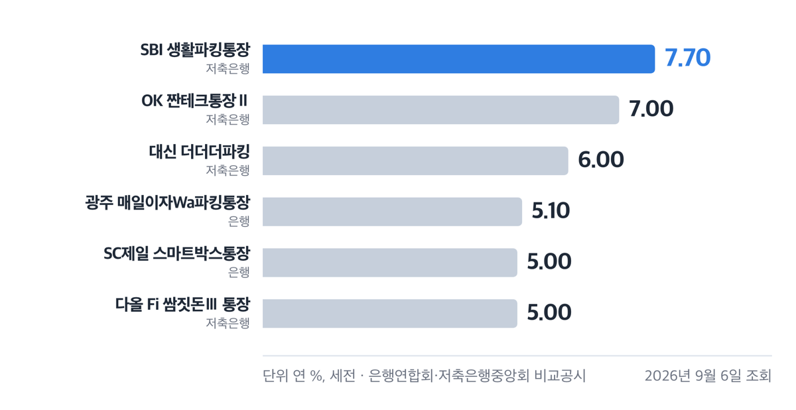
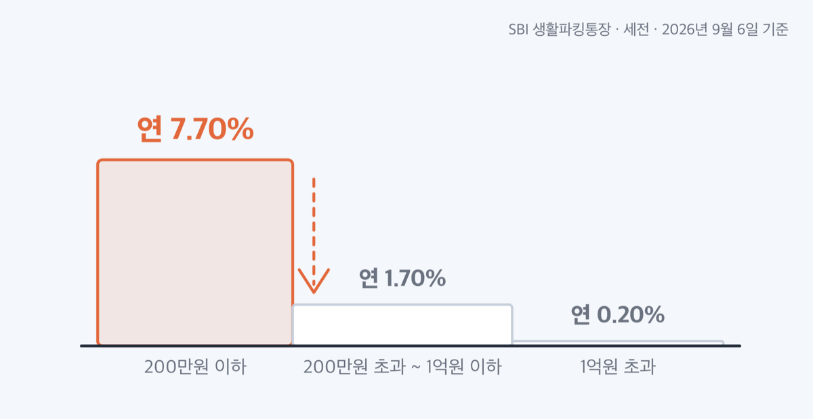
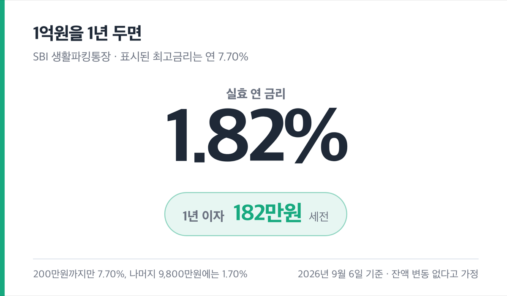

# '7.70%' 파킹통장 금리비교 2026, 금리는 200만원까지예요

📌 2026년 9월 6일 기준

파킹통장 금리비교는 금리 칸이 아니라 그 옆 금액 칸에서 끝납니다. 2026년 9월 6일 기준으로 최고 연 7.70%짜리가 있는데, 그 금리가 붙는 돈은 200만원까지예요. 200만원을 넘긴 돈에는 연 1.70%가 붙습니다.

**3줄 요약**

1. 파킹통장은 공시에서 「입출금이 자유로운 예금」으로 분류되고, 은행 상품과 저축은행 상품을 보는 창구가 서로 다릅니다.
2. 2026년 9월 6일 조회 기준 최고금리는 저축은행 연 7.70%, 은행 연 5.10%인데 둘 다 잔액의 일부 구간에만 붙어요.
3. 금리 칸보다 「최고금리 적용 금액」 칸을 먼저 확인하고, 그다음에 우대조건과 공시 제출일을 봅니다.

은행 45개·저축은행 152개 상품을 최고금리 순으로 줄 세운 표와, 1억원을 넣었을 때 실효 금리가 어디까지 내려가는지를 함께 봅니다.

## 파킹통장 금리비교, 공식 창구가 두 곳으로 나뉘어요

「파킹통장」은 공식 상품 분류 이름이 아니에요. 공시에서 쓰는 이름은 **입출금자유예금**(입출금이 자유로운 예금)이고, 예금 종류로는 보통예금이나 저축예금에 들어갑니다. 검색창에 파킹통장이라고 쳐도 공시 화면에서는 이 이름을 찾아야 해요.

문제는 은행과 저축은행을 한 화면에서 함께 줄 세울 방법이 공식 창구에 없다는 점이에요. 금융감독원 「금융상품한눈에」에도 입출금자유예금 메뉴가 있는데, 열어 보면 자체 비교표 없이 두 협회 주소만 안내해요. 안내 문구도 「은행연합회와 저축은행중앙회는 은행 및 저축은행에서 취급하는 입출금자유예금상품의 비교공시를 제공하고 있습니다」로 끝납니다.

그래서 창구를 두 번 열어야 합니다.

- 은행 상품: 전국은행연합회 소비자포털 → 금리/수수료 비교 → 예금상품금리 → 예금금리 → **입출금자유예금** 탭 *(https://portal.kfb.or.kr/compare/free_deposit.php)*
- 저축은행 상품: 저축은행중앙회 소비자포털 → 상품공시 → **입출금자유예금** *(https://www.fsb.or.kr/ratanym_0100.act)*

두 곳이 주는 칸도 다릅니다. 저축은행중앙회 공시에는 **「최고금리 적용 가능 금액」 칸이 따로 있는데 은행연합회 공시에는 그 칸이 없어요.** 은행 쪽은 상세정보를 펼쳐 「기타 유의사항」이나 우대조건 글을 읽어야 금액 상한이 나옵니다. 같은 상품을 봐도 정보가 나오는 깊이가 다른 거예요.

> 🤭 **솔직히 말하면** — 은행 표에서 최고금리만 보고 골랐다가 상세정보를 열어 보고 마음이 바뀐 상품이 한둘이 아니었어요.

두 공시 모두 **세전 금리**라는 점도 미리 짚어 둡니다. 저축은행중앙회 용어설명에 「약정금리 = 세금이 차감되지 않은 상태에서의 이자율」이라고 적혀 있어요.

## 은행 파킹통장 금리 상위 — 45개 중 최고 연 5.10%

2026년 9월 6일에 은행연합회 입출금자유예금 비교공시를 조회하면 **은행 19곳, 45개 상품**이 나옵니다. 「은행 최종제공일」은 대부분 2026년 8월 20일이고 전북은행만 2026년 9월 1일이에요. 같은 표 안에서도 기준일이 조금씩 다릅니다.

**은행 입출금자유예금 최고금리 상위 (연 %, 세전 / 2026-09-06 조회)**

| 은행·상품 | 최고금리 | 그 금리가 붙는 조건 |
|---|---|---|
| 광주은행 매일이자Wa파킹통장 | **5.10** | 잔액 30만원 이하분에 가입일부터 2개월간 2.60%p 가산 (이벤트 2026-06-16~11-30 가입분) |
| SC제일은행 스마트박스통장 | **5.00** | 첫 거래 1.0%p + 1억원 이상 0.5%p + 마케팅동의 0.2%p + 급여이체 0.3%p, 매일 잔액의 50%(최소 100만원) 구간에만 |
| 전북은행 씨드모아 통장 (3종) | **4.00** | 기본 1.80%에 가입 후 3개월 우대 최고 2.0%p 등 |
| 카카오뱅크 저금통 | **4.00** | 우대조건 없음. 최고한도 10만원, 자동저축서비스 입금만 |
| 케이뱅크 챌린지박스 | **3.90** | 목표일까지 조건 충족 시 최고 2.0%p. 가입금액 1만~500만원, 기간 30~200일 |
| 우리은행 우월한 월급 통장 | **3.10** | 급여이체 2.0%p + 첫 급여이체 1.0%p(1년), 매일 잔액 200만원 이하분 |
| BNK경남은행 BNK파킹통장 | **3.00** | 5천만원 이하 2.30% + 마케팅동의 0.70%p(가입 후 3개월). 경남은행 첫 거래 개인 |
| Sh수협은행 Sh매일받는통장 | **3.00** | 1천만~1억 구간 2.00% + 마케팅동의 0.10%p + 입출금 첫거래 0.90%p |
| 케이뱅크 플러스박스 | **2.20** | 우대조건 없음. 5천만원 이하 1.70% / 5천만원 초과분 2.20% |
| 카카오뱅크 세이프박스 | **1.60** | 우대조건 없음. 최고한도 1억원 |
| 토스뱅크 통장 | **1.00** | 우대조건 없음 |

표 맨 위 두 상품을 보면 최고금리와 실제로 받는 돈이 왜 따로 노는지 바로 드러납니다. 광주은행 매일이자Wa파킹통장의 연 5.10%는 **잔액 30만원 이하분에 2개월 동안만** 붙는 값이에요. 카카오뱅크 저금통의 연 4.00%도 최고한도가 10만원입니다.

여기서 **케이뱅크 플러스박스는 방향이 거꾸로**라 따로 짚어 둘 만해요. 대부분의 파킹통장이 잔액이 커질수록 금리를 깎는데, 플러스박스는 5천만원 이하가 1.70%, 5천만원 초과분이 2.20%입니다. 공시의 「기본금리 1.70 / 최고금리 2.20」만 보면 우대조건이 있는 것처럼 읽히지만 ==우대조건은 없고 금액 구간 차이일 뿐==이에요.

케이뱅크 플러스박스와 카카오뱅크 세이프박스는 각 은행 상품 페이지 값과 공시 값이 그대로 맞아떨어졌습니다. 세이프박스는 카카오뱅크 페이지에 「연 1.60%(세전), 2026.09.06 기준」, 플러스박스는 케이뱅크 페이지에 「기본 연 1.70% / 최고 연 2.20%, 조회기준일 2026.09.03」으로 적혀 있어요.

## 저축은행 파킹통장 금리 상위 — 152개 중 최고 연 7.70%

저축은행중앙회 공시에는 같은 날 **152개 상품**이 올라와 있습니다. 표 맨 위 숫자가 은행 쪽 최고인 연 5.10%를 넘어 연 7.70%까지 올라갑니다.

**저축은행 입출금자유예금 최고금리 상위 10 (연 %, 세전 / 2026-09-06 조회)**

| 저축은행·상품 | 최고금리 | 최고금리 적용 금액 (제출일) |
|---|---|---|
| SBI 생활파킹통장 | **7.70** | 200만원 (2026-08-07) |
| OK OK짠테크통장Ⅱ | **7.00** | 50만원 (2025-11-03) |
| 대신 대신 더더더파킹 | **6.00** | 200만원 (2026-07-01) |
| 다올 Fi 쌈짓돈Ⅲ 통장 | **5.00** | 100만원 (2026-09-04) |
| DB DB행복파킹통장 | **3.50** | 500만원 (2026-03-18) |
| 고려 보고파플러스 파킹통장 | **3.40** | 한도 표기 없음 (2026-07-29) |
| 참 기업자유예금 | **3.40** | 300억원 (2026-09-03) |
| NH NH FIC-One 보통예금 | **3.30** | 5,000만원 (2026-09-01) |
| 웰컴 웰컴 주거래통장 | **3.30** | 3억원 (2026-08-12) |
| 애큐온 애큐온모바일자유예금 | **3.30** | 한도 표기 없음 (2026-08-21) |

1위 SBI 생활파킹통장의 속을 열어 보면 셈이 이렇게 됩니다. 잔액 구간별 기본이율이 **200만원 이하분 연 2.70% / 200만원 초과~1억원 이하분 연 1.70% / 1억원 초과분 연 0.20%**이고, 여기에 청년층(만 39세 이하) 0.5%, 간편결제 결제계좌 등록 0.5%, **신규고객 4.0%**가 얹혀 7.70%가 나와요. 신규고객 우대 4.0%는 **계좌를 만든 뒤 1년 동안만** 적용됩니다.

2위 OK짠테크통장Ⅱ도 구조가 같습니다. 50만원 이하분 연 5.0%, 500만원 이하분 연 0.8%, 5,000만원 이하분 연 0.1%예요. 여기서 눈여겨볼 것은 **은행 제출일이 2025년 11월 3일**이라는 점입니다. 조회한 날 기준으로 10개월 전 값이에요.

저축은행중앙회도 공시 화면에 「저축은행의 상품별 금리, 수수료, 기타 거래조건 등의 변경 반영이 지연될 수 있습니다」라고 적어 두었습니다. **제출일을 같이 보지 않으면 1년 전 금리를 오늘 금리로 착각합니다.**

우대조건 없이 금리를 주는 상품도 있어요. 다올 Fi 쌈짓돈Ⅲ 통장은 우대조건 없이 100만원 이하 5.00%, 100만~500만원 3.50%, 500만~5,000만원 3.30%, 5,000만원 초과분 1.50%로 구간만 나눠 둡니다. 고려저축은행 보고파플러스 파킹통장은 기본 3.10%에 우대 셋을 각 0.10%씩 얹어 최고 3.40%이고, **가입금액과 기간 제한이 없어요.** 상위권에서 잔액 상한 표기가 없는 몇 안 되는 상품입니다.

## 금리 칸보다 「최고금리 적용 금액」을 먼저 봅니다

파킹통장의 최고금리는 대부분 **잔액 전체가 아니라 특정 구간에만** 붙습니다. 그래서 넣을 돈이 크면 클수록 표시된 금리와 실제로 받는 금리가 벌어져요.

1억원을 1년 동안 두었다고 놓고 계산해 봅니다.

**1억원을 1년 둘 때 실효 금리 (세전, 잔액 변동 없다고 가정)**

| 상품 | 1년 이자 (세전) | 실효 연 금리 |
|---|---|---|
| SBI 생활파킹통장 | 182만원 | **1.82%** |
| 케이뱅크 플러스박스 | 195만원 | **1.95%** |

최고 연 7.70%짜리가 최고 연 2.20%짜리보다 적게 나옵니다. SBI 생활파킹통장은 200만원까지만 7.70%이고 나머지 9,800만원에는 1.70%가 붙기 때문이에요. 반대로 플러스박스는 5천만원 초과분에 더 높은 금리를 주니까 큰 금액에서 뒤집힙니다.

> 😕 그러면 최고금리 높은 통장은 다 소용없는 건가요?

아니에요. 넣을 돈이 그 구간을 넘지 않으면 최고금리 상품 쪽 이자가 더 많아요. SBI 생활파킹통장 최고금리 구간인 200만원을 1년 채우면 세전 154,000원, 세후 130,284원이에요. OK짠테크통장Ⅱ의 50만원 구간이면 세전 35,000원, 세후 29,610원입니다.

**결국 순서가 반대예요. 금리를 먼저 보고 돈을 맞추는 게 아니라, 넣을 돈을 정하고 그 금액에 붙는 금리를 보는 것입니다.**

위 금액은 공시 금리에 원금과 기간을 곱한 값이라는 점도 밝혀 둘게요. 공시는 금리만 적고 금액은 적지 않아요. 여러 상품이 **일별 잔액 기준**이라 한 달 내내 같은 돈이 들어 있었다는 가정이 깔려 있습니다.

## 상위권 금리에 붙어 있는 조건 넷

표 위쪽 금리를 그대로 가져갈 수 없게 만드는 조건이 넷 있습니다. 좋은 점보다 이쪽을 먼저 확인하는 편이 시간을 아껴요.

**1. 대부분 「첫 거래 고객」 조건입니다.** SBI 생활파킹통장의 4.0%는 신규고객에게 1년만, 대신 더더더파킹의 4.0%p도 첫 거래 고객에게 1년만 붙어요. BNK파킹통장은 경남은행 첫 거래 개인, 광주 365파킹통장은 직전 6개월 광주은행 입출금계좌 이력이 없는 사람, SC제일 스마트박스통장은 은행 순 신규 고객이 대상입니다. ==이미 거래 중인 은행의 상품은 표 맨 위 금리를 받을 수 없어요.==

**2. 통장을 한꺼번에 여러 개 만들 수 없습니다.** IBK저축은행 모임통장과 e-파킹통장 공시에는 「20영업일 이내 타금융기관 입출금식 계좌 개설 시 가입제한」이라고 적혀 있어요. 애큐온모바일자유예금도 최근 20영업일 이내 입출금통장 개설 이력이 없어야 합니다. 금리 순서대로 서너 개를 동시에 열어 두는 방식은 막혀 있는 셈이에요.

**3. 한도제한계좌로 열릴 수 있습니다.** BNK파킹통장 공시 기타 유의사항에 「한도제한계좌」라고 적혀 있고, 토스뱅크 통장 안내에도 「토스뱅크 통장은 '금융거래 한도계좌'로 개설되며, 금융거래목적 확인 전까지 1일 최대 거래한도가 제한됩니다」라고 돼 있어요. 한도제한계좌는 금융거래 목적을 증빙하기 전까지 하루에 넣고 뺄 수 있는 돈이 묶이는 계좌를 말합니다. **금리만 보고 옮기면 정작 큰 금액을 넣지 못합니다.**

**4. 우대조건은 유지해야 살아 있습니다.** 대신 더더더파킹은 마케팅 수신동의를 매월 이자지급 시까지 유지해야 우대이율이 적용돼요. 동의 항목 중 문자 수신동의를 켜 둬야 합니다. 중간에 동의를 풀면 그달 이자가 달라져요.

> [!WARNING]
> 여기 적은 금리는 2026년 9월 6일에 두 협회 비교공시를 조회한 값입니다. 은행연합회는 「금리 비교 자료는 해당 은행의 공시 담당자가 직접 등록·게재한다」고 밝히고 있어요. 가입 직전에 해당 금융회사 페이지에서 오늘 값을 다시 확인하세요.

## 통장을 고르기 전 확인하는 다섯 단계

순서대로 다섯 번만 확인하면 됩니다.

1. **두 공시를 다 엽니다.** 은행연합회 입출금자유예금 탭과 저축은행중앙회 입출금자유예금을 각각 열어요. 한쪽만 보면 표 절반을 안 본 것입니다.
2. **최고금리 옆 금액 칸을 봅니다.** 저축은행 공시는 「최고금리 적용 가능 금액」 칸에 바로 나오고, 은행 공시는 상세정보를 펼쳐 우대조건과 기타 유의사항을 읽어야 나와요.
3. **우대조건과 공시 제출일을 함께 봅니다.** 첫 거래 조건인지, 몇 개월짜리인지, 제출일이 몇 달 전인지를 봅니다. 제출일이 오래된 상품은 해당 금융회사 페이지에서 오늘 값을 다시 확인하세요.
4. **예금자보호 한도로 나눕니다.** 2025년 9월 1일부터 보호한도가 1인당 **1억원**으로 올랐어요. 원금과 이자를 합쳐 1억원이고, 한 금융회사 안의 여러 계좌는 합산해 1억원까지만 보호됩니다. 별도 신청 없이 자동 적용되고, 다른 금융회사에 나눠 두면 각각 1억원씩 따로 보호돼요. 파킹통장은 보통예금·저축예금이라 보호 대상이고, ==CMA(자산관리계좌)는 보호 대상이 아닙니다.==
5. **세후로 바꿔 봅니다.** 공시 금리는 전부 세전이에요. 이자소득에는 소득세 14%와 개인지방소득세 1.4%를 합쳐 **15.4%**가 원천징수됩니다. 1,000만원을 연 2.5%로 한 달 두면 세전 20,548원, 세후 17,384원이에요. 1년이면 세전 250,000원, 세후 211,500원입니다.

금융소득종합과세를 걱정하는 경우도 있는데, 연간 금융소득 합계가 2천만원을 넘을 때 종합과세 대상입니다. 파킹통장 이자만으로 여기 닿으려면 연 2.5% 기준 원금이 8억원쯤 있어야 해요. 2천만원 이하면 금융회사의 원천징수로 납세의무가 끝납니다.

**저라면 잔액을 두 덩어리로 나눕니다.** 200만원 안팎의 생활 비상금은 최고금리 구간이 있는 상품에 넣고, 그보다 큰 돈은 구간 상한이 없거나 큰 금액에 더 주는 상품에 둡니다. 위 계산에서 1억원 기준으로 실효 1.95%와 1.82%가 뒤집힌 것이 그 근거예요.

한국은행 기준금리(한국은행이 정하는 정책금리)는 2026년 8월 27일에 연 3.00%가 됐습니다. 2025년 5월 29일 2.50%까지 내려간 뒤 두 번 올랐고, 3.00%는 2024년 11월 28일 이후 처음이에요.

## 파킹통장 금리비교 관련 궁금증 해결

**Q. 「매일 이자」라고 하면 매일 통장에 이자가 들어오나요?**
A. 자동으로 들어오는 것은 아니에요. 토스뱅크 통장은 매월 1일 또는 앱에서 이자 지급을 요청한 날에 지급하고, 케이뱅크 플러스박스는 이자결산지급일이 매월 넷째주 토요일이며 「바로 이자받기」로 앞당겨 받을 수 있어요. 카카오뱅크 세이프박스는 매월 네 번째 금요일의 다음날 또는 고객이 요청한 날입니다. 이자 계산은 매일 하되 **지급 시점만 앞당기는 것**이에요.

**Q. 저축은행 파킹통장도 예금자보호가 되나요?**
A. 됩니다. 저축은행은 예금보험공사가 보호하는 업권이고, 파킹통장은 원금 지급이 보장되는 보통예금·저축예금이라 보호 대상이에요. 한도는 은행과 같은 1인당 1억원입니다. 다만 이자는 약정이율과 공시이율 중 낮은 이율로 계산해 원금과 합산합니다.

**Q. 공시에 나온 금리가 오늘 값이 맞나요?**
A. 상품마다 다릅니다. 저축은행 공시의 은행 제출일을 보면 다올 Fi 쌈짓돈Ⅲ은 2026년 9월 4일인데, OK파킹플렉스통장은 2025년 7월 9일, 웰뱅 모두페이 통장은 2025년 4월 3일이에요. 가입 직전에 해당 금융회사 홈페이지나 고객센터에서 오늘 값을 확인하세요.

**Q. 지금 가입할 수 있는 상품인지는 어디서 보나요?**
A. 공시는 판매 상태가 아니라 제출일만 알려 줍니다. 하나은행 원픽 통장처럼 「2026년 9월 30일까지 신규 가입한 계좌에 대하여 제공」이라고 공시에 적힌 상품도 있어요. 가입 가능 여부와 마감일은 해당 금융회사 홈페이지나 고객센터에서 확인하세요.

**Q. 새마을금고나 증권사 CMA는 왜 표에 없나요?**
A. 이 글은 은행연합회와 저축은행중앙회 두 공시에 올라온 입출금자유예금만 다뤘어요. 상호금융과 증권사 상품은 공시 창구가 달라 같은 표에 놓을 수 없습니다. 상호금융 상품은 각 중앙회에서, CMA는 해당 증권사에서 확인하세요.

파킹통장 금리비교의 결론은 짧습니다. 표 맨 위 숫자는 대개 **작은 구간에 붙은 한시적인 금리**이고, 내 통장에 실제로 찍히는 금액은 넣을 돈이 어느 구간에 들어가는지로 정해져요. 오늘 통장에 든 돈이 얼마인지부터 확인하고, 그 금액에 붙는 금리를 두 공시에서 견줘 보세요.

참고: 금융감독원 금융상품한눈에 입출금자유예금 안내 · 전국은행연합회 소비자포털 예금금리 비교공시 · 저축은행중앙회 소비자포털 입출금자유예금 비교공시 · 금융위원회 「'25.9.1일부터 예금을 1억원까지 보호합니다」 · 예금보험공사 예금자보호제도 FAQ · 국세청 원천징수 세율 · 한국은행 기준금리 추이
