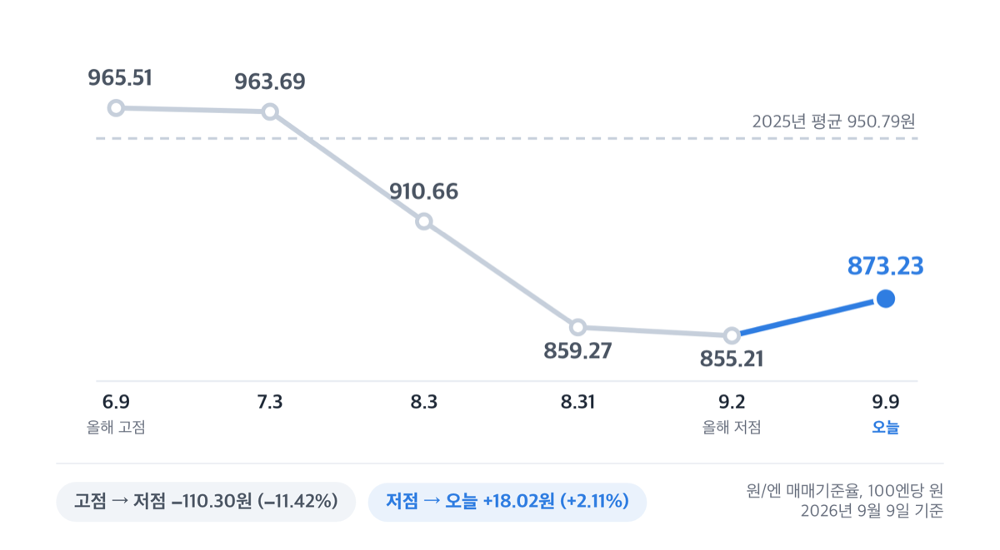
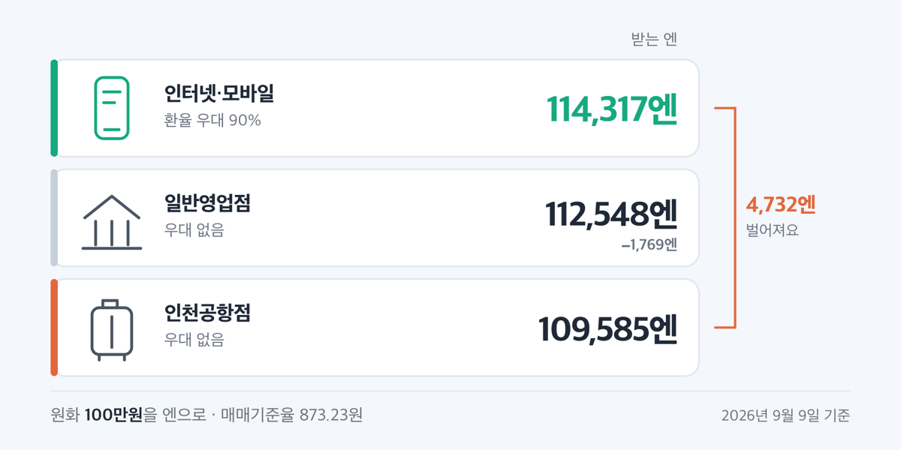

# '873원' 엔화 환율 반등, 그래도 2025년 평균보다 8% 낮습니다

📌 2026년 9월 9일 기준

873.23원이에요. 9월 2일 855.21원을 찍고 5영업일 만에 18원 올라왔어요. 그런데 2025년 한 해 평균은 950.79원이었습니다.

**3줄 요약**

- 2026년 9월 9일 원/엔 매매기준율은 100엔당 873.23원입니다.
- 9월 2일 855.21원까지 내려갔다가 5영업일 만에 18.02원(2.11%) 되올랐어요.
- 그래도 2025년 평균 950.79원보다 8.16% 낮은 구간이라, 움직이기 전에 환전 수수료부터 따져 보세요.

반등한 지금이 어디쯤인지, 그리고 실제로 바꿀 때 얼마가 나가는지를 순서대로 봅니다.

## 💴 오늘 873.23원, 저점에서 18원 되올랐어요

원/엔 매매기준율은 서울외국환중개가 매일 하나로 만들어 한국은행이 그대로 싣는 값이에요. 은행마다 다른 값이 아니라 전국이 같은 숫자로 시작하고, 여기에 은행별 수수료가 붙어 창구 환율이 됩니다. 그래서 시세를 볼 때는 이 매매기준율부터 봐야 해요.

최근 석 달의 흐름은 이렇습니다.

| 날짜 (2026년) | 원/엔 매매기준율 (100엔당, 원) |
|---|---|
| 6월 9일 — 올해 고점 | 965.51 |
| 7월 3일 | 963.69 |
| 8월 3일 | 910.66 |
| 8월 31일 | 859.27 |
| **9월 2일 — 올해 저점** | **855.21** |
| **9월 9일 — 오늘** | **873.23** |

고점에서 저점까지 110.30원, 11.42% 내렸어요. 그리고 저점에서 오늘까지 5영업일 동안 18.02원, 2.11% 되올랐습니다.

850원대였던 날은 8월 31일과 9월 1일, 9월 2일 사흘뿐이에요. 9월 3일부터는 860~870원대로 돌아왔고, 올해 850원 아래로 내려간 날은 하루도 없었어요.

## 그래도 싼 구간인 이유 — 2025년 평균보다 8.16% 낮습니다

반등한 건 맞아요. 그런데 되돌아온 18원을 보는 것과, 지금 값이 지난 1년 어디쯤인지를 보는 것은 다른 이야기예요.

| 기간 | 평균 (100엔당, 원) |
|---|---|
| 2025년 (243영업일) | 950.79 |
| 2026년 1~9월 (169영업일) | 926.34 |
| 2026년 9월 1~9일 | 865.78 |

==오늘 873.23원은 2025년 평균 950.79원보다 77.56원, 8.16% 낮아요.== 작년 한 해 평균값으로 바꿨을 때보다 같은 원화로 엔을 더 받는다는 뜻입니다.

9월 2일 855.21원이 어느 정도였는지도 함께 봐야 해요. 한국은행 일별 환율을 2015년부터 2024년까지 10년치 견줘 보면, 그 10년 동안 855.21원 아래로 내려간 날은 하루도 없었어요. 10년 중 가장 낮았던 날이 2024년 7월 2일의 855.38원이었습니다.

> **"이미 18원이나 올랐는데, 늦은 것 아닌가요"**

18원이 오른 것도 사실이고, 그 18원을 얹어도 작년 평균보다 8.16% 아래인 것도 사실이에요. 최근 5영업일 안에서만 855.21원과 873.23원 사이를 오갔으니 폭이 18.02원이었는데, 작년 평균과의 차이 77.56원은 그 네 배가 넘어요.

저는 873원대를 아직 싼 구간으로 봅니다. 근거는 하나예요. 작년 평균보다 8% 넘게 아래에 있고, 올해 850원 아래를 본 적이 없다는 것입니다.

## 왜 내렸나 — 엔이 약해진 게 아니라 원이 강해졌어요

원/엔에는 통화가 둘 들어 있어요. 원/달러와 엔/달러가 각각 움직인 결과가 원/엔으로 나와요. 어느 쪽이 움직였는지를 갈라 봐야 방향이 보입니다.

| 날짜 (2026년) | 엔/달러 (엔) · 원/달러 (원) |
|---|---|
| 7월 31일 | 159.745 · 1,441.1 |
| 8월 31일 | 160.195 · 1,376.5 |
| 9월 2일 | 160.23 · 1,370.3 |
| 9월 9일 | 153.58 · 1,341.1 |

7~8월에는 원/달러가 7월 2일 1,554.4원에서 8월 31일 1,376.5원으로 11.4% 내렸어요. 같은 기간 엔/달러는 159~163엔대에 머물렀습니다. 엔이 약해서 원/엔이 빠진 게 아니라, 원화가 강해져서 빠진 것으로 보여요.

9월 들어 방향이 바뀐 쪽은 엔입니다. 엔/달러 환율이 9월 2일 160.23엔에서 9월 9일 153.58엔으로 내리며 엔화가 4.15% 강해졌고, 같은 기간 원/달러는 2.13% 원화 강세에 그쳤어요. 그래서 원/엔이 되올랐습니다.

> **솔직히 말하면** — 여기까지가 숫자로 확인되는 데까지예요. 어느 쪽 통화가 움직였는지는 값이 말해 주지만, 그래서 다음 달에 어떻게 되는지는 어느 기관도 숫자로 내놓지 않았어요.

## 환전할 때 실제로 나가는 돈 — 수수료가 하루 변동폭보다 큽니다

환율이 8% 싸도, 바꾸는 순간 수수료를 먼저 얹고 시작해요. 계산식은 은행연합회가 공개해 둔 그대로입니다. 현찰 살 때 환율은 매매기준율에 매매기준율 곱하기 수수료율을 더한 값이에요. 그래서 수수료율이 같아도 환율이 오르면 실제로 내는 금액도 같이 올라갑니다.

9월 초 기준으로 은행연합회에 올라온 일본 엔 환전수수료율은 이렇습니다. 은행별로 공시 기준일이 9월 1일부터 9월 7일까지 흩어져 있어요.

| 어디 (일반영업점) | 사실 때 · 파실 때 수수료율 |
|---|---|
| 한국산업은행 (9월 7일 기준) | 1.50% · 1.50% |
| 14개 은행 (9월 1~2일 기준) | 1.75% · 1.75% |
| Sh수협은행 (9월 4일 기준) | 1.90% · 1.90% |
| 우리·하나·KB국민 인천공항점 | 4.50% · 7.00% |

여기에 오늘 매매기준율 873.23원을 넣으면 100만원으로 받는 엔이 이만큼 나뉩니다.

| 어디서 바꾸나 | 100만원으로 받는 엔 |
|---|---|
| 인터넷·모바일 90% 우대 | 약 114,317엔 |
| 일반영업점, 우대 없음 | 약 112,548엔 |
| 인천공항점, 우대 없음 | 약 109,585엔 |

같은 날 같은 환율인데 인터넷 우대와 공항 창구 사이가 4,732엔 벌어져요. 우대 없이 사서 바로 되팔면 일반영업점은 3.44%, 인천공항점은 11.01%가 사라집니다. 9월 3일에서 4일 사이 환율이 하루에 1.05% 움직였는데, 공항 환전 손해는 그 열 배가 넘어요.

==인터넷·모바일로 신청하면 환율 우대가 최대 90%까지 붙습니다.== 다만 '최대'라는 말이 붙어 있어요. 통화와 금액, 고객 등급에 따라 실제 우대율은 이보다 낮게 적용될 수 있고, 수령 가능한 영업점과 공항 수령 시점도 은행마다 다르니 신청 전에 거래 은행에서 확인하세요.

저라면 창구 대신 인터넷·모바일로 신청하고 영업점에서 받습니다. 편도 1.75%와 0.175%는 100만원 기준으로 1,769엔 차이이고, 그 차이는 환율이 하루 이틀 움직여 메울 수 있는 폭이 아니에요.

> [!WARNING]
> 위 수수료율은 **현찰** 기준이에요. 엔화예금에 원화로 넣고 뺄 때는 다른 환율이 적용되니, 예금 계좌로 바로 넣을 계획이면 거래 은행에 적용 환율을 따로 물어보세요.

## 엔화예금 금리는 0%부터 시작해요

조건부터 봅니다. 엔화예금은 이자로 재미를 보는 상품이 아니에요.

| 우리은행 외화정기예금 (거주자, 연이율, 세전) | 일본 엔(JPY) 금리 |
|---|---|
| 1개월 이상 | 0.0000% |
| 3개월 이상 | 0.3942% |
| **6개월 이상** | **0.5843%** |
| 12개월 이상 | 0.4822% |
| 36개월 이상 | 0.8110% |

2026년 9월 9일 조회 기준입니다. ==6개월(0.5843%)이 12개월(0.4822%)보다 높아요.== 기간별로 금리를 따로 고시하다 보니 오래 넣는다고 금리가 올라가지 않는 구간이 생깁니다. 같은 날 KB국민은행은 6개월 미만 구간이 전부 0.00000%였어요. 우리은행 외화MMDA(수시입출금식 외화예금)의 엔화 금리도 전 구간 0.0000%였습니다.

일본은행 정책금리는 2026년 6월 16일에 연 0.75%에서 연 1.0%로 올라 6월 17일부터 시행 중이에요. 그런데 국내 은행 엔화 정기예금은 가장 높은 36개월도 0.8110%예요. 정책금리가 곧 예금금리는 아닙니다.

이자에는 세금이 붙어요. 소득세법 제16조가 국내에서 받는 예금 이자를 이자소득으로 정하고 있고, 제129조의 원천징수세율은 14%입니다. 여기에 지방소득세를 더해 15.4%를 떼는 구조로 계산하면, 100만엔을 12개월(0.4822%)에 넣었을 때 세전 이자가 약 4,822엔, 세후는 약 4,079엔이에요.

저는 이자를 노리고 엔화예금에 넣지는 않습니다. 1년 넣어 받는 0.4822%가 9월 3일에서 4일 하루 환율 변동폭 1.05%보다 작으니까요. 엔화예금은 이자 상품이 아니라 엔을 원화 계좌 대신 담아 두는 통이라고 보는 편이 맞아요.

그래도 담아 둘 만한 이유는 있어요. 외화예금은 예금보험공사 보호대상 금융상품에 명시돼 있고, 원금과 소정이자를 합해 1인당 1억원까지 보호됩니다. 이 1억원 한도는 2025년 9월 1일부터 적용됐고, 상품별이나 지점별이 아니라 같은 금융회사에서 받을 수 있는 총액이에요.

## 엔화 환율 관련 궁금증 해결

**Q. 9월 17~18일 일본은행 회의에서 금리를 올리면 엔이 더 오르지 않나요?**

A. 2026년 9월 금융정책결정회합은 9월 17일 목요일부터 18일 금요일까지 열리고, 결정 내용은 18일 회의 직후 공개됩니다. 회의 의견 요약은 9월 28일 오전 8시 50분에 나와요. 직전 7월 31일 회의에서는 8 대 1로 연 1.0% 동결이 결정됐고, 다카타 하지메 위원이 1.25%로 올리자고 제안했다가 부결됐습니다. 여기까지가 지금 발표된 전부예요.

**Q. 환차익에도 세금을 내나요?**

A. 소득세법 제16조 제1항이 이자소득으로 열거한 13개 항목에 환차익은 들어 있지 않아요. 이자에 대한 원천징수는 위에 적은 대로 붙습니다. 본인 거래에 어떻게 적용되는지는 국세청 상담 창구에서 확인하세요.

**Q. 한 번에 다 바꾸는 게 나을까요, 나눠서 바꾸는 게 나을까요?**

A. 저는 나눠서 바꿉니다. 최근 5영업일 안에서만 855.21원과 873.23원 사이 18.02원을 오갔어요. 이 폭을 맞히려고 기다리는 것보다, 우대율 90%를 챙겨 몇 번에 걸쳐 바꾸는 쪽이 제 손에 남는 금액을 더 키웠어요. 앞날의 시세는 저도 점치지 않습니다.

**Q. 공항에서 급하게 바꿔야 하면 어떻게 하나요?**

A. 인터넷·모바일로 미리 신청하고 공항 영업점에서 수령하는 방법이 있어요. 다만 공항 수령이 가능한 시점과 영업점은 은행마다 다르니, 출국 전에 거래 은행 앱에서 수령지와 수령 가능 시간을 먼저 확인하세요.

## 그래서 제 돈은 어떻게 하나

오늘 873.23원은 저점에서 18원 올라온 값이지만, 2025년 평균 950.79원보다 8.16% 아래예요. 100만원을 인터넷 90% 우대로 바꾸면 약 114,317엔이고, 작년 평균 환율이었다면 같은 돈으로 이보다 적게 받았을 겁니다.

정리하면 셋입니다. 첫째, 지금 값은 평년보다 낮은 구간이에요. 둘째, 그 이점을 지키려면 수수료를 먼저 줄여야 하고 인터넷·모바일 우대가 가장 큰 차이를 만듭니다. 셋째, 엔화예금은 이자가 아니라 보관 용도로 봐야 해요.

한 번에 다 바꿔야 할 이유는 없습니다. 나눠서 바꾸고, 바꾸기 전에 거래 은행 앱에서 오늘 적용되는 우대율부터 확인해 보세요.

참고: 한국은행 경제통계시스템 「주요국 통화의 대원화환율」·「주요국 통화의 대미달러환율」 · 일본은행 「Monetary Policy Meetings」·「Statement on Monetary Policy」 · 전국은행연합회 소비자포털 환전수수료 비교공시 · 우리은행 외화예금이율조회 · KB국민은행 상품공시실 · 국가법령정보센터 소득세법 · 예금보험공사 보호대상 금융상품
