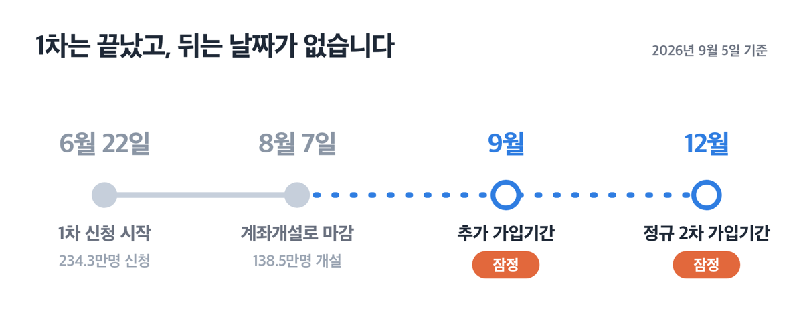
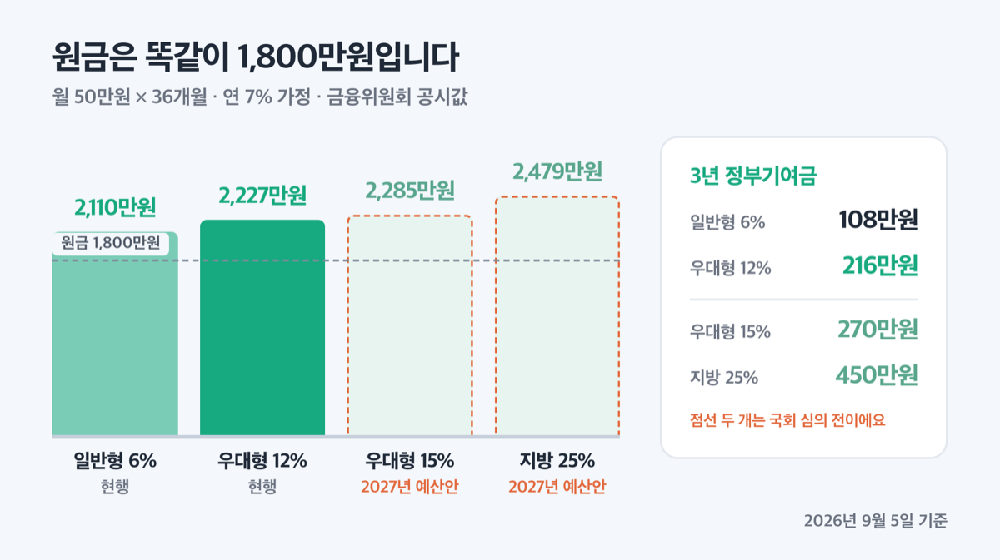
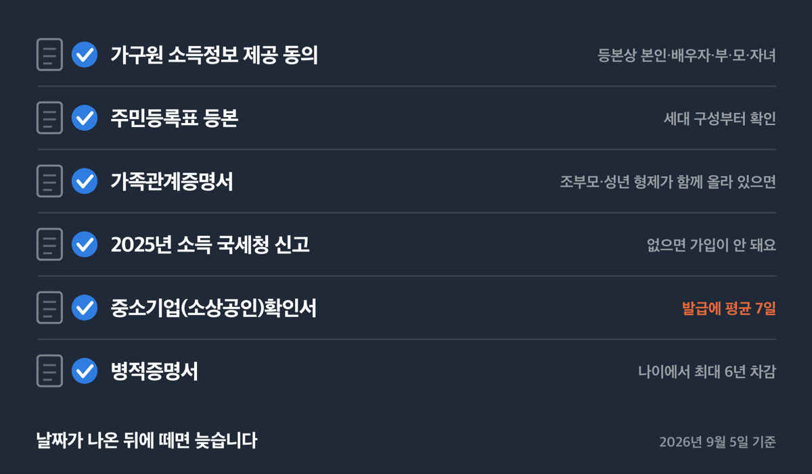
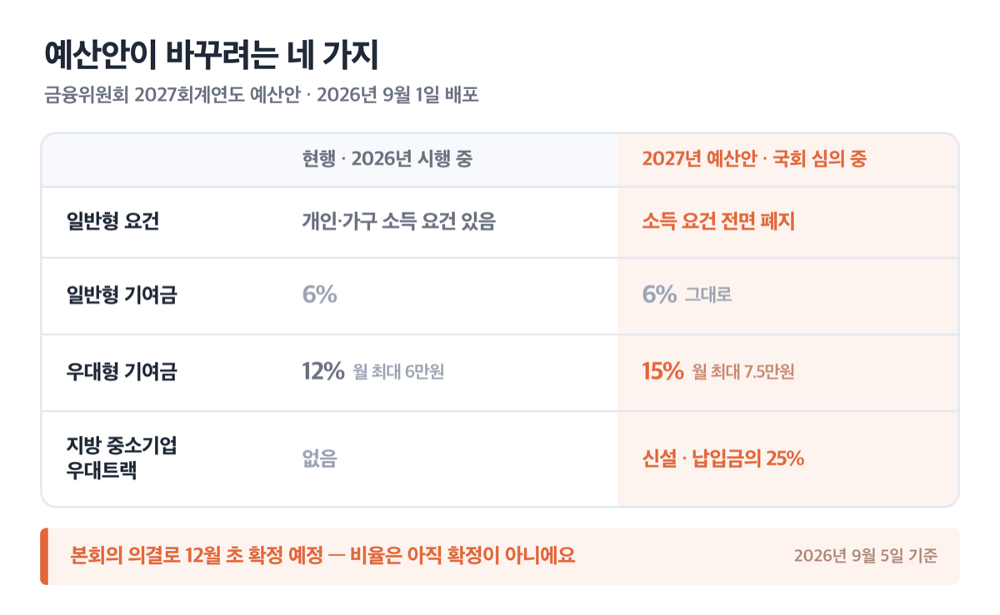

# '12월 잠정' 청년미래적금 2026 추가신청, 9월 날짜는 아직 미정

📌 2026년 9월 5일 기준

9월에 추가 신청이 열린다고들 하는데, 시작일과 마감일은 아직 발표되지 않았습니다. 금융위원회가 8월 28일 자료에 적은 말은 「추가모집 조기 시행(잠정 9월)」까지예요. 그래서 지금 할 일은 신청이 아니라 서류 준비입니다.

**3줄 요약**

- 청년미래적금은 만 19~34세가 3년간 월 최대 50만원을 넣고 정부기여금 6~12%와 이자소득 비과세를 받는 적금이에요.
- 1차 모집은 2026년 6월 22일에 시작해 8월 7일 계좌개설로 끝났고, 9월 추가 모집과 12월 2차 모집은 아직 날짜가 나오지 않았습니다.
- 먼저 확인할 것은 가구원 소득정보 제공 동의와 가족관계증명서예요. 1차 탈락 79.6만명 가운데 40.9만명이 여기서 걸렸어요.

날짜가 언제 나오든 준비가 끝나 있어야 하니, 일정부터 조건과 서류까지 순서대로 짚어 볼게요.

## 9월 추가 신청과 12월 2차 신청, 지금 어디까지 나왔나

청년미래적금의 남은 모집은 두 가지고, 성격이 서로 다릅니다. 하나는 1차를 놓쳤거나 서류가 모자라 떨어진 청년을 위한 **추가 가입기간**이고, 다른 하나는 반기별로 돌아가는 **정규 2차 가입기간**이에요.

금융위원회가 8월 10일 자료에 쓴 표현은 「'26년 9월 추가 가입기간 운영을 검토 중이며 조만간 구체적인 일정과 절차를 안내 예정」입니다. 8월 28일 관계부처 합동 자료의 인포그래픽에는 「추가모집 조기 시행(잠정 9월)」이라고 한 걸음 더 나간 표현이 있어요. 정규 2차는 6월 15일 사전안내부터 「'26년 12월 잠정」으로 적혀 있습니다.

**왜 두 자료의 말이 다를까요?** 뒤에 나온 문서일수록 내부 검토가 진전된 상태를 반영하기 때문이에요. 다만 두 문서 모두 「검토 중」과 「잠정」이라는 말을 떼지 않았습니다. ==정부 예산과 전산 일정이 함께 확정돼야 날짜가 붙는 구조==라 그렇습니다.

| 모집 구분 | 예정 시기 (2026-09-05 기준, 미확정) | 정부 발표 문서의 표현 |
|---|---|---|
| 추가 가입기간 | 2026년 9월 (잠정) | 조기 시행·검토 중 |
| 정규 2차 가입기간 | 2026년 12월 (잠정) | 잠정 |

날짜가 확정되면 서민금융진흥원 청년미래적금 공식 페이지(fill4young.kinfa.or.kr)와 취급기관 앱 공지에 올라옵니다. 청년금융콜센터 1397번에서 3번을 누르면 영업일 오전 9시부터 오후 6시 30분까지 무료로 물어볼 수 있어요.

> [!WARNING]
> 9월 추가 모집이 12월 정규 2차 모집을 앞당긴 것인지, 둘이 따로 열리는지는 아직 정부 발표에 나오지 않았습니다. 12월을 믿고 9월을 흘려보내지 않는 편이 안전해요.

## 얼마 받나 — 기여금 6%와 12%, 그리고 소득선 두 개

이 상품의 핵심은 정부기여금과 비과세 두 가지예요. 월 납입액에 비율을 곱해 정부가 얹어 주고, 만기에 받는 이자에는 소득세를 매기지 않습니다. 「조세특례제한법」 제91조의25가 2026년 1월 1일부터 시행 중이고, 2028년 12월 31일까지 가입하면 비과세가 적용됩니다.

기여금은 두 유형으로 나뉘어요.

| 유형 | 기여금 비율 | 월 최대 기여금 |
|---|---|---|
| 일반형 | 납입액의 6% | 30,000원 |
| 우대형 | 납입액의 12% | 60,000원 |
| 기여금 미지급 구간 | 0% | 0원 |

여기서 가장 많이 헷갈리는 것이 소득 기준입니다. **가입할 수 있는 선과 기여금을 받는 선이 다릅니다.**

| 구분 (직전연도 2025년 소득) | 총급여 | 종합소득금액 |
|---|---|---|
| 가입 가능선 | ==7,500만원 이하== | 6,300만원 이하 |
| 기여금 지급선 | 6,000만원 이하 | 4,800만원 이하 |

총급여가 6,000만원을 넘고 7,500만원 이하면 가입은 되지만 기여금이 0원이고 비과세만 받아요. 1차 모집에서 이 구간으로 가입한 사람이 1.2만명, 전체의 0.9%였습니다. 소상공인은 직전연도 연매출 3억원 이하면 가입 가능하고, 사업장이 여럿이면 합산합니다.

가구 소득도 함께 봅니다. 일반형은 가구 기준중위소득 200% 이하, 우대형은 150% 이하예요. 본인과 배우자로만 이뤄진 2인 가구이면서 둘 다 소득이 확인되면 각각 250%와 200%로 완화됩니다.

| 가구원 수 | 중위소득 150% (연) | 중위소득 200% (연) |
|---|---|---|
| 1인 | 4,305만 6,234원 | 5,740만 8,312원 |
| 2인 | 7,078만 7,844원 | 9,438만 3,792원 |
| 3인 | 9,045만 6,354원 | 1억 2,060만 8,472원 |
| 4인 | 1억 975만 9,914원 | 1억 4,634만 6,552원 |

*(2025년도 기준중위소득이고, 주민등록표 등본상 본인·배우자·부·모·자녀·미성년 형제자매의 소득을 더한 값이에요)*

우대형 12%를 받으려면 여기에 하나가 더 붙습니다. 중소기업 재직자는 총급여 3,600만원 이하에 가구 중위소득 150% 이하, 중소기업 신규 취업자는 총급여 6,000만원 이하에 200% 이하, 소상공인은 연매출 1억원 이하에 150% 이하예요. **신청할 때 유형을 고르지 않습니다.** 서민금융진흥원이 요건을 확인해 자동으로 나눠 줍니다.

금리는 2026년 5월 29일 공시 기준으로 전 취급기관이 기본 연 5%, 3년 고정이에요. 여기에 기관별 우대금리가 최대 3%(농협·신한·우리·하나·기업·국민·우정사업본부) 또는 최대 2%(수협·iM·부산·광주·전북·경남·카카오뱅크) 붙습니다. 최고 연 7~8%라는 숫자는 이 우대 조건을 모두 채웠을 때 나오는 값입니다.

공통 우대금리도 있어요. 총급여 3,600만원 이하면 0.5%p가 자동으로 붙고, 「청년 모두를 위한 재무상담」을 만기 3개월 전까지 이수하면 0.2%p가 더해집니다.

그래서 3년 뒤 손에 쥐는 돈은 얼마일까요? 금융위원회가 월 50만원씩 36개월, 원금 1,800만원을 연 7%로 계산해 공시한 값입니다.

| 유형 (연 7% 가정) | 만기 수령금 | 3년 정부기여금 |
|---|---|---|
| 현행 일반형 (6%) | 2,110만원 | 108만원 |
| 현행 우대형 (12%) | 2,227만원 | 216만원 |
| 2027년 우대형 (15%, 예산안) | 2,285만원 | 270만원 |
| 2027년 지방 중소기업 (25%, 예산안) | 2,479만원 | 450만원 |

*(월 50만원을 36개월 꼬박 넣었을 때예요. 중간에 덜 넣은 달이 있으면 기여금도 이자도 줄어듭니다)*

현행 우대형 2,227만원은 일반 적금으로 치면 단리 18.2%짜리와 같다는 것이 금융위원회 계산이에요. 일반 적금은 이자에서 15.4%를 떼지만 청년미래적금은 그 세금이 없어서, 세후로 견주면 격차가 더 벌어집니다.

> 🤭 **솔직히 말하면** — 저는 이 상품에서 금리보다 기여금이 본체라고 봐요. 우대형 216만원은 3년간 한 푼도 안 쓰고 모아야 겨우 만드는 차이거든요.

## 1차에서 79.6만명이 떨어진 이유

숫자부터 봅니다. 1차 모집에 234.3만명이 신청해 154.7만명이 심사를 통과했고, 최종적으로 138.5만명이 계좌를 열었어요.

떨어진 79.6만명의 사유는 세 가지로 나뉘어요.

| 미통과 사유 | 인원 |
|---|---|
| 가구원 소득정보 동의 미확보·서류 미제출 | 40.9만명 |
| 개인소득 요건 미충족 | 21.1만명 |
| 가구소득 기준 초과 | 16.5만명 |

**절반이 넘는 40.9만명이 돈이 아니라 절차에서 떨어졌습니다.** 소득이 초과된 사람(21.1만명)보다 두 배 가까이 많아요.

왜 이런 일이 생겼을까요? 청년미래적금은 본인 소득만 보는 게 아니라 가구 소득을 함께 봅니다. 그래서 등본에 올라 있는 부모나 배우자가 각자 소득정보 제공에 동의해야 심사가 끝나요. 동의 하나가 비면 그 계좌는 서류 미비로 처리됩니다.

여기에 하나가 더 겹칩니다. ==주민등록등본에 조부모까지 여러 세대가 함께 올라 있으면== 누가 가구원인지 가려야 해서 가족관계증명서를 따로 내야 해요. 조부모는 원칙적으로 가구원에서 빠지지만, 부양 사실을 증빙하면 포함됩니다. 이 절차를 모르고 넘어간 사람이 1차에서 가장 많이 떨어졌습니다.

> 😕 저는 1차에서 떨어졌는데, 다시 신청해도 되나요?

동의와 서류에서 걸린 40.9만명은 추가 가입기간에 다시 신청해 재심사를 받을 수 있습니다. 금융위원회가 8월 10일 자료에 명시한 내용이에요. 다만 소득 요건 자체가 초과된 경우는 직전연도 소득이 바뀌지 않는 한 결과가 같습니다.

## 지금 미리 준비할 것 다섯

날짜가 나온 뒤에 서류를 떼면 늦습니다. 신청 기간이 2주 남짓이었던 1차를 생각하면 더 그래요. 순서대로 정리했습니다.

1. **가구원에게 소득정보 제공 동의를 미리 받아 둡니다.** 등본상 본인·배우자·부·모·자녀·미성년 형제자매가 대상이에요. 부모님이 따로 앱을 쓰셔야 하는 절차라 미리 말씀드려 두는 편이 낫습니다.
2. **주민등록표 등본을 떼어 세대 구성을 확인합니다.** 조부모나 성년 형제가 함께 올라 있으면 가족관계증명서를 준비하세요.
3. **2025년 소득이 국세청에 신고돼 있는지 확인합니다.** 상용직·일용직·아르바이트·기간제 무관하고, 신고 소득만 확인되면 됩니다. 직전연도 소득이 없으면 가입이 되지 않아요.
4. **소상공인이라면 「중소기업(소상공인)확인서」를 먼저 발급받습니다.** 중소기업현황정보시스템(sminfo.mss.go.kr)에서 직접 받아야 하고 평균 7일쯤 걸려요. 사업장이 둘 이상이면 전부 필요합니다.
5. **병역을 마쳤다면 병적증명서를 준비합니다.** 병역 이행 기간은 최대 6년까지 나이 계산에서 빼 줘서, 만 34세를 넘겼어도 가입 대상이 될 수 있어요.

신청 자체는 어렵지 않습니다. 취급기관 앱에서 비대면으로 하고, 서류를 창구에 내는 절차 없이 전산 연계로 심사합니다. 외국인만 지점에서 대면으로 가입해요. 연차를 내고 은행에 갈 일은 없습니다.

**선착순이 아닙니다.** 요건을 갖춘 청년은 모두 가입할 수 있다고 금융위원회가 1차 때 밝혔어요. 첫날에 몰릴 이유가 없다는 뜻입니다.

> [!WARNING]
> 1991년 8월 8일부터 12월 31일 사이에 태어난 경우는 따로 확인이 필요합니다. 1차 사전안내문에 「2차 가입기간 사이에 만 35세에 도달하는 청년은 향후 추가 가입기회가 제한될 수 있다」는 문구가 있었어요. 추가 모집에 이 기준이 그대로 적용되는지는 1397번 3번으로 문의하세요.

저라면 오늘 등본부터 떼어 보겠습니다. 세대 구성은 5분이면 확인되는데, 가족관계증명서가 필요한 상황이면 그때부터 부모님 동의까지 며칠이 걸리거든요.

## 2027년 개편 — 15%와 지방 25%는 국회 통과 전입니다

2026년 9월 1일 배포된 금융위원회 2027회계연도 예산안에 개편안이 담겼습니다. 예산이 7,446억원에서 약 1.7조원으로 늘고, 가입 대상이 약 580만명에서 약 960만명으로 확대되는 안이에요.

| 항목 | 현행 (2026년) | 개선안 (2027년 예산안) |
|---|---|---|
| 일반형 요건 | 개인·가구 소득 요건 있음 | 소득 요건 전면 폐지 |
| 일반형 기여금 | 6% | 6% (그대로) |
| 우대형 기여금 | 12% (월 최대 6만원) | 15% (월 최대 7.5만원) |
| 지방 중소기업 우대트랙 | 없음 | 신설, 납입금의 25% |

기존 가입자도 챙깁니다. 예산안 본문에는 「'26년 기존 가입자에도 소급하여 적용할 계획」이라고 적혀 있어요. 다만 같은 문장에 조건이 붙습니다. 「국회 예산심의를 거쳐 기여금 지급률 등이 확정된 후 이를 반영하여 추진 예정」이라는 대목이에요.

**이 표의 오른쪽 칸은 아직 확정된 제도가 아닙니다.** 예산안은 9월 초 국회에 제출돼 상임위와 예결위 심의를 거치고, ==본회의 의결로 12월 초 확정될 예정==입니다. 심의 과정에서 비율과 시행 시기가 달라질 수 있어요.

지방 우대트랙도 아직 윤곽만 나왔습니다. 예산안 원문의 표현은 「지방 소재 중소기업에 재직 중인 청년이 청년미래적금을 가입할 경우 본인 납입금의 25%를 지원」까지예요. 어디까지를 지방으로 볼지, 비수도권 전체인지 별도로 고시하는 지역인지는 확정되면 서민금융진흥원 공식 페이지에 안내됩니다.

저는 이 개편을 기다리며 9월이나 12월 모집을 건너뛰는 선택을 권하지 않습니다. 소급 적용이 계획에 들어 있고, 반대로 국회에서 비율이 조정될 가능성도 열려 있으니 먼저 계좌를 여는 쪽이 잃을 게 적어요.

## 청년미래적금 관련 궁금증 해결

**Q. 총급여가 7,000만원인데 가입되나요?**

A. 가입됩니다. 가입 가능선이 총급여 7,500만원이라 조건에 들어요. 다만 기여금 지급선은 6,000만원이라 정부기여금은 나오지 않고, 이자소득 비과세만 적용됩니다.

**Q. 청년도약계좌를 갖고 있는데 갈아탈 수 있나요?**

A. 갈아타기 절차는 2026년 6월 최초 가입기간에만 운영됐습니다. 두 상품은 중복 가입이 되지 않으니, 지금은 청년도약계좌를 유지할지 해지할지부터 따져 보셔야 해요. 청년도약계좌를 5년 만기까지 채운 경우는 청년미래적금 가입 대상이 아닙니다.

**Q. 중간에 해지하면 어떻게 되나요?**

A. 일반 중도해지는 정부기여금이 나오지 않고 이자소득에 세금이 붙으며 중도해지금리가 적용됩니다. 사망·해외이주·천재지변·퇴직·사업장 폐업·3개월 이상 치료가 필요한 상해나 질병은 특별중도해지 사유라, 만기해지처럼 기본금리와 기여금과 비과세를 그대로 받아요. 재가입은 해지 2개월 뒤부터 가능합니다.

**Q. 우대형으로 가입한 뒤 회사를 옮기면 어떻게 되나요?**

A. 가입일부터 만기 한 달 전까지 총 29개월 이상 중소기업에 재직해야 하고, 이직은 2회까지 허용됩니다. 못 채우면 전체 가입기간에 대해 기여금이 6%로 조정되고 이미 쌓인 12% 분은 반환돼요.

**Q. 부부가 각각 가입할 수 있나요?**

A. 각자 요건을 채우면 둘 다 가입됩니다. 다만 계좌는 전 취급기관을 통틀어 1인 1개고, 공동명의 가입이나 가입 후 명의변경은 되지 않아요.

## 그래서 지금 할 일

정리하면 이렇습니다. 9월 추가 모집과 12월 정규 2차 모집은 열릴 예정이지만 날짜는 아직 발표 전이고, 확정되면 서민금융진흥원 공식 페이지와 취급기관 앱에 공지됩니다.

그사이에 할 일은 서류입니다. 1차에서 떨어진 79.6만명 중 40.9만명이 가구원 동의와 서류 때문이었다는 숫자가 그 이유를 말해 줘요. 자격이 있는데 절차에서 걸린 사람이 그만큼 많았다는 뜻입니다.

계산으로 보면 우대형은 3년에 기여금 216만원, 일반형은 108만원이에요. 여기에 이자소득세 면제 효과가 더해지니 월 50만원을 3년간 유지할 수 있는 상황이라면 저는 넣습니다. 반대로 3년 안에 목돈 쓸 일이 잡혀 있다면 중도해지 조건부터 다시 보시는 편이 나아요.

가입 자격이나 가구 소득 판정이 애매하면 서민금융진흥원 청년금융콜센터 1397번에서 3번을 눌러 확인하세요. 영업일 오전 9시부터 오후 6시 30분까지 무료입니다.

참고: 금융위원회 「청년미래적금, 138.5만명 최종 가입」(2026.8.10) · 금융위원회 「2027회계연도 금융위원회 예산안 편성」(2026.9.2) · 관계부처 합동 「청년 성장단계별 종합투자 추진전략」(2026.8.28) · 금융위원회 「청년미래적금 출시 사전안내」(2026.6.15) · 금융위원회 「취급기관별 금리 공시」(2026.5.28) · 서민금융진흥원 청년미래적금 안내 페이지 · 조세특례제한법 제91조의25
