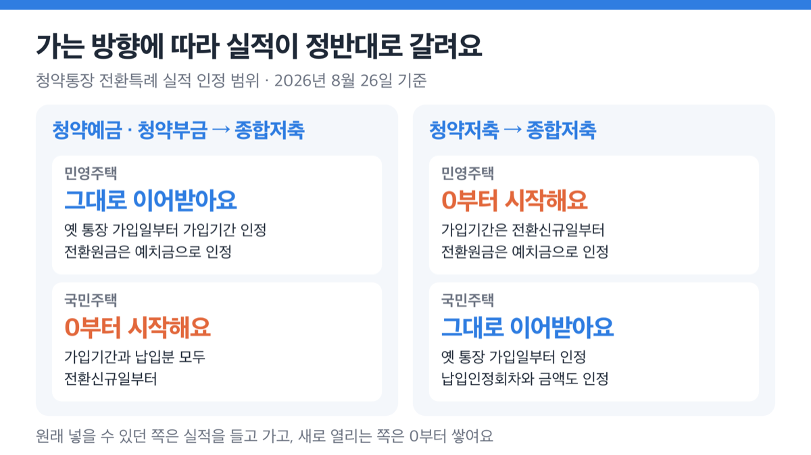
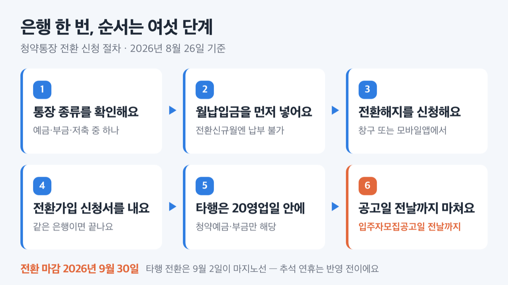

# 2026 청약통장 전환특례 9월 30일 마감, 35일 남았어요

📌 2026년 8월 26일 기준

청약예금·청약부금·청약저축을 주택청약종합저축으로 바꾸는 창구가 ==2026년 9월 30일==에 닫혀요. 오늘 기준 35일 남았습니다. 저도 멀쩡한 통장을 왜 굳이 갈아타야 하나 싶어서 국토교통부와 주택도시기금 원문을 다 열어봤어요.

**3줄 요약**

1. 2015년 9월 1일에 신규가입이 끊긴 옛 청약통장 세 종류를 주택청약종합저축으로 갈아탈 수 있게 열어 둔 한시 조치예요.
2. 2024년 10월 1일에 시작해 당초 2025년 9월 30일까지였는데, 1년 연장돼 2026년 9월 30일에 끝납니다.
3. 전환한다고 실적이 통째로 옮겨오지 않아요. 가는 방향에 따라 절반만 인정되니 내 통장이 셋 중 무엇인지부터 확인해야 합니다.

마감일과 대상, 전환 후 인정 범위, 은행에서 밟을 순서, 놓치기 쉬운 함정까지 순서대로 정리했어요.

## 전환특례가 뭐고, 왜 9월 30일인가

청약통장 전환특례의 대상은 청약예금, 청약부금, 청약저축 세 가지입니다. 이 셋을 해지하는 즉시 그 돈을 주택청약종합저축에 넣으면, 옛 통장의 실적을 일부 이어받게 해 주는 제도예요.

왜 한시 운영일까요. 2015년 9월 1일부터 입주자저축이 주택청약종합저축으로 일원화되면서 세 종류는 신규가입이 끊겼어요. 남아 있는 계좌에 갈아탈 통로를 한동안 열어 둔 것이라, 시작도 끝도 날짜로 정해져 있습니다.

이 마감일은 「주택공급에 관한 규칙」 본문에도 부칙에도 없습니다. 규칙이 정한 것은 전환할 때 실적을 어떻게 승계하느냐이고, 기한은 제도 운영상의 한시 조치예요. ==법에 박힌 날짜가 아니라서== 실제로 한 번 연장됐습니다.

> [!WARNING]
> 2026년 9월 30일은 수요일이에요. 다만 이번에도 또 연장된다고 보고 미루면 곤란합니다. 재연장 여부나 계획을 밝힌 공식 자료는 확인되지 않았어요.

아직 바꾸지 않고 남은 계좌가 꽤 됩니다.

**청약홈 공표 기준, 통장 종류별 잔존 계좌 수(좌)**

| 통장 종류 | 2024년 9월 30일 | 2026년 7월 31일 |
|---|---|---|
| 청약저축 | 340,626 | 289,469 |
| 청약부금 | 143,739 | 118,857 |
| 청약예금 | 886,240 | 701,707 |
| 세 종류 합계 | 1,370,605 | 1,110,033 |

제도 시행 이후 22개월 동안 26만여 좌가 줄었어요. 다만 이 감소분을 '전환한 사람 수'로 읽으면 안 됩니다. 당첨 해지, 중도 해지, 사망 해지가 다 섞여 있고, 전환 건수만 따로 공표한 자료는 찾지 못했어요. 청약홈도 이 통계를 참고 자료라고 밝혀 두었습니다.

> 😕 2015년에 끊긴 통장이면 이미 없어진 거 아닌가요?

아니에요. 기존 가입자는 종전 규정대로 계좌를 유지하고 청약도 할 수 있어요. 그러니까 9월 30일에 사라지는 건 통장이 아니라 **바꿀 수 있는 창구**입니다.

## 바꾸면 실적은 어디까지 따라오나

전환한다고 20년 묵은 실적이 그대로 넘어가지 않습니다.

| 어떻게 바꾸나 | 민영주택 청약 | 국민주택 청약 |
|---|---|---|
| 청약예금·청약부금 → 종합저축 | 옛 통장 가입일부터 가입기간 인정, 전환원금을 예치금으로 인정 | 가입기간·납입분 모두 전환신규일부터 |
| 청약저축 → 종합저축 | 가입기간은 전환신규일부터, 전환원금은 예치금으로 인정 | 옛 통장 가입일부터 인정, 납입인정회차와 금액도 인정 |

원리는 한 줄이에요.

> 다만, 청약 기회가 확대되는 유형(예: 청약저축 → 민영주택)은 신규 납입분부터 실적을 인정한다.
> — 국토교통부 보도자료

쉽게 말하면 원래 넣을 수 있던 쪽은 실적을 들고 가고, 새로 열리는 쪽은 0부터 시작한다는 뜻이에요. 국토교통부가 든 예시를 보면 감이 옵니다. 2004년 11월에 청약저축을 만들어 10만원씩 240개월을 넣은 사람이 2024년 10월에 전환하고 12개월을 더 넣으면, 공공청약에서는 252개월(2,520만원)로 인정받지만 민영청약에서는 12개월짜리 통장이에요. 청약예금·부금 쪽은 정확히 거꾸로입니다.

이 숫자가 왜 중요하냐면, 1순위 요건이 기간과 횟수로 걸려 있기 때문이에요.

| 지역 | 국민주택 | 민영주택 |
|---|---|---|
| 투기과열지구·청약과열지역 | 24개월 경과 + 24회 납입 | 24개월 경과 + 지역별 예치금액 |
| 그 밖의 지역 | 12개월 경과 + 12회 납입 | 12개월 경과 + 지역별 예치금액 |

다만 그 밖의 지역은 수도권 12개월(12회), 수도권 외 6개월(6회)이 기본이고, 시·도지사가 수도권 24개월, 수도권 외 12개월까지 늘려 정할 수 있어요. 지역 공고를 봐야 합니다.

민영주택 예치기준금액은 이렇습니다. 전환원금이 그대로 예치금으로 인정되니, 옛 통장에 든 돈이 이 표를 넘는지 먼저 보세요.

**민영주택 청약 예치기준금액 (단위: 만원)**

| 공급받을 수 있는 전용면적 | 예치기준금액 — 특별시 및 부산광역시 (만원) | 예치기준금액 — 그 밖의 광역시 (만원) |
|---|---|---|
| 85㎡ 이하 | 300 | 250 |
| 102㎡ 이하 | 600 | 400 |
| 135㎡ 이하 | 1,000 | 700 |
| 모든 면적 | 1,500 | 1,000 |

특별시와 광역시를 제외한 지역은 위 순서대로 200, 300, 400, 500만원이에요.

## 💰 금리와 소득공제는 얼마나 달라지나

주택청약종합저축 이자율은 2026년 1월 1일 시행 고시 기준으로 이렇게 됩니다.

| 가입일부터 해지까지 | 이자율 |
|---|---|
| 1개월 이내 | 이자 없음 |
| 1개월 초과 1년 미만 | 연 2.3% |
| 1년 이상 2년 미만 | 연 2.8% |
| 2년 이상 | 연 3.1% |

청약예금·청약부금은 은행별로 연 1% 후반에서 2% 초반이에요. 이 차이가 전환의 가장 큰 이유로 소개되는데, 절반만 맞는 말입니다. 고시 조문이 "주택청약종합저축(청약저축을 포함한다)"이라고 적고 있어서 ==청약저축은 이미 같은 이자율==이에요. 금리 하나로 서두를 이유가 있는 사람은 청약예금·청약부금 가입자입니다.

소득공제는 총급여 7천만원 이하 근로자이면서 무주택 세대의 세대주 또는 그 배우자가 대상이에요. 연 300만원 납입한도의 40%를 근로소득금액에서 공제하니, 300만원을 꽉 채우면 공제액은 120만원이 됩니다. 2028년 12월 31일까지 납입분에 적용되고, 무주택 확인서는 다음 해 2월 말까지 은행에 내야 해요.

디딤돌대출 우대금리도 있어요. 청약예금·부금의 가입기간이나 청약저축의 납입횟수를 계속 인정해 0.3~0.5%p를 깎아 줍니다.

한 가지 더. 국민주택 청약에서 인정되는 월 납입금이 2024년 11월 1일부터 10만원에서 25만원으로 올랐어요. 40년 넘게 10만원이던 기준이 바뀐 거라, 공공주택을 노린다면 이 한도를 채우는 게 저축총액 경쟁에서 유리해집니다.

> **솔직히 말하면** — 저는 청약예금이나 청약부금을 들고 있다면 이번에 바꿉니다. 민영주택 가입기간이 그대로 따라오는데 금리와 소득공제가 붙으니 안 바꿀 이유를 못 찾겠어요.

반대로 청약저축만 있고 공공주택만 볼 생각이라면 급하지 않다고 봐요. 이자율은 이미 같고 국민주택 실적도 그대로 남거든요. 그 경우 전환의 실익은 민영주택이라는 선택지가 하나 늘어나는 것뿐이에요.

## 은행에서 전환하는 순서

절차 자체는 은행 한 번이면 끝나요. 순서는 여섯 단계입니다.

1. 내 통장이 청약예금·청약부금·청약저축 중 무엇인지 확인해요. 인정 범위가 여기서 갈려요.
2. 국민주택 청약을 볼 거라면, 그 달 약정일에 월납입금을 **먼저 납부**해요. 전환신규월에는 추가 납부가 안 되거든요.
3. 가입은행 창구나 모바일앱에서 전환해지를 신청해요.
4. 이어서 전환가입 신청서를 작성해 제출하면 같은 은행 전환은 끝나요.
5. 다른 은행으로 옮기려면 전환해지 신청일을 포함해 20영업일 안에 원하는 은행에 전환가입 신청서를 내야 해요. *(청약예금·청약부금 가입자만 해당해요)*
6. 청약할 곳이 있다면 그 주택의 입주자모집공고일 전날까지 전환신규를 마쳐야 해요.

업무취급은행은 우리, KB국민, IBK기업, NH농협, 신한, 하나, iM뱅크, 부산, 경남 아홉 곳이에요.

마감일에 몰리면 창구가 밀립니다. 다른 은행으로 옮기는 경우 20영업일을 주말만 빼고 역산하면 2026년 9월 2일이 마지노선인데, 여기엔 추석 연휴가 반영돼 있지 않아요. 실제로는 더 앞당겨 잡는 게 안전합니다.

## 놓치기 쉬운 함정 다섯

공식 안내를 다 읽어도 걸리기 쉬운 자리가 다섯 군데 있어요.

**첫째, 선납과 연체 기록은 사라져요.** 전환하면 기존 선납·연체 정보가 인정되지 않고 모두 소멸합니다. 청약저축의 연체분은 전환한 뒤에는 납부할 수 없어서, 납입인정 회차와 금액이 줄어들 수 있어요.

**둘째, 전환한 달은 납입이 비어요.** 전환신규월에는 월납입금을 추가로 낼 수 없어요. 순서를 바꿔서 먼저 넣고 전환하면 그 달이 인정됩니다.

**셋째, 아예 전환이 막히는 경우가 셋 있어요.** 기존 계좌가 청약에 당첨된 경우, 청약을 신청하고 결과가 확정되지 않은 경우, 통장에 압류 같은 제한이 걸린 경우입니다. 청약 결과를 기다리는 중이라면 그 사이에는 신청 자체가 안 돼요.

**넷째, 명의변경 범위가 좁아집니다.** 미전환의 거의 유일한 실익이 여기예요.

| 통장 | 명의변경 가능 범위 |
|---|---|
| 주택청약종합저축 | 가입자 사망 시 상속인 명의로만 가능 |
| 청약저축 | 사망 시 상속인, 결혼한 경우 배우자, 배우자나 세대원인 직계존비속으로 세대주가 바뀐 경우 그 세대주 |

2000년 3월 27일 전에 가입한 청약예금·청약부금은 옛 규칙을 따르도록 부칙이 정하고 있어요. 다만 그 옛 규칙의 구체적인 허용 범위까지는 확인하지 못했으니, 가족 간 승계를 염두에 두고 있다면 은행에 먼저 물어보세요.

**다섯째, 소득공제를 받아 온 사람은 추징을 확인해야 해요.** 가입일부터 5년 안에 해지하면 납입액 누계의 6%가 추징될 수 있는데, 전환은 '전환해지 + 전환가입' 절차를 거칩니다. 이 전환해지가 추징 대상 해지에 들어가는지 밝힌 공식 자료를 찾지 못했어요. 가입한 지 5년이 안 됐다면 창구에서 반드시 확인하고 진행하세요.

## 청약통장 전환특례 관련 궁금증 해결

**Q. 청약저축도 전환 대상인가요? 요약 자료에는 예금·부금만 적혀 있던데요.**
A. 세 종류 모두 대상이에요. 정책 요약문에 '청약예금·부금'만 적힌 곳이 있는데, 주택도시기금 제도안내와 국토교통부 보도자료는 청약저축을 대상에 명시하고 있습니다.

**Q. 주거래 은행으로 옮기면서 전환할 수 있나요?**
A. 청약예금·청약부금 가입자에 한해 다른 은행으로 전환 가입할 수 있어요. 청약저축의 타행 전환은 공식 안내에 언급이 없어서, 된다 안 된다를 말씀드릴 근거가 없습니다. 가입은행에 확인하세요.

**Q. 예전에 청약저축에서 청약예금으로 한 번 바꾼 적이 있어요. 또 되나요?**
A. 청약예금에서 주택청약종합저축으로 다시 전환할 수 있어요. 다만 그때 소멸된 납입인정 회차 같은 국민주택 청약정보는 되살아나지 않습니다.

**Q. 9월 30일이 지나면 영영 못 바꾸나요?**
A. 그 이후를 밝힌 공식 자료가 없어요. 한 번 연장된 전례가 있으니 '마지막 기회'라고 단정하기도 어렵고, 반대로 또 연장된다고 믿고 미룰 근거도 없습니다. 확실한 건 지금은 열려 있다는 것뿐이에요.

## 안 바꿔도 통장은 살아 있어요

정리하면 이래요. 옛 통장을 그대로 둬도 계좌와 청약 자격은 유지됩니다. 9월 30일에 닫히는 건 갈아탈 창구예요. 그래서 이 결정은 '급한 불'이 아니라 '지금 아니면 못 여는 문'에 가깝습니다.

판단 기준은 하나예요. 민영과 공공 중 지금 못 넣는 쪽에 앞으로 넣을 생각이 있는가. 있다면 실적이 0부터 쌓이니 하루라도 빨리 여는 게 낫고, 없다면 명의변경 범위까지 견줘 보고 결정하면 돼요.

숫자와 자격은 통장마다 다르게 걸립니다. 최종 판단 전에 가입은행 창구, 주택도시기금 포털(nhuf.molit.go.kr), 청약홈(applyhome.co.kr)에서 본인 계좌 기준으로 확인하시고, 소득공제 추징처럼 세금이 걸리는 부분은 은행이나 국세청 상담 창구에서 따로 확인하세요.

참고: 국토교통부 보도자료 「3%대 금리, 청약예·부금 종합저축으로 전환 가능」 · 주택도시기금 포털 「청약예금·청약부금 등 주택청약종합저축 전환」 · 대한민국 정책브리핑 「2026년 부동산 제도, 이렇게 달라집니다!」 · 국가법령정보센터 「주택공급에 관한 규칙」 · 국토교통부고시 제2025-976호 · 조세특례제한법 제87조 · 한국부동산원 청약홈 청약통장 통계
