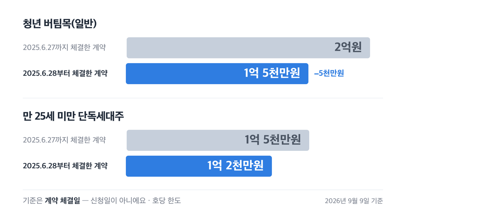
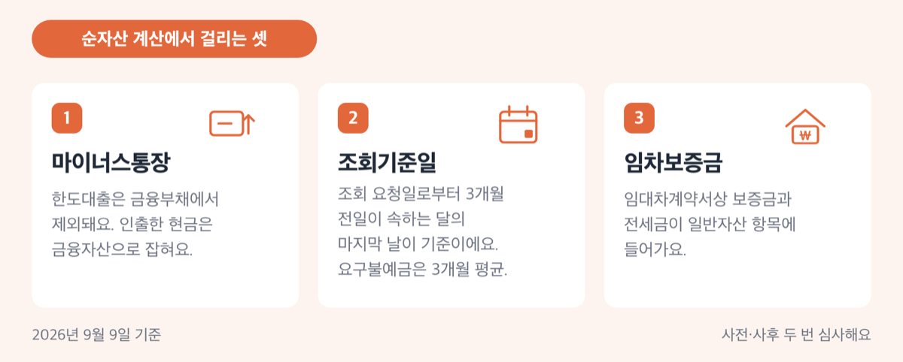
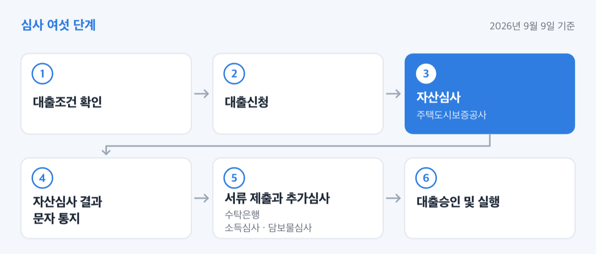
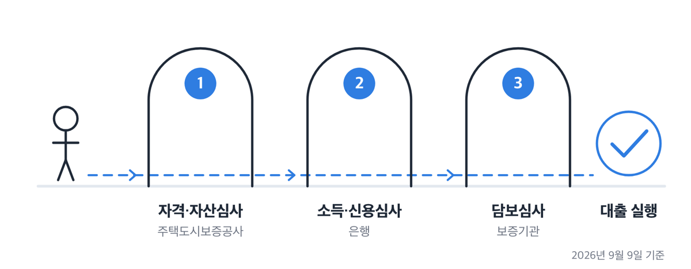

# 청년 전세자금대출 거절 사유, 2026년 한도 1.5억원

📌 2026년 9월 9일 기준

신용점수가 몇 점은 넘어야 된다는 말이 도는데, 주택도시기금 상품안내에는 점수 하한이 없어요. 대신 연체나 대위변제 기록이 남아 있으면 거기서 끝납니다. 거절 사유는 점수가 아니라 조건표에 적혀 있어요.

**3줄 요약**

1. 청년전용 버팀목전세자금은 만 19~34세 무주택 세대주가 부부합산 연소득 5천만원·순자산 3.45억원 이하일 때 최대 1억 5천만원까지 빌리는 주택도시기금 대출이에요.
2. 2025년 6월 28일 체결 계약부터 한도가 2억원에서 1억 5천만원으로 줄었고, 6월 27일까지 체결한 계약은 옛 한도인 2억원을 씁니다.
3. 거절되는 관문은 셋이에요 — 자격·자산심사(주택도시보증공사), 은행의 소득·신용심사, 보증기관의 담보심사.

아래에서 한도·자격·자산심사·집·절차 순서로, 어디서 어떻게 걸리는지 하나씩 짚어요.

## 💰 청년 버팀목, 2026년 조건은 이렇습니다

청년전용 버팀목전세자금의 뼈대는 나이·소득·순자산·무주택 넷이에요. 넷 중 하나라도 어긋나면 은행 창구까지 갈 것도 없이 걸립니다.

| 항목 | 2026년 기준 |
|---|---|
| 나이 | 대출접수일 현재 만 19세 이상 만 34세 이하 세대주(예비 세대주 포함) |
| 소득 | 신청인과 배우자 합산 총소득 5천만원 이하 |
| 순자산 | 신청인과 배우자 합산 3억 4,500만원 이하 |
| 무주택 | 세대주를 포함한 세대원 전원이 무주택 |
| 계약 | 임대차계약 체결 후 임차보증금의 5% 이상 지불 |

소득에는 예외가 있어요. 혁신도시 이전 공공기관 종사자, 타 지역 이주 재개발 구역 세입자, 다자녀가구, 2자녀 가구는 6천만원 이하고 신혼가구는 7,500만원 이하예요. 나이도 예외가 있어요. 중소·중견기업 취업자, 그리고 중소벤처기업진흥공단·신용보증기금·기술보증기금의 창업 지원을 받는 만 34세 이하인 사람이 대상이에요. 여기에 해당하고 병역의무를 이행했으면 복무기간만큼 늘어나 ==최대 만 39세까지== 됩니다.

빌릴 수 있는 돈은 호당 1억 5천만원 이내예요. 만 25세 미만 단독세대주는 1억 2천만원 이내입니다. 여기에 신규계약은 전세금액의 80% 이내라는 비율이 하나 더 붙어요.

> 😕 한도가 1.5억원이면 보증금 2억원짜리 집도 되는 것 아닌가요?

계산 순서를 따라가면 그렇게 안 돼요. 보증금이 낮으면 80% 비율이 먼저 걸리고, 보증금이 높으면 1억 5천만원 한도가 먼저 걸립니다. 두 선이 만나는 지점은 보증금 1억 8,750만원쯤이에요(1억 5천만원 ÷ 80%로 계산한 값이라 우대금리나 부채가 끼면 달라져요). 대상주택 보증금 상한이 3억원이니까, 3억원짜리 집을 얻으려면 자기 돈이 최소 1억 5천만원 필요합니다.

집 조건도 숫자로 정해져 있어요. 임차 전용면적 85㎡ 이하(주거용 오피스텔 포함)에 보증금 3억원 이하고, 만 25세 미만 단독세대주는 면적이 60㎡ 이하로 더 좁아져요.

금리는 부부합산 연소득 구간에 따라 연 2.2%에서 3.3% 사이에서 나뉘어요. 연소득 2천만원 이하가 연 2.2%, 2천만~4천만원이 연 2.5%, 4천만~6천만원이 연 2.9%, 6천만~7,500만원이 연 3.3%입니다. 대상주택이 지방에 있으면 0.2%p 내려가요. 소득 요건은 5천만원인데 금리표에 7,500만원 칸이 있는 건 오류가 아니라, 위에서 말한 신혼·다자녀 예외 대상에 맞춘 칸이에요.

## 2025년 6월에 줄어든 한도 — 5천만원이 사라졌어요

2025년 6월 27일 관계기관 합동 긴급 가계부채 점검회의에서 「가계부채 관리 강화 방안」이 발표됐고, 시행일은 다음 날인 6월 28일이었어요. 청년 버팀목 한도가 이때 全지역 2억원에서 1억 5천만원으로 내려갔습니다. 만 25세 미만 단독세대주는 1억 5천만원에서 1억 2천만원으로 줄었고요.

| 대출 종류 | 2025.6.27까지 체결한 계약 (호당 한도) | 2025.6.28부터 체결한 계약 (호당 한도) |
|---|---|---|
| 청년 버팀목(일반) | 2억원 | 1억 5천만원 |
| 만 25세 미만 단독세대주 | 1억 5천만원 | 1억 2천만원 |

줄어든 폭은 5천만원, 비율로는 25%예요. 보증금 1억 8,750만원 이상인 계약이라면 그만큼을 본인이 메워야 한다는 뜻입니다.

여기서 가장 자주 어긋나는 게 날짜예요. 발표일은 6월 27일, 시행일은 6월 28일, 그리고 기준이 되는 건 **계약을 언제 체결했느냐**입니다. 신청일이 아니라 계약 체결일을 봅니다.

> [!WARNING]
> 2025년 6월 27일까지 임대차계약을 체결하고 계약금을 이미 납부했으면 옛 한도인 2억원이 적용됩니다. 다만 **가계약은 인정되지 않습니다.** 계약갱신청구권을 써서 연장하는 경우와, 시행일 전에 은행이 전산으로 신청접수를 완료한 경우도 종전 규정이에요. 반대로 **증액하거나 다른 은행으로 대환하면 새 한도가 적용됩니다.**

2025년 10월 15일 주택시장 안정화 대책과 2026년 4월 1일 「'26년도 가계부채 관리방안」에서도 버팀목 한도는 손대지 않았어요. 두 보도자료 본문 어디에도 버팀목 한도 조정 항목이 없고, 상품 페이지도 지금까지 1억 5천만원을 적고 있습니다.

전세대출 DSR(총부채원리금상환비율) 얘기도 자주 섞여 들어와요. 2025년 10월 29일부터 1주택자가 수도권·규제지역에서 전세대출을 받으면 이자상환분이 DSR에 반영돼요. 그런데 금융위원회 문답은 「정책적 목적의 전세대출 제외 — 예: 버팀목 전세대출」이라고 상품명을 직접 적었어요. ==버팀목은 이 규제 대상이 아닙니다.==

## 자격에서 걸리는 것 — 중복대출·소득 산정·신용정보

기금 대출은 세대 단위로 봐요. 그래서 본인이 아무 문제가 없어도 세대원에서 걸리는 경우가 생깁니다. 성년인 세대원 중 한 명이라도 주택도시기금 대출을 이용 중이면 안 되고, 본인이나 배우자가 전세자금대출이나 주택담보대출을 쓰고 있어도 안 돼요. 세대 분리된 배우자와 자녀, 결혼예정 배우자, 함께 사는 배우자의 직계존속까지 봅니다.

비대면으로 접수하면 주택도시보증공사가 두 가지를 먼저 걸러요. **본인이나 배우자가 공공임대주택에 살고 있는지**, 그리고 **세대원이 기금 대출을 쓰고 있는지**입니다. 이 둘에서 막히면 「자격심사 부적격」이라는 결과가 나와요.

소득 쪽에서 걸리는 것도 정리하면 이렇습니다.

1. **퇴사·폐업했으면 그 소득은 인정되지 않아요.** 접수일 기준으로 퇴직이나 폐업 상태면 연소득이 없는 것으로 봅니다.
2. **재직 1년 미만이면 한도가 2천만원 이하로 제한될 수 있어요.** 급여내역서로 월환산하되 소득발생기간이 1개월 이상 입증돼야 인정돼요.
3. **사업 영위 1년 미만, 수령기간 1년 미만 기타소득은 연소득 환산이 안 됩니다.**
4. **성과급이나 내일채움공제로 소득이 일시적으로 늘었어도 그만큼을 제외해 주지 않아요.** 소득입증자료에 적힌 '소득금액'을 그대로 씁니다.
5. **소득은 세전으로 산정해요.** 실수령액으로 계산하고 안심하면 나중에 어긋나요.

재직 여부는 근로소득자면 건강보험자격득실확인서로, 사업소득자면 사업자등록증으로 확인해요. 이직하고 수습 중인 상태라면 이 서류가 어떻게 나오는지부터 보는 게 순서입니다.

신용 쪽은 점수가 아니라 기록으로 봐요. 한국신용정보원 「신용정보관리규약」이 정하는 정보가 남아 있으면 대출이 안 됩니다. 셋이에요 — ① 연체·대위변제·대지급·부도·관련인 정보 ② 금융질서문란정보·공공기록정보·특수기록정보 ③ 신용회복지원등록정보.

그럼 연체는 언제 기록으로 남을까요. 일반 대출은 원금이나 이자를 **3개월 이상** 연체하면 등록돼요. 분할상환 개인주택자금대출은 9개월, 학자금대출은 6개월입니다. 기산일은 갚기로 한 약정기일의 다음 날이고요. 등록사유가 생긴 날부터 ==90일 안에 해제되면 보존기간이 없어요.== 등록금액 100만원 이하의 소액 연체·대위변제 정보는 금융기관이 신용정보원에서 제공받을 수 없다는 조항(제15조 제1항 제1호)도 있어요. 다만 같은 조 제2항에 예외가 있어서 늘 가려지는 건 아니에요.

> 😕 저는 연체한 적이 없는데 왜 떨어졌을까요?

기금 안내문에 「그 외, 부부에 대하여 대출취급기관 내규로 대출을 제한하고 있는 경우에는 대출 불가능」이라는 줄이 하나 더 있어요. 주택도시보증공사도 「보증요건에 부합하더라도 취급 금융기관의 대출 심사에 따라 대출이 거절될 수 있음」이라고 적고, 한국주택금융공사도 같은 취지를 적어요. 은행 내규는 공개 대상이 아니니, 이 대목은 신청하려는 은행 지점에 직접 물어보세요.

기금 대출을 쓰다가 약정을 위반해 기한의 이익을 잃은 이력도 걸립니다. 다만 대출 접수일 기준으로 기한의 이익을 상실한 지 3년이 지났으면 다시 신청할 수 있어요.

저는 신용점수 몇 점이면 되는지 찾는 데 시간을 쓰지 않겠어요. 청년버팀목·일반버팀목·청년보증부월세·주거안정월세 네 상품 안내가 모두 같은 문장을 쓰는데 어디에도 점수가 없거든요. 대신 연체 기록이 있는지, 그게 90일 안에 정리됐는지를 먼저 확인하는 편이 빠릅니다.

## 자산심사에서 조용히 걸리는 것

순자산 3억 4,500만원은 2026년도 기준이에요. 통계청 가계금융복지조사의 소득 3분위 전체가구 평균값 이하로 정하고 십만원 단위에서 반올림하는 방식이라, 해마다 바뀝니다. 직전 기준은 3억 3,700만원이었고 2026년 1월 1일 이후 신규 접수분부터 3억 4,500만원이 적용돼요.

여기서 사람들이 놓치는 건 금액이 아니라 **계산 방법**이에요.

- **마이너스통장은 부채로 잡아주지 않아요.** 금융부채를 셀 때 한도대출(마이너스통장)과 금융기관 외 금전거래는 제외한다고 적혀 있어요. 마이너스통장을 당겨 잔고를 만들어 두면 자산만 늘고 부채는 그대로예요.
- **신용카드 미결제금은 조건이 맞아야 부채로 봐요.** 조회기준일에 미결제금액이 3개월 이상 남아 있고 50만원 이상인 건의 원금만 부채로 잡아요.
- **임차보증금도 자산이에요.** 일반자산 항목에 임대차계약서상 보증금과 전세금이 들어갑니다.

조회 시점도 신청일이 아니에요. 금융자산과 금융부채는 사회보장정보원이 조회를 요청한 날로부터 **3개월 전일이 속하는 달의 마지막 날**을 기준으로 봅니다. 요구불예금은 그 조회기준일로부터 **과거 3개월 평균 잔액**이고요. 신청 직전에 돈을 옮겨도 지난 석 달이 그대로 잡힙니다.

부동산·자동차·상가 임대보증금 같은 비금융자산은 대출접수일 기준으로 봐요. 기준일이 항목마다 다르다는 점을 모르면 계산이 어긋납니다.

심사는 두 번 이뤄져요. 사전자산심사는 비금융자산과 7개 수탁은행의 금융자산·부채로 하고, 사후자산심사는 전체 금융기관 정보로 합니다. 사전에서 부적격이 나오면 대출이 실행되지 않고 취소돼요. 사후에서 나오면 이미 실행된 대출에 가산금리가 붙거나 기한의 이익을 잃습니다.

| 순자산 초과 금액 | 전월세자금 가산금리 |
|---|---|
| 1천만원 이하 | 0.1%p |
| 1천만~5천만원 | 2.0%p |
| 5천만~1억원 | 4.0%p |
| 1억원 초과 | 4.0%p + 기한이익상실 |

한국주택금융공사 보증이 거절된 경우에는 초과 금액과 무관하게 1.0%p가 더 붙어요. 가산금리가 붙은 계좌는 기한 연장 같은 조건변경이 안 되고 기존 우대금리도 빠집니다.

저라면 계약서에 도장을 찍기 전에 순자산부터 계산해 봅니다. 사전심사에서 걸리면 계약은 이미 되어 있는데 대출만 취소되거든요.

## 집에서 막히는 것 — 보증서가 안 나오면 끝입니다

자격이 다 맞아도 집에서 막히는 경우가 있어요. 기금 대출은 담보로 한국주택금융공사 전세대출보증, 주택도시보증공사 전세금안심대출보증, 채권양도협약기관 반환채권양도 중 하나를 잡는데, ==보증서가 안 나오면 대출도 안 나옵니다.==

집 자체가 안 되는 경우를 먼저 봅니다.

1. **주택법상 주택·준주택이 아닌 집** — 생활숙박시설 같은 곳이에요.
2. **압류·가압류·가등기·가처분·경매가 걸린 집**
3. **직계존비속 소유 집** — 배우자의 직계존비속도 포함돼요. 형제·자매 소유는 실제로 대금을 지급한 내역을 입증하면 예외적으로 됩니다.
4. **집의 일부만 빌리는 경우** — 다가구·다중주택에서 방만 빌리면 안 돼요. 세대가 분리돼 있고 독립된 주거공간이 확인되면 가능합니다.
5. **법인·조합·문중·교회·사찰 소유 주택** — 다만 사업목적에 부동산임대업이 있는 법인 소유는 됩니다.
6. **(임시)사용승인일로부터 12개월이 지난 미등기 건물과 무허가 건물**
7. **본인이 살던 집을 팔고 그 매수인과 임대차계약을 맺는 경우**

보증기관 쪽 문턱은 따로 있어요. 주택도시보증공사 전세금안심대출보증은 전입신고와 확정일자를 갖춰야 하고, 건축물대장에 위반건축물로 적혀 있으면 안 됩니다. 전세계약기간이 1년 미만이어도 안 되고, 공인중개사가 날인한 계약이어야 해요. 전세보증금과 선순위채권을 합한 금액이 주택가격의 90%를 넘어도 안 되고, 선순위채권만 따로 봤을 때 주택가액의 60%를 넘어도 안 돼요. 단독·다중·다가구는 다른 세입자의 선순위보증금까지 합쳐 주택가액의 80% 안이어야 합니다. **임대인이 법인이면 임차인용 전세금안심대출보증 자체가 안 됩니다.**

한국주택금융공사 일반전세자금보증은 등기부상 건물 소유권에 권리침해가 없어야 하고, 선순위채권과 임차보증금의 합이 주택가격의 90%(임대인이 법인이면 80%) 안이어야 해요. 보증비율은 수도권·규제지역이 80%, 그 외 지역이 90%로 지역에 따라 다릅니다.

셋 중에 고르라면 저는 계약 전에 등기부등본과 건축물대장부터 봐요. 위반건축물 표기나 선순위 근저당은 계약서를 쓴 뒤엔 손쓸 방법이 없습니다.

## 어디서 신청하고, 거절되면 어떻게 하나

신청은 기금e든든(enhuf.molit.go.kr)에서 비대면으로 하거나 수탁은행 지점에 방문해서 해요. 심사는 여섯 단계로 이어집니다.

1. 대출조건 확인
2. 대출신청
3. 자산심사(주택도시보증공사)
4. 자산심사 결과 문자 통지
5. 서류 제출과 추가심사(수탁은행) — 소득심사·담보물심사
6. 대출승인 및 실행

기한이 가장 흔한 탈락 사유 중 하나예요. **신청은 임대차계약서상 잔금지급일과 주민등록 전입일 중 빠른 날로부터 3개월 안에 해야 합니다.** 갱신이면 계약갱신일로부터 3개월 안이고요. 기금 대출과 별개로 보증(한국주택금융공사·주택도시보증공사)도 기한 안에 신청을 마쳐야 해요. 대출을 실행한 뒤에는 1개월 안에 주민등록 전입을 입증하는 서류를 내야 합니다.

거절 통지를 받았다면 이의신청 경로가 있어요.

| 이의신청 항목 | 기준 (심사 결과 통지 이후) |
|---|---|
| 어디서 | 기금e든든(웹·모바일 앱) 또는 신청한 은행 지점 |
| 언제까지 | 심사 결과 통지일로부터 10영업일 이내 |
| 어떻게 | 마이페이지 → 이의신청접수 → 하단 [이의신청 최종접수] |

별도 회원가입은 필요 없고 공동인증서나 휴대폰 본인인증으로 들어가요. 보완 자료는 마이페이지의 [이의(소명)자료 추가제출]로 내고, 결과는 [이의신청결과]에서 확인하거나 문자로 받습니다. 자산심사 부적격으로 이의신청할 때는 **대상 자산을 한 번에 몰아서** 신청해야 해요.

> [!WARNING]
> 주택도시보증공사가 자산심사 결과를 은행에 부적격으로 확정 통보한 뒤에는 이의신청 접수가 되지 않습니다. 이 경우엔 대출을 취소하고 다시 신청해야 해요. 은행을 바꾸고 싶을 때도 마찬가지로 대출 취소 후 재신청입니다.

대출계약 철회도 됩니다. 대출계약서류를 받은 날, 계약체결일, 대출실행일, 사후자산심사 부적격 확정통지일 중 늦은 날로부터 14일 이내예요. 원금·이자·부대비용을 전액 반환해야 효력이 생기고, 한 번 철회하면 되돌릴 수 없습니다.

막혔을 때 물어볼 곳은 셋이에요. 대출 심사는 주택도시보증공사 콜센터 1566-9009와 수탁은행 지점, 자산심사는 전용 상담센터 1551-3119, 제도 전반은 국토교통부 콜센터 1599-0001입니다.

## 청년 전세자금대출 거절 관련 궁금증 해결

**Q. 한도가 부족한데 다른 상품은 없나요?**

A. 조건에 따라 셋을 봅니다. 청년전용 보증부월세대출은 만 19~34세 무주택 단독세대주가 보증금 4,500만원에 월세 1,200만원까지 빌릴 수 있고, 보증금 금리가 연 1.3%예요. 주거안정월세대출은 최대 1,440만원까지고 우대형이 연 1.3%, 일반형이 연 1.8%입니다. 서울에 산다면 서울시 청년 임차보증금 이자지원도 있어요. 만 19~39세에 연소득 5천만원 이하면 최대 2억원까지 융자되고 서울시가 연 2.0%를 지원해요(하나은행 취급, 생애 1회).

**Q. 나이 제한에 걸리면 방법이 없나요?**

A. 일반 버팀목전세자금은 나이 제한이 없어요. 부부합산 연소득 5천만원 이하, 순자산 3억 4,500만원 이하, 무주택이면 됩니다. 다만 한도가 수도권 1억 2천만원, 수도권 외 8천만원이고 대출비율도 전세금액의 70% 이내(일반가구)라 청년 상품보다 적어요.

**Q. 마이너스통장을 미리 갚아 두면 순자산 계산이 유리해지나요?**

A. 갚는 건 도움이 되지만, 남겨 둔 채로 돈을 인출해 통장에 넣어 두는 건 반대로 작용해요. 마이너스통장은 부채로 잡아주지 않는데 인출한 현금은 금융자산으로 잡히거든요. 요구불예금은 조회기준일 기준 과거 3개월 평균 잔액을 보니까, 신청 직전에 옮겨도 소용이 없습니다.

**Q. 대출을 받은 뒤에 집을 사면 어떻게 되나요?**

A. 기한의 이익을 잃어 대출금을 갚아야 합니다. 유주택인 세대원이 전입하거나 유주택자와 혼인하는 것도 주택 취득으로 봐요. 상속으로 받은 경우엔 공유지분이면 회신받은 날로부터 3개월 안에, 단독 취득이면 6개월 안에 처분하면 무주택으로 봅니다.

## 결국 어디를 먼저 봐야 하나

거절 사유를 늘어놓고 보면 성격이 둘로 나뉘어요. 나이·소득·순자산처럼 **미리 계산해서 알 수 있는 것**과, 보증서 발급이나 은행 내규처럼 **신청해 봐야 아는 것**입니다.

앞의 것부터 정리하는 게 순서예요. 계약금을 넣고 나면 되돌리기 어렵고, 사전자산심사에서 부적격이 나오면 계약만 남고 대출은 사라집니다.

계약서를 쓰기 전에 순자산을 계산하고, 등기부등본으로 선순위채권을 확인하고, 건축물대장에 위반건축물 표기가 있는지 보세요. 세 가지만 봐도 걸릴 것의 상당 부분이 미리 보입니다. 개별 조건은 신청하려는 수탁은행 지점이나 주택도시보증공사 콜센터 1566-9009에서 확인하시면 돼요.

참고: 주택도시기금 「청년전용 버팀목전세자금」 상품안내 · 주택도시기금 「자산심사 안내」 · 주택도시기금 「심사 단계별 이의신청 안내」 · 금융위원회 「가계부채 관리 강화 방안」(2025.6.27) · 금융위원회 「'26년도 가계부채 관리방안」(2026.4.1) · 주택도시보증공사 「전세금안심대출보증」 · 한국주택금융공사 「일반전세자금보증」 · 한국신용정보원 「일반신용정보관리규약」 · 서울주거포털 「청년 임차보증금 이자지원 사업」
