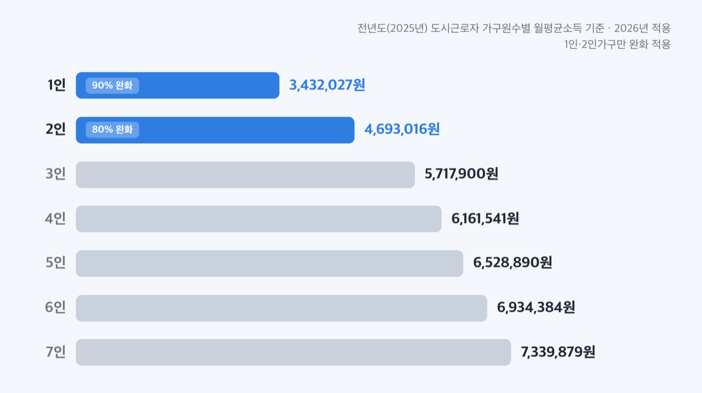
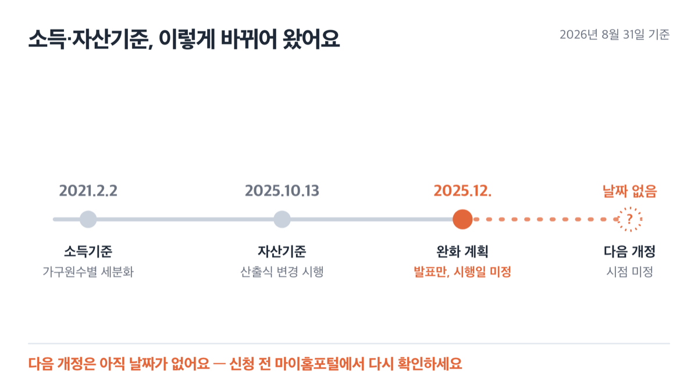
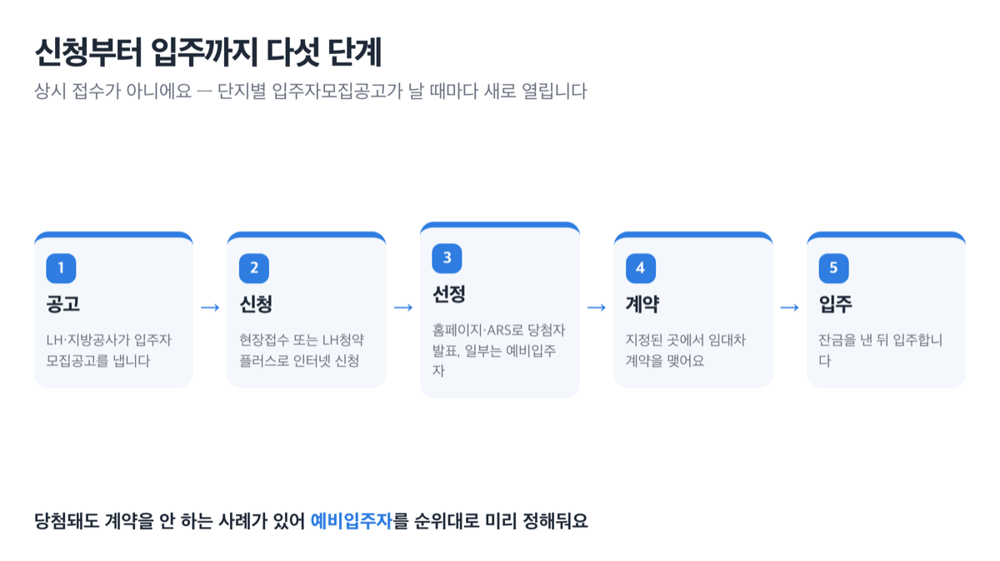
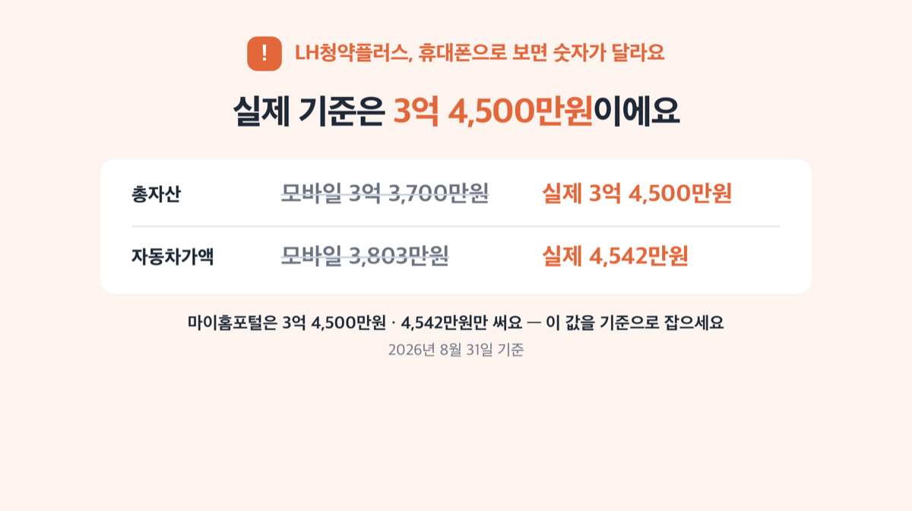

# 국민임대주택 소득기준 70%, 2026년엔 1인가구 90%까지

📌 2026년 8월 31일 기준

70%예요. 그런데 1인가구면 90%, 2인가구면 80%까지 기준이 올라갑니다. 이 숫자 세 개를 안 나누고 보면 계산부터 틀려요.

**3줄 요약**
- 국민임대주택은 무주택 저소득층에게 시세의 60~80% 임대료로 최장 30년을 살게 해주는 공공임대주택이에요.
- 소득기준 자체는 그대로지만, 자산기준을 계산하는 방식이 2025년 10월 13일 새 고시로 바뀌었어요.
- 신청 전엔 내 소득이 도시근로자 월평균소득 70%(1인 90%, 2인 80%) 밑인지부터 확인하세요.

아래에서 소득기준 표부터 자산기준, 신청 방법, 자주 걸리는 함정까지 순서대로 정리했어요.

> [!WARNING]
> 이 표의 금액은 전년도(2025년) 통계를 기준으로 매년 새로 계산돼요. 2027년엔 또 달라지니, 신청 직전엔 마이홈포털에서 그해 최신 공고를 다시 확인하세요.

## 국민임대주택, 정확히 뭘 말하는 건가요

국민임대주택은 무주택 저소득층, 그러니까 소득 1~4분위 계층의 주거 안정을 위해 국가재정과 주택도시기금을 지원받아 국가나 LH(한국토지주택공사)가 짓는 임대주택이에요. 전용면적 60㎡ 이하로만 나오고, 임대기간은 최장 30년이며 2년 단위로 계약을 다시 씁니다. 임대조건은 시세의 60~80% 수준이에요.

국가 돈이 들어간 만큼 아무나 못 받게 막아둔 게 소득기준과 자산기준입니다.

결국 이 둘을 통과해야 신청서를 낼 자격이 생겨요.

## 💰 소득기준 70%, 얼마까지 되나

정의부터 정리할게요. 국민임대주택 소득기준은 전년도(2025년) 도시근로자 가구원수별 가구당 월평균소득 70% 이하예요. 쉽게 말하면, 근로자 가구가 평균적으로 버는 돈의 70%를 넘지 않아야 한다는 뜻입니다.

다만 1인가구와 2인가구는 예외예요. ==1인가구는 90%==, ==2인가구는 80%==까지 완화됩니다. 3인 이상 가구는 그대로 70%예요.

| 가구원수 | 2026년 소득기준 (1인 90%·2인 80%) | 비고 |
|---|---|---|
| 1인 | 3,432,027원 이하 | 90% 완화 적용 |
| 2인 | 4,693,016원 이하 | 80% 완화 적용 |
| 3인 | 5,717,900원 이하 | |
| 4인 | 6,161,541원 이하 | |
| 5인 | 6,528,890원 이하 | |
| 6인 | 6,934,384원 이하 | |
| 7인 | 7,339,879원 이하 | |

> 😕 "저는 기준중위소득으로 계산해봤는데 기준을 넘던데요?"
> 그 계산이 애초에 다른 기준이에요. 국민임대주택은 **기준중위소득이 아니라 도시근로자 가구원수별 월평균소득**의 70%를 씁니다. 기준중위소득 150% 이하는 통합공공임대주택 등 다른 유형에서 쓰는 기준이라, 여기 대입하면 처음부터 계산이 틀려요.

왜 1인·2인가구만 따로 완화해줬을까요. 2021년 2월 이전엔 1~3인가구가 똑같이 '3인 기준'을 적용받았어요. 그러다 보니 혼자 사는 사람이 오히려 불리했어요. 그래서 2021년 2월 2일부터 가구원수별로 나누고, 1인가구는 20%p, 2인가구는 10%p씩 기준을 더 올려줬어요. 그 결과 국민임대 1인가구 기준은 2020년도 기준 185만원에서 238만원으로, 2인가구는 307만원에서 350만원으로 뛰었습니다.

## 자산기준 3억 4,500만원, 어떻게 정해지나

소득기준을 통과해도 끝이 아니에요. 세대구성원 전원의 자산을 합쳐 ==3억 4,500만원== 이하, 자동차가액은 ==4,542만원== 이하여야 합니다. 총자산은 부동산·자동차·금융자산·일반자산을 더한 값에서 부채를 뺀 금액이에요.

물론 대출이 많이 낀 집을 가진 세대는 부채를 차감하고 나면 순자산이 낮게 잡혀 유리할 수 있어요. 그런데 그 계산도 결국 3억 4,500만원이라는 상한 안에서만 통하는 얘기예요.

| 항목 | 2026년 기준 |
|---|---|
| 총자산 | 3억 4,500만원 이하 |
| 자동차가액 | 4,542만원 이하 |

자산기준은 정액이 고정된 게 아니라 산출식으로 정해져요.

> 국토교통부고시 제2025-560호(2025년 10월 13일 시행) — 총자산기준은 통계청 가계금융복지조사의 소득3분위 순자산 평균값, 자동차가액 기준은 4,200만원에 전년도 운송장비 소비자물가지수를 곱한 금액입니다.

그래서 통계청 통계가 바뀌면 이 두 금액도 자동으로 따라 바뀌는 구조예요.

물론 예외도 있어요. 장애인사용 자동차와 국가유공자(상이 1~7등급) 보철용 차량은 자동차가액 계산에서 아예 빠집니다. 그리고 2023년 3월 28일 이후 출생한 자녀가 있는 가구는 자산기준이 110%까지, 자녀가 2명 이상이면 120%까지 완화돼요.

저라면 소득기준표만 보고 미리 포기하지 않아요. 1인가구 기준 3,432,027원은 웬만한 초임 근로소득보다 높거든요.

## 무주택 요건과 신청 자격

소득·자산기준 말고도 하나 더 있어요. **입주자모집공고일 현재 본인과 세대원 전원이 무주택**이어야 합니다. 여기서 세대원은 본인뿐 아니라 배우자(주민등록상 세대가 분리돼 있어도 포함), 직계존속·직계비속과 그 배우자까지 넓게 봐요. 세대원 중 누구 하나라도 집이 있으면 그 세대는 이미 주거 문제가 해결된 것으로 보아 이렇게 넓게 잡는 거예요.

미성년자는 원칙적으로 신청할 수 없어요. 다만 자녀가 있는 미성년 세대주, 부모의 사망·행방불명으로 형제자매를 부양해야 하는 미성년 세대주, 부모 중 한쪽이 외국인인 한부모가족의 미성년 자녀가 세대주인 경우는 예외적으로 신청할 수 있습니다.

소득 계산에는 근로소득·사업소득·재산소득·기타소득 등 12가지 소득을 세대구성원 전원 합산해요. 국민연금·장애인연금·기초노령연금도 여기 포함됩니다. *(연금 받는 부모님을 모시고 산다면 이 대목에서 꼭 걸려요)*

일부 물량은 아래처럼 먼저 배정돼요.

- 신혼부부·한부모가족 30%
- 장애인 등 20% *(등록 장애인 세대는 반드시 확인해볼 만해요)*
- 철거민 등 10%, 다자녀가구 10%, 국가유공자등 10%
- 영구임대퇴거자 3%, 비닐간이공작물 거주자 등 2%, 무허가건축물 세입자 등 2%

전용 50㎡ 이상 60㎡ 이하 물량은 그 지역에 사는 사람에게 먼저 배정돼요. 같은 소득기준이라도 사는 지역에 따라 당첨 확률이 달라질 수 있다는 뜻이에요.

## 신청은 어떻게 하나

국민임대주택은 상시 접수가 아니라 **단지별로 입주자모집공고가 날 때마다 신청 기간이 새로 열립니다.** 그래서 "언제까지 신청해야 하나요"라는 질문엔 정해진 답이 없어요. 공고문마다 접수 기간이 다르게 적혀 있으니 그걸 봐야 합니다.

절차는 이렇습니다.

1. 사업주체(LH·지방공사 등)가 홈페이지 등에 **입주자모집공고**를 냅니다.
2. 현장에서 신청서를 내거나, LH청약플러스(apply.lh.or.kr)에 로그인해 인터넷으로 신청합니다.
3. 홈페이지나 ARS(자동응답시스템, 1661-7700)로 **당첨자**를 발표하고, 일정 비율은 **예비입주자**로 뽑습니다.
4. 사업주체가 지정한 곳에서 임대차 계약을 맺습니다.
5. 잔금을 낸 뒤 입주합니다.

당첨자 중에도 계약을 안 하거나 나중에 해약하는 사례가 꾸준히 나와요. 그 몫을 채우려고 예비입주자를 순위대로 미리 정해두는 거예요.

## 놓치기 쉬운 함정 셋

**첫째, LH청약플러스를 휴대폰으로 보면 다른 숫자가 뜰 수 있어요.** 같은 페이지인데 데스크톱 화면은 총자산 3억 4,500만원·자동차 4,542만원을 쓰고, 모바일 화면 제목엔 총자산 3억 3,700만원·자동차 3,803만원이 붙어 있습니다. 마이홈포털은 3억 4,500만원·4,542만원만 쓰니, 이 값을 기준으로 잡으세요.

**둘째, 2025년 12월 업무보고에 나온 "소득·자산기준 완화" 계획은 아직 시행되지 않았어요.** 국토교통부가 방향만 밝힌 상태라 완화 폭도, 시행일도 정해지지 않았습니다. 국민임대주택에도 그대로 적용될지는 아직 별도 발표가 없으니, 신청 전에 마이홈포털에서 최신 공고가 바뀌었는지 다시 확인하세요.

**셋째, 자동차가액이 4,542만원 이하면 자동차가 있어도 걸리지 않아요.** 장애인사용 자동차나 국가유공자 보철용 차량은 계산에서 아예 빠집니다. 자동차 한 대 있다고 미리 포기하지 마세요.

> 솔직히 말하면 — 정부 공식 페이지 안에서도 숫자가 다르게 뜨는 게 이 정도로 흔한 일이에요.

## 국민임대주택 관련 궁금증 해결

**Q. 소득기준 70%가 기준중위소득 70%랑 같은 건가요?**
A. 아니요. 국민임대주택은 전년도 도시근로자 가구원수별 월평균소득의 70%를 씁니다. 기준중위소득은 통합공공임대주택 등 다른 유형에서 쓰는 별도 기준이에요.

**Q. 1인가구인데 소득이 좀 높으면 못 받나요?**
A. 1인가구는 90%까지 완화돼요. 3,432,027원 이하면 신청할 수 있습니다.

**Q. 자동차가 있으면 신청 자격이 안 되나요?**
A. 자동차가액 합계가 4,542만원을 넘지 않으면 됩니다. 장애인사용·국가유공자 보철용 차량은 계산에서 빠져요.

**Q. 신청은 어디서 하나요?**
A. LH청약플러스(apply.lh.or.kr)에서 인터넷으로 하거나, 공고문에 적힌 현장접수 장소에서 하면 됩니다.

**Q. 2025년 12월에 나온 "완화 계획"은 지금 적용되나요?**
A. 아직입니다. 방향만 나왔고 폭과 시행일은 정해지지 않았어요. 신청 전 마이홈포털에서 최신 공고를 다시 확인하세요.

국민임대주택은 소득·자산·무주택이라는 세 조건을 다 통과해야 신청서를 낼 수 있는 제도예요. 조건 하나씩은 넉넉해 보여도 셋을 동시에 맞추려면 생각보다 까다롭습니다. 그래도 1인가구 기준 90%까지 완화된 걸 모르고 지레 포기하는 경우가 많으니, 표부터 다시 확인해보세요.

참고: 마이홈포털 「국민임대주택 입주자격 및 소득」 · LH청약플러스 「국민임대주택 입주자격 소득기준」 · 국토교통부 보도설명자료(2021-02-01) · 국토교통부 「2026년 업무보고」 서면자료(2025-12-12) · 국토교통부고시 제2025-560호
