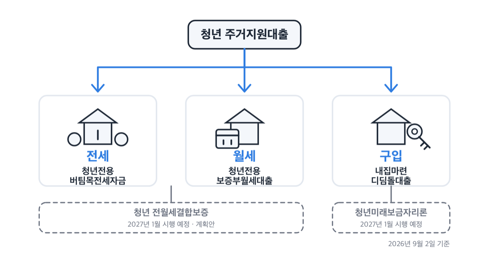
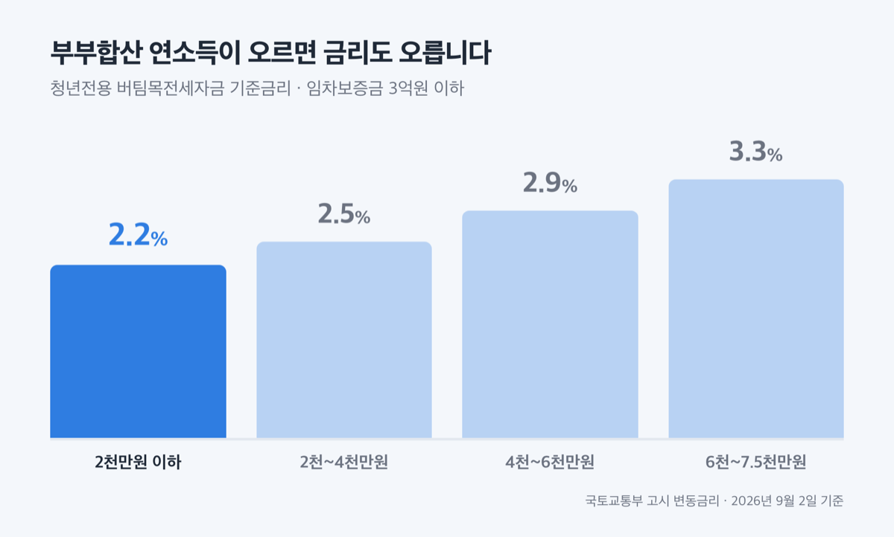
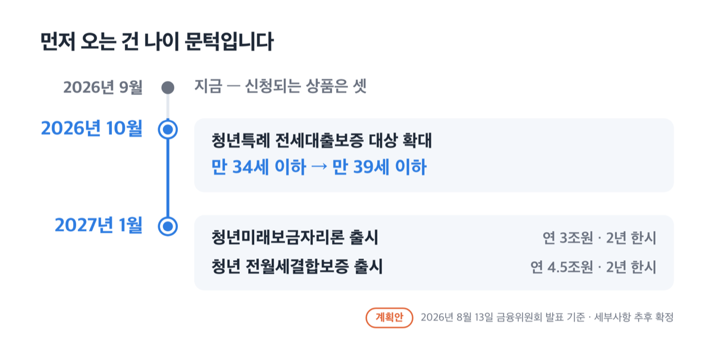
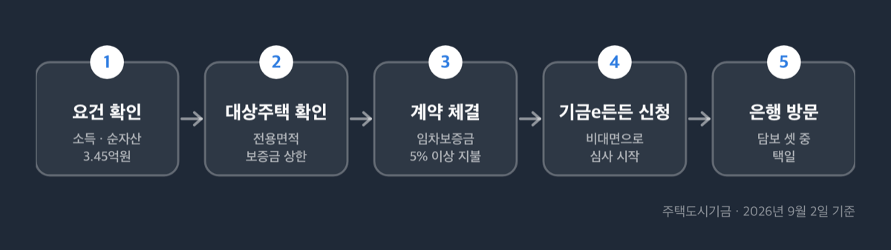
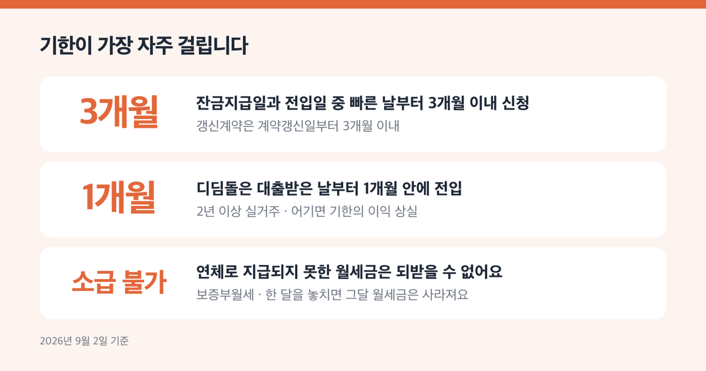

# 청년 주거지원대출 6종, 2026년 지금 되는 건 셋뿐

📌 2026년 9월 2일 기준

셋이에요. 청년 주거지원대출로 묶여 도는 상품 여섯 개를 2026년 9월 2일에 하나씩 열어 봤더니, 지금 신청되는 건 셋이었어요. 둘은 2027년 1월에나 나오는 계획안이고, 하나는 대출이 아니었습니다.

**3줄 요약**

- 청년전용 버팀목전세자금은 최대 1.5억원, 기준금리는 연 2.2~3.3%예요. 청년전용 보증부월세대출은 보증금 4,500만원에 월세 1,200만원까지 나와요.
- 청년미래보금자리론과 청년 전월세결합보증은 2026년 8월 13일 발표된 계획안이고, 시행은 2027년 1월입니다.
- 소득과 순자산부터 확인하세요. 버팀목은 부부합산 총소득 5천만원, 순자산 3.45억원이 문턱이에요.

지금 되는 셋의 금리와 한도를 먼저 적고, 2027년에 나올 둘은 계획안이라고 밝혀 두고 조건만 옮겼어요.

## 지금 되는 셋, 아직 아닌 둘

「청년 주거지원대출」이라는 이름으로 한 묶음처럼 도는 상품이 여섯 개예요. 성격이 서로 다릅니다. 셋은 정부 기금이 직접 빌려주는 대출이고, 하나는 현금을 나눠 주는 사업, 둘은 아직 발표 단계인 계획안이에요.

| 상품 | 갈래 | 2026년 9월 2일 상태 |
|---|---|---|
| 청년전용 버팀목전세자금 | 전세자금 대출 | 신청 가능 |
| 청년전용 보증부월세대출 | 보증금 + 월세 대출 | 신청 가능 |
| 내집마련 디딤돌대출 | 주택 구입자금 대출 | 신청 가능 (청년 전용은 아니에요) |
| 청년월세 지원사업 | 현금 지원 (대출이 아니에요) | 2026년 접수 5월 29일 마감 |
| 청년미래보금자리론 | 주택 구입자금 대출 | 계획안, 2027년 1월 시행 |
| 청년 전월세결합보증 | 대출 보증 | 계획안, 2027년 1월 시행 |

> 🤭 **솔직히 말하면** — 이 여섯 개를 「청년 대출 6종」으로 묶어 놓은 목록을 여러 곳에서 봤는데, 그중 둘은 아직 상품이 아니고 하나는 대출이 아니에요.

왜 이렇게 뒤섞였을까요. 2026년 8월 13일 금융위원회가 청년 주거 금융 대책을 발표하면서 새 상품 두 개를 함께 내놨고, 그 발표문이 「案(안)」이라고 적어 둔 부분까지 확정 상품처럼 옮겨 적혔기 때문이에요. **발표는 상품이 아닙니다.**

## 전세 — 버팀목전세자금 최대 1.5억원, 금리 연 2.2%부터

청년전용 버팀목전세자금은 전세보증금이 부족한 청년에게 주택도시기금이 빌려주는 전세자금 대출이에요. 요건은 연령·소득·순자산·무주택 넷을 함께 봐요. 순자산은 가진 재산에서 빚을 뺀 금액을 말해요.

| 항목 | 2026년 9월 2일 기준 |
|---|---|
| 연령 | 대출접수일 현재 만 19세 이상 ~ 만 34세 이하 세대주 (예비 세대주 포함) |
| 소득 | 부부합산 총소득 5천만원 이하 |
| 자산 | 부부합산 순자산 3.45억원 이하 (2026년도 기준) |
| 그 밖에 | 무주택 세대주 · 임차보증금 5% 이상 지불 · 다른 전세대출이나 주택담보대출 미이용 |
| 대상주택 | 전용면적 85㎡ 이하, 임차보증금 3억원 이하 |
| 한도 | 호당 1.5억원 이내 (만 25세 미만 단독세대주는 1.2억원) |
| 기간 | 2년 이내, 최장 10년 (10년 뒤 미성년 1자녀당 2년 추가, 최장 20년) |

기준금리는 임차보증금 3억원 이하를 기준으로 소득 구간에 따라 네 단계예요. 국토교통부가 고시하는 변동금리라 고시가 바뀌면 함께 바뀝니다.

| 부부합산 연소득 | 기준금리 (연, 임차보증금 3억원 이하) |
|---|---|
| 2천만원 이하 | 2.2% |
| 2천만원 초과 ~ 4천만원 이하 | 2.5% |
| 4천만원 초과 ~ 6천만원 이하 | 2.9% |
| 6천만원 초과 ~ 7.5천만원 이하 | 3.3% |

대출대상주택이 지방에 있으면 여기서 0.2%p 내려가요. 우대금리도 있어요. 만 25세 미만 단독세대주 0.3%p, 중소기업 취업·창업 청년 0.3%, 부동산 전자계약 0.1%p 같은 항목이 붙는데 우대를 다 받아도 연 1.0% 아래로는 내려가지 않아요.

여기서 한도를 오해하기 쉬워요. 1.5억원은 상한일 뿐이고, 신규계약은 ==전세금액의 80% 이내==라는 조건이 함께 걸려요. 보증금 1억원인 집이면 실제로 나오는 돈은 8천만원까지예요. 세 값 중 가장 작은 금액이 내 한도가 됩니다.

> 😕 **저는 소득이 5천만원을 넘는데요?**

부부합산 5천만원은 일반 기준이고 예외가 따로 있어요. 신혼가구는 7.5천만원 이하, 다자녀·2자녀 가구와 혁신도시 이전 공공기관 종사자는 6천만원 이하까지 봐요. 금리표에 6천만원 초과 구간이 있는 이유가 이것이에요.

한도에도 오래된 기준이 남아 있어요. 2025년 6월 27일 이전에 계약을 체결한 건은 2억원(만 25세 미만 단독세대주 1.5억원)이 적용돼요. 인터넷에 떠도는 「청년 버팀목 2억」은 그 경과 조치를 그대로 옮긴 숫자입니다.

전세가 아니라 월세로 사는 경우는 상품이 따로 있어요.

## 월세 — 보증금 4,500만원에 월세는 20만원까지 연 0%

청년전용 보증부월세대출은 보증금과 월세를 함께 빌려주는 대출이에요. 만 19세 이상 만 34세 이하 단독세대주가 대상이고, 소득 5천만원·순자산 3.45억원 기준은 버팀목과 같아요.

| 항목 | 2026년 9월 2일 기준 |
|---|---|
| 금리 (보증금) | 연 1.3% |
| 금리 (월세금) | 월 20만원까지 연 0%, 20만원 초과분은 연 1.0% |
| 한도 (보증금) | 최대 4,500만원 |
| 한도 (월세금) | 최대 1,200만원 (24개월 기준 월 최대 50만원) |
| 대상주택 | 전용 60㎡ 이하, 보증금 6.5천만원·월세 70만원 이하 |
| 기간 | 25개월 만기 일시상환, 4회 연장해 최장 10년 5개월 |

==월 20만원까지 연 0%==라는 조건이 이 상품의 본체예요. 월세 50만원인 집이면 20만원은 무이자, 나머지 30만원에만 연 1.0%가 붙는 구조예요.

월세금이 지급되는 방식은 따로 정해져 있어요. 월세금은 내 통장으로 한꺼번에 들어오지 않아요. 대출 실행 후 24회차 범위에서 매월 약정일에 임대인 통장으로 직접 지급돼요. 1년마다 월세금 지급신청서를 내고 거주 확인도 받아야 해요.

**연체로 지급되지 못한 월세금은 소급해서 받을 수 없습니다.** 한 달을 놓치면 그달 월세금은 사라져요.

저라면 전세부터 알아보기 전에 이 상품을 먼저 계산해 봅니다. 보증금 6.5천만원 이하 집에 사는 청년이라면, 월세 20만원 무이자와 보증금 연 1.3%를 합친 이자 부담이 버팀목보다 낮게 나오는 경우가 있어서요. 다만 쉐어하우스 입주자는 이용할 수 없고, 재직 1년 미만이면 한도가 2천만원 이하로 제한될 수 있어요.

집을 사는 쪽은 조건이 확 달라져요.

## 집 살 때 — 디딤돌은 청년 전용이 아니에요

내집마련 디딤돌대출은 정부지원 서민 구입자금을 하나로 합친 주택 구입 대출이에요. 청년 상품 목록에 늘 끼어 있지만 청년 전용이 아니에요. ==만 30세 미만 단독세대주와 미혼세대주는 원칙적으로 제외==돼요.

이 제한에는 이유가 있어요. 디딤돌은 세대의 주거 안정을 전제로 설계된 상품이라 부양가족을 함께 봐요. 그래서 미성년 형제자매나 직계존비속 1인 이상과 같은 세대를 이루고 6개월 이상 부양했다면 만 30세 미만도 가능해요.

| 항목 | 2026년 9월 2일 기준 |
|---|---|
| 소득 | 부부합산 6천만원 이하 (생애최초·다자녀·2자녀 7천만원, 신혼가구 8.5천만원) |
| 자산 | 부부합산 순자산 5.11억원 이하 (2026년도 기준) |
| 대상주택 | 전용 85㎡ 이하, 담보주택 평가액 5억원 이하 (신혼·2자녀 이상 6억원) |
| 한도 | 일반 2억원, 생애최초 2.4억원, 신혼·2자녀 이상 3.2억원 |
| 담보 인정 | LTV(주택담보대출비율) 70%, 생애최초 80% (수도권·규제지역은 70%), DTI(총부채상환비율) 60% |

금리는 소득 구간과 만기에 따라 정해져요. 만기 30년을 기준으로 보면 아래와 같고, 만기 10년을 고르면 각 구간이 2.85%·3.20%·3.55%·3.90%로 내려가요.

| 부부합산 연소득 | 기준금리 (연, 만기 30년) |
|---|---|
| 2천만원 이하 | 3.10% |
| 2천만원 초과 ~ 4천만원 이하 | 3.45% |
| 4천만원 초과 ~ 7천만원 이하 | 3.80% |
| 7천만원 초과 ~ 8.5천만원 이하 | 4.15% |

만 30세 이상이어도 미혼 단독세대주는 조건이 더 좁아요. 대상주택은 전용 60㎡ 이하·평가액 3억원 이하, 한도는 1.5억원(생애최초 2억원)이에요.

이름에 「청년」이 붙은 구입자금은 따로 있어요. 청년 주택드림 디딤돌 대출이에요. 청년 주택드림 통장으로 청약에 당첨된 사람만 쓸 수 있고, 통장을 1년 이상 가입해 1천만원 이상 넣어 둬야 해요. 한도는 미혼 3억원·신혼 4억원, 금리는 연 2.4~4.15%예요. 연소득 4천만원 이하면 만기를 40년까지 늘릴 수 있어요.

물론 통장 청약 당첨이라는 전제가 커요. 그런데 당첨자라면 일반 디딤돌보다 금리가 낮고 한도가 커서 비교할 이유가 없는 조건이에요.

## 2026년 10월과 2027년 1월에 바뀌는 것

2026년 8월 13일 금융위원회 대책에 청년 주거 금융 상품 세 건이 담겼어요. 시행 시점이 서로 달라요. 아래 조건은 모두 **2026년 8월 13일 발표된 계획안 기준**이고, 원문에 「세부사항 추후 확정」이라고 적혀 있어요.

가장 먼저 바뀌는 건 이미 있는 보증의 나이 문턱이에요.

| 시행 시점 (예정) | 바뀌는 내용 (2026년 8월 13일 발표 계획안 기준) |
|---|---|
| 2026년 10월 | 청년특례 전세대출보증 대상이 만 34세 이하 → 만 39세 이하로 확대 |
| 2027년 1월 | 청년미래보금자리론 출시 (연 3조원, 2년 한시) |
| 2027년 1월 | 청년 전월세결합보증 출시 (연 4.5조원, 2년 한시) |

청년특례 전세대출보증은 지금도 있는 제도예요. 한국주택금융공사가 신청일 기준 만 34세 이하 무주택자에게 최대 2억원까지 보증해 주고, 1억원 이하로 이용하면 상환능력별 보증한도 심사를 생략하고 보증비율 100%를 적용해요. 본인·배우자 합산 연소득은 7천만원 이하여야 해요. 여기서 나이만 만 39세로 넓어지는 것이 2026년 10월 예정입니다.

월세 쪽에도 이미 청년 전용 보증이 있어요. 무주택청년 특례월세 보증인데, 만 34세 이하·보증금 1억원 이하·월세 70만원 이하가 대상이고 한도는 1,200만원이에요. 청년전세자금보증을 함께 쓰고 있으면 600만원으로 줄어요. 보증료율은 연 0.02%예요.

### 청년미래보금자리론 — 4억원 이하 비아파트

월세로 사는 1인 가구와 사회초년생이 월세 수준의 원리금으로 집을 살 수 있게 하려는 정책모기지예요. 대상은 생애최초로 집을 사는 만 39세 이하이고, 소득은 7천만원 이하(신혼부부는 부부 중 1인 기준)예요.

| 항목 | 계획안 (2026년 8월 13일 발표) |
|---|---|
| 대상 주택 | 4억원 이하, 비(非)아파트, 85㎡ 이하 |
| LTV | 최대 80% |
| 생애최초 우대 | 이 상품을 써도 생애최초 LTV 우대가 유지 (수도권·규제지역 70%, 그 외 80%) |
| 금리 | 우대금리 — 일반 보금자리론보다 약 2%p 낮은 수준 (잠정) |

금융위원회 자료가 든 예시는 2억원을 30년 만기 연 3.0%로 빌렸을 때 월 원리금 85만원이에요. 비아파트 평균 월세 80만원과 견준 숫자예요. 원문에 적힌 가정치이고 확정 금리가 아닙니다.

금리가 얼마쯤 될지는 추정해 볼 수 있을 뿐이에요. 2026년 9월 1일 공시된 아낌e보금자리론이 만기별로 연 4.90~5.20%인데, 여기에 「약 2%p 낮은 수준」을 그대로 대면 연 2.9~3.2%가 나와요. 원문이 「잠정」이라고 적어 둔 값이고 2027년 1월의 시장 금리도 지금과 다를 수 있어서, 확정 금리로 보면 안 돼요.

「비아파트」라는 조건을 두고 발표 직후 말이 많았어요. 금융위원회는 2026년 8월 18일 설명자료를 내어 아파트 구입을 막는 것이 아니라고 밝히면서, 2025년 중 청년층에 공급된 보금자리론 12.0조원의 97%인 11.6조원이 아파트 구입에 쓰였다는 수치를 함께 냈어요. 오피스텔은 현행 주택법상 지원 대상이 아니라서, 넣으려면 주택금융공사법을 고쳐야 해요. 개정 추진은 2026년 하반기로 잡혀 있어요.

저는 이 상품을 기다리며 계약을 미루지 않습니다. 아직 案이고, 대상이 4억원 이하 비아파트로 좁고, 시행이 넉 달 뒤라서요.

### 청년 전월세결합보증 — 전세와 월세를 한 번에

지금은 전세보증과 월세보증 중 하나만 고를 수 있어요. 이 상품은 전세대출과 월세대출을 함께 보증해요. 만 39세 이하 무주택청년이 대상이고 소득 요건은 7천만원 이하예요.

- 대출한도 임차보증금의 90%, 2억원 *(월세대출도 이 한도 안에 포함돼요)*
- 신혼·유자녀 가구는 3억원 *(일반 전세대출보증은 임차보증금 80%·4억원이에요)*
- 보증비율 100% *(일반은 90%, 수도권·규제지역은 80%)*
- 지방·저소득 청년에게 이차보전 *(정부가 이자 일부를 대신 내주는 것을 말해요)*

작동 방식에서 하나가 달라져요. 지금 월세대출은 매월 자동으로 실행되는데, 이 상품은 마이너스통장 방식이에요. 한도를 열어 두고 필요한 달에만 꺼내 쓰는 구조예요.

그럼 지금 신청되는 상품은 어떤 순서로 움직여야 할까요.

## 신청 순서와 걸리는 것

주택도시기금 상품은 온라인에서 심사를 시작하고 은행에서 마무리해요. 기금e든든에서 비대면으로 신청한 다음 영업점을 방문하는 순서예요. 취급은행은 우리·KB국민·IBK기업·NH농협·신한·하나·iM뱅크 등이에요.

1. 소득과 순자산부터 확인해요. 버팀목·보증부월세는 순자산 3.45억원, 디딤돌은 5.11억원이 문턱이에요
2. 대상주택 요건을 봐요. 전용면적과 보증금 상한에 걸리면 뒤 단계는 의미가 없어요
3. 임대차계약을 체결하고 임차보증금의 5% 이상을 지불해요 *(보증금 1억원이면 500만원을 먼저 낸 상태여야 신청이 돼요)*
4. 기금e든든에서 비대면 신청 후 취급은행 영업점을 방문해요
5. 담보를 하나 고릅니다. 한국주택금융공사 전세대출보증, 주택도시보증공사 전세금안심대출보증, 채권양도협약기관 반환채권양도 중 택일이에요

기한이 가장 자주 걸려요. 신청은 잔금지급일과 전입일 중 빠른 날부터 3개월 이내예요. 갱신계약은 계약갱신일부터 3개월 이내입니다. 이사하고 정리한 뒤에 알아보면 이미 늦은 경우가 생겨요.

디딤돌은 받은 다음에도 의무가 남아요. 대출받은 날부터 1개월 안에 전입해 2년 이상 실거주해야 해요. 어기면 기한의 이익을 잃어요. 쉽게 말하면 남은 대출금을 한꺼번에 갚아야 한다는 뜻이에요. 2024년 6월 19일 신규접수분부터는 1주택 유지 의무도 있어서, 추가로 집을 사고 6개월 안에 처분하지 않으면 대출금을 회수해요.

중도상환수수료는 상품마다 달라요. 버팀목과 보증부월세는 없어요. 디딤돌은 3년 이내 중도상환 원금에 0.6% 한도로 붙지만, 2024년 8월 12일부터 2026년 12월 31일까지의 중도상환분은 면제예요.

## 청년 주거지원대출 관련 궁금증 해결

**Q. 청년월세 지원사업은 지금 신청할 수 있나요?**

A. 2026년 신규 접수는 3월 30일에 열려 5월 29일 16시에 닫혔어요. 월 최대 20만원을 최장 24개월, 생애 1회 지급하는 현금 지원 사업이고 대출이 아니에요. 2026년은 전국 6만명을 새로 뽑아 9월에 선정자를 공지하고 5월분부터 소급 지급해요. 2026년부터 계속사업으로 바뀌어 매년 새로 모집하니, 다음 모집 일정은 복지로나 국토교통부 콜센터 1599-0001에서 확인하세요.

**Q. 버팀목전세자금과 다른 전세대출을 함께 쓸 수 있나요?**

A. 안 돼요. 버팀목은 주택도시기금 대출, 은행재원 전세자금대출, 주택담보대출을 이용하고 있으면 신청할 수 없어요. 공공임대주택에 입주해 있는 경우도 제외예요. 보증부월세대출은 제2금융권 전세자금대출을 갈아타는 용도로도 쓸 수 없어요.

**Q. 서울에 사는데 서울시 청년월세지원은 어떻게 되나요?**

A. 국토교통부 사업과 별개예요. 2026년 서울시 사업은 월 최대 20만원을 최대 12개월, 240만원까지 지급하고 15,000명을 뽑았어요. 대상은 19~39세, 임차보증금 8천만원 이하·월세 60만원 이하이고 소득은 기준 중위소득 48% 초과 150% 이하예요. 접수는 5월 6일부터 19일까지로 이미 마감됐고, 국토교통부 청년월세 지원을 받고 있으면 중복으로 받을 수 없어요.

**Q. 만 34세를 넘겼으면 방법이 없나요?**

A. 셋이 있어요. 첫째, 버팀목은 중소·중견기업 취업자나 창업 보증·자금 지원을 받는 만 34세 이하가 병역의무를 이행했다면 복무기간만큼, 최대 만 39세까지 연장돼요. 둘째, 청년특례 전세대출보증이 2026년 10월부터 만 39세 이하로 넓어질 예정이에요. 셋째, 2027년 1월 시행 예정인 두 상품도 만 39세 이하가 대상이에요.

**Q. 청년월세 지원사업에 청약통장이 있어야 하나요?**

A. 아니에요. 2차 사업 때 있던 청약통장 가입 요건은 2026년 신규 모집부터 없어졌어요. 다만 청년 주택드림 디딤돌 대출은 청년 주택드림 통장 청약 당첨이 전제라서 통장이 필요해요. 두 제도를 섞어 이해하는 경우가 많은 대목이에요.

## 정리하면

지금 움직일 수 있는 건 셋이에요. 전세는 버팀목전세자금, 월세는 보증부월세대출, 구입은 디딤돌대출입니다. 순자산 3.45억원과 소득 5천만원부터 확인하고, 대상주택 상한에 걸리는지 보는 순서가 헛걸음을 가장 많이 줄여요.

기다릴 이유가 있는 사람도 있어요. 지금 만 35세에서 39세 사이 무주택 청년이라면 2026년 10월 청년특례 전세대출보증 확대가 첫 기회예요. 계약 시점을 조정할 수 있다면 그 시점을 함께 보고 움직이는 편이 낫습니다.

숫자는 고시와 공시에 따라 바뀌어요. 금리는 국토교통부 고시로 달라지고, 순자산 기준은 해마다 새로 정해져요. 실제 한도와 금리는 취급은행 상담에서 확정되니, 계약서에 서명하기 전에 주택도시기금 포털과 취급은행에서 그날 기준을 다시 확인하세요.

참고: 주택도시기금 「청년전용 버팀목전세자금」·「청년전용 보증부월세대출」·「내집마련디딤돌대출」·「청년 주택드림 디딤돌 대출」 대출안내 · 금융위원회 2026년 8월 13일 보도자료 및 8월 15일 보도설명자료 · 국토교통부 2026년 3월 18일 청년월세 지원사업 보도자료 · 한국주택금융공사 특례전세자금보증·월세자금보증 안내 및 2026년 9월 보금자리론 금리안내 · 서울특별시 공고 제2026-1440호
