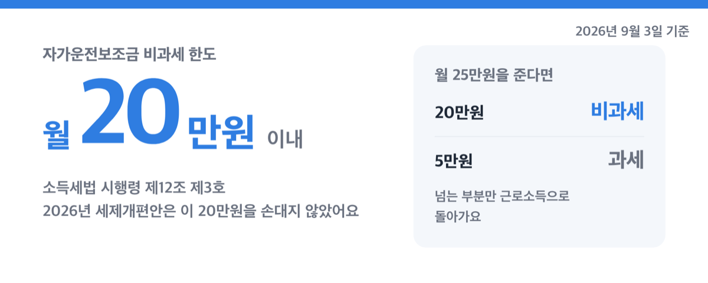
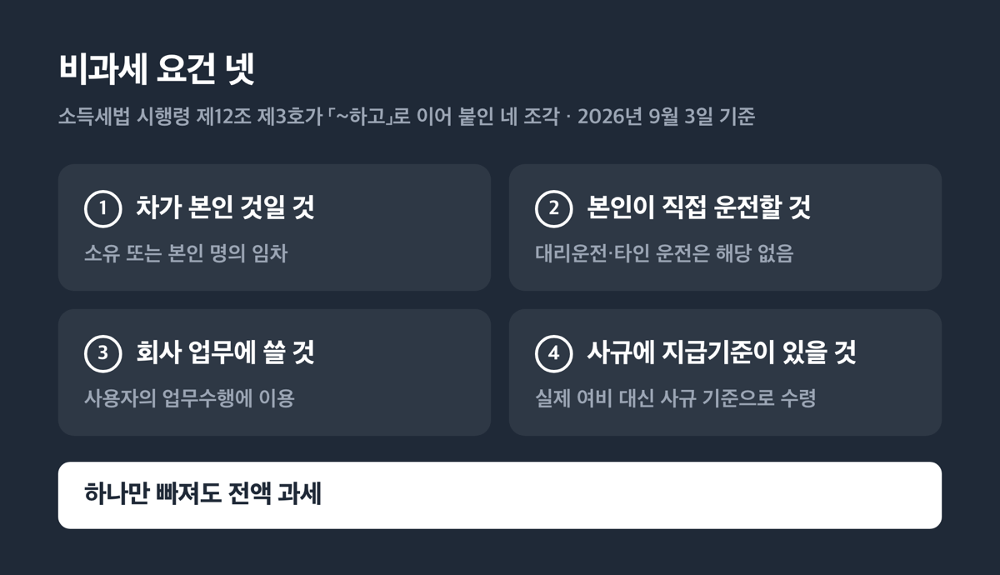
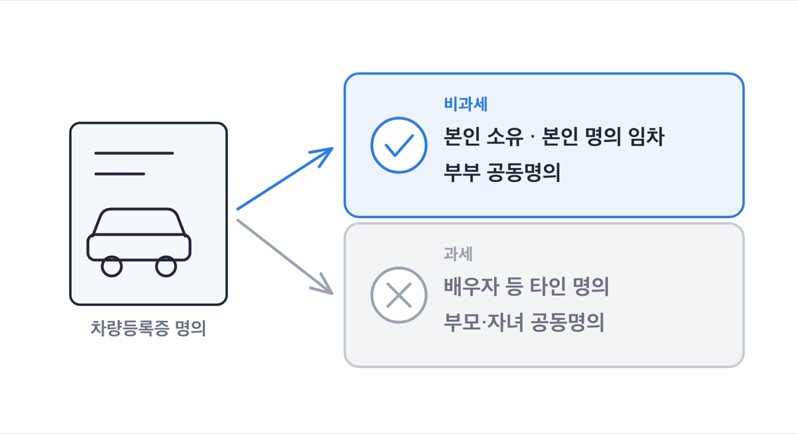
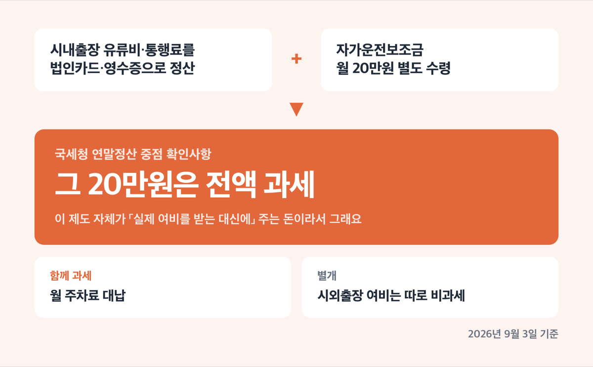

# 자가운전보조금 비과세 20만원, 2026년에도 조건 넷 그대로

📌 2026년 9월 3일 기준

운행일지를 꼬박꼬박 써 둬야 비과세된다고들 하는데, 아니에요. 국세청은 증빙서류를 갖췄는지와 관계없이 사규에 지급기준만 있으면 비과세로 봅니다. 대신 엉뚱한 곳에서 걸려요.

**3줄 요약**

- 본인 차를 직접 몰고 회사 업무에 쓰면서 사규에 정한 기준으로 받는 자가운전보조금은 월 20만원까지 비과세예요.
- 2026년 세제개편안은 이 20만원을 손대지 않았고, 2027년 1월 1일 시행분 조문까지 같은 문구입니다.
- 시내출장 여비를 따로 정산받고 있다면, 같이 받는 자가운전보조금은 20만원이라도 전액 과세예요.

한도가 얼마인지, 조건 넷이 무엇인지, 국세청이 되고 안 되고를 어디서 나누는지, 실제로 손에 얼마가 남는지 순서로 적었어요.

## 💰 월 20만원까지, 2026년에도 그대로입니다

자가운전보조금은 회사가 직원에게 주는 차량 운행비예요. 정식 이름은 「자기차량운전보조금」이고, 근거는 소득세법 시행령 제12조 제3호입니다.

> 3. 일직료·숙직료 또는 여비로서 실비변상정도의 금액(종업원이 소유하거나 본인 명의로 임차한 차량을 종업원이 직접 운전하여 사용자의 업무수행에 이용하고 시내출장 등에 소요된 실제여비를 받는 대신에 그 소요경비를 해당 사업체의 규칙 등으로 정하여진 지급기준에 따라 받는 금액 중 월 20만원 이내의 금액을 포함한다)

이 조문은 2026년 7월 1일 시행분 기준이에요.

| 항목 | 2026년 9월 3일 기준 값 |
|---|---|
| 비과세 한도 | 월 20만원 이내 |
| 한도를 넘긴 금액 | 넘는 부분은 과세 근로소득 |
| 2026년 세제개편안 | 이 20만원은 개정 대상이 아님 |
| 2027년 1월 1일 시행 조문 | 문구 동일 |

조문이 쓰인 방식을 봐야 해요. 「월 20만원 이내의 금액을 **포함한다**」는 열거 방식이라, 한도를 넘긴 부분은 자동으로 원래 성격인 근로소득으로 돌아갑니다. 그래서 월 25만원을 주면 25만원 전체가 과세되는 게 아니라 ==20만원은 비과세, 5만원만 과세==예요.

2026년 8월 3일 나온 세제개편안 상세본에도 이 조문이 등장하기는 합니다. 다만 자차운전분은 「(좌 동)」으로 두고 지방 이주수당만 새로 넣었어요. 바뀌는 게 없다는 사실 자체가 원문에 적혀 있는 셈입니다.

## 조건은 넷, 하나만 빠져도 전액 과세

조문이 「~하고」로 이어 붙인 네 조각이 그대로 요건이에요. 이 넷을 다 채워야 비과세입니다.

| # | 조건 | 조문이 요구하는 것 |
|---|---|---|
| 1 | 차가 본인 것일 것 | 소유 또는 본인 명의 임차 |
| 2 | 본인이 직접 운전할 것 | 대리운전·타인 운전은 해당 없음 |
| 3 | 회사 업무에 쓸 것 | 사용자의 업무수행에 이용 |
| 4 | 사규에 지급기준이 있을 것 | 실제 여비 대신 사규 기준으로 수령 |

실무에서 가장 많이 걸리는 건 4번이에요. 「사규에 지급기준이 있어야 한다」는 게 국세청이 만든 관행이 아니라 **법 조문에 직접 적힌 요건**이거든요. 급여명세서에 「차량유지비 20만원」이라고 적혀 있어도, 여비규정이나 급여규정에 지급기준이 없으면 근거가 없는 겁니다.

쉽게 말하면 회사 문서에 「이런 사람에게 얼마를 준다」가 먼저 적혀 있어야 하고, 급여는 그다음 순서예요.

저라면 급여명세서보다 회사 규정집을 먼저 열어 봅니다. 명세서 항목 이름은 담당자가 바꿔 적을 수 있지만, 세무조사에서 보는 건 규정이니까요.

> 😕 차는 배우자 명의인데, 제가 몰고 다니면 되는 거 아닌가요?

안 됩니다. 국세청은 배우자를 포함한 타인 명의 차량에 지급한 자가운전보조금을 전액 과세로 봐요. 다만 **부부 공동명의**는 비과세가 됩니다. 명의에 본인 이름이 들어가 있느냐가 기준이에요.

## 되는 사람과 안 되는 사람, 국세청이 그은 선

국세청이 상담센터 문답과 연말정산 안내 책자에서 정리해 둔 경계예요.

| 상황 (차량 명의 · 수령 형태) | 국세청 판단 (자가운전보조금 월 20만원) |
|---|---|
| 차가 아예 없는 직원 | 전액 과세 |
| 배우자 등 타인 명의 차량 | 전액 과세 |
| 부부 공동명의 차량 | 비과세 가능 |
| 부모·자녀 공동명의 차량 | 과세 |
| 두 회사에 다니며 각각 수령 | 회사별로 각 월 20만원까지 |
| 부부가 각자 다른 회사에서 수령 | 각자 월 20만원까지 |
| 임원 | 비과세 가능 |
| 운행일지·영수증 없음 | 비과세 가능 |

부부 공동명의는 되는데 부모·자녀 공동명의는 안 된다는 것, 이 대비가 헷갈리는 곳이에요. 국세청은 「부자 공동명의 차량은 안 되고, 부부 공동명의 차량은 된다」고 표현합니다. 장애인 자녀와의 공동명의도 마찬가지로 과세예요.

한도가 사람 기준이 아니라 **지급하는 회사 기준**이라는 것도 알아 둘 만해요. A사에서 20만원, B사에서 20만원을 받으면 합쳐서 40만원이 비과세됩니다.

증빙 부분은 오해가 특히 많습니다. 국세청은 증빙서류를 갖췄는지와 관계없이, 사규에 따라 실제로 받는 월 20만원 이내 금액이면 비과세로 봐요. 운행일지를 쓰라는 회사가 있다면 그건 내부 관리 목적이지 비과세 요건은 아닙니다.

## 20만원을 비과세로 돌리면 실제로 얼마가 남나

여기가 이 제도의 실익이에요. 자가운전보조금 비과세분은 소득세만 빠지는 게 아니라 4대보험 네 곳에서 전부 빠집니다.

원리는 이래요. 국민연금·건강보험·고용보험·산재보험이 각각 「소득세법 제12조 제3호에 따른 비과세 근로소득」을 부과 기준에서 뺀다고 정해 뒀어요. 자가운전보조금은 그 제12조 제3호 자목에 해당하는 항목이라 네 곳 모두에서 자동으로 빠집니다. 장기요양보험은 건강보험료를 기준으로 계산하니 함께 빠져요.

건강보험은 단서로 되돌려 넣는 항목이 따로 있는데, 자목은 거기에 없습니다.

**월 20만원을 요건 갖춘 자가운전보조금으로 바꿨을 때 근로자 부담이 얼마나 줄어드는지는 아래와 같아요. 확인된 요율에 20만원을 곱해 계산한 추정치입니다.**

| 구분 (근로자 부담 기준) | 월 절감액 (추정) |
|---|---|
| 4대보험만 (9.7174%) | 19,434원 |
| 4대보험 + 소득세 6% 구간 | 32,634원 |
| 4대보험 + 소득세 15% 구간 | 52,434원 |
| 4대보험 + 소득세 24% 구간 | 72,234원 |

과세표준 15% 구간이면 연 62만원쯤이에요. ==한 달 통신비를 1년 내내 회사가 대신 내주는 셈==입니다.

다만 이 숫자에는 단서가 셋 붙어요.

1. 소득세는 매달 떼는 금액이 아니라 연말정산으로 확정됩니다. 위 값은 세율만 곱한 단순 계산이고 각종 공제가 얽히면 달라져요.
2. 국민연금 기준소득월액 상한(2026년 7월분~2027년 6월분 659만원)을 넘는 사람은 연금 절감분 9,500원이 없어요.
3. 총급여액 자체가 줄어듭니다. 총급여를 기준으로 한도를 정하는 공제와 감면이 있다면 세무대리인과 함께 따져 보세요.

")

## 사규에 지급기준을 넣는 순서, 그리고 국세청이 보는 곳

4번 조건을 갖추지 못했다면 여기부터 정리하면 돼요. 회사 담당자와 직원이 함께 확인할 순서입니다.

확인하는 데는 세 곳이면 됩니다. 규정집과 급여대장은 **회사 인사·급여 담당 부서**에, 차량 명의는 **차량등록증**에, 나머지 판단은 **관할 세무서나 세무대리인**에게 있어요.

1. 여비규정이나 급여규정에 자가운전보조금 지급기준이 있는지 확인합니다. 대상자 범위와 월 지급액이 적혀 있어야 해요.
2. 없으면 규정을 만들거나 개정합니다. 「시내출장 실제 여비를 지급하는 대신 월 20만원을 지급한다」는 취지가 드러나야 합니다.
3. 시내출장 여비를 실비로 정산하는 절차가 함께 돌아가고 있는지 확인합니다. 둘 다 주고 있으면 하나를 정리해야 해요.
4. 대상 직원의 차량 등록증으로 명의를 확인합니다. 본인 단독 또는 부부 공동명의여야 하고, 리스·장기렌트는 계약서 명의를 봅니다.
5. 급여대장과 지급명세서에 비과세 코드 **H03**(소득령 §12 3호 자가운전보조금)으로 넣습니다.

연봉에 이미 포함돼 있던 금액을 떼어 자가운전보조금으로 돌리는 것도 됩니다. 국세청은 연봉계약서에 들어 있고 사규나 급여지급기준에 지급기준이 정해져 있으면 실비변상적 급여로 본다고 밝혔어요. 총 인건비를 늘리지 않고도 정리할 수 있다는 뜻입니다.

그런데 여기서 자주 걸리는 게 있어요.

국세청은 「연말정산 중점 확인사항」에 자가운전보조금을 오류 유형으로 올려 뒀어요. 시내출장 여비를 따로 받으면서 자가운전보조금까지 받는 경우, 그리고 본인 차가 없는데 받는 경우 둘입니다.

첫 번째가 특히 함정이에요. 소득세법 기본통칙은 이렇게 정리합니다. 시내출장에 실제로 든 여비는 실비변상적 급여라 비과세지만, 그때 함께 받은 자기차량운전보조금은 근로소득에 포함된다는 거예요.

> [!WARNING]
> 법인카드나 영수증으로 시내출장 유류비·통행료를 정산받고 있으면서 자가운전보조금 20만원을 별도로 받고 있다면, 그 20만원은 비과세가 아닙니다.

원리는 간단해요. 이 제도 자체가 「실제 여비를 받는 대신에」 주는 돈이거든요. 실제 여비를 이미 받았으면 대신 줄 이유가 사라지는 셈입니다.

시내출장 여비를 실비로 정산해 주면서 월 주차료까지 대납해 주는 경우, 그 주차비용도 과세예요.

반대로 **시외출장 여비는 별개**입니다. 자가운전보조금 비과세를 받고 있어도 시외출장에 실제로 든 유류비·통행료·교통비 중 실비변상 정도의 금액은 따로 비과세돼요.

출퇴근 편의로 주는 교통보조금도 자가운전보조금이 아닙니다. 인사발령으로 근무지가 바뀐 직원에게 주는 교통비도 과세 근로소득이에요. 이름이 비슷해도 조문이 요구하는 「업무수행에 이용」이 아니라서 그렇습니다.

정리하면 이 제도에서 무너지는 순서는 늘 같아요. ==차 명의, 그다음이 사규, 마지막이 여비 중복==입니다.

## 자가운전보조금 비과세 관련 궁금증 해결

**Q. 리스나 장기렌트 차량도 되나요?**

A. 됩니다. 2022년 1월 1일 이후 지급분부터 「본인 명의로 임차한 차량」이 인정돼요. 계약서상 임차인이 본인이어야 하고, 회사 명의 리스는 해당하지 않습니다.

**Q. 연봉에 포함된 금액을 자가운전보조금으로 나눠 적어도 되나요?**

A. 됩니다. 연봉계약서에 들어 있고 회사 사규나 급여지급기준에 지급기준이 정해져 있으면 비과세로 인정돼요.

**Q. 회사가 법인 차량을 따로 내주는데 자가운전보조금도 받고 있어요.**

A. 조문상 본인 소유 또는 본인 명의 임차 차량이 있어야 한다는 요건은 그대로 적용됩니다. 법인 차량을 함께 쓰는 경우의 처리는 관할 세무서나 세무대리인에게 확인하세요.

**Q. 월 중간에 입사하면 20만원을 일할 계산해야 하나요?**

A. 조문은 「월 20만원 이내」라고만 정하고 있어요. 회사 사규가 정한 지급기준을 따르되, 일할 지급 여부는 관할 세무서에서 확인하세요.

**Q. 개인사업자 대표 본인도 받을 수 있나요?**

A. 법인의 임원은 근로자에 포함돼 비과세가 됩니다. 개인사업자 대표 본인은 관할 세무서나 세무대리인에게 확인하세요.

## 정리

2026년에 바뀐 건 없습니다. 월 20만원, 조건 넷 그대로예요. 바뀌지 않았다는 것도 확인할 값어치가 있는데, 2026년 세제개편안이 같은 조문을 손대면서도 자차운전분만 그대로 뒀고 2027년 1월 1일 시행분 조문까지 문구가 같거든요.

지금 급여명세서에 차량유지비 항목이 있다면 순서대로 셋만 보면 됩니다. 차량등록증 명의, 회사 규정집의 지급기준, 시내출장 여비를 따로 정산받는지.

저라면 셋 중 두 번째를 가장 먼저 봅니다. 명의는 대체로 맞춰져 있고 여비 중복은 본인이 알지만, 사규는 아무도 안 열어 보거든요. 그런데 세무조사에서 먼저 열리는 게 그 문서입니다.

참고: 국가법령정보센터 소득세법 시행령 제12조 · 국세청 국세상담센터 「자기차량운전보조금」 문답 · 국세청 「2025년 귀속 원천징수의무자를 위한 연말정산 신고안내」 · 재정경제부 「2026년 세제개편안」 · 보건복지부 고시 제2026-31호
