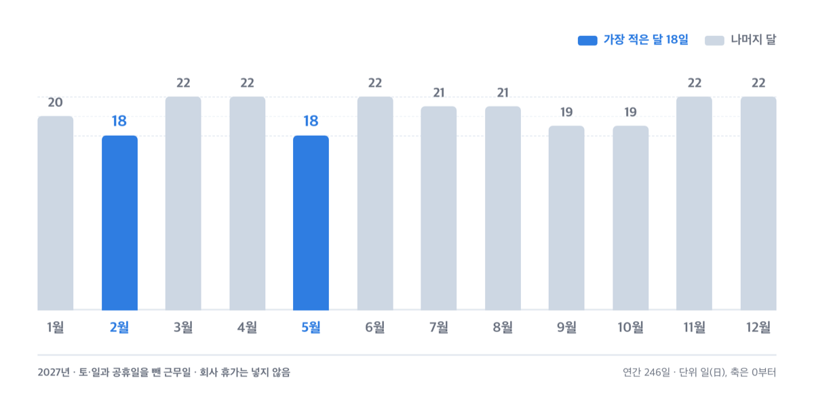
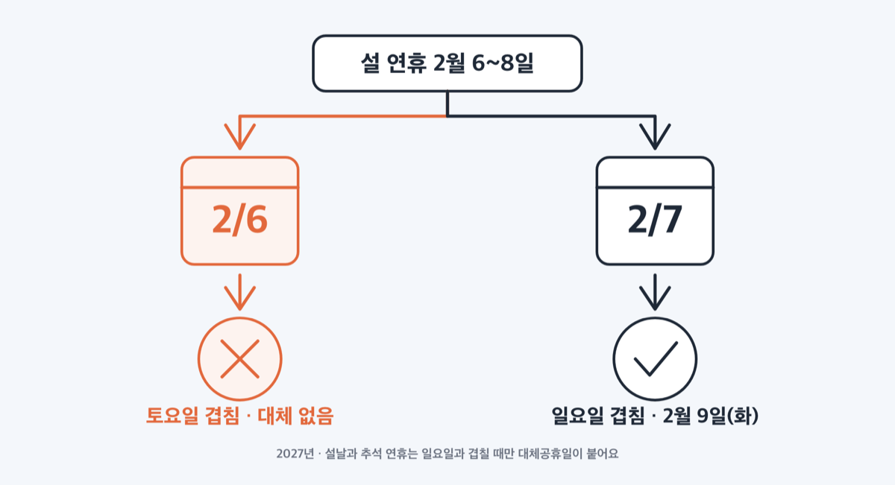
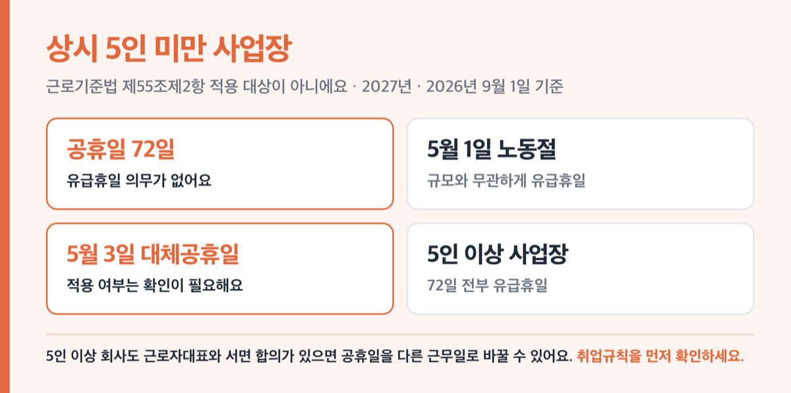

# 2027년 공휴일 72일, 연차 2일로 9일 연휴 만드는 법

📌 2026년 9월 1일 기준

연차 2일이에요. 9월 13일과 9월 17일, 이 두 날만 쓰면 2027년에 아흐레를 내리 쉽니다. 나머지 달은 계산이 조금 더 복잡해요.

**3줄 요약**

- 2027년 관공서 공휴일은 실질 72일, 주5일제로 일하는 직장인의 실질 휴일은 119일입니다. 2026년(120일)보다 하루 적어요.
- 2026년 5월부터 제헌절(7월 17일)과 노동절(5월 1일)이 공휴일에 들어와, 2027년 대체공휴일은 7일이 됐어요.
- 연차 없이 생기는 3일 이상 연휴는 10번이고 가장 긴 것이 설 4일입니다. 5일 이상 연휴는 연차를 써야 만들어져요.

공휴일 전체 날짜와 대체공휴일이 붙는 규칙을 먼저 보고, 연차를 어디에 쓰면 연휴가 가장 길어지는지까지 날짜로 적어요.

## 2027년 공휴일 20개, 실질은 72일

우주항공청이 2026년 6월 29일 발표한 「2027년 월력요항」에 적힌 날짜예요. 월력요항은 천문법에 따라 우주항공청과 한국천문연구원이 만드는 다음 해 달력 기준표이고, 관보에 실리면 그해 공휴일 날짜가 확정됩니다.

**2027년 관공서 공휴일 (일요일 52일은 표에 넣지 않음)**

| 공휴일 | 2027년 날짜 (요일) | 대체공휴일 |
|---|---|---|
| 1월 1일 | 1월 1일 (금) | 없음 |
| 설날 연휴 | 2월 6~8일 (토·일·월) | 2월 9일 (화) |
| 3·1절 | 3월 1일 (월) | 겹침 없음 |
| 노동절 | 5월 1일 (토) | 5월 3일 (월) |
| 어린이날 | 5월 5일 (수) | 겹침 없음 |
| 부처님 오신 날 | 5월 13일 (목) | 겹침 없음 |
| 현충일 | 6월 6일 (일) | 없음 |
| 제헌절 | 7월 17일 (토) | 7월 19일 (월) |
| 광복절 | 8월 15일 (일) | 8월 16일 (월) |
| 추석 연휴 | 9월 14~16일 (화·수·목) | 겹침 없음 |
| 개천절 | 10월 3일 (일) | 10월 4일 (월) |
| 한글날 | 10월 9일 (토) | 10월 11일 (월) |
| 기독탄신일 | 12월 25일 (토) | 12월 27일 (월) |

일요일 52일까지 넣어 더하면 76일인데, 실제로 쉬는 날은 72일입니다. 설날 2월 7일, 현충일 6월 6일, 광복절 8월 15일, 개천절 10월 3일 넷이 일요일과 겹쳐서예요. 원래 쉬는 날에 공휴일이 얹히면 휴일이 하루 늘지는 않으니까요.

**2027년 휴일 날수 (주5일제 기준)**

| 계산 항목 (2027년, 주5일제 기준) | 날수 (일) |
|---|---|
| 공휴일 단순 합계 (일요일 52일 포함) | 76일 |
| 일요일과 겹치는 공휴일 | 4일 |
| **실질 공휴일** | **72일** |
| 여기에 토요일 52일을 더한 단순 휴일 | 124일 |
| 토요일과 겹치는 공휴일 | 5일 |
| **주5일제 실질 총 휴일** | **119일** |
| 2026년 실질 총 휴일 | 120일 |

토요일과 겹치는 공휴일 5일은 설 연휴 첫날 2월 6일, 노동절 5월 1일, 제헌절 7월 17일, 한글날 10월 9일, 기독탄신일 12월 25일이에요. 이 다섯은 토요일 겹침이라도 대체공휴일이 붙어서 쉬는 날 자체가 사라지지는 않아요.

토·일과 공휴일을 뺀 근무일은 연간 246일입니다.

**2027년 월별 근무일 (토·일·공휴일 제외, 회사 휴가 제외)**

| 근무일 | 해당 월 |
|---|---|
| 18일 | 2월, 5월 |
| 19일 | 9월, 10월 |
| 20일 | 1월 |
| 21일 | 7월, 8월 |
| 22일 | 3월, 4월, 6월, 11월, 12월 |

2월과 5월이 가장 헐렁하고, 3·4·6·11·12월이 가장 빡빡해요. 월급은 같은데 일하는 날만 나흘 차이 나요.

## 대체공휴일은 7일, 현충일에는 안 붙어요

2027년 대체공휴일은 ==7일==이에요. 설날·노동절·제헌절·광복절·개천절·한글날·기독탄신일에 각각 하루씩 붙었어요.

붙는 규칙이 공휴일마다 다릅니다. 근거는 대통령령 하나예요.

> **「관공서의 공휴일에 관한 규정」 제3조제1항** — 대체공휴일을 주는 대상은 국경일, 설날 연휴, 부처님 오신 날, 노동절, 어린이날, 추석 연휴, 기독탄신일이다. 1월 1일과 현충일은 이 목록에 들어 있지 않다.

그래서 현충일 6월 6일이 일요일인데도 대체공휴일이 없습니다. 쉬는 날 하나가 그냥 사라지는 셈이에요. 1월 1일은 2027년에 금요일이라 애초에 겹침이 없어요.

> 😕 설날은 토요일과 일요일에 둘 다 걸렸는데, 대체공휴일이 왜 하루뿐인가요?

같은 조항 안에서 설날과 추석만 규칙이 다르기 때문이에요. 국경일·노동절·어린이날·부처님 오신 날·기독탄신일은 **토요일 겹침도** 대체 대상인데, 설날과 추석 연휴는 **일요일과 겹칠 때만** 대체공휴일을 줍니다. 2027년 설 연휴는 2월 6일(토)·7일(일)·8일(월)이라 일요일 겹침 하루뿐이고, 그래서 대체공휴일도 2월 9일 화요일 하루예요.

제헌절과 노동절이 목록에 들어온 것은 2026년 일이에요. 「공휴일에 관한 법률」이 두 번 바뀌었습니다.

| 무엇이 바뀌었나 | 시행일 |
|---|---|
| 노동절(5월 1일)을 공휴일로 신설 | 2026년 5월 1일 |
| 공휴일 범위를 국경일 전체로 넓혀 제헌절 포함 | 2026년 5월 11일 |

제헌절은 2008년에 공휴일에서 빠졌다가 18년 만에 되돌아왔어요. 국경일 다섯(3·1절·제헌절·광복절·개천절·한글날)이 전부 공휴일이 된 것도 이때부터예요. 2026년부터 이미 적용됐으니 2027년에 새로 늘어나는 것은 아니에요.

노동절은 이름도 바뀌었습니다. 2025년 11월 11일부터 법 이름이 「노동절 제정에 관한 법률」이 됐어요. 「근로자의 날」은 이제 옛 이름입니다.

## 연차 없이 쉬는 3일 이상 연휴, 열 번

주5일제 기준으로 3일 이상 연휴가 열 번 생겨요. 월력요항이 직접 세어 놓은 값입니다.

| 기간 | 일수 | 구성 |
|---|---|---|
| 1월 1일(금) ~ 1월 3일(일) | 3일 | 1월 1일 + 토·일 |
| **2월 6일(토) ~ 2월 9일(화)** | **4일** | 토요일 + 설 연휴 + 대체공휴일 |
| 2월 27일(토) ~ 3월 1일(월) | 3일 | 토·일 + 3·1절 |
| 5월 1일(토) ~ 5월 3일(월) | 3일 | 노동절 + 일 + 대체공휴일 |
| 7월 17일(토) ~ 7월 19일(월) | 3일 | 제헌절 + 일 + 대체공휴일 |
| 8월 14일(토) ~ 8월 16일(월) | 3일 | 토 + 광복절 + 대체공휴일 |
| 9월 14일(화) ~ 9월 16일(목) | 3일 | 추석 연휴 |
| 10월 2일(토) ~ 10월 4일(월) | 3일 | 토 + 개천절 + 대체공휴일 |
| 10월 9일(토) ~ 10월 11일(월) | 3일 | 한글날 + 일 + 대체공휴일 |
| 12월 25일(토) ~ 12월 27일(월) | 3일 | 기독탄신일 + 일 + 대체공휴일 |

열 번 중 아홉 번이 3일입니다. 대체공휴일이 주말 다음 첫 근무일, 즉 대부분 월요일에 붙는 구조라 토·일·월 3일로 끝나는 거예요.

가장 긴 연휴가 설 4일이고, ==5일 이상 연휴는 연차 없이 하나도 없습니다==.

## 💡 연차 1일·2일·4일로 만드는 최대 연휴

여기부터는 월력요항에 없는 값이에요. 위 공휴일 20개와 2027년 달력으로 직접 계산한 값이라 추정으로 봐 주세요. 계산 기준은 주5일제(토·일 휴무)이고, 회사 창립기념일이나 하계휴가는 넣지 않았어요.

**연차 1일로 만드는 연휴 (추정, 주5일제 기준)**

| 연차 쓰는 날 | 연휴 기간 | 일수 |
|---|---|---|
| **9월 13일(월)** | 9월 11일(토) ~ 9월 16일(목) | **6일** |
| **9월 17일(금)** | 9월 14일(화) ~ 9월 19일(일) | **6일** |
| 2월 5일(금) | 2월 5일(금) ~ 2월 9일(화) | 5일 |
| 5월 4일(화) | 5월 1일(토) ~ 5월 5일(수) | 5일 |
| 1월 4일(월) | 1월 1일(금) ~ 1월 4일(월) | 4일 |
| 2월 26일(금) | 2월 26일(금) ~ 3월 1일(월) | 4일 |
| 5월 14일(금) | 5월 13일(목) ~ 5월 16일(일) | 4일 |
| 7월 16일(금) | 7월 16일(금) ~ 7월 19일(월) | 4일 |
| 8월 13일(금) | 8월 13일(금) ~ 8월 16일(월) | 4일 |
| 10월 1일(금) | 10월 1일(금) ~ 10월 4일(월) | 4일 |
| 10월 8일(금) | 10월 8일(금) ~ 10월 11일(월) | 4일 |
| 12월 24일(금) | 12월 24일(금) ~ 12월 27일(월) | 4일 |
| 6월 4일(금) | 6월 4일(금) ~ 6월 6일(일) | 3일 |

9월이 효율이 가장 좋은 이유는 추석 연휴가 화·수·목에 놓여서예요. 앞뒤가 각각 월요일과 금요일이니, 어느 쪽을 막아도 주말 두 개가 한 덩어리로 붙어요.

**연차 2일 이상 (추정, 주5일제 기준)**

| 연차 | 쓰는 날 | 연휴 (일수) |
|---|---|---|
| **2일** | 9월 13일 + 9월 17일 | **9월 11일 ~ 19일 (9일)** |
| 2일 | 2월 4일 + 2월 5일 | 2월 4일 ~ 9일 (6일) |
| 2일 | 4월 30일 + 5월 4일 | 4월 30일 ~ 5월 5일 (6일) |
| 2일 | 5월 6일 + 5월 7일 | 5월 5일 ~ 9일 (5일) |
| 3일 | 2월 10~12일 | 2월 6일 ~ 14일 (9일) |
| 3일 | 5월 4·6·7일 | 5월 1일 ~ 9일 (9일) |
| **4일** | 10월 5~8일 | **10월 2일 ~ 11일 (10일)** |

연차 한 장당 늘어나는 휴일로 따지면 9월 두 장이 가장 셉니다. ==연차 2일로 9일==, 하루당 3.5일씩 늘어나는 셈이에요. 10월 열흘은 연차를 넉 장 써야 하니 효율은 절반 아래고요.

저라면 9월 13일과 17일을 연초에 먼저 잡습니다. 3일 이상 연휴 열 번 중 추석만 화·수·목에 걸려 있어서, 이 조합은 다른 달로 대체가 안 돼요. 반대로 10월 열흘은 연차가 넉 장 필요하니 순서를 뒤로 미뤄도 손해가 적어요.

연말은 계산이 하나 더 붙어요. 12월 28~31일 나흘을 쓰면 2027년 12월 25일부터 2028년 1월 2일까지 9일이 되는데, 2028년 1월 1일은 다음 해 월력요항이 정해요. 해를 넘기는 연휴는 2028년 달력을 따로 확인하세요.

## 5인 미만 사업장은 이야기가 달라요

지금까지 적은 72일은 관공서 기준이에요. 회사에서 실제로 쉬는지는 근로기준법이 정합니다.

> **「근로기준법」 제55조제2항** — 사용자는 근로자에게 대통령령으로 정하는 휴일을 유급으로 보장하여야 한다. 다만, 근로자대표와 서면으로 합의한 경우 특정한 근로일로 대체할 수 있다.

여기서 말하는 휴일이 「관공서의 공휴일에 관한 규정」의 공휴일과 대체공휴일이에요(일요일은 제외). 300명 이상은 2020년, 30~300명 미만은 2021년, 5~30명 미만은 2022년부터 적용됐어요. 그러니 5인 이상 회사라면 위 72일이 유급휴일입니다.

==상시 5인 미만 사업장은 제55조제2항 적용을 받지 않습니다==. 「근로기준법 시행령」 별표 1이 상시 4명 이하 사업장에 적용하는 근로시간·휴식 조항을 제54조(휴게), 제55조제1항(주휴일), 제63조로만 적어 놨어요. 공휴일 유급휴일 조항인 제55조제2항이 그 목록에 없어요.

다만 5월 1일 노동절은 예외예요. 「노동절 제정에 관한 법률」이 이 날을 근로기준법에 따른 유급휴일로 직접 정하고, 사업장 규모 조건을 달지 않았어요. 5월 3일 대체공휴일까지 같이 적용되는지는 회사 취업규칙과 관할 고용노동지청에서 확인하세요.

> [!WARNING]
> 5인 이상 회사도 근로자대표와 서면 합의를 하면 공휴일을 다른 근무일로 바꿀 수 있어요. 근로자대표는 근로자 과반을 대표하는 사람이나 노동조합을 말해요. 위 연휴 계산을 짜기 전에 회사 취업규칙에 이 합의가 있는지부터 확인하세요.

지방공휴일도 있어요. 「지방공휴일에 관한 규정」에 따라 그 지역 관공서만 쉬는 날입니다.

| 지방공휴일 | 2027년 날짜 (요일) | 지역 |
|---|---|---|
| 4·3희생자 추념일 | 4월 3일 (토) | 제주특별자치도 |
| 동학농민혁명 기념일 | 5월 11일 (화) | 전북특별자치도 정읍시 |
| 5·18민주화운동 기념일 | 5월 18일 (화) | 광주광역시 |

## 2027년 공휴일 관련 궁금증 해결

**Q. 2027년에 5일 넘게 쉬는 연휴가 연차 없이 있나요?**

A. 없습니다. 연차를 쓰지 않으면 3일 이상 연휴가 열 번이고, 가장 긴 것이 2월 6일부터 9일까지 설 연휴 4일이에요. 5일 이상은 연차를 최소 한 장 써야 만들어져요.

**Q. 현충일이 일요일인데 정말 대체공휴일이 없나요?**

A. 없어요. 「관공서의 공휴일에 관한 규정」 제3조제1항을 보면 대체공휴일 대상에서 현충일과 1월 1일이 빠져 있어요. 국경일·설날·추석·부처님 오신 날·노동절·어린이날·기독탄신일만 대상이에요.

**Q. 제헌절과 노동절은 2027년부터 공휴일인가요?**

A. 아니에요. 2026년부터예요. 노동절은 2026년 5월 1일, 제헌절은 2026년 5월 11일부터 적용됐어요. 노동절은 그전에도 근로자에게는 유급휴일이었고, 2026년에 관공서 공휴일로 들어오면서 공무원과 학교까지 함께 쉬게 됐어요.

**Q. 임시공휴일이 생기면 연휴가 더 늘어나나요?**

A. 늘어날 수 있어요. 임시공휴일은 「관공서의 공휴일에 관한 규정」 제4조에 따라 국무회의 심의로 그때그때 정해져요. 정해진 시점에 정부 발표로 확인하세요.

**Q. 2027년 설날과 추석은 음력 며칠인가요?**

A. 설날은 음력 1월 1일로 2월 7일(일), 추석은 음력 8월 15일로 9월 15일(수)이에요. 2027년은 정미년이고 윤달이 없어요. 정월대보름은 2월 21일(일), 초복·중복·말복은 7월 20일·7월 30일·8월 9일이에요.

## 그래서 지금 할 일

2027년은 2026년보다 휴일이 하루 적고, 연차 없이 5일 이상 쉴 수 있는 구간이 하나도 없어요. 그러니 연차를 어디에 놓느냐가 그해 체감을 정합니다.

순서는 셋이에요. 첫째, 회사 취업규칙에서 공휴일 유급휴일 대체 합의가 있는지 봅니다. 둘째, 9월 13일과 17일을 먼저 확보해요. 셋째, 2월 5일과 5월 4일처럼 연차 한 장이 5일이 되는 날을 남은 연차에 맞춰 채웁니다.

연차 신청은 대체로 선착순으로 처리되니, 9월 두 날은 연초에 올려 두는 편이 안전합니다.

참고: 우주항공청 「2027년 월력요항」 보도자료(2026년 6월 29일) · 국가법령정보센터 「공휴일에 관한 법률」·「관공서의 공휴일에 관한 규정」·「국경일에 관한 법률」·「근로기준법」 및 시행령 별표 1·「노동절 제정에 관한 법률」
