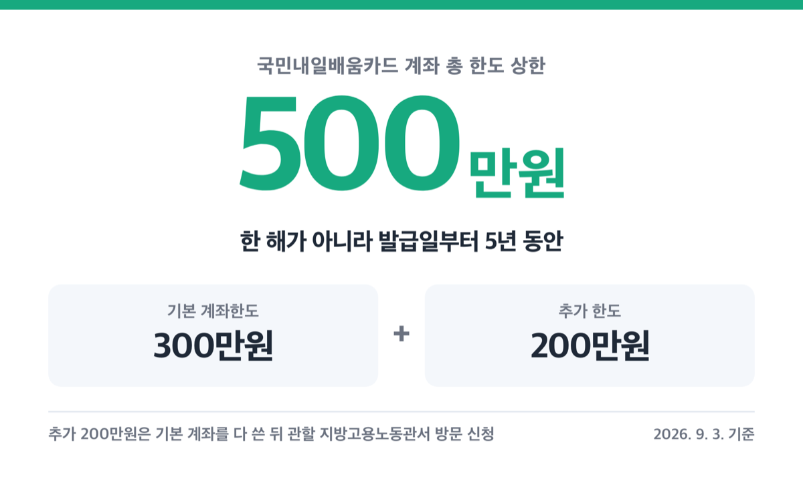
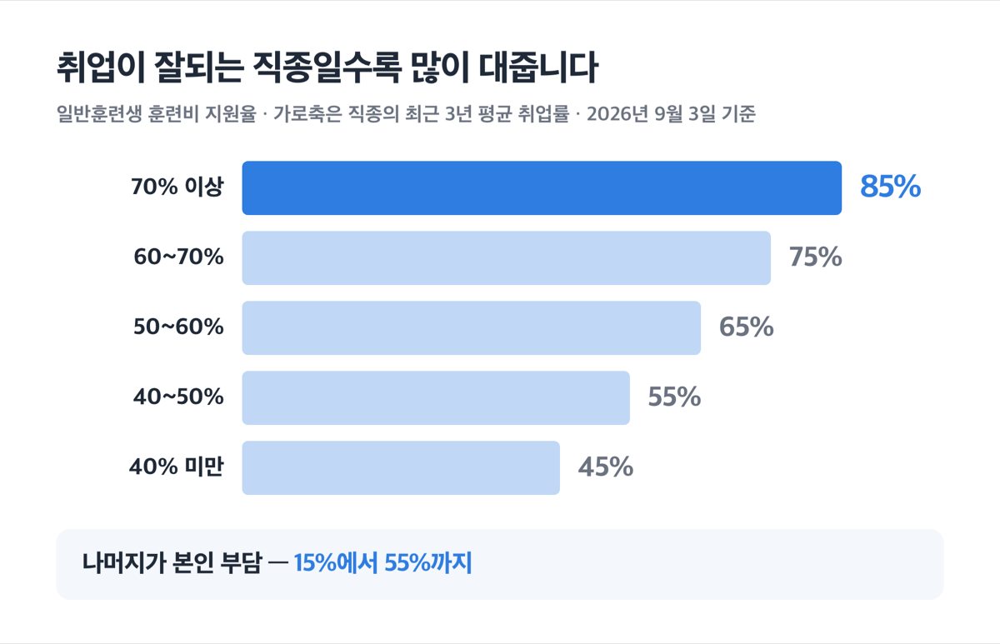
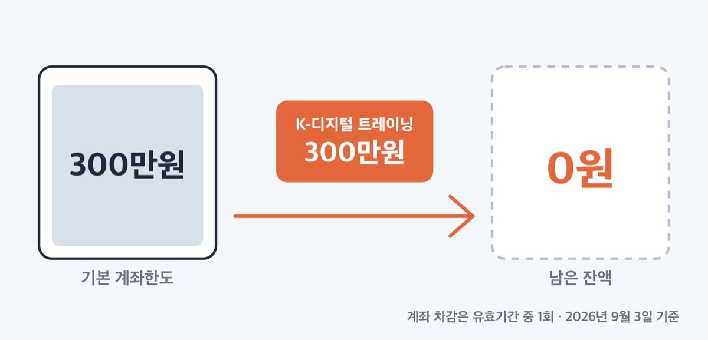
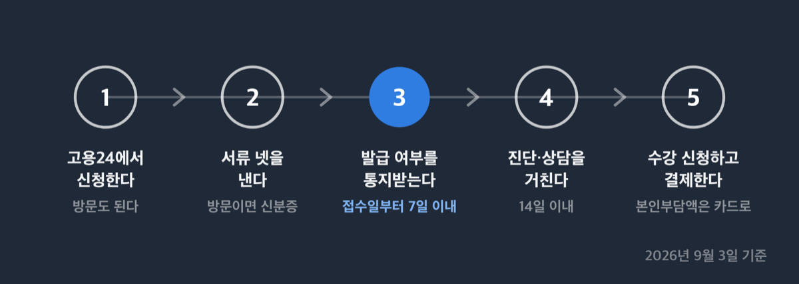
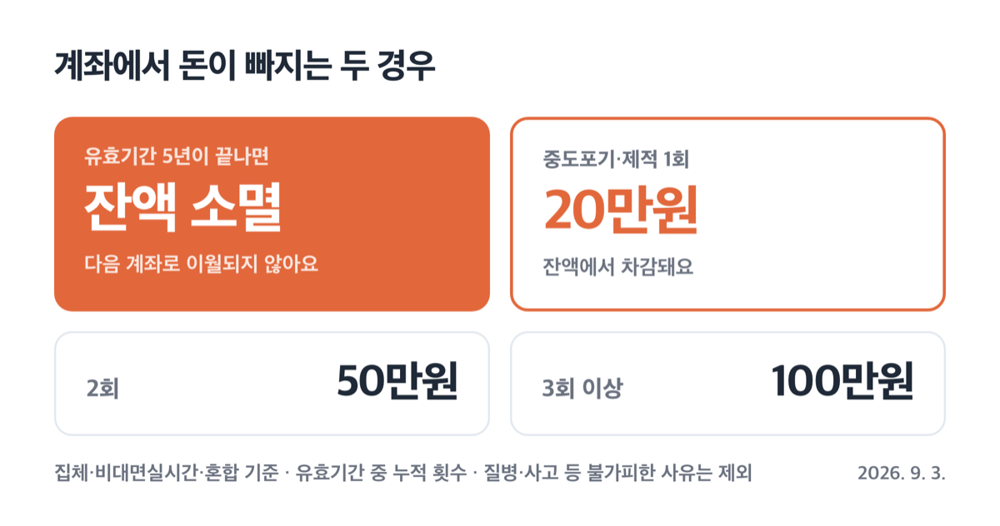

# 내일배움카드 지원금 500만원, 2026년 자기부담 최대 60만원

📌 2026년 9월 3일 기준

작년과 달라진 게 하나 있어요. 2026년부터 K-디지털 트레이닝 같은 인기 과정은 훈련비를 전액 대주지 않습니다. 한도 500만원은 그대로인데, 지갑에서 나가는 돈이 새로 생겼어요.

**3줄 요약**

- 국민내일배움카드는 계좌 발급일부터 5년간 훈련비를 대주는 카드예요. 기본 300만원, 조건을 채우면 최대 500만원까지 씁니다.
- 2026년 1월 1일 이후 시작하는 훈련부터 국가기간산업직종·K-디지털 트레이닝 등 특화훈련 6종에 자기부담금이 생겼어요. ==훈련비의 10%, 최대 60만원==입니다.
- 먼저 확인할 것은 자격이에요. 대규모기업에 다니는 만 45세 미만이면서 최근 3개월 월평균 임금이 300만원 이상이면 발급 대상에서 빠져요.

한도와 본인부담, 훈련 중에 받는 수당, 못 받는 사람, 신청 절차 순서로 갑니다.

## 내일배움카드가 대주는 돈, 기본 300만원에 추가 200만원

국민내일배움카드의 한도는 기본 300만원, 추가 200만원, 합쳐서 500만원입니다. 이 500만원은 한 해 한도가 아니라 계좌 발급일부터 5년 동안 쓰는 총액이에요.

여기서 자주 놓치는 게 유효기간입니다. ==유효기간이 끝나면 남은 잔액은 소멸합니다.== 5년째에 몰아서 쓰겠다는 계획이 위험한 이유가 이것이에요. 재발급은 유효기간 종료일 이후에 됩니다. 종료일에 훈련을 듣고 있었다면 그 훈련이 끝난 뒤에 다시 받아요.

| 국민내일배움카드 계좌 (1인 기준) | 금액 |
|---|---|
| 기본 계좌한도 | 300만원 |
| 추가 한도 | 200만원 |
| 총 한도 상한 | 500만원 |
| 유효기간 | 발급일부터 5년 |

추가 200만원은 자동으로 붙지 않습니다. 아래 11가지 중 하나에 들어야 해요.

1. 기간제·파견·단시간·일용근로자로 재직 중인 고용보험 피보험자 *(정규직이 아니면 여기서 대부분 해결돼요)*
2. 고용위기지역·고용위기 선제대응지역 지원 대상자
3. 특별고용지원업종 종사자
4. 출소자 또는 출소 예정자 등
5. 기초생활수급자 및 차상위계층 *(국민취업지원제도 Ⅰ유형 참여자는 중위소득 60% 초과자만 아니면 여기 해당하는 것으로 봐요)*
6. 장애인
7. 보호종료아동 중 34세 이하 자립준비청년
8. 한부모가족 해당자
9. 북한이탈주민
10. 아프간 특별기여자
11. 「청소년복지 지원법」에 따른 가정밖청소년

신청 방법이 온라인이 아니라는 점이 걸립니다. 추가 한도는 ==기본 계좌가 소진된 뒤에== 거주지 또는 소속 사업장 관할 지방고용노동관서에 방문해 「계좌한도 추가지원 신청서」를 내야 해요. 미리 신청해 두는 것이 아니라, 300만원을 다 쓰고 나서 발이 한 번 필요합니다.

여기에 K-디지털 크레딧이라는 별도 지원이 하나 더 있어요. 1회에 한해 50만원이고, 유효기간은 처음 수강 신청한 훈련의 개시일부터 1년입니다. 계좌 5년과 기간이 다르게 흘러가니 따로 세어 두는 게 안전해요.

## 훈련비는 얼마를 내가 내나 — 2026년 자기부담금까지

한도가 500만원이라고 훈련비가 공짜인 것은 아니에요. 나라가 훈련비의 몇 %를 대주는지가 과정마다 다르고, 나머지가 본인 몫입니다.

지원율을 정하는 기준은 그 훈련 직종의 최근 3년 평균 취업률이에요. 취업이 잘되는 직종일수록 많이 대주고, 안 되는 직종은 덜 대줍니다. 사람을 훈련시켜 취업으로 보내려는 제도라 그래요.

| 직종평균 취업률 (최근 3년) | 일반훈련생 지원율 | 나머지 본인부담 |
|---|---|---|
| 70% 이상 | 85% | 15% |
| 60~70% | 75% | 25% |
| 50~60% | 65% | 35% |
| 40~50% | 55% | 45% |
| 40% 미만 | 45% | 55% |

일반훈련생 기준으로 훈련비의 15%에서 55%까지가 본인 부담입니다. 100만원짜리 과정이면 적게는 15만원, 많게는 55만원이에요.

우대를 받는 대상은 부담이 확 내려갑니다.

| 훈련생 유형 | 훈련비 지원율 |
|---|---|
| 근로장려금 수급자 | 92.5% ~ 72.5% (본인부담 50% 경감) |
| 국민취업지원제도 Ⅱ유형 중 청년·중장년 | 85% ~ 50% |
| 국민취업지원제도 Ⅰ유형, Ⅱ유형 특정계층 | 100% (취업률 40% 미만 직종은 80%) |

앞에서 본 추가 한도 대상자들도 국민취업지원제도 Ⅰ유형과 같은 지원율을 받아요. 장애인, 기초생활수급자, 차상위계층, 자립준비청년, 한부모가족, 북한이탈주민, 가정밖청소년, 고용위기지역 대상자가 여기에 해당해요. 본인부담률이 0~20% 구간으로 내려가요.

몇 가지는 취업률과 상관없이 지원율이 정해져 있습니다.

- 외국어·법정직무 과정: 50% *(절반은 내 돈이에요. 그리고 이 둘은 고용보험 피보험자만 수강 신청할 수 있어요)*
- K-디지털 크레딧: 90%
- 돌봄서비스 훈련과정: 10% *(국민취업지원제도 Ⅰ유형·Ⅱ유형 특정계층은 90%)*

단서도 둘 있어요. 훈련공급이 몰린 상위직종은 위 지원율에서 10%p 범위 안에서 깎아 지원합니다. 반대로 훈련성과가 좋은 기관은 한 단계 높은 구간을 적용받아요. 수료생 10명 이상, 해당 직종 취업률 60% 이상, 전국 직종평균보다 5%p 이상 높음을 모두 채운 기관입니다.

> 🤭 **솔직히 말하면** — 같은 과정 이름을 달고도 어느 기관에서 듣느냐에 따라 내 돈이 달라지는 구조예요. 수강 신청 전에 그 과정의 지원율이 몇 %인지 훈련기관에 직접 물어보세요.

계좌한도를 넘는 훈련비도 본인 부담입니다. 그리고 본인부담액은 반드시 국민내일배움카드로 결제해야 해요. 체크카드형이라면 신한이나 농협 계좌에 미리 돈을 넣어 둬야 결제가 됩니다.

그런데 2026년부터, 지원율이 높은 인기 과정에서 오히려 새 부담이 생겼습니다.

**2026년 개편의 핵심은 특화훈련 자기부담금입니다.** 예전에 훈련비 전액을 대주던 특화훈련 6종에 자기부담금이 붙었어요.

고시 원문에는 이렇게 적혀 있어요.

> 훈련비의 100분의 90 이상을 지원하되 훈련생의 자기부담금은 최대 60만원으로 제한한다

대상은 여섯입니다. 국가기간산업직종 훈련과정, 일반고 특화과정, K-디지털 트레이닝(KDT), K-디지털 트레이닝 단기, 산업구조변화 대응 등 특화훈련, 그리고 그 단기 과정이에요.

쉽게 말하면 훈련비의 10%를 내는데, 아무리 비싼 과정이라도 60만원을 넘지 않습니다. 훈련비가 300만원이면 30만원, 600만원을 넘어가면 그때부터는 계속 60만원이에요.

> [!WARNING]
> 이 자기부담금은 2026년 1월 1일 이후 시작되는 훈련과정부터 적용됩니다. 시행일이 아니라 **훈련 개시일**이 기준이에요. 2025년에 등록해 뒀어도 훈련이 올해 시작하면 부담금이 붙습니다.

국민취업지원제도 Ⅰ유형·Ⅱ유형 특정계층과 앞서 본 훈련생 유형 특례 대상자는 전액 지원을 받습니다. 부담금이 붙지 않아요.

**계좌에서 빠지는 돈은 실제 지원액과 다릅니다.** 여기가 가장 헷갈리는 대목이에요. 특화훈련을 들으면 실제로 지원받은 금액이 아니라, 규정이 정한 금액만큼 계좌잔액이 빠집니다.

| 특화훈련 과정 (2026년 기준) | 계좌에서 빠지는 금액 (1개 과정당) | 계좌 차감 인정 횟수 |
|---|---|---|
| 국가기간산업직종·일반고 특화·산업구조변화 대응 특화 | 200만원 | 유효기간 중 1회 |
| K-디지털 트레이닝 | 300만원 | 유효기간 중 1회 |
| K-디지털 트레이닝 단기 | 150만원 | 유효기간 중 1회 |
| 산업구조변화 대응 등 특화훈련 단기 | 100만원 | 제한 없음 |

실제 지원액이 저 금액보다 적으면 실제 지원액만큼만 빠져요. 반대로 이 금액이 남은 잔액보다 커도 훈련비는 전부 지원할 수 있습니다. 잔액이 모자라 훈련을 못 듣는 상황은 막아 둔 구조예요.

저라면 KDT를 계좌의 마지막 카드로 두겠습니다. 300만원이 한 번에 빠져나가니, 기본 한도 300만원만 가진 사람은 KDT 한 과정으로 계좌가 사실상 끝나요. 짧은 과정을 먼저 듣고 KDT를 나중에 붙이는 순서가 훨씬 유리합니다.

## 훈련 들으면 받는 돈, 훈련장려금과 특별훈련수당

훈련비를 대주는 것과 별개로, 훈련받는 동안 생활비 성격의 돈이 나옵니다. 훈련하느라 일을 못 하는 사람을 붙잡아 두려는 돈이라 요건이 소득이 아니라 근로 상태에 걸려 있어요.

받으려면 세 가지를 채워야 합니다. 총 훈련시간 140시간 이상 과정을 들으면서, 단위기간 출석률 80% 이상을 채우고, 아래 조건 중 하나에 해당해야 해요.

1. 근로계약을 맺지 않은 사람 *(사업자등록증이 있거나 법인 이사면 원칙적으로 안 돼요. 다만 2026년 개정으로 건강보험·국민연금에서 무보수 대표임이 확인되면 지급받을 수 있어요)*
2. 월 소정근로시간 60시간 미만으로 일하는 피보험자 *(주 15시간 미만 포함)*
3. 근로장려금 또는 자녀장려금 수급자로서 별도 기준을 채운 사람
4. 자영업자인 고용보험 피보험자
5. 장애인 취업성공패키지 참여자

| 2026년 훈련장려금 (단위기간 출석일수 기준) | 출석 1일당 | 월 한도 |
|---|---|---|
| 특화훈련 6종, 1일 5시간 이상 | 10,000원 | 200,000원 |
| 특화훈련 6종, 1일 5시간 미만 | 4,300원 | 86,000원 |
| 일반계좌제·과정평가형·돌봄, 1일 5시간 이상 | 5,800원 | 116,000원 |
| 일반계좌제·과정평가형·돌봄, 1일 5시간 미만 | 2,500원 | 50,000원 |
| 자영업자인 피보험자, 1일 5시간 이상 | 18,000원 | 360,000원 |
| 자영업자인 피보험자, 1일 5시간 미만 | 9,000원 | 180,000원 |

특화훈련을 하루 5시간 이상 들으면 출석 20일에 월 한도 20만원이 채워집니다. 일반과정은 같은 20일에 116,000원이에요. 같은 달을 다녀도 8만원 넘게 차이가 납니다.

2026년에는 특별훈련수당도 새로 생겼어요. 국가기간산업직종·K-디지털 트레이닝·산업구조변화 대응 등 특화훈련 중 총 훈련시간 350시간 이상인 과정이 대상입니다. 출석률 80% 이상 요건은 같아요.

| 주된 훈련장소 | 5시간 이상 출석 1일당 | 월 상한 |
|---|---|---|
| 인구감소지역 | 15,000원 | 300,000원 |
| 비수도권 (인구감소지역 제외) | 10,000원 | 200,000원 |
| 수도권 | 5,000원 | 100,000원 |

여러 지역에서 훈련하면 주된 훈련장소로 판정합니다. 비대면실시간훈련은 수도권에서 받은 것으로 봐요. 집에서 서울 강의를 듣든 지방 강의를 듣든 수도권 단가라는 뜻입니다.

350시간 이상 특화훈련을 한 달 20일 출석하면 훈련장려금 20만원에 특별훈련수당이 얹혀요. 인구감소지역이면 월 50만원, 비수도권이면 40만원, 수도권이면 30만원입니다. 출석일수가 모자라거나 출석률 80%를 못 채운 달은 이 금액이 아니에요.

> [!WARNING]
> ==원격훈련과정·법정직무훈련·외국어훈련은 훈련장려금이 나오지 않습니다.== 혼합훈련이라면 원격으로 들은 부분도 빠져요. 특별훈련수당도 마찬가지입니다.

훈련기관이 휴업·폐업하거나 폐강해서 못 들은 경우는 예외예요. 출석률과 상관없이 지원할 수 있습니다.

## 못 받는 사람 — 회사원이 특히 걸리는 조항

> 😕 회사 다니는데 저도 되나요?

됩니다. 다만 조건이 하나 걸려요. ==대규모기업에 다니는 만 45세 미만이면서 최근 3개월 월평균 임금이 300만원 이상이면 제외 대상입니다.== 둘 다 해당해야 걸리니, 45세가 넘었거나 임금이 300만원 미만이면 이 조항과 무관해요.

이 조항에서도 빠지는 사람이 다섯 있습니다.

1. 기간제·단시간·파견·일용근로자
2. 취업훈련 신청일부터 180일 이내 이직 예정인 사람
3. 경영상 이유로 90일 이상 무급휴직 중인 사람
4. 사업주 훈련을 3년 이상 받지 못한 사람 *(회사가 교육을 안 시켜 줬다면 여기를 보세요)*
5. 육아휴직 중인 사람

그 밖에 발급이 안 되는 경우는 이렇습니다.

1. 공무원연금법·사립학교교직원연금법 적용을 받는 공무원과 교직원으로 재직 중인 사람
2. 군인연금법에 따른 군인으로 재직 중인 사람 *(6개월 이내 전역 예정자 등은 제외)*
3. 만 75세 이상인 사람
4. 외국인 *(고용보험 피보험자·난민·결혼이민자 등은 제외. 2026년 개정으로 고용허가제 외국인근로자 중 고용보험 피보험자도 발급 대상에 들어왔어요)*
5. 생계급여 수급자 *(조건부수급자와 조건 부과 유예자는 제외)*
6. 초·중등학교 재학생 *(고등학교 3학년은 제외)*
7. 대학 재학생 *(졸업까지 남은 수업연한 2년 이내인 사람과 원격대학 재학생은 제외)*
8. 사업자·특수형태근로종사자로 최근 3개월 월평균 소득 500만원 이상인 사람
9. 사업자등록을 한 지 1년이 안 되었거나, 최근 1년 매출과세표준이 4억원 이상인 사업자 *(부동산 임대사업자라면 신고 임대공급가액이 4,800만원 이상일 때 걸려요)*
10. 법인 대표자로 사업기간 1년 미만이거나 최근 1년 월평균 소득 300만원 이상인 사람
11. 고유번호를 받은 단체 대표로 최근 1년 월평균 소득 300만원 이상인 사람
12. 지원·융자·수강 제한 기간이 끝나지 않은 사람, 부정행위 반환명령을 이행하지 않은 사람, 중앙행정기관·지자체에서 훈련비를 지원받는 훈련에 참여하는 사람

대학 재학생과 사업자·법인 대표 조항에는 구제가 있어요. 이 조항들에 걸려도 고용보험 피보험자라면 지원할 수 있습니다.

판정 시점도 알아 둘 만합니다. 계좌발급 신청과 수강 신청 모두 ==신청일 기준으로 따집니다.== 이미 카드를 받은 사람이 수강 신청할 때는 이 소득·임금 조항을 계좌 발급일부터 2년 주기로 따져요. 그 주기 안의 첫 수강 신청 때만 봐요. 연봉이 오른 뒤에도 그 주기 안에서는 다시 따지지 않는다는 뜻입니다.

## 신청 절차, 그리고 여기서 자주 걸립니다

절차 자체는 단순해요.

1. 고용24(HRD-Net) 온라인으로 신청하거나, 거주지 또는 소속 사업장 관할 지방고용노동관서에 방문합니다.
2. 계좌발급 신청서, 개인정보 수집·이용 동의서, 지원대상 확인 서류, 신청자 권리·의무 확인서를 냅니다. 방문이라면 신분증도 챙기세요.
3. 발급 여부는 접수일부터 7일 이내에 통지받습니다. 안 나오면 「계좌 미발급 통지서」가 오고, 이의신청하면 접수일부터 7일 이내에 결과를 다시 통지받아요.
4. 총 훈련시간 140시간 이상 과정을 듣거나 국민취업지원제도 참여자라면 훈련 진단·상담을 거칩니다. 상담 기간은 14일 이내예요.
5. 카드를 받으면 고용24에서 과정을 골라 수강 신청하고, 본인부담액은 카드로 결제합니다.

상담을 건너뛰는 경우도 있습니다. K-디지털 트레이닝(단기 포함), 산업구조변화 대응 특화훈련(단기 포함), 돌봄서비스 훈련, 일반고 특화과정 참여자, 국민취업지원제도 취업활동계획 수립자는 상담 없이 갑니다.

한 가지 제약은 재수강이에요. 본인이 이미 들은 것과 같은 훈련과정은 다시 수강 신청할 수 없습니다. 질병·사고처럼 불가피한 사유로 마치지 못했다면 고용센터 상담을 거쳐 가능해요.

절차를 통과한 다음부터가 진짜입니다. 자주 걸리는 것 넷을 모았어요.

**중도에 그만두면 계좌가 깎여요.** 질병·사고, 훈련기관 휴폐업, 천재지변 같은 불가피한 사유 없이 포기하거나 제적되면 잔액에서 돈이 빠집니다. 환불이 아니라 벌점 성격의 차감이에요.

| 훈련 방식 | 포기·제적 횟수 (계좌 유효기간 중 누적) | 계좌에서 빠지는 금액 (해당 횟수에 이르면) |
|---|---|---|
| 집체·비대면실시간·혼합 | 1회 | 20만원 |
| 집체·비대면실시간·혼합 | 2회 | 50만원 |
| 집체·비대면실시간·혼합 | 3회 이상 | 100만원 |
| 원격 (비대면실시간 제외) | 1회 | 4만원 |
| 원격 (비대면실시간 제외) | 2회 | 10만원 |
| 원격 (비대면실시간 제외) | 3회 이상 | 20만원 |

차감액이 남은 잔액보다 크면 나중에 재발급받는 계좌의 한도에서 그만큼 뺍니다. 도망갈 곳이 없어요. 거짓이나 부정한 방법으로 출결을 확인해 제적되거나 부정하게 계좌를 발급받았다면 전액 차감입니다.

**창구 안내문의 금액이 최신이 아닐 수 있어요.** 실제로 고용24 제도안내 화면은 훈련장려금을 하루 2,500원과 5,800원으로만 적고 있습니다. 2026년에 오른 특화훈련 단가인 하루 4,300원과 10,000원이 빠져 있어요. 금액이 다르게 보이면 고시가 정본입니다.

**추가 200만원은 미리 신청되지 않습니다.** 계좌가 소진된 뒤에 관할 지방고용노동관서를 직접 방문해야 해요. 훈련 등록을 앞두고 급하게 알아보면 늦습니다.

**자기부담금은 훈련 개시일 기준입니다.** 고시 시행일이 아니라 훈련이 언제 시작하느냐로 판단해요.

## 내일배움카드 지원금 관련 궁금증 해결

**Q. 500만원을 한 해에 다 쓸 수 있나요?**
A. 쓸 수 있습니다. 500만원은 연 한도가 아니라 5년 유효기간 전체의 총액이에요. 다만 특화훈련은 과정당 유효기간 중 1회로 횟수가 묶여 있습니다.

**Q. 재직 중인데 훈련장려금도 받나요?**
A. 일반적인 정규직 재직자라면 어렵습니다. 훈련장려금은 근로계약을 맺지 않은 사람, 월 소정근로시간 60시간 미만 근로자, 근로·자녀장려금 수급자, 자영업자인 피보험자 등이 대상이에요. 재직자에게 돌아오는 것은 훈련비 지원 쪽입니다.

**Q. KDT 자기부담금 60만원은 언제 내나요?**
A. 훈련비의 10%가 자기부담이고 그 상한이 60만원입니다. 훈련비 600만원을 넘는 과정에서 60만원이 되고, 300만원짜리라면 30만원이에요. 국민취업지원제도 Ⅰ유형 등 우대 대상은 전액 지원이라 내지 않습니다.

**Q. 5년이 지나면 남은 돈은 어떻게 되나요?**
A. 소멸합니다. 이월되지 않아요. 재발급은 유효기간 종료일 이후에 되고, 종료일에 훈련 중이었다면 그 훈련이 끝난 뒤에 받습니다.

**Q. 온라인 강의도 훈련장려금이 나오나요?**
A. 원격훈련과정은 나오지 않습니다. 비대면실시간훈련은 원격과 다르게 취급되니, 과정 유형이 원격인지 비대면실시간인지 등록 전에 확인하세요.

## 그래서 무엇부터 하면 되나

저라면 순서를 이렇게 잡겠습니다. 먼저 제외 대상에 걸리는지부터 확인해요. 대규모기업 45세 미만에 월평균 임금 300만원 이상이면 여기서 끝나니, 뒤를 볼 이유가 없습니다.

통과했다면 다음은 과정 순서예요. 짧고 저렴한 과정을 먼저 듣고, 계좌를 크게 깎아 먹는 특화훈련을 뒤에 두는 편이 잔액을 오래 씁니다. 반대로 하면 300만원짜리 KDT 하나로 계좌가 비어요.

마지막은 지원율 확인입니다. 훈련비 지원율은 직종과 훈련기관에 따라 달라져요. 수강 신청 전에 그 과정의 지원율과 내가 낼 금액을 훈련기관이나 고용24에서 확인하고 등록하세요.

결론은 하나입니다. 카드는 먼저 만들어 두고, 과정은 순서를 따져 고르세요.

참고: 고용노동부 고시 제2026-39호 「국민내일배움카드 운영규정」 · 고용노동부 고시 제2026-101호 · 고용24 국민내일배움카드 제도안내 · 정부24 국민내일배움카드 서비스 정보
