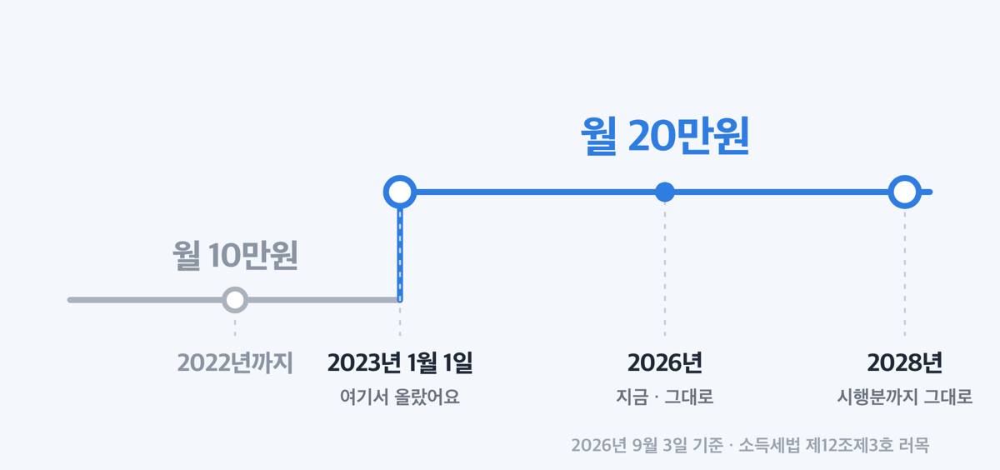
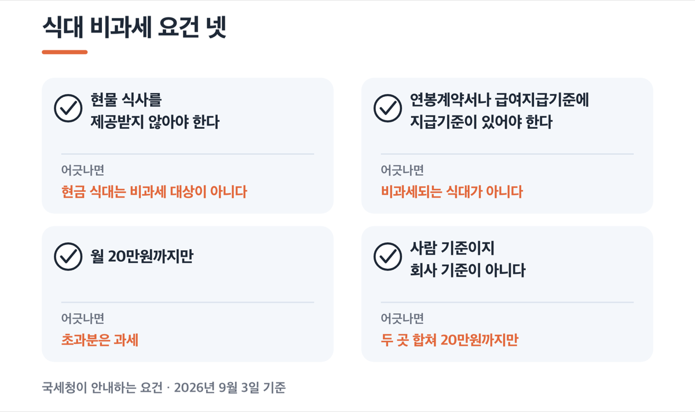
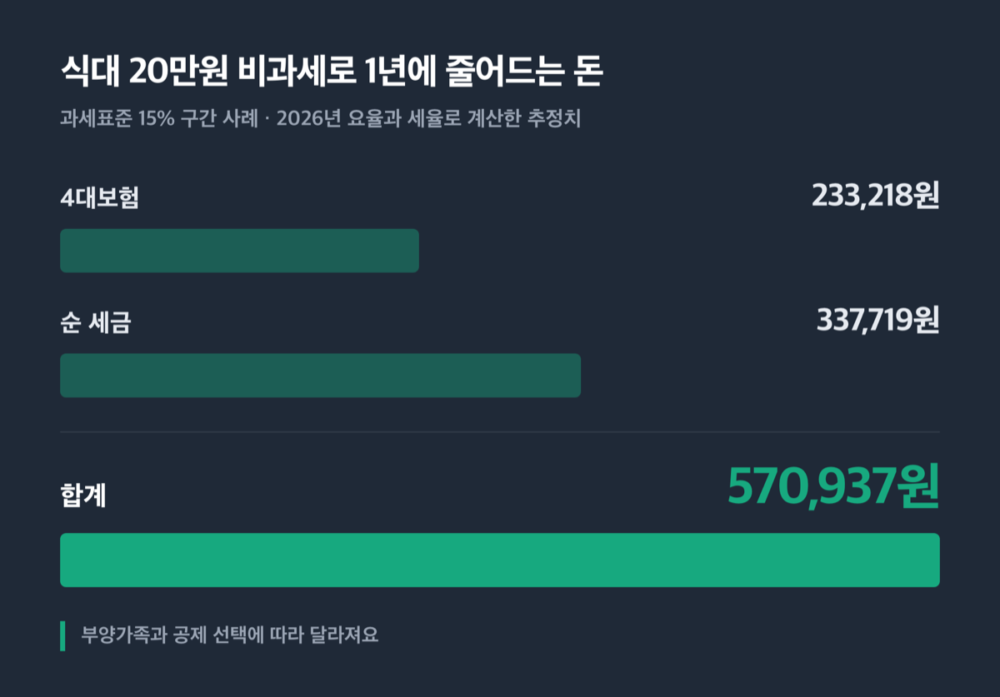
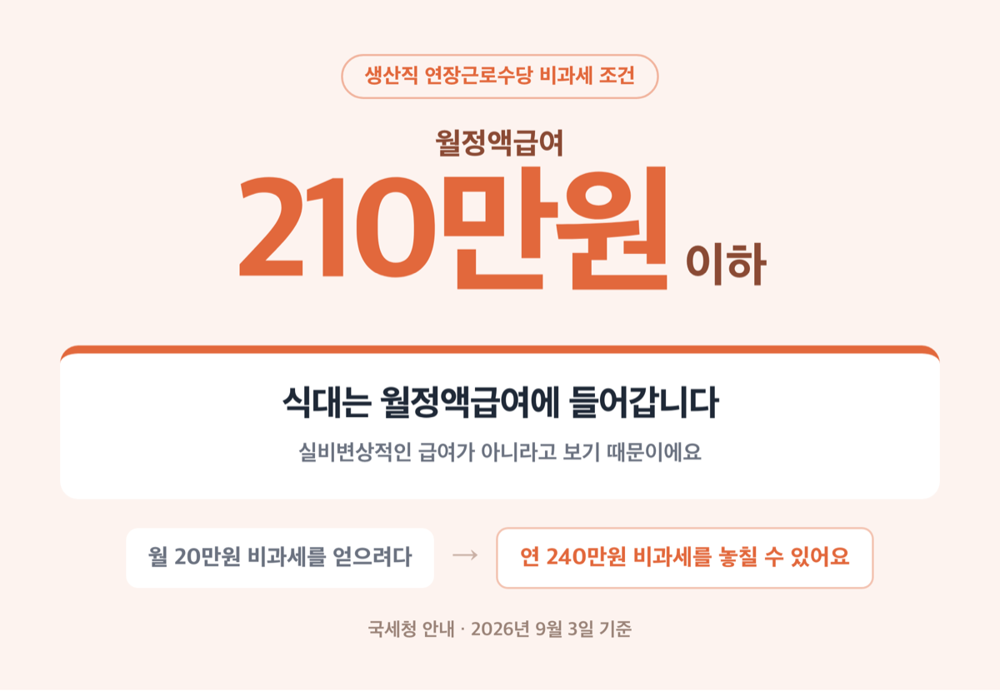

# 식대 비과세 한도 월 20만원, 2026년에도 안 올랐어요

📌 2026년 9월 3일 기준

월 20만원이에요. 그런데 이 20만원을 받고도 세금이 그대로 붙는 경우가 있어요. 조건이 넷이거든요.

**3줄 요약**

1. 식대 비과세는 회사에서 받는 밥값 중 월 20만원까지를 세금과 4대보험 계산에서 빼 주는 제도예요.
2. 20만원이 된 건 2023년 1월 1일부터이고, 2026년에도 그대로입니다.
3. 현물 식사를 함께 받는지, 급여지급기준에 식대가 적혀 있는지를 먼저 확인하세요.

한도가 얼마인지, 누가 받는지, 실제로 손에 남는 돈이 얼마인지, 어디서 걸리는지까지 순서대로 적었어요.

> [!WARNING]
> 국세청 국세상담센터 「연말정산 Q&A — 비과세 식대」 페이지 맨 위 Tip 상자는 아직 「월 10만원」으로 남아 있어요. 같은 페이지 아래 Q&A와 법 원문은 모두 20만원입니다. Tip 상자가 2023년 개정 전 값이에요.

---

## 💰 식대 비과세 한도는 월 20만원, 2026년에도 그대로예요

식대 비과세의 근거는 소득세법 제12조제3호 러목입니다. 조문이 짧아요.

> 근로자가 사내급식이나 이와 유사한 방법으로 제공받는 식사 기타 음식물 또는 근로자(식사 기타 음식물을 제공받지 아니하는 자에 한정한다)가 받는 **월 20만원 이하의 식사대**
> — 소득세법 제12조제3호 러목 (법률 제21221호, 시행 2026.1.1)

==월 20만원==이 된 시점은 2023년 1월 1일입니다. 그 전에는 월 10만원이었어요. 2022년 8월 12일 공포된 개정법 부칙이 2023년 1월 1일 이후 받는 식사·식사대부터 20만원을 적용하도록 정했습니다.

여기서 한 가지 짚고 갈 게 있어요. 예전에는 이 금액이 소득세법 **시행령** 제17조의2에 적혀 있었어요. 지금은 그 조문이 없어졌고, 한도는 법률 본문으로 올라왔습니다. 시행령은 정부가 고칠 수 있지만 법률은 국회를 거쳐야 해요. **한도가 쉽게 안 움직이는 이유가 여기 있습니다.**

**언제까지 20만원인가**

법제처에 올라와 있는 시행 예정 소득세법까지 전부 봤어요. 2026년 7월 1일 시행분, 2027년 1월 1일 시행분, 2028년 1월 1일 시행분의 제12조제3호 러목이 모두 「월 20만원」입니다.

**지금 확정된 법 안에서는 2028년까지 20만원입니다.**

**2026년 세제개편안에도 식대는 없어요**

2026년 세제개편안은 2026년 8월 3일 세제발전심의위원회에서 확정·발표됐어요. 입법예고 8월 4일~8월 20일, 국무회의 9월 1일, 정기국회 제출 9월 3일 이전 일정으로 움직였습니다.

이 개편안에 식대 비과세 항목은 없습니다. 식비 쪽에서 걸린 건 하나예요. 학교와 공장·광산·건설현장 등에 공급하는 **급식용역 부가가치세 면제** 적용기한이 2026년 12월 31일에서 2029년 12월 31일로 늘어나는 항목인데, 근로자가 받는 식대와는 다른 제도입니다.

---

## 비과세를 받으려면 조건이 넷이에요

한도가 20만원이라고 해서 식대 20만원이 자동으로 빠지는 게 아니에요. 국세청이 안내하는 요건이 넷입니다.

| # | 요건 | 어긋나면 |
|---|---|---|
| 1 | 현물 식사를 제공받지 않아야 한다 | 현금 식대는 비과세 대상이 아니다 |
| 2 | 연봉계약서나 급여지급기준에 지급기준이 있어야 한다 | 비과세되는 식대가 아니다 |
| 3 | 월 20만원까지만 | 초과분은 과세 |
| 4 | 사람 기준이지 회사 기준이 아니다 | 두 곳 합쳐 20만원까지만 |

3번은 예를 들면 이렇습니다. 식대를 월 23만원 받으면 20만원은 비과세, 3만원은 과세입니다. 23만원 전부가 날아가는 게 아니라 넘은 만큼만 과세돼요.

4번이 자주 틀리는 대목이에요. 두 회사에서 각각 식대를 받아도 **합한 금액 중 월 20만원까지만** 비과세됩니다. 회사별로 각각 20만원이 아니에요.

> 😕 현물 식사도 받고 식대도 현금으로 받는데요?

그 경우엔 현물분만 비과세되고 ==현금분은 전액 과세==됩니다. 20만원까지도 안 빠져요. 조문 괄호에 「식사 기타 음식물을 제공받지 아니하는 자에 한정한다」라고 적혀 있어서 그렇습니다. 밥을 두 번 지원받는 셈이니 현금 쪽은 빼 주지 않는 구조예요.

**갈래별로 어떻게 되나**

| 받는 형태·대상 (2026년, 월 20만원 한도 기준) | 식대 비과세 적용 여부 |
|---|---|
| 현물 식사 + 현금 식대 | 현물분만 비과세, 현금분 전액 과세 |
| 현금으로 못 바꾸는 식권 | 비과세된다 |
| 편의점·커피숍에서 쓰는 식권 | 비과세되는 식사·음식물로 보지 않는다 |
| 급식수당 23만원 + 야간 현물식사 | 20만원 + 야간 현물식사 모두 비과세 |
| 임원 | 된다. 근로자에 임원이 포함된다 |
| 해외파견 근로자 | 국외근로소득 비과세와 별도로 20만원까지 비과세 |

식권 쪽은 조건이 하나 붙어요. 회사가 외부 음식업자와 식사제공계약을 맺고, **현금으로 바꿀 수 없는** 식권을 준 경우여야 합니다. 현금화가 되는 순간 식사가 아니라 돈이 되니까요.

---

## 식대 20만원이 비과세되면 실제로 얼마가 남나

여기서부터는 법에 적힌 금액이 아니에요. 2026년 요율과 세율에 20만원을 곱해 본 **추정치**입니다. 부양가족과 공제 선택에 따라 달라져요.

먼저 4대보험입니다. 국민연금·건강보험·고용보험 관련 법이 모두 「소득세법 제12조제3호 비과세 근로소득」을 보수에서 빼도록 하고 있어요. 식대는 예외 목록에 없으니 그대로 빠집니다.

| 보험 | 2026년 근로자 부담 요율 | 월 20만원 기준 |
|---|---|---|
| 국민연금 | 4.75% | 9,500원 |
| 건강보험 | 3.595% | 7,190원 |
| 장기요양 | 0.4724% | 945원 |
| 고용보험 | 0.9% | 1,800원 |
| **합계** | **9.7174%** | **약 19,435원** |

*(국민연금 4.75%는 2026년 한 해 값이에요. 국민연금법 부칙이 2027년 5.00%, 2028년 5.25%로 계단식 인상을 정해 두고 있습니다)*

연으로 보면 약 233,218원입니다. 다만 국민연금은 기준소득월액에 상한이 있어요. 2026년 7월분부터 2027년 6월분까지 상한이 659만원, 하한이 41만원입니다. 기준소득월액이 이미 659만원을 넘으면 국민연금 4.75%가 빠지지 않아서 연 절감액은 약 119,218원으로 줄어요.

**세금은 240만원어치가 통째로 빠지지 않아요**

여기가 계산에서 제일 헷갈리는 대목이에요. 식대가 비과세되면 총급여가 줄고, **총급여가 줄면 근로소득공제도 함께 줄어듭니다.** 그래서 과세표준이 줄어드는 폭은 240만원보다 작아요.

| 사례 | 과세표준 감소 | 세금 절감(연) |
|---|---|---|
| 과세표준 15% 구간 | 228만원 | 약 376,200원 |
| 과세표준 24% 구간 | 228만원 | 약 601,920원 |
| 과세표준 6% 구간 | 204만원 | 약 134,640원 |

*(지방소득세 포함. 총급여 4,500만~1억원 구간은 근로소득공제율 5%, 1,500만~4,500만원 구간은 15%를 적용한 값이에요)*

여기서 한 번 더 되돌아옵니다. 4대보험료가 줄면 연금보험료공제와 보험료 특별소득공제도 함께 줄어서 세금이 조금 올라와요. 15% 구간 사례에 이걸 반영하면 순 세금 절감이 약 337,719원입니다. 4대보험 절감 233,218원을 더하면 **연 570,937원쯤이에요.**

> **솔직히 말하면** — 식대를 이미 20만원 받고 있다면 따로 할 일이 없어요. 계산이 의미 있는 쪽은 식대 항목이 아예 없거나 10만원대인 경우입니다.

---

## 급여명세서에서 이것부터 확인하세요

근로기준법 제48조제2항은 임금을 줄 때 임금명세서를 서면이나 전자문서로 주도록 하고 있어요. 시행령 제27조의2가 적어야 할 것을 정해 두었는데, 그중에 **기본급과 각종 수당 등 구성항목별 금액**이 들어 있습니다.

식대가 별도 항목으로 나와 있어야 앞의 요건 2번, 지급기준이 있다는 걸 뒷받침해요. 순서대로 보시면 됩니다.

1. 이번 달 급여명세서를 열어 **식대 항목이 따로 있는지** 봅니다.
2. 있다면 금액이 20만원 이하인지, 넘는다면 초과분이 과세로 잡혀 있는지 확인합니다.
3. 항목이 없다면 연봉계약서와 사규·급여지급기준에 식대 지급기준이 적혀 있는지 확인합니다.
4. 둘 다 없으면 인사·급여 담당 부서에 급여지급기준 개정 여부를 문의합니다.
5. 두 곳에서 급여를 받고 있다면 합산액이 월 20만원을 넘는지 직접 더해 봅니다.

물어볼 곳은 셋으로 나뉘어요. 명세서 항목과 급여지급기준은 회사 인사·급여 부서, 조문과 예규 해석은 국세청 국세상담센터, 내 사례에 대한 개별 판정은 관할 세무서입니다.

조문과 예규 원문은 국세청 「비과세 근로소득」 안내(https://www.nts.go.kr/nts/cm/cntnts/cntntsView.do?mi=6588&cntntsId=7867)에서 바로 볼 수 있어요.

**명세서에 식대가 찍혀 있다고 자동으로 비과세되는 건 아닙니다.** 근거는 어디까지나 급여지급기준이에요. 명세서는 그 기준이 실제로 굴러가고 있다는 증거 쪽에 가깝습니다.

---

## 여기서 자주 걸려요 — 생산직 연장근로수당과 부딪힙니다

생산직 근로자에게는 연장·야간·휴일근로수당을 연 240만원까지 비과세해 주는 제도가 따로 있어요. 조건이 둘입니다. 월정액급여 210만원 이하, 그리고 직전 과세기간 총급여 3천만원 이하.

문제는 여기예요. ==식대는 월정액급여에 들어갑니다.== 국세청이 「식대는 실비변상적인 급여가 아니므로 월정액급여 계산 시 포함한다」고 안내하고 있어요. 실비변상적인 급여란 업무에 쓴 돈을 되돌려 주는 성격의 돈을 말합니다. 식대는 그렇게 보지 않는다는 뜻이에요.

식대를 올려 받으면 월정액급여가 올라가고, 210만원 선을 넘으면 연장근로수당 비과세를 통째로 잃을 수 있어요. 월 20만원 비과세를 얻으려다 연 240만원 비과세를 놓치는 셈입니다.

**저라면 월정액급여가 200만원대 초반인 생산직이면 식대 인상 전에 이 계산부터 해 봅니다.**

**자기차량운전보조금과 헷갈리지 마세요**

월 20만원이라는 숫자가 같아서 자주 섞여요. 그런데 성격이 다릅니다.

| 항목 | 식대 | 자기차량운전보조금 |
|---|---|---|
| 회사별 적용 | 합산해서 20만원 | 회사별로 각각 |
| 월정액급여 | 포함 | 제외 |

자기차량운전보조금은 실비변상적 급여로 보는 돈이라 이렇게 달라져요. 「식대도 회사마다 각각 20만원」이라는 설명이 돌아다니는데, 그건 자기차량운전보조금 쪽 규칙입니다.

**최저임금에는 전액 산입돼요**

최저임금법은 식비 같은 복리후생비 중 통화로 주는 것의 월 환산액 7%를 최저임금에 넣지 않도록 하고 있어요. 그런데 부칙이 그 비율을 연도별로 정해 두었고, **2024년부터는 「100분의 0」입니다.**

즉 2026년 현재 현금으로 받는 식대는 최저임금 계산에 전액 들어갑니다. 회사가 도시락이나 구내식당처럼 현물로 주는 식사는 최저임금에 넣지 않아요.

**「2026년부터 30만원」은 시행되는 법이 아니에요**

검색하면 상단 요약이나 일부 블로그가 그렇게 적어 두고 있어요. 법 원문을 열어 확인한 결과 2026년 1월 1일 시행분부터 2028년 1월 1일 시행분까지 전부 「월 20만원」입니다. 30만원은 국회에 발의된 개정안 내용이지 지금 적용되는 값이 아니에요.

**급여 설계나 연말정산 계산은 20만원 기준으로 하셔야 합니다.**

---

## 식대 비과세 한도 관련 궁금증 해결

**Q1. 식대를 30만원 받으면 30만원 전부가 과세되나요?**
A1. 아니에요. 20만원은 비과세, 넘는 10만원만 과세됩니다. 넘은 만큼만 세금과 4대보험 계산에 들어가요.

**Q2. 구내식당에서 밥을 먹는데 식대도 현금으로 받아요.**
A2. 현물 식사는 비과세이고, 현금 식대는 전액 과세됩니다. 20만원 한도가 적용되지 않아요. 회사마다 운영이 다르니 급여지급기준을 먼저 확인하세요.

**Q3. 임원도 식대 비과세를 받나요?**
A3. 받습니다. 법이 임원을 따로 빼지 않는 한 「근로자」에 임원이 포함된다는 게 국세청 기본통칙의 해석이에요.

**Q4. 회사 식권으로 편의점에서 도시락을 사 먹어요.**
A4. 편의점·커피숍에서 쓰는 식권은 비과세되는 식사·음식물로 보지 않습니다. 외부 음식업자와의 식사제공계약에 따른, 현금으로 바꿀 수 없는 식권만 비과세돼요.

**Q5. 재택근무 중에 받는 식대는 어떻게 되나요?**
A5. 회사 급여지급기준에 재택 시 식대 지급기준이 어떻게 적혀 있는지에 따라 판단이 달라집니다. 관할 세무서나 국세청 국세상담센터에서 확인하세요.

---

## 마무리

정리하면 셋이에요. 한도는 2026년에도 월 20만원, 현물 식사를 함께 받으면 현금 식대는 전액 과세, 두 회사에서 받으면 합산 20만원.

식대 항목이 급여명세서에 없는 분이라면 오늘 명세서를 한 번 열어 보시는 걸 권합니다. 15% 구간이면 연 57만원쯤 차이가 나는 항목이에요. 회사 입장에서도 4대보험 사업주 부담이 함께 줄어드니 꺼낼 만한 이야기입니다.

참고: 소득세법 제12조제3호 러목(법률 제21221호) · 국세청 「비과세 근로소득」 안내 · 국세청 국세상담센터 연말정산 Q&A · 재정경제부 「2026년 세제개편안」 · 보건복지부 고시 제2026-31호 · 최저임금법 · 근로기준법 제48조
