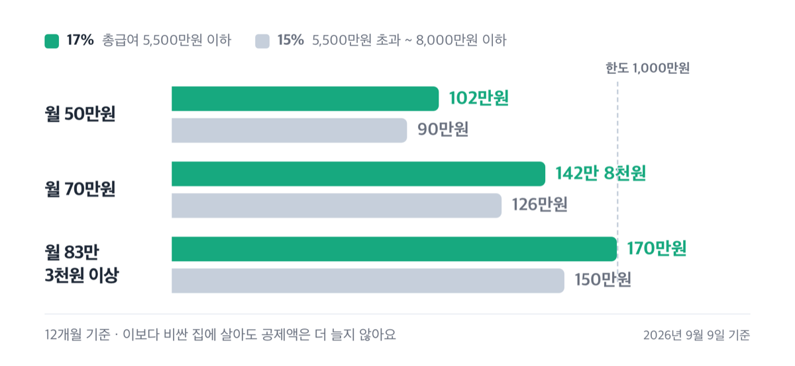
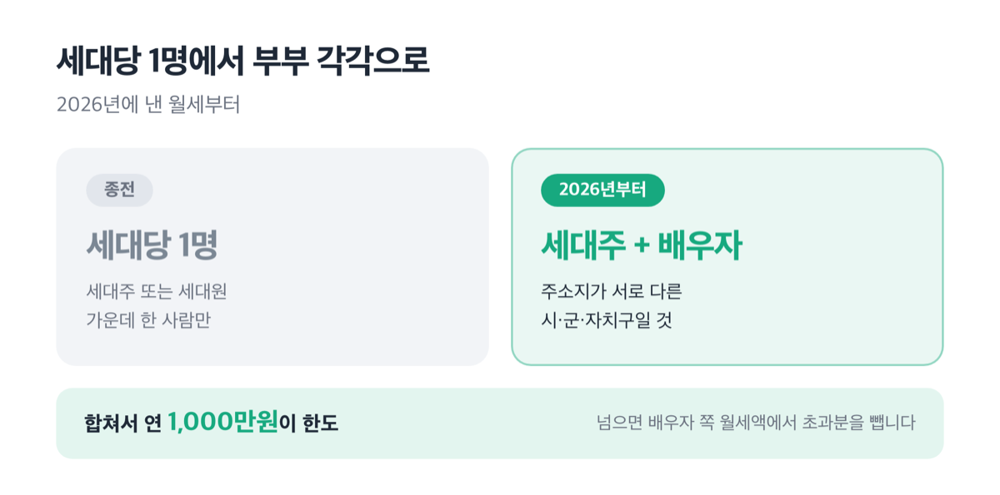
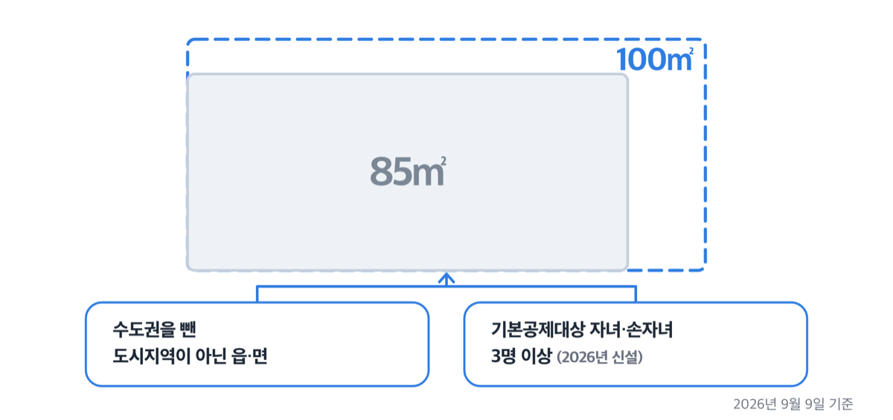
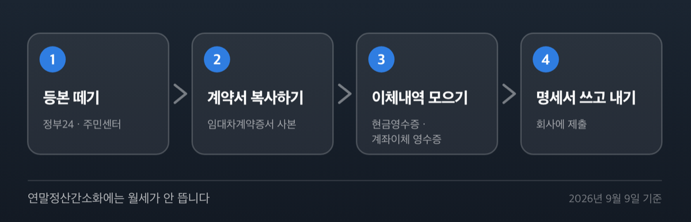

# 월세 세액공제 조건 2026년, 8천만원 이하도 전입신고 없으면 0원

📌 2026년 9월 9일 기준

총급여 7천만원이 기준선이라고 알고 계신 곳이 아직 많아요. 지금 법은 8천만원입니다. 국세청 국세상담센터 페이지 맨 위 요약 상자조차 옛 숫자가 그대로 남아 있어요.

**3줄 요약**

- 무주택 근로자가 낸 월세를 연 1,000만원까지 잡아, 그 15%나 17%를 세금에서 직접 빼 주는 제도예요.
- 2026년에 낸 월세부터 따로 사는 무주택 부부가 각각 받을 수 있고, 자녀·손자녀가 3명 이상이면 100㎡ 집까지 됩니다.
- 소득이 맞아도 12월 31일 무주택과 전입신고 중 하나가 어긋나면 한 푼도 못 받아요.

소득 기준부터 서류 셋, 그리고 공식 페이지를 봐도 값이 어긋나는 대목까지 순서대로 적었어요.

> [!WARNING]
> 검색하면 나오는 「한도 1,200만원」과 「청년 17%」는 **2027년에 낼 월세부터** 적용하자는 정부 개정안이에요. 2026년 9월 9일 현재 시행 중인 법은 한도 1,000만원, 15%와 17%입니다.

## 얼마를 돌려받나 — 15%와 17%, 한도 1,000만원

월세 세액공제의 값은 소득 기준, 공제율, 한도 셋으로 정해집니다. 총급여가 얼마냐에 따라 공제율이 두 갈래로 나뉘어요.

| 총급여 (연간) | 공제율 | 함께 걸리는 종합소득금액 |
|---|---|---|
| 5,500만원 이하 | **17%** | 4,500만원 초과면 제외 |
| 5,500만원 초과 ~ 8,000만원 이하 | **15%** | 7,000만원 초과면 제외 |
| 8,000만원 초과 | 대상 아님 | — |

표 오른쪽 칸이 함정이에요. 총급여가 5,500만원 이하여도 다른 소득을 합친 종합소득금액이 4,500만원을 넘으면 17%가 아니라 대상에서 빠집니다.

공제 대상 월세액은 ==연 1,000만원==까지만 잡아요. 그 위로 낸 월세는 없는 것으로 봅니다. 그래서 최대 공제세액은 17% 구간에서 170만원, 15% 구간에서 150만원이에요. 170만원은 총급여 5,500만원 이하이면서 연 월세가 1,000만원을 넘을 때 나오는 값입니다.

이건 소득에서 빼 주는 소득공제가 아니라 **산출세액에서 직접 빼는 세액공제**입니다. 월세는 2014년에 소득공제에서 세액공제로 옮겨 왔어요. 소득 구간에 따라 혜택이 커지지 않고 낸 월세에 비율만 곱하는 구조라, 소득이 낮은 쪽이 상대적으로 유리해집니다.

다만 법 조문이 "종합소득산출세액에서 공제한다"고만 적어 둬서, 낼 세금 자체가 적으면 그만큼만 줄어들어요.

실제로 월세를 얼마 낼 때 얼마가 되는지 계산해 봤어요. 중간에 이사했거나 덜 낸 달이 있으면 이 값과 달라집니다.

| 월세 (12개월 기준) | 17% 구간 | 15% 구간 |
|---|---|---|
| 월 50만원 | 102만원 | 90만원 |
| 월 70만원 | 142만 8천원 | 126만원 |
| 월 83만 3천원 이상 | 170만원 | 150만원 |

한도를 꽉 채우는 월세는 월 83만 3천원쯤입니다. 1,000만원을 12개월로 나눈 값이에요. 이보다 비싼 집에 살아도 공제액은 더 늘지 않아요.

중간에 이사했다면 법이 정한 계산식을 씁니다. 계약서상 지급해야 할 월세 합계를 계약기간 일수로 나눈 뒤, 그 해에 실제로 임차한 날수를 곱해요.

## 누가 받나 — 조건 넷을 다 채워야 합니다

국세청이 요건을 넷으로 정리해 뒀어요. 하나라도 어긋나면 나머지를 다 채워도 0원입니다.

1. **무주택 세대의 세대주**일 것 *(요건을 채운 세대원도 됩니다)*
2. 임대차계약이 **근로자 본인 또는 기본공제대상자 명의**일 것
3. **전입신고**를 해서 계약서 주소와 주민등록등본 주소가 같을 것
4. **월세를 근로자 본인이 냈을** 것

**무주택은 12월 31일 하루로 판정합니다.**

소득세는 한 해를 통째로 묶어 계산하는 기간과세라, 무주택 여부도 과세기간 종료일인 12월 31일 현재로 봅니다. 1월부터 11월까지 무주택으로 월세를 냈어도 12월에 집을 사면 그 해 월세는 전부 날아가요.

「세대」에는 본인과 배우자, 그리고 같은 주소에서 생계를 같이 하는 직계존비속과 형제자매가 들어갑니다. 그래서 같이 사는 부모님이 지방에 집을 갖고 계시면 무주택 세대가 아니에요.

> 😕 배우자와 따로 살면 세대가 나뉘는 것 아닌가요?
>
> 배우자는 생계를 달리해도 같은 세대로 봅니다. 배우자 명의 집이 있으면 본인이 아무리 무주택이어도 공제받지 못해요.

세대원도 받을 수 있어요. 단 세대주가 월세액 세액공제, 주택마련저축, 주택임차차입금 원리금상환액, 장기주택저당차입금 이자상환액 공제를 **하나도 받지 않았을 때**만 가능합니다. 부양가족 없는 1인 세대주도 물론 대상이에요.

**전입신고가 없으면 여기서 끝입니다.**

법령이 요구하는 건 하나예요. 임대차계약증서의 주소지와 주민등록표 등본의 주소지가 같을 것.

사정이 있어 늦게 전입신고했다면, ==늦기 전에 낸 월세는 공제되지 않습니다==. 앞집 전세보증금 반환소송으로 전입신고를 못 했던 사례에서도 국세청은 안 된다고 답했어요. 사정을 감안해 준 해석 사례를 저는 아직 못 봤습니다.

반대로 **확정일자는 받지 않아도 됩니다.** 2014년에 요건에서 빠졌어요. 확정일자와 전입신고를 묶어서 기억하시는 분들이 여기서 헷갈립니다.

계약 명의는 본인이 아니어도 됩니다. 2017년부터 기본공제대상자 명의도 인정돼요. 다만 그 사람이 나이 요건과 소득 요건을 모두 채운 기본공제대상자여야 합니다. 소득이 있는 배우자 명의로 계약했다면 여기서 걸려요.

외국인도 받습니다. 출입국관리법상 등록 외국인이나 재외동포법상 국내거소신고를 한 외국국적동포면 2021년 귀속분부터 대상이에요. **일용근로자는 제외됩니다.**

**2026년부터 따로 사는 부부는 각각 받아요.**

여기가 올해 가장 크게 바뀐 것입니다. 종전에는 세대당 한 명만 받았는데, 2026년에 낸 월세부터는 요건을 채운 **세대주의 배우자도 추가로** 받을 수 있어요.

| 요건 | 내용 |
|---|---|
| 배우자 소득 | 총급여 8,000만원 이하 등 본인과 같은 요건을 모두 충족 |
| 주소 | 세대주와 배우자의 주소지가 서로 다른 시·군·자치구일 것 |
| 세대 | 배우자와 같은 주소인 직계존비속·형제자매도 12월 31일 무주택일 것 |

한도가 두 배로 늘어나는 건 아니에요. **세대주와 배우자의 월세를 합쳐 1,000만원이 한도**이고, 합계가 넘으면 배우자 쪽 월세액에서 초과분을 뺍니다. 두 사람이 각각 월 60만원씩 낸다면 합계 1,440만원 중 1,000만원까지만 잡혀요.

> 🤭 **솔직히 말하면** — 이 요건에서 「시·군·자치구가 서로 달라야 한다」는 조건이 생각보다 까다로워요. 같은 시 안에서 구만 다른 경우가 아니라면 대체로 통과하지만, 계약서 주소와 등본 주소가 둘 다 맞아야 합니다.

## 어떤 집이어야 하나 — 85㎡ 또는 기준시가 4억원

집도 조건이 있어요. **국민주택규모 이하이거나, 기준시가 4억원 이하**면 됩니다. 둘 중 하나만 맞으면 돼요.

| 구분 | 면적 기준 |
|---|---|
| 기본 | 주거전용면적 85㎡ 이하 |
| 수도권을 뺀 도시지역이 아닌 읍·면 | 100㎡ 이하 |
| 기본공제대상 자녀·손자녀 3명 이상 | 100㎡ 이하 *(2026년 신설)* |

100㎡ 기준에 붙은 조건을 정확히 봐야 해요. 그냥 지방이 아니라 **수도권을 제외한, 도시지역이 아닌 읍 또는 면** 지역입니다. 지방 도시의 동 지역은 여전히 85㎡예요.

자녀·손자녀 3명 이상 가구의 100㎡ 확대는 2026년에 낸 월세부터 적용되는 시행 중인 규정입니다. 자녀 범위에는 입양자와 위탁아동, 손자녀가 들어가고 모두 기본공제대상자여야 해요.

집의 종류도 갈래가 있습니다.

- **주거용 오피스텔** — 됩니다 *(주택법 시행령이 정한 오피스텔이 대상에 들어가요)*
- **고시원** — 됩니다 *(2017년 1월 1일 이후 임차분부터)*
- **학교·회사 기숙사** — 안 됩니다 *(주택법상 준주택이라 대상 주택이 아니에요)*
- **다가구주택** — 가구당 전용면적으로 판단해요
- **세대구분형 공동주택** — 전체가 85㎡를 넘어도 임차한 부분이 85㎡ 이하면 됩니다

기준시가로 판단할 때는 시점이 중요해요. **임대차계약 체결일 기준**입니다. 계약 후에 집값이 올라 4억원을 넘겼다면 그건 따지지 않아요. 집에 딸린 토지는 도시지역이면 건물 정착면적의 5배, 그 밖은 10배 안이어야 합니다.

그런데 서류를 언제 어디에 내는지에서 또 한 번 걸립니다.

## 서류는 셋, 내는 곳은 회사예요

연말정산 때 회사(원천징수의무자)에 냅니다. 준비할 서류는 셋이에요.

1. **주민등록표등본** — 읍·면·동 주민센터나 정부24에서 뗍니다
2. **임대차계약증서 사본** — 본인이 갖고 있는 계약서를 복사해요
3. **월세를 임대인에게 냈다는 증명** — 현금영수증, 계좌이체 영수증, 무통장입금증 등

여기에 「월세액·거주자 간 주택임차차입금 원리금 상환액 소득·세액공제 명세서」를 근로자가 직접 작성합니다. 국세청은 임대차 계약서상 주소지와 계약기간을 정확히 적으라고 따로 밝혀 뒀어요.

**연말정산간소화에는 월세가 안 뜹니다.**

이 대목을 모르고 넘어가는 경우가 많아요. 간소화 서비스가 주는 주택 관련 자료는 주택마련저축 납입금액, 주택임차차입금 원리금상환액, 장기주택저당차입금 이자상환액, 그리고 **공공주택사업자에게 낸 월세** 넷입니다.

일반 임대인에게 낸 월세는 뜨지 않아요. 서류를 직접 챙겨야 합니다.

증빙이 약하다면 홈택스나 손택스에서 **「주택임차료 신고」**를 하면 돼요. 임대차계약서를 첨부해 신고하면 국세청이 월세 지급일에 현금영수증을 발급합니다. 신고기한은 월세 지급일로부터 5년 이내이고, 신고는 임차인 본인만 할 수 있어요. 매달 다시 할 필요는 없지만 **계약이 연장되거나 바뀌면 다시 신고해야 합니다.**

**이미 놓쳤다면 5년 안에 되돌릴 수 있어요.**

지난 연말정산에서 빠뜨렸어도 방법이 있습니다. 법정신고기한이 지난 후 **5년 이내**에 관할 세무서장에게 경정청구를 하면 돼요. 연말정산으로 끝난 근로자도 대상입니다. 세무서는 청구받은 날부터 2개월 안에 답을 줍니다.

저라면 지난 3~4년치 계약서와 이체내역부터 뒤져 보겠어요. 조건이 맞는데 몰라서 넘긴 해가 있다면 그게 그대로 돈입니다.

## 공식 페이지를 봐도 헷갈리는 이유

공식 안내 페이지마다 적힌 수치가 달라 주의해야 해요. **국세청 안내끼리 값이 다릅니다.**

국세청 국세상담센터 「월세세액공제」 페이지 맨 위 요약 상자에는 "총급여액 7천만원 이하 근로자(종합소득금액 6천만원 초과시 제외)"라고 적혀 있어요. 2023년 이전 규정이 그대로 남아 있는 것으로 보입니다. 같은 페이지 아래쪽 Q&A(질의응답) 본문은 8천만원으로 답하고, 법 조문도 8천만원이에요.

같은 페이지의 「연말정산 책자 다운」 버튼도 마찬가지입니다. 내려받으면 표지가 **「연말정산 신고안내 2022. 12.」**인 파일이 나와요. 그 책자 본문에는 총급여 7천만원, 한도 750만원, 기준시가 3억원이 적혀 있습니다. 전부 지난 값이에요.

| 어디서 본 값 | 그 안내에 적힌 값 | 2026년 9월 9일 현행 법령 값 |
|---|---|---|
| 상담센터 요약 상자 | 총급여 7천만원 | **8천만원** |
| 2022년 12월판 책자 | 한도 750만원 | **1,000만원** |
| 2022년 12월판 책자 | 기준시가 3억원 | **4억원** |

정본은 국세청 본청이 내는 「2025년 원천징수의무자를 위한 연말정산 신고안내」(2025년 12월 발간)입니다. 그 책자가 총급여 8천만원, 한도 1,000만원, 기준시가 4억원으로 적고 있어요. 국세청 「월세액 세액공제」 안내 페이지도 값 자체는 맞지만 페이지 아래에 "2024.12.31. 기준"이라고 적혀 있어, 2026년에 새로 생긴 부부 각각 공제와 다자녀 100㎡는 실려 있지 않습니다.

**공식 페이지에서 본 숫자라고 안심하지 마세요.** 어느 시점의 안내인지 먼저 확인해야 합니다.

함께 못 받는 것도 짚어 둘게요. **월세 세액공제와 월세 현금영수증을 통한 신용카드 등 사용금액 소득공제는 중복되지 않습니다.** 유리한 쪽 하나만 고릅니다. 총급여 요건에 걸려 세액공제를 못 받는 사람은 현금영수증으로 신용카드 등 소득공제를 받으면 돼요. 국가나 지자체에서 지원받은 월세는 그 금액만큼 대상에서 빠집니다.

## 2027년부터 바뀔 수 있는 것 — 아직 법이 아닙니다

> [!WARNING]
> 아래 값은 2026년 8월 3일 발표된 **정부 개정안**이에요. 국회 심사를 거쳐야 확정되고, 지금 연말정산에 쓰는 값이 아닙니다.

정부가 내놓은 2026년 세제개편안에는 월세 세액공제를 넓히는 내용이 담겼어요. 개정 이유로는 주거비 부담 완화를 들었습니다.

| 항목 | 현행 (2026년) | 정부 개정안 |
|---|---|---|
| 공제 대상 월세 한도 | 연 1,000만원 | 연 1,200만원 |
| 청년 공제율 | 총급여 5,500만원 이하만 17% | 총급여와 무관하게 17% |
| 적용 시기 | — | 2027년 1월 1일 이후 지급 월세분 |

여기서 청년은 15세부터 34세까지이고, 군복무기간은 최대 6년까지 나이에서 빼 줍니다. 청년 우대는 2027년부터 2029년까지 3년 한시로 설계됐어요.

정부 문답자료가 든 예시를 보면, 총급여 7,000만원인 청년 근로자가 월 100만원을 낼 때 현행 150만원에서 204만원으로 늘어납니다. 성실사업자에 대한 같은 공제도 적용기한을 2029년 말까지 늘리는 안이 함께 들어 있어요.

정부는 2026년 9월 3일 이전에 국회에 제출하겠다는 일정을 밝혔습니다. 확정 여부와 심사 진행 상황은 국회 의안정보시스템에서 조세특례제한법 개정안으로 확인하세요.

## 월세 세액공제 관련 궁금증 해결

**Q. 전입신고를 두 달 늦게 했어요. 그 전에 낸 월세도 되나요?**

A. 안 됩니다. 전입신고 전에 낸 월세는 공제 대상에서 빠져요. 계약서 주소와 등본 주소가 같아야 한다는 요건을 그 기간에는 채우지 못했기 때문입니다.

**Q. 부모님과 같이 사는데 부모님이 지방에 집이 있어요. 제 월세는요?**

A. 받지 못합니다. 같은 주소에서 생계를 같이 하는 직계존비속은 같은 세대로 봐요. 그러면 무주택 세대가 아니게 됩니다.

**Q. 확정일자를 안 받았는데 괜찮나요?**

A. 괜찮습니다. 확정일자는 2014년에 요건에서 빠졌어요. 전입신고만 되어 있으면 됩니다.

**Q. 고시원에 사는데 대상인가요?**

A. 됩니다. 2017년 1월 1일 이후 임차분부터 대상이에요. 다만 학교나 회사 기숙사는 준주택이라 안 됩니다.

**Q. 묵시적 갱신으로 계약서 없이 계속 살고 있어요.**

A. 공제됩니다. 기존 계약서와 월세를 낸 내역을 함께 내면 돼요.

올해 낸 월세를 정산하는 건 2027년 1~2월입니다. 지금 확인할 것은 셋이에요. 12월 31일까지 무주택을 유지할 수 있는지, 등본 주소가 계약서와 같은지, 월세 이체내역이 본인 계좌에서 나갔는지. 이 셋이 맞으면 나머지는 서류를 떼는 일뿐입니다.

세 조건 중 하나라도 애매하다면 관할 세무서나 국세청 국세상담센터에서 본인 사례로 확인하세요. 세대 판정과 명의 문제는 개별 사정에 따라 결론이 달라집니다.

참고: 조세특례제한법 제95조의2 및 같은 법 시행령 제95조 · 국세청 「2025년 원천징수의무자를 위한 연말정산 신고안내」 · 국세청 「연말정산 월세액 주택자금공제의 이해」 · 국세청 「2026년 개정세법 요약」 · 재정경제부 「2026년 세제개편안」
