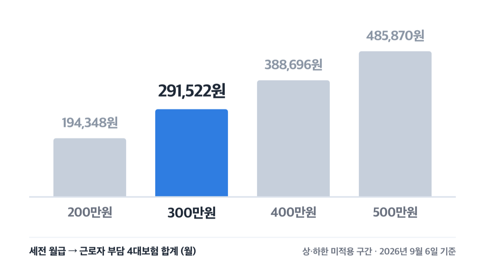
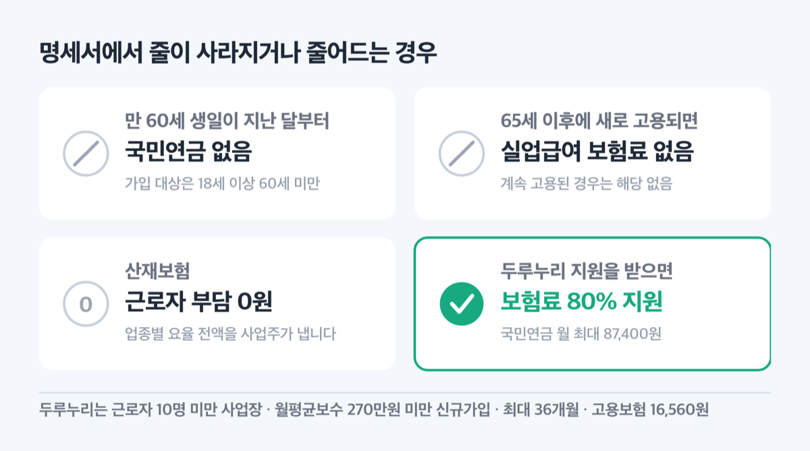
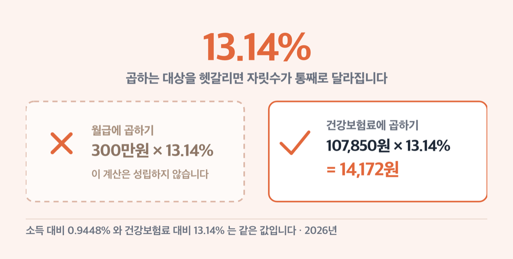

# '월 29만원' 4대보험 공제액, 2026년 월급 300만원에서 떼요

📌 2026년 9월 6일 기준

작년까지 월급에서 떼던 4대보험이 올해부터 달라졌어요. 국민연금 요율이 1998년 이후 처음 올랐고, 건강보험과 장기요양보험도 같이 올랐거든요. 월급 300만원이면 지금 매달 얼마가 나가는지 하나씩 계산해 봤어요.

**3줄 요약**

- 4대보험은 국민연금·건강보험·고용보험·산재보험이고, 근로자는 산재보험을 뺀 셋을 냅니다. 장기요양보험은 건강보험에 얹혀 함께 빠져요.
- 2026년 1월부터 국민연금 요율이 9%에서 9.5%로, 건강보험료율이 7.09%에서 7.19%로 올랐습니다.
- 내 공제액을 보려면 국민연금 기준소득월액이 상한 659만원과 하한 41만원 사이에 드는지부터 확인하세요.

요율부터 보고, 월급별 금액과 상한·하한, 안 떼는 경우, 자주 틀리는 것까지 순서대로 짚습니다.

## 💰 2026년 4대보험, 근로자가 내는 요율은 이 넷입니다

4대보험의 넷은 국민연금, 건강보험, 고용보험, 산재보험이에요. 장기요양보험은 다섯 번째가 아니라 건강보험료 위에 얹혀 함께 나갑니다.

| 항목 (2026년) | 근로자 부담 요율 | 사업주 부담 |
|---|---|---|
| 국민연금 | 기준소득월액의 4.75% | 4.75% |
| 건강보험 | 보수월액의 3.595% | 3.595% |
| 장기요양보험 | 건강보험료(근로자분)의 13.14% | 같은 금액 |
| 고용보험(실업급여) | 보수총액의 0.9% | 0.9% + 고용안정·직업능력개발분 |
| 산재보험 | 0원 | 업종별 요율 전액 |

*(장기요양보험 13.14%는 월급이 아니라 건강보험료에 곱하는 값이에요. 보수월액 기준으로 바꾸면 0.4724%입니다)*

왜 요율이 절반씩인지부터 짚을게요. 국민건강보험법 제76조 제1항이 직장가입자 보험료를 가입자와 사업주가 각각 100분의 50씩 부담하도록 정해 뒀어요. 그래서 뉴스에 나오는 7.19%가 아니라 그 절반인 3.595%만 월급에서 빠집니다. 고용보험 실업급여도 같은 구조예요. 보험료징수법 시행령 제12조가 실업급여 보험료율을 1천분의 18로 정했고, 법 제13조 제2항이 근로자에게 그 2분의 1을 지우거든요.

> 😕 국민연금은 9.5%라던데, 왜 4.75%만 떼나요?

9.5%는 회사와 나눠 내는 합계예요. 직장가입자는 절반인 4.75%만 월급에서 빠지고 나머지 4.75%는 회사가 냅니다. 9.5%를 혼자 다 내는 쪽은 지역가입자와 임의가입자예요.

국민연금 요율은 법 조항을 읽을 때 헷갈리기 쉬워요. 국민연금법 제88조 제3항 본문은 기여금과 부담금을 각각 1천분의 65, 그러니까 6.5%씩으로 적어 두었습니다. 그런데 부칙 제4조 제1항이 2026년부터 2032년까지를 따로 정했어요. 2026년은 1만분의 475, 곧 4.75%입니다. 본문의 6.5%씩(합계 13%)은 2033년부터 적용돼요. ==본문만 읽으면 두 배 넘게 틀린 숫자가 나옵니다.==

작년과 견주면 이렇게 움직였어요.

| 항목 | 2025년 | 2026년 |
|---|---|---|
| 국민연금 합계 요율 | 9% | 9.5% |
| 건강보험료율 | 7.09% | 7.19% |
| 장기요양보험료율(소득 대비) | 0.9182% | 0.9448% |
| 고용보험 실업급여 요율 | 1.8% | 1.8% (동결) |
| 평균 산재보험료율 | 1.47% | 1.47% (3년 연속 동결) |

*(위 요율은 근로자와 사업주를 합친 값이에요. 근로자 몫은 그 절반입니다)*

올린 이유도 문서에 적혀 있어요. 보건복지부는 보험료율 동결과 경제 저성장으로 건강보험 수입 기반이 약해졌고, 지역 의료와 꼭 있어야 할 진료를 키우는 국정과제에 들어갈 돈을 고려했다고 밝혔습니다. 장기요양은 수급자가 2022년 101.9만 명에서 2024년 116.5만 명으로 늘어난 것을 이유로 들었어요. 국민연금은 1998년 이후 9%로 묶여 있던 요율을 8년에 걸쳐 0.5%포인트씩 올려 2033년 13%에 닿게 됩니다. 올해가 그 첫해예요.

## 월급 300만원이면 29만 1,522원 — 월급별 공제액

법령과 고시는 요율만 정하고 금액은 적지 않아요. 그래서 요율에 월급을 곱해 직접 계산했습니다.

| 월급 (세전, 월) | 근로자 부담 4대보험 합계 (월) |
|---|---|
| 2,156,880원 (2026년 최저임금 월 환산) | 209,593원 |
| 200만원 | 194,348원 |
| 300만원 | 291,522원 |
| 400만원 | 388,696원 |
| 500만원 | 485,870원 |

*(최저임금 월 환산액 2,156,880원은 2026년 최저임금 고시에 적힌 값이에요. 시급 10,320원에 월 209시간 기준입니다)*

300만원 칸이 어떻게 나왔는지 뜯어 볼게요.

1. 국민연금 142,500원 — 300만원 × 4.75%
2. 건강보험 107,850원 — 300만원 × 3.595%
3. 장기요양보험 14,172원 — 건강보험료 107,850원 × 13.14%
4. 고용보험 27,000원 — 300만원 × 0.9%
5. 산재보험 0원 — 사업주가 전액 부담

넷을 더하면 291,522원이에요. 요율로 보면 보수월액의 약 9.72%입니다. 4.75 + 3.595 + 0.4724 + 0.9를 더한 값이에요.

이 계산에는 전제가 둘 있어요. 국민연금 기준소득월액과 건강보험 보수월액이 내 월급과 같다고 봤고, 상한과 하한에 걸리지 않는 구간으로 봤습니다. 기준소득월액은 1년에 한 번 정해져서 실제 급여와 어긋날 수 있어요. 원 단위까지 맞는 확정 금액은 급여명세서에서 확인하세요.

**월급의 10분의 1쯤은 손에 쥐기 전에 나간다고 보면 됩니다.**

## 아무리 많이 벌어도 여기서 멈춥니다

국민연금과 건강보험에는 천장이 있어요. 소득이 아무리 높아도 그 위로는 보험료가 늘지 않습니다.

| 국민연금 기준소득월액 | 하한 | 상한 |
|---|---|---|
| 2025년 7월 ~ 2026년 6월 | 40만원 | 637만원 |
| 2026년 7월 ~ 2027년 6월 | 41만원 | 659만원 |

*(지금 적용 중인 값은 아래 줄이에요. 하한 41만원, 상한 659만원입니다)*

상한 659만원에 걸리면 국민연금 근로자 부담은 월 313,025원에서 멈춰요. 하한 41만원이면 월 19,475원입니다. 기준소득월액은 신고한 소득월액에서 천원 미만을 버린 금액이에요.

여기가 한 해 안에서도 값이 바뀌는 대목이라 조심해야 합니다. 상·하한액은 매년 3월 말까지 보건복지부 장관이 고시하고 그해 7월부터 1년간 적용돼요. 그래서 2026년 1월부터 6월까지는 상한이 637만원, 7월부터는 659만원입니다. "2026년 상한액"이라고만 적힌 자료는 절반이 틀린 셈이에요.

건강보험은 요율이 아니라 보험료 금액 자체에 상한을 걸어 뒀어요.

| 건강보험 월별 보험료액 (2026년) | 금액 (본인+사업주 합계) |
|---|---|
| 직장가입자 보수월액보험료 상한 | 월 9,183,480원 |
| 직장가입자 보수월액보험료 하한 | 월 20,160원 |

*(표의 금액은 회사 몫까지 합친 값이에요. 본인 부담은 그 절반입니다)*

상한이 걸리면 근로자 몫은 월 4,591,740원이에요. 역산하면 보수월액 약 1억 2,772만원부터 이 상한에 닿습니다. 하한 쪽은 보수월액 약 28만원이에요. 상한을 이렇게 정하는 이유는 시행령 제32조에 있어요. 전전년도 평균 보수월액보험료의 30배를 고려해 장관이 고시하도록 되어 있습니다.

## 안 떼거나 덜 떼는 경우 넷

전부 다 내는 것이 기본이지만 빠지는 경우가 있어요.

1. **만 60세부터 국민연금이 빠집니다.** 국민연금 가입 대상이 18세 이상 60세 미만이라 그래요(법 제6조). 60세 생일이 지난 달부터 명세서에서 국민연금 줄이 사라집니다.
2. **65세 이후에 새로 고용되면 실업급여 보험료를 안 냅니다.** 보험료징수법 제13조 제3항이 징수하지 않도록 정했어요. *(65세 전부터 자격을 유지하다 같은 회사에 계속 고용된 경우는 해당하지 않아요)*
3. **산재보험은 근로자 부담이 0원입니다.** 법에 근로자 부담분 조문 자체가 없어요. 2026년 업종별 요율은 금융·보험업 1천분의 5부터 석탄광업 1천분의 185까지고, 출퇴근재해 요율은 전 업종 1천분의 0.6으로 같습니다. 이 전부를 사업주가 냅니다.
4. **두루누리 지원을 받으면 두 가지가 80% 줄어요.** 근로자 10명 미만 사업장의 월평균보수 270만원 미만 신규가입 근로자와 그 사업주에게 고용보험료와 국민연금 보험료의 80%를 최대 36개월 지원합니다. 근로자 기준으로 고용보험은 월 최대 16,560원, 국민연금은 월 최대 87,400원이에요.

두루누리에서 걸러지는 요건도 있어요. 전년도 재산 과세표준 합계가 6억원 이상이거나 종합소득이 4,300만원 이상이면 제외됩니다. 신청과 요건 확인은 [두루누리 사회보험료 지원 안내](https://insurancesupport.or.kr/durunuri/intro.php)에서 하세요.

저라면 근로자 10명 미만 회사에 새로 들어갔을 때 두루누리부터 확인합니다. ==국민연금만 월 87,400원까지 지원받는 제도예요.== 요건이 좁아서 해당되는 사람이 많지는 않지만, 해당되는데 신청을 안 하고 넘어가면 그만큼이 그냥 나갑니다.

그런데 여기서 숫자를 통째로 잘못 읽는 것이 있어요.

## 여기서 자주 틀립니다

> [!WARNING]
> 요즘 나온 고용보험료율 2.0% 소식은 2026년이 아니라 2027년 이야기입니다. 2026년 9월 6일 현재 시행 중인 실업급여 요율은 1.8%(근로자 0.9%)예요.

첫째, **장기요양보험 13.14%는 월급에 곱하는 값이 아닙니다.** 건강보험료에 곱하는 값이에요. 표기가 두 가지라 헷갈리기 쉬운데, 시행령은 소득 대비 100만분의 9,448(0.9448%)로 적고 보도자료와 공단 안내는 건강보험료 대비 13.14%로 적습니다. 둘은 같은 값이에요. 0.9448을 7.19로 나누면 0.131405가 나오거든요. 곱하는 대상을 헷갈리면 자릿수가 통째로 달라집니다.

둘째, **국민연금 상한액은 1월이 아니라 7월에 바뀝니다.** 앞에서 짚었듯 2026년 1~6월은 637만원, 7월부터는 659만원이에요. 고소득 구간이라면 7월 명세서에서 국민연금이 월 1만원쯤 늘어난 것을 보게 됩니다.

셋째, **2027년 고용보험료율 인상은 아직 확정된 요율이 아닙니다.** 고용노동부가 2026년 9월 1일 고용보험위원회에서 「고용보험 제도개편 방안」을 심의했어요. 여기에 2027년 실업급여 계정 보험료율을 1.8%에서 2.0%로 올린다는 내용이 담겼습니다. 노동자와 사용자가 각각 0.1%포인트씩 더 내는 구조예요. 같은 회의에서 구직급여 지급방식을 주 7일에서 주 6일로 바꾸고, 조기재취업수당 지급제외 기준을 월 574만원에서 300만원으로 낮추는 안도 함께 다뤘습니다.

**다만 연내 법률과 하위법령 개정을 목표로 절차가 진행 중이고, 시행령은 아직 바뀌지 않았습니다.**

## 4대보험 공제액 관련 궁금증 해결

**Q1. 4대보험 근로자 부담을 다 합치면 월급의 몇 퍼센트인가요?**

A1. 약 9.72%예요. 국민연금 4.75%, 건강보험 3.595%, 장기요양 0.4724%, 고용보험 0.9%를 더한 값입니다. 상한과 하한에 걸리지 않고 기준소득월액·보수월액이 월급과 같다고 볼 때 나오는 값이에요.

**Q2. 국민연금은 앞으로도 계속 오르나요?**

A2. 부칙에 연도별 숫자가 이미 적혀 있어요. 근로자 몫 기준으로 2027년 5.0%, 2028년 5.25%, 2029년 5.5%, 2030년 5.75%, 2031년 6.0%, 2032년 6.25%입니다. 2033년부터 법 본문의 6.5%씩, 합계 13%가 적용돼요.

**Q3. 급여명세서에 산재보험료가 없는데 잘못된 건가요?**

A3. 정상입니다. 산재보험은 근로자 부담분이 법에 없어요. 사업주가 업종별 요율 전액을 냅니다.

**Q4. 건강보험료는 얼마나 더 내게 되나요?**

A4. 보건복지부는 직장가입자 월평균 보험료(본인부담)가 2025년 158,464원에서 2026년 160,699원으로 2,235원 오른다고 밝혔습니다. 장기요양보험은 가입자 세대당 월 평균 17,845원에서 18,362원으로, 517원 오르는 것으로 봤어요.

**Q5. 지역가입자도 국민연금을 4.75%만 내나요?**

A5. 아니에요. 지역가입자와 임의가입자는 2026년 1천분의 95, 곧 9.5%를 전액 본인이 냅니다(부칙 제4조 제2항). 회사와 나눠 내는 직장가입자와 부담이 완전히 달라요.

## 그래서 내 월급에서는

명세서를 열고 세 줄만 맞춰 보면 됩니다.

1. **국민연금** — 기준소득월액 × 4.75%. 기준소득월액이 659만원을 넘으면 313,025원에서 멈춥니다.
2. **건강보험** — 보수월액 × 3.595%. 바로 아래 장기요양보험은 그 건강보험료 × 13.14%예요.
3. **고용보험** — 보수총액 × 0.9%. 65세 이후 신규 고용이면 이 줄이 없습니다.

숫자가 맞지 않는다면 원인은 대개 기준소득월액이에요. 1년에 한 번 정해지는 값이라 그사이 오른 월급이 반영되지 않았을 수 있습니다. 이럴 때는 사업장 담당자에게 신고된 기준소득월액과 보수월액을 먼저 물어보세요. 그래도 맞지 않으면 국민연금공단과 국민건강보험공단에 각각 확인하면 됩니다.

저는 올해 명세서에서 국민연금 줄을 가장 눈여겨봅니다. 28년 만에 처음 오른 요율이고, 2033년까지 매년 0.5%포인트씩 더 오르는 것이 법에 이미 적혀 있으니까요. 지금 월급이 그대로여도 내년 이맘때 손에 쥐는 돈은 조금 더 줄어듭니다.

참고: 국민연금법 제88조·부칙 제4조 · 보건복지부 고시 제2026-31호 「국민연금 기준소득월액 하한액과 상한액」 · 국민건강보험법 제76조·시행령 제44조 · 보건복지부 고시 제2025-222호 「월별 건강보험료액의 상한과 하한에 관한 고시」 · 노인장기요양보험법 제9조·시행령 제4조 · 고용보험 및 산업재해보상보험의 보험료징수 등에 관한 법률 제13조·시행령 제12조 · 고용노동부고시 제2025-91호 「2026년도 사업종류별 산재보험료율」 · 고용노동부고시 제2025-47호 「2026년 적용 최저임금 고시」 · 보건복지부 보도자료 「2026년 건강보험료율 7.19%로 결정」 · 보건복지부 보도자료 「2026년도 장기요양보험료율 0.9448%」 · 고용노동부 보도자료 「고용보험 제도개편 방안」 · 국민연금공단 연금보험료 안내 · 두루누리 사회보험료 지원 안내
