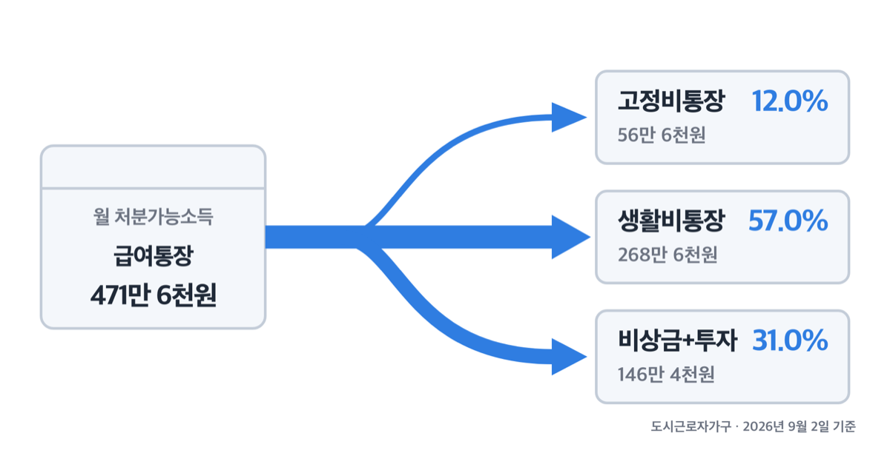
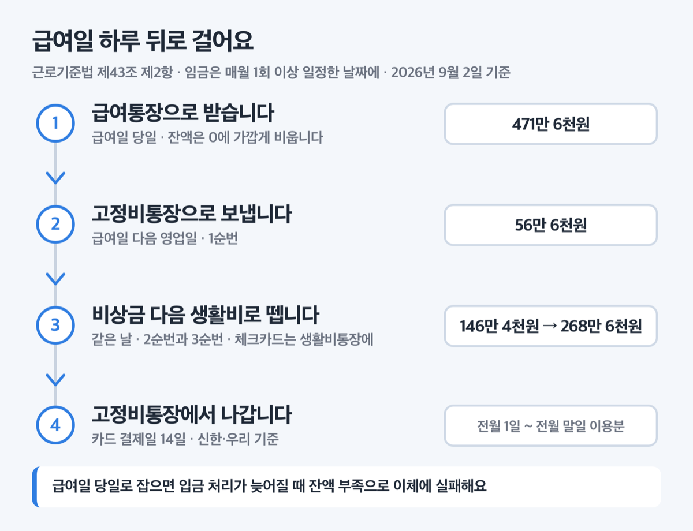
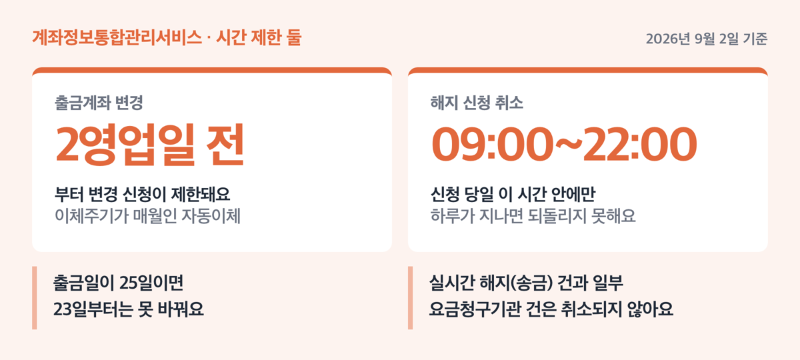

# 통장 쪼개기 4단계, 2026년 직장인 471만원 이렇게 나눕니다

📌 2026년 9월 2일 기준

통장 쪼개기는 넷으로 나누기만 하면 돈이 모인다고들 하는데, 나누는 것만으로는 안 모여요. 나눈 다음에 급여일 하루 뒤로 자동이체를 걸어야 그때부터 남습니다.

**3줄 요약**

- 통장 쪼개기는 급여통장 하나를 급여·고정비·생활비·비상금 넷으로 나누고, 그 사이를 자동이체로 잇는 방식이에요.
- 2025년 9월 1일부터 예금자보호 한도가 5,000만원에서 1억원으로 올랐습니다. 금융회사 한 곳에 맡긴 원금과 이자를 합쳐 1억원까지 보호돼요.
- 먼저 확인할 것은 지금 걸려 있는 자동이체 목록이에요. 금융결제원 계좌정보통합관리서비스(payinfo.or.kr)에서 56개 금융회사 건이 한 번에 조회됩니다.

넷에 각각 얼마씩 넣는지, 이체 날짜를 며칠로 잡는지, 남은 돈을 어디에 두는지 순서로 적었어요.

## 통장 쪼개기, 실제로 나뉘는 건 이 넷이에요

통장 쪼개기의 통장 넷은 급여통장, 고정비통장, 생활비통장, 비상금통장입니다.

왜 하필 넷이냐면, 돈이 빠져나가는 방식이 넷이라서 그래요. 월세와 통신비는 매달 정해진 날 거의 같은 금액이 자동으로 나가고, 식비와 교통비는 쓰는 만큼 달라집니다. 그리고 안 쓰고 남기려는 돈은 애초에 나가지 말아야 하는 돈이고요. 성격이 다른 셋을 한 통장에 두면 잔액만 보고는 이게 남은 돈인지 나갈 돈인지 구분이 안 돼요.

> 😕 통장 하나로도 잘 관리해 왔는데요?

잔액을 매일 들여다볼 수 있으면 하나로도 됩니다. 다만 통장을 나누는 진짜 이유는 관리가 아니라 **선저축**이에요. 남으면 저축하는 게 아니라, 먼저 떼고 남은 것으로 사는 순서로 바꾸는 겁니다. 그 순서를 사람 의지가 아니라 자동이체가 지키게 만드는 것이 4단계의 핵심이에요.

- ① **급여통장** — 월급이 들어오고, 그날 다 비워지는 곳 *(잔액은 0에 가까울수록 좋아요)*
- ② **고정비통장** — 월세·관리비·통신비·카드값 *(이 통장 잔액은 절대 안 씁니다)*
- ③ **생활비통장** — 식비·교통비·쇼핑 *(체크카드를 여기에 연결해요)*
- ④ **비상금통장** — 갑자기 목돈이 필요할 때만 여는 곳

## 얼마씩 나누나 — 2026년 2분기 기준 배분표

국가데이터처가 2026년 8월 27일 낸 2026년 2/4분기 가계동향조사를 보면, 도시근로자가구의 월평균 소득은 610만 4천원이에요. 여기서 도시근로자가구란 특별시·광역시 전체와 도의 동 지역에 사는, 가구주가 임금근로자인 가구를 말합니다.

그런데 610만 4천원이 통장에 찍히는 건 아니에요. 세금·사회보험료·이자 같은 비소비지출 138만 8천원이 먼저 빠집니다. ==실제로 나눌 돈은 471만 6천원이에요.== 이 돈에서 소비지출 325만 2천원이 나가고 146만 4천원이 남습니다. 흑자율로는 31.1%예요.

**통장 넷의 배분 (도시근로자가구 평균, 처분가능소득 471.6만원 = 100% 기준, 월)**

| 통장 | 비율 | 월 금액 |
|---|---|---|
| ① 급여통장 (들어오는 돈) | 100% | 471만 6천원 |
| ② 고정비통장 | 12.0% | 56만 6천원 |
| ③ 생활비통장 | 57.0% | 268만 6천원 |
| ④ 비상금+투자통장 | 31.0% | 146만 4천원 |

혼자 사는 직장인은 숫자가 다릅니다. 1인 도시근로자가구는 가구주 평균 연령이 44.1세이고 월평균 소득이 384만 5천원, 처분가능소득이 291만 9천원이에요.

**통장 넷의 배분 (1인 도시근로자가구, 처분가능소득 291.9만원 = 100% 기준, 월)**

| 통장 | 비율 | 월 금액 |
|---|---|---|
| ① 급여통장 (들어오는 돈) | 100% | 291만 9천원 |
| ② 고정비통장 | 15.6% | 45만 6천원 |
| ③ 생활비통장 | 52.0% | 151만 8천원 |
| ④ 비상금+투자통장 | 32.4% | 94만 5천원 |

두 표에서 비율은 제가 계산한 값이에요. 처분가능소득·소비지출·흑자액은 조사 결과 그대로지만, **어느 항목까지 고정비로 볼지는 조사가 정해 주지 않거든요.** 저는 매달 정해진 날 거의 같은 금액이 나가는 주거·수도·광열과 정보통신 둘만 고정비로 묶었어요. 1인가구 기준으로 주거·수도·광열 33만 8천원에 정보통신 11만 8천원을 더한 45만 6천원입니다.

그래서 대중교통 정기권이나 민간 의료보험료를 고정비로 옮기면 고정비 비율이 올라가고 생활비 비율이 그만큼 내려가요. 비율은 출발점이지 정답이 아닙니다.

## 자동이체 날짜, 언제로 잡나

날짜를 잡을 수 있는 근거는 법에 있어요. 근로기준법 제43조 제2항은 임금을 매월 1회 이상 일정한 날짜를 정해 지급하도록 하고 있습니다. 급여일이 매달 같은 날이라서 그 뒤에 이체일을 붙일 수 있는 거예요.

순서는 이렇습니다.

1. **급여통장에서 고정비통장으로 — 급여일 다음 영업일**
   급여일 당일로 잡으면 입금 처리가 늦어질 때 잔액 부족으로 이체에 실패해요. ==급여일 다음 영업일 하루==만 띄우면 됩니다.
2. **급여통장에서 비상금통장으로 — 같은 날**
   고정비 다음 순번으로 걸어요. 남은 돈을 나중에 옮기는 게 아니라 먼저 떼는 순서라는 것이 요점입니다.
3. **급여통장에서 생활비통장으로 — 같은 날, 마지막 순번**
   앞의 둘을 뺀 나머지가 생활비예요. 이 통장에만 체크카드를 연결합니다.
4. **카드값 출금 계좌를 고정비통장으로 바꿉니다**
   여기서 결제일을 함께 봐야 해요.

카드 안내문에는 '신용공여기간'이라고 적혀 있어요. 무슨 뜻인지 확인해 봤습니다. 카드를 쓴 날부터 그 값을 갚는 날까지, 카드사가 대신 내주고 있는 기간이에요. 결제일마다 이 기간이 달라집니다.

신한카드와 우리카드는 결제일이 14일이면 이용기간이 **전월 1일부터 전월 말일까지**예요. 한 달 쓴 값이 달을 넘기지 않고 딱 끊긴다는 뜻입니다. 9월에 쓴 카드값 전부가 10월 14일에 한 번에 나가요. 그래서 결제일 14일은 고정비통장과 궁합이 맞습니다. 이번 달 쓴 금액을 보고 다음 달 고정비통장에 넣을 돈을 정할 수 있으니까요.

다만 이용기간은 카드사마다 달라요. 쓰는 카드사 앱의 결제일별 이용기간 안내에서 본인 결제일을 확인하세요.

**지금 걸린 자동이체부터 모아 봅니다**

통장을 새로 만들기 전에 지금 어디서 뭐가 빠져나가는지부터 봐야 해요. 금융결제원 계좌정보통합관리서비스(payinfo.or.kr)에서 조회합니다. 어카운트인포·페이인포라고도 불러요.

| 무엇 | 되는 범위 (2026년 9월 2일 기준) |
|---|---|
| 자동이체 조회·해지 | 56개 금융회사 (은행 19 · 서민금융기관 7 · 외국은행 국내지점 5 · 금융투자회사 25) |
| 자동이체 출금계좌 변경 | 18개 은행 (인터넷전문은행 포함) |
| 이용 대상 | 만 19세 이상 내국인 (법인·임의단체·해외체류자·외국인 제외) |

출금계좌를 바꾸면 신청일을 뺀 최대 5영업일 안에 홈페이지나 앱의 처리결과 조회에서 확인할 수 있어요. 새로 등록한 자동이체는 금융회사가 전산에 올린 날의 다음 영업일부터 조회됩니다.

## 어느 통장에 두느냐로 1년에 27만원이 달라져요

비상금통장 이야기입니다. 여기 모은 돈은 당장 안 쓰는 돈이라 어디에 두느냐가 그대로 이자 차이가 돼요.

한국은행이 2026년 8월 26일 낸 7월 가중평균금리를 보면, 2026년 7월말 잔액 기준으로 이렇습니다.

**예금은행 수신금리 (2026년 7월말 잔액 기준, 연 %, 세전)**

| 상품 | 연 금리 (2026년 7월말 잔액 기준, 세전) |
|---|---|
| 요구불예금 | 0.53% |
| 저축예금 | 0.26% |
| 개인MMDA(수시입출식 저축성예금) | 0.96% |
| 정기예금 | 2.94% |

신규취급액 기준으로는 2026년 7월 중 정기예금 1년물이 연 3.48%, 정기적금이 연 3.99%였어요. 전부 세전입니다.

이자에는 세금이 붙어요. 소득세법 제129조가 정한 이자소득 원천징수세율이 14%이고, 지방세법 제103조의13에 따라 그 소득세의 10%가 개인지방소득세로 더 붙습니다. 둘을 더하면 15.4%예요. 흔히 보는 이 숫자는 법 조문에 그대로 적힌 게 아니라 두 세율을 더한 값입니다.

1,000만원을 1년 동안 그대로 두었다고 치고 계산해 봤어요.

**1,000만원 · 1년 · 우대조건 없음 · 중간 입출금 없음 기준**

| 어디에 두나 | 세후 이자 |
|---|---|
| 저축예금 (연 0.26%) | 21,996원 |
| 개인MMDA (연 0.96%) | 81,216원 |
| 정기예금 1년 (연 3.48%) | 294,408원 |

저축예금과 1년 정기예금의 차이가 ==272,412원==입니다.

> 🤭 **솔직히 말하면** — 저는 이 표를 만들어 보고 비상금통장 금리를 그날 확인했어요. 같은 돈인데 통장 이름만 다릅니다.

그렇다고 비상금 전액을 정기예금에 넣으면 안 돼요. 비상금은 급할 때 바로 빼야 하는 돈이라 만기 전에 깨면 약정 이자를 못 받습니다. 그래서 입출금이 자유로우면서 이율이 붙는 곳을 찾게 되는데, 여기서 상품 종류를 갈라 봐야 해요.

**입출금이 되는 단기 상품 셋**

| 상품 | 예금자보호 (한도 1억원 기준) | 이체·결제 |
|---|---|---|
| MMDA — 은행 | 보호 | 가능 |
| MMF(단기금융펀드) — 은행·증권사 | 비보호 | 불가능 |
| CMA(자산관리계좌) — 종금사·증권사 | 종금사 취급분만 보호 | 가능 |

MMDA는 은행이 맡은 돈을 단기금융상품에 굴려 얻은 이익으로 이자를 주는 확정금리 상품이고, 입출금과 이체·결제가 다 됩니다. MMF는 실적배당이라 원금이 보장되지 않고 이체도 안 돼요. CMA는 이체·결제와 ATM 입출금이 되지만 종금사가 취급한 것만 예금자보호 대상입니다.

예금자보호 한도는 2025년 9월 1일부터 1억원이에요. 2001년부터 24년 동안 5,000만원이었다가 올랐습니다. 시행일 전에 가입한 예금도 별도 신청 없이 1억원까지 보호돼요. 예금자보호 1억원은 **같은 금융회사의 모든 계좌를 합산한 금액**이에요. 은행을 나누면 각각 1억원이고요.

은행이 파는 이른바 파킹통장은 대부분 수시입출금식 저축예금이라 보호대상 안에 듭니다. 다만 개별 상품이 어떤 계정으로 만들어졌는지는 상품설명서에 적혀 있으니 가입 화면에서 예금자보호 문구를 확인하세요.

## 여기서 자주 걸려요

공식 안내를 그대로 따라가다 막히는 곳을 모았어요.

1. **출금계좌 변경은 아무 때나 안 됩니다**
   이체주기가 매월인 자동이체는 출금예정일 2영업일 전부터 변경 신청이 제한돼요. 통신비 출금일이 25일이면 23일부터는 못 바꿉니다. 통장을 옮기려면 이체일에서 최소 사흘은 앞당겨 신청하세요.
2. **자동이체 해지는 당일 안에만 취소됩니다**
   해지 신청을 되돌릴 수 있는 시간은 신청 당일 09:00부터 22:00까지예요. 실시간으로 해지되는 자동이체(송금) 건과 일부 요금청구기관 건은 그마저도 취소되지 않습니다.
3. **사파리 브라우저로는 홈페이지 이용이 안 돼요**
   맥이나 아이폰 기본 브라우저로 들어가면 진행이 막힙니다. 다른 브라우저로 여세요.
4. **서비스 이용시간은 화면에 뜬 안내를 따르세요**
   홈페이지 상단 안내 띠와 같은 페이지 FAQ에 적힌 시간이 서로 다릅니다. 접속했을 때 화면 위쪽에 떠 있는 시간이 그날 적용되는 값이에요. 막히면 금융결제원 고객센터 1577-5500(영업일 09:00~17:45)으로 확인하시면 됩니다.
5. **MMDA는 잔액이 적으면 이자가 거의 없을 수 있어요**
   취급 금융회사에 따라 500만원 미만 소액에는 이자율이 낮거나 아예 붙지 않을 수 있습니다. 비상금이 아직 적다면 이 조건부터 보세요.
6. **급여일이 휴일과 겹칠 때를 미리 정해 둡니다**
   입금일이 밀리면 이체가 통째로 실패해요. 급여일이 주말·공휴일일 때 언제 입금되는지 인사팀에 확인한 뒤 이체일을 잡으세요.

## 통장 쪼개기 관련 궁금증 해결

**Q. 통장 넷을 다 다른 은행에 만들어야 하나요?**
A. 꼭 그렇진 않아요. 다만 예금자보호는 같은 금융회사 계좌를 합산해 1억원이라, 한 은행에 1억원을 넘겨 두실 계획이면 은행을 나누는 것이 유리합니다. 자동이체 출금계좌 변경이 지원되는 은행은 18곳이니, 옮길 은행이 그 안에 있는지 payinfo.or.kr에서 먼저 확인하세요.

**Q. 비상금은 얼마까지 모으면 되나요?**
A. 저라면 소비지출 전액이 아니라 고정비 3개월치부터 채웁니다. 1인가구 기준 고정비 45만 6천원의 3개월치면 136만 8천원이에요. 소득이 끊기면 식비나 쇼핑은 줄일 수 있지만 월세와 통신비는 그대로 나가거든요. 소비지출 전액 3개월치는 592만 2천원이라 처음부터 목표로 잡으면 대부분 중간에 그만둡니다.

**Q. 파킹통장 금리는 어디서 비교하나요?**
A. 전국은행연합회 소비자포털의 예금상품금리 비교(portal.kfb.or.kr)에서 19개 은행의 입출금자유예금과 개인MMDA 금리를 볼 수 있어요. 은행 앱 화면의 금리는 우대조건을 다 채웠을 때 값인 경우가 많으니 기본금리를 함께 보세요.

**Q. 이자에서 세금은 언제 떼나요?**
A. 이자를 줄 때 은행이 15.4%를 미리 떼고 나머지를 입금합니다. 따로 신고하실 필요는 없어요. 통장에 찍히는 금액이 이미 세후입니다.

**Q. 자동이체를 전부 옮기는 데 며칠 걸리나요?**
A. 출금계좌 변경 결과는 신청일을 뺀 최대 5영업일 안에 확인할 수 있어요. 새로 등록한 자동이체가 조회 화면에 뜨는 것은 금융회사가 전산에 올린 날의 다음 영업일부터고요. 급여일을 기준으로 잡으면 넉넉히 2주 전에 시작하시는 편이 좋아요.

## 그래서 내 돈은 어떻게 되나

통장을 넷으로 나눈다고 소득이 늘지는 않아요. 바뀌는 것은 순서입니다. 471만 6천원에서 고정비와 저축을 먼저 떼고 남은 268만 6천원으로 한 달을 사는 구조가 되는 것이고, 그게 흑자율 31.1%를 지키는 방법이에요.

저라면 오늘 둘만 합니다. payinfo.or.kr에서 지금 걸린 자동이체를 전부 뽑아 보는 것, 그리고 비상금이 들어 있는 통장의 금리를 확인하는 것. 저축예금 0.26%에 1,000만원이 잠들어 있다면 1년에 27만원을 그냥 두고 있는 셈이니까요.

결론은 하나입니다. 나누는 건 오늘 하고, 채우는 건 급여일부터 자동으로 되게 하세요.

세금이나 개별 상품 가입 판단이 걸린 부분은 해당 금융회사 창구나 세무 전문가에게 확인하시는 것이 정확합니다.

참고: 국가데이터처 「2026년 2/4분기 가계동향조사 결과」 · 한국은행 「2026년 7월 금융기관 가중평균금리」 · 예금보험공사 예금자보호제도 안내 · 금융위원회 예금보호 한도 상향 보도자료 · 금융결제원 계좌정보통합관리서비스 · 금융감독원 「대학생을 위한 실용금융」 · 국가법령정보센터 근로기준법·소득세법·지방세법
