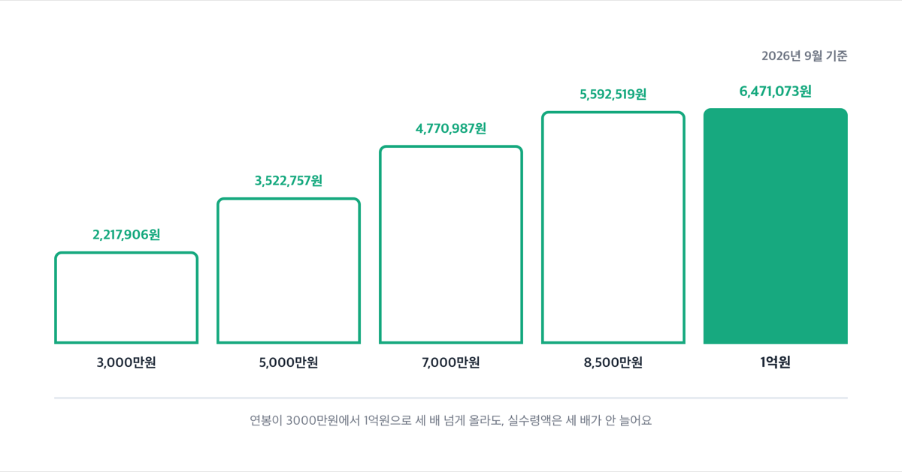

# 연봉 실수령액표, 3000만원부터 1억까지 2026년 기준

📌 2026년 9월 1일 기준

연봉이 오르면 실수령액도 그만큼 늘 거라고 생각하기 쉬운데, 8000만원을 넘으면 국민연금 보험료는 더 안 늘어나요. 그런데 소득세는 계속 오르죠. 그래서 연봉 구간마다 실수령액 차이가 딱 맞아떨어지지 않아요.

**3줄 요약**
- 2026년 4대보험료율과 소득세 간이세액표를 기준으로 연봉 3000만원부터 1억원까지 15개 구간의 월 실수령액을 계산했어요.
- 국민연금 요율이 9%에서 9.5%로, 건강보험료율이 7.19%로 올라 작년보다 공제액이 늘었어요.
- 표에 없는 애매한 금액이면 가까운 구간으로 어림잡고, 부양가족 수에 따라 세금이 달라진다는 점부터 확인하세요.

> [!WARNING]
> 이 표는 매달 같은 급여를 받고 비과세 항목(식대 등)이 없으며 부양가족은 본인 한 명뿐이라고 가정한 값이에요. 상여금을 따로 받거나 부양가족이 있으면 실제 금액은 표와 달라져요.

이 숫자가 어떻게 나왔는지 먼저 살펴보고, 표로 바로 넘어갈게요.

## 실수령액, 정확히 뭘 뺀 금액인가

이 표는 4대보험에 가입된 일반 직장인 기준이에요. 프리랜서나 특수형태근로종사자는 4대보험 적용 방식 자체가 달라서 이 표와 맞지 않아요.

실수령액의 공제 항목은 국민연금·건강보험·장기요양보험·고용보험, 그리고 근로소득세와 지방소득세예요. 이 여섯 가지를 월급에서 뺀 나머지가 통장에 들어와요.

앞의 넷은 4대보험료로 묶어 부르고 회사와 절반씩 나눠 내요. 뒤의 둘은 소득세와 그 10%인 지방소득세로, 국세청 간이세액표에 따라 매달 미리 떼는 금액이에요.

'기준소득월액'이라는 말이 낯설 수 있는데, 국민연금 보험료를 매기는 기준이 되는 월급이라고 보면 돼요. 이 값에는 상한(6,590,000원)과 하한(410,000원)이 있어서, 월급이 아무리 높아도 국민연금 보험료가 무한정 늘지는 않아요.

## 💰 연봉 구간별 월 실수령액표

아래 표는 연봉을 12로 나눈 월급여를 기준으로, 4대보험료와 소득세를 뺀 뒤 실제로 받는 금액이에요.

| 연봉 | 월급여 | 월 실수령액 |
|---|---|---|
| 3,000만원 | 2,500,000원 | 2,217,906원 |
| 3,500만원 | 2,916,667원 | 2,560,434원 |
| 4,000만원 | 3,333,333원 | 2,893,707원 |
| 4,500만원 | 3,750,000원 | 3,213,383원 |
| 5,000만원 | 4,166,667원 | 3,522,757원 |
| 5,500만원 | 4,583,333원 | 3,833,756원 |
| 6,000만원 | 5,000,000원 | 4,145,114원 |
| 6,500만원 | 5,416,667원 | 4,459,614원 |
| 7,000만원 | 5,833,333원 | 4,770,987원 |
| 7,500만원 | 6,250,000원 | 5,026,292원 |
| 8,000만원 | 6,666,667원 | 5,301,335원 |
| 8,500만원 | 7,083,333원 | 5,592,519원 |
| 9,000만원 | 7,500,000원 | 5,883,712원 |
| 9,500만원 | 7,916,667원 | 6,179,890원 |
| 1억원 | 8,333,333원 | 6,471,073원 |

연봉이 3000만원에서 1억원으로 세 배 넘게 늘 때, 월 실수령액은 221만원에서 647만원으로 늘어요. 딱 세 배가 아니에요.

1년치로 보면 이래요.

| 연봉 | 월 실수령액 | 연 실수령액 |
|---|---|---|
| 3,000만원 | 2,217,906원 | 26,614,872원 |
| 3,500만원 | 2,560,434원 | 30,725,208원 |
| 4,000만원 | 2,893,707원 | 34,724,484원 |
| 4,500만원 | 3,213,383원 | 38,560,596원 |
| 5,000만원 | 3,522,757원 | 42,273,084원 |
| 5,500만원 | 3,833,756원 | 46,005,072원 |
| 6,000만원 | 4,145,114원 | 49,741,368원 |
| 6,500만원 | 4,459,614원 | 53,515,368원 |
| 7,000만원 | 4,770,987원 | 57,251,844원 |
| 7,500만원 | 5,026,292원 | 60,315,504원 |
| 8,000만원 | 5,301,335원 | 63,616,020원 |
| 8,500만원 | 5,592,519원 | 67,110,228원 |
| 9,000만원 | 5,883,712원 | 70,604,544원 |
| 9,500만원 | 6,179,890원 | 74,158,680원 |
| 1억원 | 6,471,073원 | 77,652,876원 |

저라면 연봉 협상 때 세전 금액보다 이 연 실수령액을 먼저 봐요. 세전 연봉이 비슷해 보여도 구간마다 공제되는 비율이 다르거든요.

## 4대보험료와 소득세, 항목별로 얼마씩 나가나

국민연금 상한액은 기준소득월액 기준 6,590,000원이에요. 연봉으로 바꾸면 12를 곱해 약 7,908만원이고, 이 지점을 넘는 순간부터 국민연금 보험료가 더 안 늘어나요.

| 연봉 | 국민연금(월) | 소득세(월) |
|---|---|---|
| 3,000만원 | 118,750원 | 35,600원 |
| 3,500만원 | 138,510원 | 66,220원 |
| 4,000만원 | 158,317원 | 105,210원 |
| 4,500만원 | 178,125원 | 156,560원 |
| 5,000만원 | 197,885원 | 217,320원 |
| 5,500만원 | 217,692원 | 276,560원 |
| 6,000만원 | 237,500원 | 335,470원 |
| 6,500만원 | 257,260원 | 391,570원 |
| 7,000만원 | 277,067원 | 450,470원 |
| 7,500만원 | 296,875원 | 560,340원 |
| 8,000만원 | 313,025원 | 655,590원 |
| 8,500만원 | 313,025원 | 750,850원 |
| 9,000만원 | 313,025원 | 846,100원 |
| 9,500만원 | 313,025원 | 936,820원 |
| 1억원 | 313,025원 | 1,032,080원 |

국민연금은 8000만원부터 멈춰요.

반면 소득세는 연봉이 오르는 만큼 계속 늘어요. 그래서 8000만원을 넘긴 뒤로는 연봉이 올라도 실수령액이 늘어나는 폭이 소득세 쪽에서 더 많이 깎여요.

😕 그럼 고연봉일수록 손해라는 뜻일까요.

아니에요. 국민연금은 나중에 돌려받는 돈이라 보험료가 고정되는 게 오히려 그 이상 붓지 않아도 된다는 뜻이고, 소득세는 연말정산에서 각종 공제를 받으면 일부 돌아와요. 이 표는 매달 원천징수되는 금액만 보여줄 뿐, 연말정산 환급까지 반영한 최종 금액은 아니에요.

건강보험료는 소득의 7.19%를 회사와 절반씩 내고, 장기요양보험료는 그 건강보험료에 13.14%를 얹어 추가로 내요. 고령화로 늘어나는 요양 비용을 건강보험료에 얹어 걷는 방식이라 그래요.

| 연봉 | 건강보험(월) | 장기요양(월) |
|---|---|---|
| 3,000만원 | 89,875원 | 11,809원 |
| 3,500만원 | 104,854원 | 13,777원 |
| 4,000만원 | 119,833원 | 15,746원 |
| 4,500만원 | 134,812원 | 17,714원 |
| 5,000만원 | 149,791원 | 19,682원 |
| 5,500만원 | 164,770원 | 21,650원 |
| 6,000만원 | 179,750원 | 23,619원 |
| 6,500만원 | 194,729원 | 25,587원 |
| 7,000만원 | 209,708원 | 27,555원 |
| 7,500만원 | 224,687원 | 29,523원 |
| 8,000만원 | 239,666원 | 31,492원 |
| 8,500만원 | 254,645원 | 33,460원 |
| 9,000만원 | 269,625원 | 35,428원 |
| 9,500만원 | 284,604원 | 37,396원 |
| 1억원 | 299,583원 | 39,365원 |

고용보험은 실업급여 재원을 마련하려고 노사가 함께 내는 보험료예요. 지방소득세는 소득세에 얹어 지자체가 걷는 부가세 성격이라, 소득세의 10%로 정해져 있어요.

| 연봉 | 고용보험(월) | 지방소득세(월) |
|---|---|---|
| 3,000만원 | 22,500원 | 3,560원 |
| 3,500만원 | 26,250원 | 6,622원 |
| 4,000만원 | 29,999원 | 10,521원 |
| 4,500만원 | 33,750원 | 15,656원 |
| 5,000만원 | 37,500원 | 21,732원 |
| 5,500만원 | 41,249원 | 27,656원 |
| 6,000만원 | 45,000원 | 33,547원 |
| 6,500만원 | 48,750원 | 39,157원 |
| 7,000만원 | 52,499원 | 45,047원 |
| 7,500만원 | 56,249원 | 56,034원 |
| 8,000만원 | 60,000원 | 65,559원 |
| 8,500만원 | 63,749원 | 75,085원 |
| 9,000만원 | 67,500원 | 84,610원 |
| 9,500만원 | 71,250원 | 93,682원 |
| 1억원 | 74,999원 | 103,208원 |

4대보험료를 다 더한 값과, 거기에 세금까지 더한 최종 공제 금액을 한 번에 보면 이래요.

| 연봉 | 4대보험 합계(월) | 공제 합계(월) |
|---|---|---|
| 3,000만원 | 242,934원 | 282,094원 |
| 3,500만원 | 283,391원 | 356,233원 |
| 4,000만원 | 323,895원 | 439,626원 |
| 4,500만원 | 364,401원 | 536,617원 |
| 5,000만원 | 404,858원 | 643,910원 |
| 5,500만원 | 445,361원 | 749,577원 |
| 6,000만원 | 485,869원 | 854,886원 |
| 6,500만원 | 526,326원 | 957,053원 |
| 7,000만원 | 566,829원 | 1,062,346원 |
| 7,500만원 | 607,334원 | 1,223,708원 |
| 8,000만원 | 644,183원 | 1,365,332원 |
| 8,500만원 | 664,879원 | 1,490,814원 |
| 9,000만원 | 685,578원 | 1,616,288원 |
| 9,500만원 | 706,275원 | 1,736,777원 |
| 1억원 | 726,972원 | 1,863,260원 |

공제 합계에는 4대보험료와 세금이 이미 다 포함되어 있어요. 월급여에서 이 공제 합계를 빼면 실수령액이 나와요.

## 부양가족 수에 따라 얼마나 달라지나

4대보험료는 부양가족 수와 상관없이 똑같아요. 다만 근로소득세는 '공제대상가족의 수'에 따라 달라지고, 여기엔 본인도 1명으로 들어가요.

물론 이 글의 메인 표는 부양가족이 없는 1인 기준이에요. 그러나 배우자나 자녀가 있는 직장인이 더 많으니, 아래 표로 차이를 확인해 보세요.

| 연봉 | 가족 1명(본인만) | 가족 3명 이상 |
|---|---|---|
| 5,000만원 | 3,522,757원 | 3,619,744원 |
| 1억원 | 6,471,073원 | 6,686,618원 |

연봉 5000만원이면 부양가족이 본인 포함 3명일 때 매달 96,987원을 더 받고, 연봉 1억원이면 215,545원을 더 받아요. 소득이 높을수록 가족 수에 따른 차이도 커져요.

## 내 정확한 금액은 어떻게 확인하나

이 표는 15개 구간으로 나눠 정리했지만, 내 연봉이 딱 떨어지지 않을 수 있어요. 그럴 땐 아래 순서로 직접 확인하세요.

1. 국세청 홈택스에 온라인으로 접속해 '근로소득 간이세액표 조회'를 찾아요. (세금신고 → 원천세 신고 → 근로소득 간이세액표)
2. 월급여액과 공제대상가족의 수를 입력해요. 자녀가 있으면 8세 이상 20세 이하 자녀 수도 따로 넣어요.
3. 조회된 세액을 이 글의 순서대로 빼면 내 진짜 실수령액을 알 수 있어요.
4. 연말정산 환급까지 알고 싶으면 홈택스 '연말정산 미리보기'에서 신용카드 사용액과 공제 항목을 넣어 예상 세액을 조회해요.

## 이 표에서 놓치기 쉬운 것

이 표는 어디까지나 추정치예요.

- 월급여는 연봉을 12로 나눈 값이에요 *(상여금을 별도 달에 몰아 받으면 그 달만 공제액이 확 뜁니다)*
- 비과세 항목(식대 등)이 없다고 가정했어요 *(비과세를 받으면 실제 세금은 표보다 조금 더 적어요)*
- 부양가족은 본인 1명 기준이에요 *(배우자·자녀가 있으면 위 표로 차이를 다시 확인하세요)*
- 4대보험료 원단위는 전부 절사로 통일했어요 *(공단별 실제 처리가 조금씩 달라 항목당 몇십 원 차이가 날 수 있어요)*

저는 상여금도 따로 받는데 이 표가 맞나요.

상여금을 받는 달은 그 달만 월급여가 확 뛰어서 세금도 그만큼 더 붙어요. 다만 1년 전체로 보면 연말정산에서 다시 정산되니, 매달 원천징수액만 궁금하다면 상여금 받는 달의 월급여를 따로 홈택스에 넣어 조회하는 편이 정확해요.

> [!WARNING]
> 국민연금 기준소득월액은 실제로는 매년 7월에 전년도 소득을 기준으로 정해지고, 그 사이 급여가 올라도 안 바뀌는 게 원칙이에요. 이 표는 계산 편의상 '이번 달 월급 = 기준소득월액'으로 가정했으니, 연봉이 오른 지 얼마 안 됐다면 실제 국민연금 공제액이 표보다 적을 수 있어요.

## 연봉 실수령액 관련 궁금증 해결

**Q. 제 연봉이 4700만원처럼 표에 없는 금액이면 어떻게 하나요?**
A. 가장 가까운 구간(4500만원 또는 5000만원)으로 어림잡거나, 홈택스 간이세액표 조회에 정확한 월급여를 넣어 확인하세요.

**Q. 왜 연봉 8000만원부터는 국민연금이 더 안 늘어나나요?**
A. 국민연금 기준소득월액 상한이 6,590,000원이라, 월급이 이보다 많아도 그 이상엔 보험료를 매기지 않아요.

**Q. 부양가족이 있으면 실수령액이 얼마나 늘어나나요?**
A. 4대보험료는 그대로고 소득세만 줄어요. 연봉 1억원 기준으로 부양가족 3명이면 본인만 있을 때보다 매달 215,545원을 더 받아요.

**Q. 상여금을 따로 받으면 이 표랑 다른가요?**
A. 네, 달라요. 이 표는 매달 같은 급여를 받는다고 가정했고, 상여금을 몰아 받는 달은 그 달만 공제액이 커져요.

**Q. 식대 같은 비과세 항목이 있으면요?**
A. 식대 같은 비과세 항목이 있으면 세금 매기는 기준이 줄어서, 실제 손에 쥐는 돈은 이 표보다 조금 더 많아요.

연봉 3000만원부터 1억원까지, 국민연금 상한이 있어 8000만원을 기점으로 4대보험료 증가 폭이 확 줄어요. 반면 소득세는 연봉에 비례해 계속 늘어나죠.

내 연봉이 이 구간 어딘가에 있다면, 표로 대략의 실수령액을 가늠하고 정확한 숫자는 홈택스에서 한 번 더 확인하세요.

참고: 보건복지부 「2026년 건강보험료율 7.19%로 결정」 보도자료 · 보건복지부 「국민연금, 새해 재정은 보다 튼튼하게 노후는 더욱 든든하게…」 보도자료 · 국민연금공단 「2026년도 국민연금 기준소득월액 상·하한액 조정 안내」 · 국가법령정보센터 소득세법 시행령 [별표 2] 근로소득 간이세액표 · 지방세법 제103조의13
