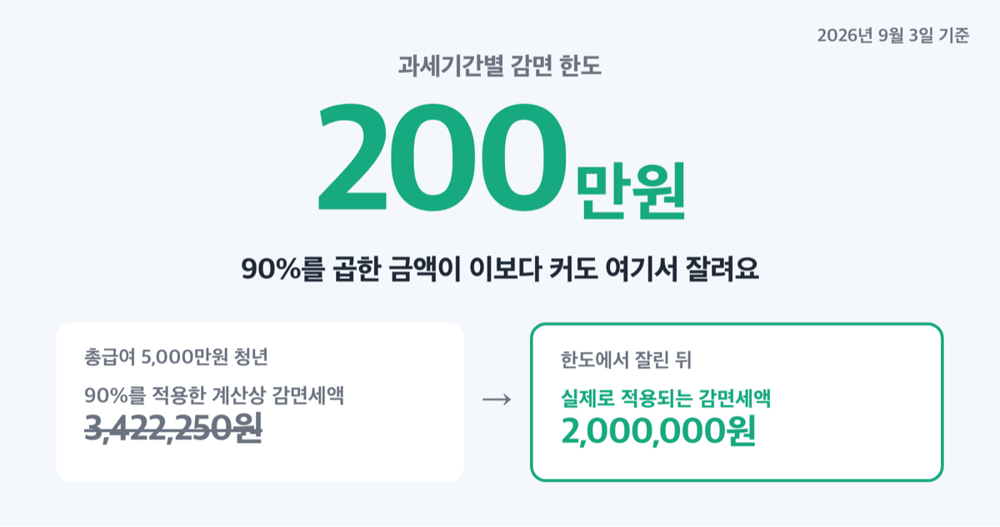
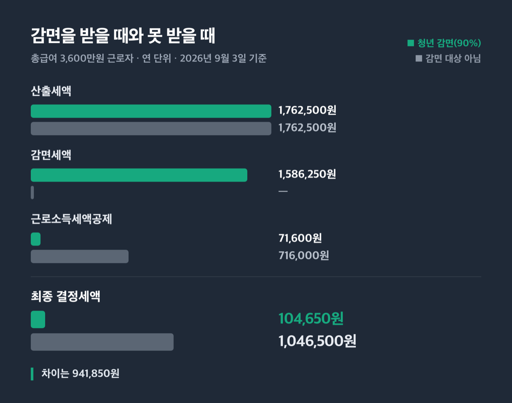
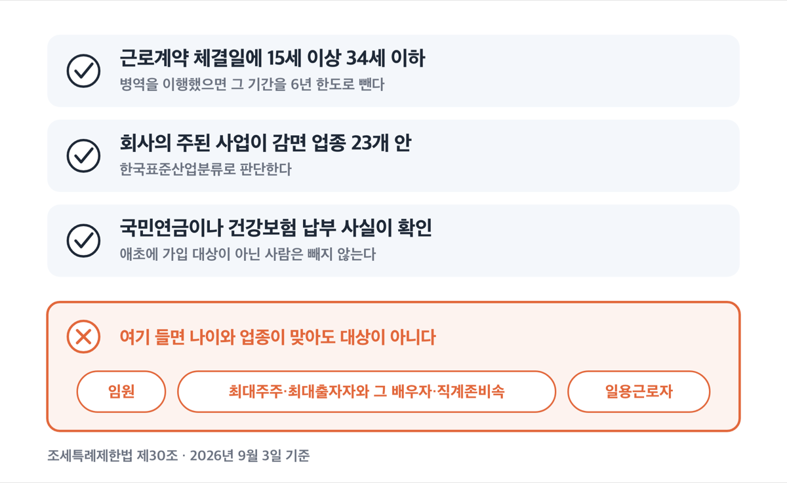
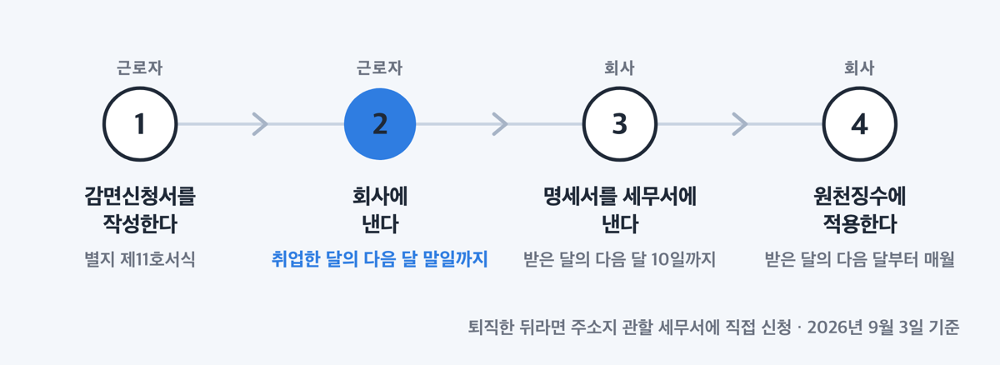
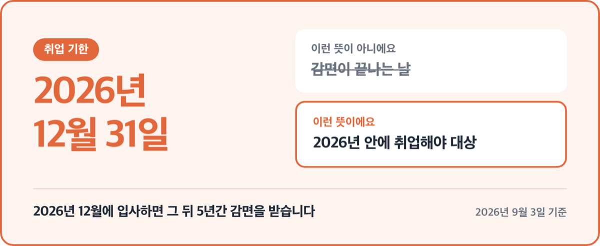

# 중소기업 청년 소득세 감면 90%, 2026년 취업까지만 됩니다

📌 2026년 9월 3일 기준

연 200만원이에요. 감면율은 소득세의 90%인데, 한 과세기간에 200만원까지만 줄어듭니다. 90%라는 숫자만 보면 세금이 0원이 될 것 같지만 그렇게 되지 않아요.

**3줄 요약**

1. 중소기업에 취업한 청년은 근로소득에 붙는 소득세를 5년간 90% 감면받고, 한 과세기간에 200만원까지 줄어듭니다.
2. 2025년 2월 28일 이후 취업자부터 통관업·가상자산 매매 및 중개업·수의업·부동산 임대업 넷이 감면 업종에서 빠졌어요.
3. 취업 기한이 2026년 12월 31일까지라서, 대상 업종인지와 근로계약을 맺은 날의 나이를 먼저 확인해야 합니다.

감면율과 한도, 나이 요건, 회사 조건, 신청 절차, 그리고 감면을 받으면 오히려 다른 공제가 줄어드는 대목까지 순서대로 짚어요.

## 소득세의 90%, 한 해 200만원까지

중소기업 취업자 소득세 감면은 조세특례제한법 제30조에 있는 제도예요. 중소기업에 취업한 청년·60세 이상·장애인·경력단절 근로자의 근로소득세를 정해진 기간 동안 깎아 줍니다.

| 대상 (조세특례제한법 제30조, 2026년 9월 3일 기준) | 감면율과 기간 |
|---|---|
| 청년 | 소득세의 **90%** · 취업일부터 **5년** |
| 60세 이상·장애인·경력단절 근로자 | 소득세의 **70%** · 취업일부터 **3년** |

기간을 세는 법이 조금 특이해요. 취업일부터 5년(또는 3년)이 되는 날이 **속하는 달까지** 발생한 소득이 대상이고, 감면신청서에는 그 달의 말일을 종료일로 적습니다.

그리고 한도가 있습니다. ==과세기간별 200만원==이에요.

급여가 올라갈수록 이 한도에 실제로 걸리기 시작해요. 국세청 안내책자의 계산 사례를 보면, 총급여 5,000만원인 청년의 산출세액은 3,802,500원이고 90%를 적용한 감면세액은 계산상 3,422,250원입니다. 그런데 실제로 적용되는 금액은 **2,000,000원**이에요. 한도에서 잘리는 거죠.

쉽게 말하면 급여가 낮을 때는 감면율 90%가 힘을 쓰고, 급여가 올라가면 한도 200만원이 천장이 됩니다.

국세청 안내책자에 나온 연말정산 비교 사례로 보면 감이 잡혀요. 총급여 3,600만원, 인적공제는 본인과 배우자만 300만원, 국민연금보험료 120만원, 건강보험료 100만원인 경우입니다.

| 구분 (총급여 3,600만원 근로자, 연 단위) | 청년 감면(90%) | 감면 대상 아님 |
|---|---|---|
| 산출세액 | 1,762,500원 | 1,762,500원 |
| 감면세액 | 1,586,250원 | — |
| 근로소득세액공제 | 71,600원 | 716,000원 |
| 최종 결정세액 | 104,650원 | 1,046,500원 |

표의 산출세액에서 감면세액과 근로소득세액공제를 빼면 결정세액이 나와요. 청년은 104,650원, 감면을 못 받으면 1,046,500원입니다. 차이는 **941,850원**이에요.

여기에 개인지방소득세가 붙습니다. 소득세가 줄면 그 감면액의 10%만큼 개인지방소득세도 함께 감면돼요. 두 세금을 합친 차이는 1,036,035원이 됩니다.

긴 표를 봤으니 한 줄로 닫을게요. 총급여 3,600만원 청년이라면 1년에 100만원 정도가 남습니다.

5년을 다 채우면 200만원 × 5과세기간, 단순 계산으로 1,000만원이에요. 다만 취업 시점에 따라 첫해와 마지막 해는 한 해 치를 다 못 채우고, 급여가 낮으면 애초에 200만원에 닿지 않습니다. 이 값은 상한선으로만 보는 게 맞아요.

## 누가 받나 — 청년은 근로계약 체결일에 34세 이하

나이 기준일이 함정입니다. 지금 나이가 아니라 **근로계약 체결일 현재** 나이로 봐요.

| 대상 | 요건 (근로계약 체결일 현재) |
|---|---|
| 청년 | 15세 이상 34세 이하 |
| 60세 이상 | 60세 이상 |
| 장애인 | 장애인복지법 적용 장애인, 국가유공자법상 상이자, 5·18민주화운동부상자, 고엽제후유의증환자로서 장애등급 판정을 받은 사람 |
| 경력단절 근로자 | 같은 기업에서 1년 이상 계속 근로한 뒤 결혼·임신·출산·육아·자녀교육·가족돌봄으로 퇴직하고, 퇴직일부터 2년 이상 15년 미만 지난 사람 |

병역을 이행했으면 그 기간을 나이에서 뺍니다. **6년 한도**로 빼고 34세 이하면 청년으로 봐요. 현역병(상근예비역·의무경찰·의무소방원 포함), 사회복무요원, 현역으로 복무한 장교·준사관·부사관이 대상입니다.

군 복무로 취업이 늦어진 만큼을 나이에서 되돌려 주는 구조라서, 2년 복무했으면 36세에 입사해도 청년으로 계산됩니다.

경력단절 근로자는 조건 하나가 더 붙어요. 1년 이상 계속 근로한 사실이 **근로소득세 원천징수 기록으로 확인되는 경우**로 한정되고, 그 회사의 최대주주·최대출자자나 특수관계인이면 안 됩니다.

병역을 마치고 복직한 경우는 계산이 또 달라요. 병역 이행 후 1년 안에 병역 전에 다니던 그 중소기업에 복직하면 복직일부터 2년까지, 복직일이 최초 취업일부터 5년 안이면 최초 취업일부터 7년까지 감면됩니다.

나이와 업종이 맞아도 아래에 걸리면 대상이 아닙니다.

1. 법인세법 시행령에 따른 **임원**
2. **최대주주·최대출자자와 그 배우자** (개인사업자는 대표자)
3. 위 사람의 직계존비속과 그 배우자, 그리고 국세기본법 시행령상 친족관계인 사람
4. **일용근로자**
5. 국민연금 부담금·기여금이나 건강보험 직장가입자 보험료 납부 사실이 확인되지 않는 사람

5번에는 예외가 있어요. 국민연금법·국민건강보험법 단서에 따라 애초에 가입 대상이 아닌 사람은 제외하지 않습니다. 국세청은 국민연금 가입 예외에 해당해 납부 사실이 없는 외국인 근로자에게도 감면을 적용할 수 있다고 해석했어요.

가족 회사에 취업한 경우가 여기서 자주 걸립니다.

## 회사 조건 — 중소기업이면서 업종 23개에 들어야

내가 청년이어도 회사가 조건을 못 맞추면 감면이 없습니다. 중소기업기본법상 중소기업(비영리기업 포함)이면서, 아래 업종을 **주된 사업**으로 해야 해요.

농업·임업 및 어업, 광업, 제조업, 전기·가스·증기 및 공기조절 공급업, 수도·하수 및 폐기물처리·원료재생업, 건설업, 도매 및 소매업, 운수 및 창고업, 숙박 및 음식점업, 정보통신업, 부동산업, 연구개발업, 광고업, 시장조사 및 여론조사업, 건축기술·엔지니어링 및 기타 과학기술 서비스업, 기타 전문·과학 및 기술 서비스업, 사업시설 관리·사업 지원 및 임대 서비스업, 기술 및 직업훈련학원, 컴퓨터 학원, 사회복지 서비스업, 개인 및 소비용품 수리업, 창작 및 예술 관련 서비스업, 도서관·사적지 및 유사 여가 관련 서비스업, 스포츠 서비스업. 모두 23개예요.

업종 안에서도 빠지는 것이 있습니다.

| 감면 업종 (조세특례제한법 시행령 제27조, 한국표준산업분류 기준) | 그 업종에서 빠지는 세부 업종 |
|---|---|
| 운수 및 창고업 | 관세사법에 따른 통관업 |
| 숙박 및 음식점업 | 주점 및 비알코올 음료점업 |
| 정보통신업 | 비디오물 감상실 운영업, 가상자산 매매 및 중개업 |
| 부동산업 | 부동산 임대업 |
| 기타 전문·과학 및 기술 서비스업 | 수의업 |

이 가운데 **통관업·가상자산 매매 및 중개업·수의업·부동산 임대업**은 2025년 2월 28일 이후 취업자부터 제외됐어요. 그전에 취업해 감면을 받던 사람과 지금 입사하는 사람의 결과가 달라지는 대목입니다.

업종은 회사가 스스로 정하는 게 아니라 통계청장이 고시하는 한국표준산업분류에 따라 판단해요. 그래서 카페처럼 보이는 곳도 사업자등록상 주된 사업이 무엇인지에 따라 결과가 바뀝니다.

국가·지방자치단체·공공기관운영법상 공공기관·지방공기업법상 지방공기업은 업종과 무관하게 대상이 아닙니다.

## 신청은 서류 한 장, 다음 달 말일까지

절차는 근로자가 회사에 내고, 회사가 세무서에 내는 두 단계예요.

1. 근로자가 **「중소기업 취업자 소득세 감면신청서」(조세특례제한법 시행규칙 별지 제11호서식)** 를 작성합니다.
2. 병역복무기간 증명서류, 장애인등록증(수첩·복지카드) 사본, 근로소득 원천징수영수증 가운데 해당하는 것을 첨부해요. 원천징수영수증은 감면을 받던 사람이 다른 중소기업에 취업하거나 재취업한 경우에만 필요하고, 수수료는 없습니다.
3. **취업일이 속하는 달의 다음 달 말일까지** 회사(원천징수의무자)에 제출합니다.
4. 회사는 **신청을 받은 날이 속하는 달의 다음 달 10일까지** 「중소기업 취업자 소득세 감면 대상 명세서」를 원천징수 관할 세무서장에게 냅니다.
5. 회사는 감면신청서를 받은 달의 **다음 달부터** 감면율을 적용해 매월 소득세를 원천징수할 수 있어요.

근로자 기한이 다음 달 말일, 회사 기한이 그다음 달 10일인 이유가 여기 있습니다. 회사가 명세서를 만들 시간을 뒤에 붙여 둔 순서예요. 근로자가 말일에 맞춰 내면 회사가 명세서를 준비할 시간이 그만큼 줄어듭니다.

퇴직한 뒤라면 회사를 거치지 않아도 됩니다. 2019년 1월 1일부터 퇴직한 근로자는 본인 주소지 관할 세무서장에게 직접 신청할 수 있어요.

## 자주 걸리는 함정 넷

> 😕 저는 작년에 취업했는데 신청을 안 했어요. 이제 늦은 건가요?

늦지 않았어요. **신청기한이 지난 뒤에 제출해도 감면을 적용받을 수 있고, 취업일부터 소급해 적용됩니다.** 이미 연말정산이 끝난 해는 경정청구로 돌려받는데, 경정청구는 법정신고기한이 지난 후 5년 이내에 할 수 있어요. 저라면 이번 달에 회사에 감면신청서부터 냅니다. 매달 원천징수부터 줄어드는 게 먼저니까요.

나머지 셋은 순서대로 짚을게요.

**첫째, 감면을 받으면 근로소득세액공제가 줄어듭니다.** 위 계산 표에서 근로소득세액공제가 716,000원에서 71,600원으로 떨어진 게 그것이에요. 감면소득이 있으면 세액공제액에 감면 비율만큼 차감하는 계산식이 걸립니다. 그래서 "소득세 90%가 사라진다"는 말은 과장이에요. 국세청 예시에서도 결정세액이 0원이 아니라 104,650원이었습니다.

> 🤭 **솔직히 말하면** — 이 제도에서 가장 많이 새는 곳이 여기예요. 90%와 200만원만 보고 계산하면 실제 환급액과 어긋납니다.

**둘째, 이직해도 5년이 새로 시작되지 않습니다.** 다른 중소기업으로 옮기거나 재취업해도, 합병·분할·사업양도로 고용이 승계돼도 감면 기간은 **최초 취업일부터** 셉니다. 27세에 첫 중소기업에 입사했다면 32세까지가 전부예요.

**셋째, 요건에 안 맞는데 감면을 받으면 105%로 돌려냅니다.** 세무서장이 회사에 통지하면 회사는 원래 원천징수했어야 할 세액에 미달한 금액 합계의 105%를 그달 원천징수세액에 더해 징수해요. 이미 퇴직했으면 주소지 관할 세무서장이 과소징수액의 105%를 근로자에게 부과합니다. 소득세가 추징되면 함께 감면받은 개인지방소득세도 내야 해요.

> [!WARNING]
> 취업 기한이 **2026년 12월 31일**까지입니다. 이 날짜는 감면이 끝나는 날이 아니라 **2026년 안에 취업해야 대상이 된다**는 뜻이에요. 2026년 12월에 입사하면 그 뒤 5년간 감면을 받습니다.

## 국회 심사 중 — 지방 근무는 최대 10년까지 늘리는 개정안

정부는 2026년 8월 3일 「2026년 세제개편안」을 발표하고, 9월 1일 국무회의에서 11개 세법 개정법률안 정부안을 확정했어요. 9월 3일까지 국회에 제출돼 정기국회에서 심사될 예정입니다. 지금 시행 중인 규정이 아니라 **국회 심사를 거쳐야 법이 되는 개정안**이에요.

담긴 내용은 둘입니다. 적용기한을 2026년 12월 31일에서 **2029년 12월 31일까지 3년 연장**하고, **근로를 제공하는 사업장 소재지**에 따라 감면 기간과 감면율을 나눕니다. 정부가 든 개정 이유는 지역 균형발전과 지방 소재 중소기업의 인력 확보 지원이에요.

| 사업장 소재지 (정부 개정안) | 청년 | 고령자·장애인·경력단절 |
|---|---|---|
| 수도권 | 5년 90% (현행과 같음) | 3년 70% (현행과 같음) |
| 비수도권 광역시 등, 수도권 우대지역 | **6년** 90% | 3년 **75%** |
| 기타 비수도권, 비수도권 광역시 등 우대지역 | **7년** 90% | 3년 **80%** |
| 기타 비수도권 우대지역 | **10년** 90% | 3년 **90%** |

이미 다니는 사람에게도 적용됩니다. 정부 문답자료는 청년의 경우 기존 취업자도 취업일을 기준으로 개정된 감면기간까지 90% 감면을 적용하고, 고령자 등은 2027년 과세기간 분부터 개정된 공제율을 적용한다고 밝혔어요. 정부가 든 사례로는 지역 중소기업에 2025년 3월 취업한 청년의 감면 기간이 2030년 2월에서 **2035년 2월**까지 늘어납니다.

지역 구분은 아직 정해지지 않았습니다. 「비수도권 광역시 등」과 「우대지역」의 세부 구분은 행정안전부 지방우대지수 등을 고려해 대통령령으로 정하고, 정부는 이를 2027년 2월 정기 시행령 개정에 반영한다고 적었어요.

그래서 지금 판단할 것은 하나입니다. **개정안을 기다리지 말고 2026년 안에 취업했다면 현행 기준으로 신청부터 해 두는 편이 맞아요.** 개정안 경과조치가 2026년 과세기간 분에 감면을 적용받은 경우를 전제로 쓰여 있어서, 현행 감면을 받고 있는 상태가 유리하게 이어집니다.

## 중소기업 청년 소득세 감면 관련 궁금증 해결

**Q. 회사가 감면 신청을 안 해 줬는지 어떻게 확인하나요?**
A. 감면은 근로자가 신청서를 내고 회사가 명세서를 제출해야 적용돼요. 회사 급여 담당자에게 감면신청서 접수와 감면 대상 명세서 제출 여부를 확인하세요. 매월 원천징수부터 반영됩니다.

**Q. 아르바이트도 되나요?**
A. 일용근로자는 제외 대상이에요. 국민연금 부담금·기여금이나 건강보험 직장가입자 보험료 납부 사실도 확인돼야 합니다.

**Q. 소득세 감면인데 지방소득세도 줄어드나요?**
A. 줄어듭니다. 소득세법이나 조세특례제한법으로 소득세가 감면되면 그 감면액의 10%에 해당하는 개인지방소득세가 감면돼요. 근거는 지방세특례제한법 제167조의2입니다.

**Q. 감면 기간이 정확히 언제 끝나나요?**
A. 취업일부터 5년(청년)이 되는 날이 속하는 달의 말일까지예요. 감면신청서에도 이 날짜를 적습니다. 이직해도 최초 취업일부터 계산해요.

**Q. 내 회사가 감면 업종인지 애매합니다.**
A. 한국표준산업분류상 주된 사업으로 판단해요. 애매하면 사업자등록증의 업종과 함께 원천징수 관할 세무서에서 확인하세요.

첫 급여를 받기 전에 확인할 것은 결국 셋입니다. 근로계약 체결일 나이, 회사의 주된 업종, 그리고 감면신청서를 냈는지 여부예요. 셋 중 하나만 어긋나도 5년간 최대 1,000만원이 그냥 지나갑니다. 취업일이 속하는 달의 다음 달 말일이 첫 기한이니 입사 서류를 정리하면서 같이 챙기는 게 편해요.

참고: 조세특례제한법 제30조 · 조세특례제한법 시행령 제27조 · 국세청 「중소기업 취업자 소득세 감면제도 안내」 · 재정경제부 「2026년 세제개편안」 · 지방세특례제한법 제167조의2
