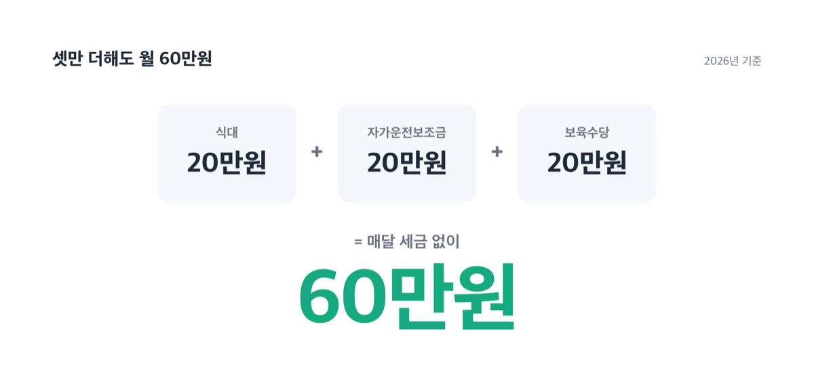
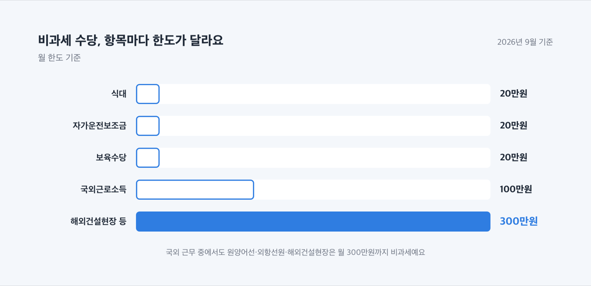
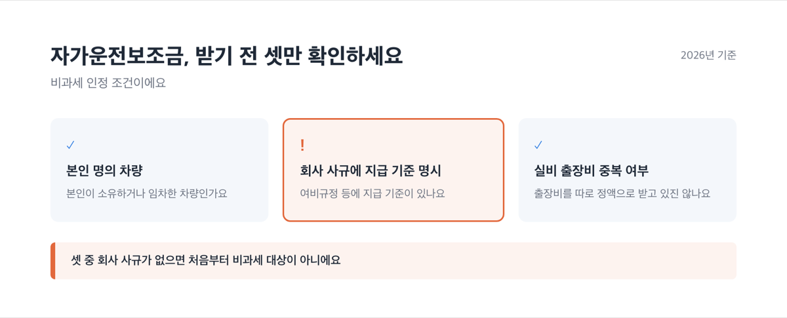
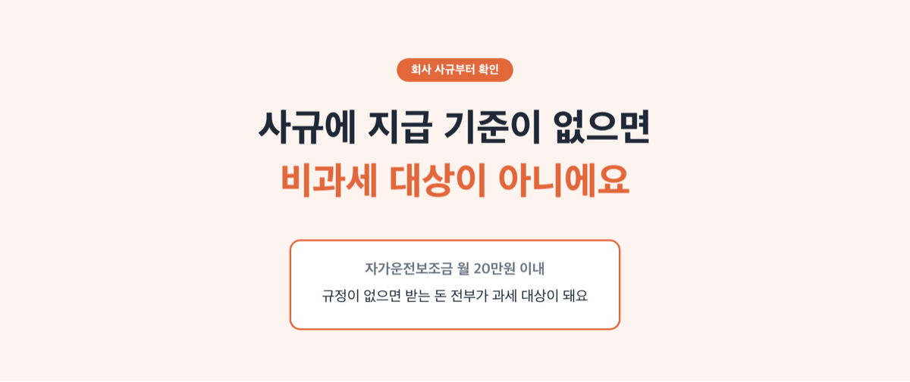

# 직장인 비과세 수당, 2026년 월 60만원까지 세금 없어요

📌 2026년 9월 1일 기준

60만원이에요. 식대 20만원, 자가운전보조금 20만원, 보육수당 20만원만 더해도 세금 한 푼 안 떼고 매달 이만큼이 통장에 들어와요. 그런데 이 셋을 한꺼번에 챙기는 직장인은 생각보다 적어요.

**3줄 요약**
- 회사에서 받는 식대·자가운전보조금·보육수당 같은 수당은 조건만 맞으면 소득세를 안 뗍니다.
- 2026년 1월부터 보육수당은 자녀 1명당 월 20만원으로 늘었고, 7월부터는 생산직 근로자 비과세 자격 기준도 올랐어요.
- 자가운전보조금은 회사 사규에 지급 기준이 있어야만 받을 수 있어서, 급여명세서와 인사 규정부터 확인해야 해요.

이 글에서는 식대부터 생산직 근로수당까지 비과세 항목 여덟 가지의 금액과 조건, 실제로 줄어드는 세금까지 짚어봅니다.

## 비과세 수당이 뭔가

월급에서 소득세를 아예 떼지 않는 항목을 비과세 근로소득이라고 해요. 소득세법 제12조가 이 항목들을 따로 정해 놨어요.

대표적인 항목은 식대, 자가운전보조금, 보육수당, 출산지원금, 연구활동비, 벽지수당, 생산직 근로자 야간근로수당, 국외근로소득, 종업원 할인까지 아홉 가지예요.

왜 이런 항목만 예외로 뒀는지 보면 이유가 각각 달라요. 자가운전보조금·식대는 실제 쓴 돈을 보전해주는 성격이라 그렇고, 보육수당·출산지원금은 저출산 대응 같은 정책 목적이 있어서 그래요. 생산직 야간근로수당·벽지수당은 특정 근로자를 따로 보호하려는 취지예요.

여기서 오해가 자주 생겨요. ==회사 사규에 지급 기준이 있어야 한다==는 조건이 식대에도 똑같이 적용된다고 알고 있는 경우가 많거든요.

자가운전보조금은 시행령 조문 자체가 이 조건을 직접 정해 놨어요.

> 소득세법 시행령 제12조 제3호: "종업원이 소유하거나 본인 명의로 임차한 차량을 종업원이 직접 운전하여 사용자의 업무수행에 이용하고 시내출장 등에 소요된 실제여비를 받는 대신 그 소요경비를 해당 사업체의 규칙 등으로 정하여진 지급기준에 따라 받는 금액"

회사 여비규정 같은 사규에 지급 기준이 없으면 애초에 비과세 대상이 아니라는 뜻이에요.

반대로 식대는 조문(제12조 제3호 러목)에 이런 문구가 없습니다. 실무에서 급여 규정에 지급 기준을 적어두는 회사가 많을 뿐, 법이 요구하는 조건은 아니에요.

## 💰 얼마까지 세금이 안 붙나

항목별 한도와 조건을 표로 정리했어요.

| 항목 | 월 한도 | 핵심 조건 |
|---|---|---|
| 식대 | 20만원 이하 | 현물 식사(사내급식 등)를 따로 안 받을 때만, 중복 수령 불가 |
| 자가운전보조금 | 20만원 이내 | 본인 명의 차량, 회사 사규에 지급 기준 명시 필요, 실비 출장비와 중복 불가 |
| 보육수당(6세 이하 자녀) | 자녀 1명당 20만원 이내 | 2026년 1월부터 자녀 수만큼 인정 |
| 출산지원금 | 한도 없음(전액) | 출생일 이후 2년 이내 최대 2회, 특수관계인 제외 |
| 연구활동비 | 20만원 이내 | 연구소·출연기관·학교 연구직 종사자 |
| 벽지수당 | 20만원 이내 | 벽지 근무자 |
| 생산직 야간·연장·휴일수당 | 연 240만원 이내(일용·광산근로자는 전액) | 월정액급여 260만원 이하, 직전연도 총급여 3,700만원 이하 |
| 국외근로소득 | 월 100만원(일반)·300만원(원양어선·외항선원·해외건설현장) | 국외 또는 북한지역 근무 |
| 종업원 할인 | 시가의 20%와 연 240만원 중 큰 금액 | 재판매 금지기간: 자동차·대형가전 2년, 그 외 1년 |

표에서 보듯 대부분 월 20만원 한도예요. 출산지원금만 한도 자체가 없어요.

> [!WARNING]
> 보육수당은 2026년 1월 1일부터 계산 방식이 바뀌었어요. 전에는 근로자 1인당 월 20만원이었는데, 지금은 자녀 1명당 월 20만원이에요. 자녀가 둘이면 월 40만원까지 비과세예요.

> [!WARNING]
> 생산직 근로자 야간근로수당 비과세 자격도 2026년 7월 1일부터 바뀌었어요. 월정액급여 260만원 이하, 직전 과세기간 총급여 3,700만원 이하인 근로자만 해당돼요.

> 저는 소득이 높은 편인데 그래도 받을 수 있나요?

네, 받을 수 있어요. 비과세 수당은 소득 기준이 없어요. 근로자면 조건만 맞으면 누구나 해당됩니다.

출산지원금은 조금 다릅니다. "사용자와 대통령령으로 정하는 특수관계에 있는 자"는 제외돼요. 쉽게 말하면 지배주주의 친족처럼 회사와 특수한 관계에 있는 근로자는 이 항목에서 빠진다는 뜻이에요.

### 다 챙기면 한 달에 얼마 줄어드나

이건 가정한 상황이에요. 연봉 4,000만원 근로자가 기본급 60만원을 식대 20만원, 자가운전보조금 20만원, 보육수당 20만원(자녀 1명, 6세 이하)으로 재설계했다고 가정하고 계산했어요.

| 보험료 | 요율(근로자 부담) | 월 60만원에 대한 절감액 |
|---|---|---|
| 국민연금 | 4.75% | 28,500원 |
| 건강보험 | 3.595% | 21,570원 |
| 장기요양보험 | 0.9448% | 5,669원 |

국민연금·건강보험·장기요양보험 세 가지만 더해도 매달 5만 5,739원, 1년이면 66만 8,868원이 줄어요.

소득세·지방소득세까지 더하면 절감액은 더 커집니다. 다만 사람마다 과세표준 구간이 달라서, 실제 절감액은 홈택스 연말정산 미리보기에서 본인 구간을 넣어 확인해야 정확해요.

## 어떻게 챙기나

번호 순서대로 확인하면 됩니다.

1. 급여명세서에서 이미 비과세로 처리된 항목이 있는지 먼저 확인해요.
2. 자가운전보조금은 회사 사규(여비규정 등)에 지급 기준이 있는지 인사팀에 물어봐요. 실비 출장비와 동시에 받고 있다면 중복 여부도 함께 확인해요.
3. 6세 이하 자녀가 있으면 보육수당이 2026년 기준(자녀 1명당 20만원)으로 반영됐는지 확인해요.
4. 출산 예정이거나 이미 했다면 출산지원금 지급 시기(출생일 이후 2년 이내, 최대 2회)를 인사팀과 맞춰봐요.
5. 생산직이라면 월정액급여와 전년도 총급여가 260만원·3,700만원 기준을 충족하는지 확인해요.

저라면 자가운전보조금부터 인사팀에 물어봅니다. 조건 자체는 다섯 중에 제일 간단한데, 회사 사규가 없어서 놓치는 경우가 제일 많아 보이거든요.

## ⚠️ 자주 걸리는 함정

- 식대에 자가운전보조금과 같은 사규 요건이 있다고 오해해서 스스로 신청을 미루는 경우가 있어요.
- 자가운전보조금과 실비 출장비를 동시에 정액으로 받으면 비과세 대상에서 제외돼요.
- 보육수당을 예전 기준(근로자 1인당 월 20만원)으로 알고 있어서 자녀별 계산을 놓치는 경우가 있어요.
- 출산지원금은 특수관계인 요건이 있어서 지배주주 친족인 근로자는 지급 대상에서 빠져요.

결국 사규가 없으면 못 받습니다.

## 직장인 비과세 수당 관련 궁금증 해결

**Q. 자가운전보조금은 회사에 규정이 없어도 받을 수 있나요?**
아니요. 시행령 조문 자체가 회사 사규에 지급 기준이 있어야 한다고 정해 놨어요. 규정이 없으면 매달 받는 돈이 전부 과세 대상이에요.

**Q. 자녀가 둘이면 보육수당도 두 배인가요?**
네. 2026년 1월부터는 자녀 1명당 월 20만원이라, 6세 이하 자녀가 둘이면 월 40만원까지 비과세예요.

**Q. 출산지원금과 보육수당을 같이 받을 수 있나요?**
네. 서로 다른 항목이라 요건만 맞으면 같이 받을 수 있어요. 출산지원금은 전액, 보육수당은 자녀 1명당 월 20만원까지예요.

**Q. 생산직 근로자 비과세 자격 기준은 언제부터 바뀌었나요?**
2026년 7월 1일부터예요. 월정액급여 260만원 이하, 직전 과세기간 총급여 3,700만원 이하인 근로자가 대상입니다.

**Q. 소득세는 정확히 얼마나 줄어드나요?**
사람마다 과세표준 구간이 달라서 정확한 금액은 다릅니다. 홈택스 연말정산 미리보기에서 본인 구간을 넣어 확인하는 방법을 추천해요.

## 그래서 오늘 확인할 것

비과세 수당은 소득 기준 없이 조건만 맞으면 누구나 받을 수 있어요. 다만 자가운전보조금처럼 회사 사규가 있어야 하는 항목도 있고, 보육수당처럼 2026년부터 계산 방식이 바뀐 항목도 있어요.

결론은 하나입니다. 급여명세서와 회사 사규부터 확인하세요.

참고: 국가법령정보센터 소득세법 제12조(비과세소득) · 소득세법 시행령 제12조(실비변상적 급여의 범위) · 소득세법 시행령 제17조(생산직근로자가 받는 야간근로수당등의 범위) · 국세청 비과세 근로소득 안내 · 보건복지부 2026년 국민연금·건강보험료율 보도자료 · 국민건강보험공단 EDI 2026년도 보험료율 안내
