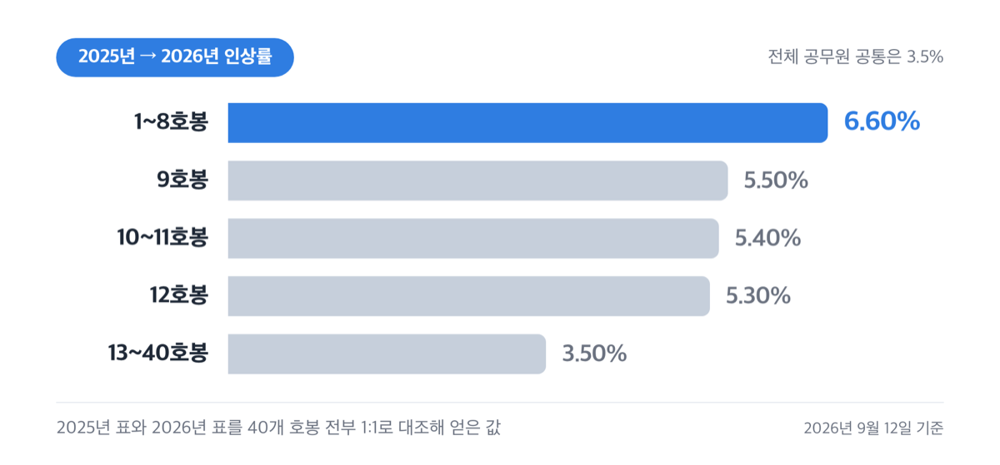
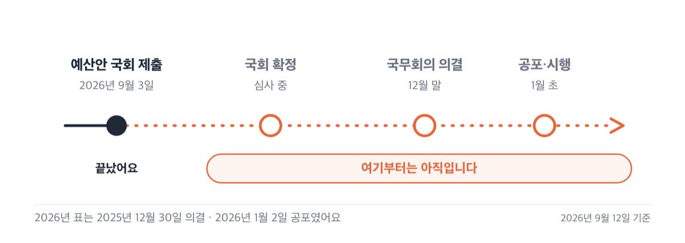
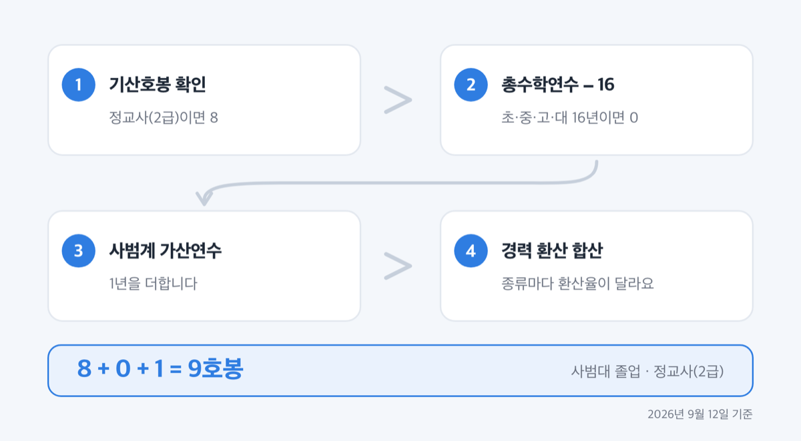
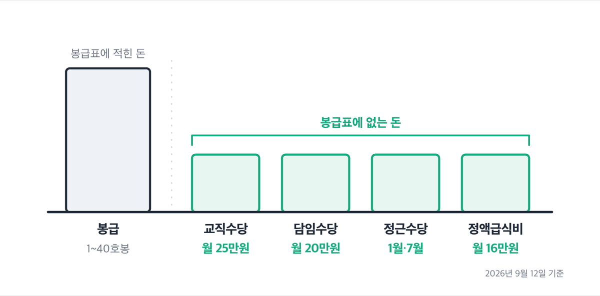

# '9호봉 249만원' 교사 호봉표, 2027년은 아직 안 나왔어요

📌 2026년 9월 12일 기준

2027년 교사 호봉표는 오늘 기준으로 존재하지 않습니다. 봉급표는 대통령령을 고쳐야 확정되는데, 가장 최근 개정은 2026년 1월 2일이었어요. 그래서 지금 쓸 수 있는 교사 호봉표는 2026년 표 하나뿐입니다.

**3줄 요약**

- 교사 호봉표는 「공무원보수규정」이 정하고, 지금 유효한 것은 2026년 1월 2일 공포된 표예요. 1호봉 204만 1,500원에서 40호봉 620만 5,700원까지입니다.
- 2026년에는 전체 공무원 보수가 3.5% 올랐는데, 교원 봉급표에서는 ==1~8호봉만 6.6%== 올랐어요. 9호봉은 5.5%였습니다.
- 2027년 봉급표는 아직 만들어지지 않았어요. 국회가 예산을 확정한 뒤 대통령령을 고쳐야 나옵니다.

봉급표 전액과 호봉 계산 공식, 봉급과 별도로 나오는 수당, 그리고 2027년 표가 언제 어떻게 나오는지를 순서대로 정리해요.

## 💰 2026년 교사 호봉표, 1호봉부터 40호봉까지

교원 봉급표는 유치원·초등학교·중학교·고등학교 교원에게 공통으로 적용되는 한 장짜리 표입니다. 교장도 교감도 수석교사도 이 표를 씁니다. 직급별로 표가 나뉘는 일반직 공무원과 다른 대목이에요.

아래는 2026년 1월 2일 개정된 교원 봉급표 전액입니다. 월 지급액이고 단위는 원이에요.

| 호봉 | 2026년 월 봉급액 (원) |
|---:|---:|
| 1 | 2,041,500 |
| 2 | 2,103,300 |
| 3 | 2,166,000 |
| 4 | 2,228,500 |
| 5 | 2,291,500 |
| 6 | 2,354,400 |
| 7 | 2,416,600 |
| 8 | 2,478,600 |
| 9 | 2,495,600 |
| 10 | 2,516,700 |
| 11 | 2,538,300 |
| 12 | 2,585,900 |
| 13 | 2,657,500 |
| 14 | 2,773,700 |
| 15 | 2,889,700 |
| 16 | 3,006,200 |
| 17 | 3,121,000 |
| 18 | 3,241,500 |
| 19 | 3,361,200 |
| 20 | 3,481,000 |
| 21 | 3,600,700 |
| 22 | 3,733,600 |
| 23 | 3,865,300 |
| 24 | 3,997,500 |
| 25 | 4,129,400 |
| 26 | 4,261,900 |
| 27 | 4,400,100 |
| 28 | 4,538,000 |
| 29 | 4,682,100 |
| 30 | 4,826,800 |
| 31 | 4,971,100 |
| 32 | 5,115,200 |
| 33 | 5,261,600 |
| 34 | 5,407,500 |
| 35 | 5,553,600 |
| 36 | 5,699,100 |
| 37 | 5,825,700 |
| 38 | 5,952,500 |
| 39 | 6,079,500 |
| 40 | 6,205,700 |
| **최고** | **40호봉에서 멈춥니다** |

최고 호봉은 40호봉이에요. 41호봉 이상은 표에 없습니다. 40호봉에 도달하면 봉급은 그대로고, 근속에 따라 붙는 수당만 늘어나요.

표를 보면 8호봉 247만 8,600원에서 9호봉 249만 5,600원으로 넘어가는 구간은 차이가 1만 7천원입니다. 바로 앞 구간이 6만원씩 오르던 것과 비교하면 눈에 띄게 작아요. 승급 폭이 일정하지 않은 표라는 뜻입니다.

인사혁신처가 2025년 12월 30일에 밝힌 2026년 공무원 보수 인상률은 3.5%였어요. 그런데 교원 봉급표를 2025년 표와 호봉별로 맞춰 보면 구간마다 오른 폭이 달랐습니다.

| 호봉 구간 | 2025년 대비 인상률 | 예시 (2025 → 2026) |
|---|---:|---|
| 1~8호봉 | 6.60% | 1호봉 1,915,100 → 2,041,500 |
| 9호봉 | 5.50% | 2,365,500 → 2,495,600 |
| 10~11호봉 | 5.40% | 10호봉 2,387,800 → 2,516,700 |
| 12호봉 | 5.30% | 2,455,700 → 2,585,900 |
| 13~40호봉 | 3.50% | 40호봉 5,995,800 → 6,205,700 |

이 구간 나눔은 2025년 표와 2026년 표를 40개 호봉 전부 1:1로 대조해 계산한 값이에요. 공통 인상률 3.5% 위에 저연차 구간만 추가 인상을 얹어서 이런 계단이 생깁니다. 초임 보수가 낮아 젊은 공무원이 빠져나가는 것을 막으려고 만든 구조예요.

> **솔직히 말하면** — 「저연차 6.6% 인상」이라는 말을 신규 교사 이야기로 옮겨 적은 글이 많은데, 사범대를 나와 9호봉으로 시작한 교사의 실제 인상률은 5.5%예요. 6.6%가 적용된 1~8호봉은 교사가 잘 밟지 않는 구간입니다.

## 2027년 교사 호봉표가 아직 없는 이유

봉급표는 「공무원보수규정」이라는 대통령령의 별표입니다. 이 별표를 고쳐 관보에 공포해야 그 해의 표가 생겨요. 2026년 표는 2025년 12월 30일 국무회의를 통과해 2026년 1월 2일 공포됐고, 그 뒤로 봉급표 개정은 없었습니다.

순서를 보면 왜 지금 나올 수 없는지가 분명해집니다. 정부 예산안이 국회로 넘어가고, 국회가 인건비를 확정하고, 그 금액에 맞춰 인사혁신처가 봉급표 개정안을 만들어 국무회의에 올려요. 2027년도 예산안은 2026년 9월 3일에 국회로 갔습니다. ==지금은 첫 단계가 막 끝난 상태예요.==

| 단계 | 2026년 표는 이랬어요 |
|---|---|
| 정부 예산안 국회 제출 | 전년 9월 초 |
| 국무회의 의결 | 2025년 12월 30일 |
| 공포·시행 | 2026년 1월 2일 |
| 적용 | 2026년 1월 1일 이후 지급하는 보수부터 |

표가 1월에 나와도 **적용은 1월 1일 지급분부터 소급됩니다.** 공포가 늦어져도 손해 보는 구조가 아니에요.

> 😕 검색하면 2027년 교사 호봉표가 벌써 나오던데요?

그 표들은 2026년 표에 인상률을 곱해 만든 계산값입니다. 출발점이 관보가 아니라 보도예요. 그리고 2026년이 보여 줬듯 호봉 구간마다 인상률이 다르게 적용되면, 전체에 같은 비율을 곱한 표는 저연차에서 통째로 틀립니다.

저라면 2027년 표를 미리 계산해 두지 않습니다. 국회 심사에서 인건비가 조정되거나 저연차 추가 인상이 또 붙으면 계산을 처음부터 다시 해야 하거든요. 확정된 표는 인사혁신처 공무원봉급표 페이지(https://www.mpm.go.kr/mpm/info/resultPay/bizSalary/)에 연도별로 올라옵니다.

## 내 호봉은 이렇게 정해집니다

교사의 첫 호봉은 근무 연수가 아니라 **자격증과 학력과 경력**으로 정해집니다. 규정에 적힌 공식은 이거예요.

> **초임호봉 = 기산호봉 + 환산된 경력연수 + 총수학연수 가감**

기산호봉은 교원자격증 종류로 정해지는 출발점입니다.

| 교원자격증 종류 | 기산호봉 (호) |
|---|---:|
| 정교사(1급)·전문상담교사(1급)·사서교사(1급)·보건교사(1급)·영양교사(1급) | 9 |
| 정교사(2급)·전문상담교사(2급)·사서교사(2급)·보건교사(2급)·영양교사(2급) | 8 |
| 준교사·실기교사 | 5 |

교장·원장·교감·원감과 교육장·장학관·장학사에게는 정교사(1급)의 호봉을 적용합니다.

총수학연수 가감은 학교를 몇 년 다녔는지를 호봉으로 바꾸는 부분이에요. 공식은 **(총수학연수 − 16) + 가산연수**입니다. 16년을 기준으로 잡아 놓고 그보다 더 배웠으면 더해 주는 구조예요. 사범대나 교육대처럼 수학연한 2년 이상인 사범계 학교를 나오면 가산연수 1년이 붙습니다.

경력은 종류마다 인정 비율이 다릅니다. 쉽게 말하면 같은 3년이라도 어디서 일했느냐에 따라 호봉으로 바뀌는 양이 달라져요.

- 교육공무원·사립학교 교원 경력 — 100% 이내 *(기간제 경력도 자격증과 학교가 맞으면 여기예요)*
- 국가·지방공무원 경력, 현역 군 복무 — 100%
- 석·박사 학위 취득 시 학칙상 최저 수업연한 — 100% 이내 *(박사는 최대 3년)*
- 학원법에 따라 등록된 학원·교습소 근무 — 50% 이내 *(강사로 등록되지 않았으면 30% 이내)*
- 상법상 회사 근무 경력 — 40% 이내 *(일반 기업에서 넘어오면 여기서 많이 줄어들어요)*

순서대로 계산하면 이렇게 됩니다.

1. 교원자격증으로 기산호봉을 찾습니다. 정교사(2급)이면 8이에요.
2. 총수학연수에서 16을 뺍니다. 초등 6년·중학 3년·고등 3년·대학 4년이면 0이 나와요.
3. 사범계 졸업이면 가산연수 1년을 더합니다.
4. 경력이 있으면 환산율을 적용해 더합니다.

이 순서대로면 사범대를 졸업하고 정교사(2급) 자격으로 바로 임용된 교사는 8 + 0 + 1로 **9호봉**이 됩니다. 비사범계 학과에서 교직을 이수했다면 가산연수가 없어 8호봉이에요.

다만 위 환산율은 전부 「○○% 이내」로 적혀 있어요. 실제 적용률은 임용권자인 시·도교육감이 정하고, 학력과 경력이 겹치면 하나만 넣어요. 개별 확정 호봉은 소속 교육청이나 학교 행정실에서 확인하세요.

임용된 뒤에는 단순해집니다. 호봉 사이 승급에 필요한 기간은 1년이고, 승급은 매달 1일자로 이뤄져요. 자격이나 학력이 바뀌었거나 처음에 못 낸 경력 자료가 있으면 호봉을 다시 정할 수 있는데, **합산을 신청한 달의 다음 달 1일**에 반영됩니다. 신청이 하루 늦으면 한 달이 밀린다는 뜻이에요.

징계를 받으면 승급이 멈춥니다. 집행이 끝난 뒤에도 강등·정직은 18개월, 감봉은 12개월, 견책은 6개월 동안 호봉이 오르지 않아요.

## 봉급 말고 따로 나오는 돈

위 봉급표는 봉급만입니다. 수당은 전부 별도예요. 교원의 실제 월급은 봉급 하나가 아니라 여러 항목이 겹쳐 만들어져요. 호봉표만 보고 월급을 짐작하면 실제와 크게 벌어집니다.

먼저 교원만 받는 교직수당과 가산금입니다. 가산금은 사유가 둘 이상이면 각각 더해서 받을 수 있어요.

| 항목 | 월 지급액 |
|---|---:|
| 교직수당 (교사·수석교사·교감·교장 등) | 250,000원 |
| 담임 가산금 (학급담당교원) | 200,000원 |
| 보직교사 가산금 | 150,000원 |
| 특수교육 담당 교원 가산금 | 120,000원 |
| 원로교사 가산금 (교육경력 30년 이상 + 55세 이상) | 50,000원 |
| 보건교사·영양교사 가산금 | 각 40,000원 |
| 사서교사·전문상담교사 가산금 | 각 30,000원 |
| 통학버스 월 10회 이상 동승 | 30,000원 |

==교직수당 월 25만원==은 교사면 누구나 받습니다. 담임을 맡으면 여기에 20만원이 더 붙어요. 담임과 보직을 함께 맡는 경우가 흔한데, 그러면 두 가산금이 모두 나옵니다.

다음은 모든 공무원에게 공통으로 적용되는 것들이에요.

| 공통 수당 | 지급 시기와 금액 (2026년 기준) |
|---|---|
| 정액급식비 | 월 160,000원 *(2026년에 14만원에서 올랐어요)* |
| 명절휴가비 | 설날·추석에 각각 월 봉급액의 60% |
| 정근수당 | 1월·7월에 지급. 근무연수 2년 미만 10%부터 10년 이상 50%까지 |
| 정근수당 가산금 | 매월 지급. 5년 미만 3만원부터 20년 이상 10만원까지 |
| 가족수당 | 배우자 4만원 / 첫째 자녀 5만원 / 둘째 8만원 / 셋째부터 12만원 |

가족수당에서 자주 걸리는 것이 둘 있어요. 부양가족 수는 4명까지만 세는데 **자녀는 4명을 넘어도 줍니다.** 그리고 부부가 모두 공무원이면 한 사람에게만 나와요.

시간외근무수당은 계산식으로 정해집니다. **기준호봉 봉급액 × 55% ÷ 209 × 150%**가 시간당 단가이고, 교원은 실제 호봉이 아니라 아래 기준호봉으로 계산해요.

| 대상 | 기준호봉 | 시간당 단가 |
|---|---:|---:|
| 19호봉 이하 교사 | 18호봉 | 약 12,795원 |
| 20~29호봉 교사 | 21호봉 | 약 14,213원 |
| 30호봉 이상 교사 | 23호봉 | 약 15,258원 |
| 교감·원감 | 25호봉 | 약 16,300원 |

이 단가는 2026년 봉급표를 계산식에 넣어 얻은 값이라 원 단위 처리에서 실제 지급액과 몇 원 차이가 날 수 있어요. 근무명령 시간은 하루 4시간, 한 달 57시간을 넘길 수 없습니다. 한 달을 꽉 채워도 57시간이 상한이라는 뜻이에요.

교원연구비는 하나 더 짚어야 합니다. 아래 금액은 **국립학교 소속 교원 기준**이에요.

| 구분 | 유·초등 교원 | 중등 교원 |
|---|---:|---:|
| 교사 5년 미만 | 75,000원 | 75,000원 |
| 교사 5년 이상 | 60,000원 | 60,000원 |
| 보직교사·수석교사 | 60,000원 | 60,000원 |
| 교감 | 65,000원 | 60,000원 |
| 교장 | 75,000원 | 60,000원 |

도서벽지 근무 교원은 3,000원이 가산됩니다. 이 기준을 정한 교육부 훈령은 적용 범위를 국립학교 교원으로 한정해 놓았어요. 공립·사립 학교 교원의 교원연구비는 시·도교육청이 따로 정합니다. ==소속 교육청에 확인하세요.==

## 교사 호봉표에서 자주 틀리는 것 셋

**첫째, 호봉과 근무연수는 다른 숫자입니다.** 신규 교사는 9호봉으로 시작하지만 정근수당을 계산할 때의 근무연수는 0년이에요. 학력으로 얹어 준 기산호봉과 가산연수는 호봉에만 들어가고 경력으로는 치지 않기 때문입니다. 9호봉이니 9년치 정근수당이 나오겠거니 계산하면 첫 1월에 당황해요.

**둘째, 「저연차 6.6% 인상」은 교사 이야기가 아닐 수 있습니다.** 그 수치는 일반직 7~9급 초임을 두고 나온 말이에요. 교원 봉급표에서 6.6%가 적용된 구간은 1~8호봉이고, 9호봉으로 출발하는 사범대 출신 신규 교사에게는 5.5%가 적용됐습니다. 한 호봉 차이로 1.1%포인트가 달라졌어요.

**셋째, 기간제교원은 구조가 다릅니다.** 기간제교원의 봉급은 산정한 호봉의 봉급을 주되 고정급으로 합니다. 매년 승급하는 정규 교원과 달라요. 연금을 받던 사람이 기간제교원으로 채용되면 교육부장관이 정하는 금액을 적용합니다. 구체적인 운영 기준은 시·도교육청의 계약제교원 지침에 있으니 채용 공고와 함께 소속 교육청에 확인하세요.

저는 이 셋 중에 첫 번째가 가장 착각하기 쉽다고 봐요. 나머지 둘은 틀려도 남의 이야기로 끝나는데, 호봉을 근무연수로 착각하면 정근수당·명절휴가비·가산금을 한꺼번에 잘못 계산하게 되거든요.

## 교사 호봉표 관련 궁금증 해결

**Q. 2027년 교사 호봉표는 언제 나오나요?**
A. 국회가 예산을 확정한 뒤 국무회의 의결과 관보 공포를 거쳐 나옵니다. 2026년 표는 전년 12월 30일 의결, 1월 2일 공포였어요. 인사혁신처 공무원봉급표 페이지에 연도별로 올라옵니다.

**Q. 호봉표에 적힌 금액이 통장에 들어오나요?**
A. 아니요. 그 금액은 봉급이고, 여기에 교직수당 25만원과 정액급식비 16만원 같은 수당이 더해진 뒤 기여금과 세금이 빠집니다. 실수령액은 봉급표 숫자보다 낮게 잡는 편이 안전해요.

**Q. 교육대학원 석사를 하면 호봉이 오르나요?**
A. 학위 취득 시 학칙상 최저 수업연한을 연구경력으로 100% 이내에서 인정합니다. 다만 학력과 경력이 겹치면 하나만 넣고 인정률도 임용권자가 정해요. 재직 중 취득했다면 호봉 재획정을 신청해야 반영됩니다.

**Q. 40호봉을 넘으면 어떻게 되나요?**
A. 봉급표는 40호봉에서 끝납니다. 그 뒤로 봉급은 그대로예요. 대신 정근수당 가산금은 근무연수 25년 이상에서 월 3만원이 더 붙는 식으로 계속 올라갑니다.

**Q. 사기업에서 일하다 교사가 되면 그 경력이 인정되나요?**
A. 상법상 회사 근무 경력은 40% 이내로 환산됩니다. 5년을 일했어도 호봉으로는 2년어치 이하로 들어간다는 뜻이에요. 정확한 적용률은 소속 교육청이 정합니다.

## 2027년 표가 나오면 확인할 곳

지금 할 수 있는 것은 셋입니다. 2026년 표로 올해 봉급을 확인하는 것, 내 호봉이 제대로 정해졌는지 급여명세서와 맞춰 보는 것, 반영되지 않은 경력이 있으면 지금 신청하는 것이에요.

세 번째가 특히 그렇습니다. 호봉 재획정은 신청한 달의 다음 달 1일에 반영되고 소급되지 않아요. **미룰수록 손해가 쌓이는 구조입니다.**

2027년 표가 공포되면 확인할 곳은 둘이에요. 인사혁신처 공무원봉급표 페이지(https://www.mpm.go.kr/mpm/info/resultPay/bizSalary/)와 국가법령정보센터의 「공무원보수규정」 별표입니다. 두 곳의 값은 같아야 하고, 법령 쪽이 원본이에요.

개별 호봉 확정과 경력 인정률은 소속 시·도교육청과 학교 행정실이 판단합니다. 내 경력이 몇 %로 들어가는지는 그쪽에 직접 물어보세요.

참고: 국가법령정보센터 「공무원보수규정」 · 국가법령정보센터 「공무원 수당 등에 관한 규정」 · 인사혁신처 2026년 공무원봉급표 · 인사혁신처 2026년 공무원 보수 인상 보도자료 · 교육부 훈령 「교원연구비 지급에 관한 규정」
