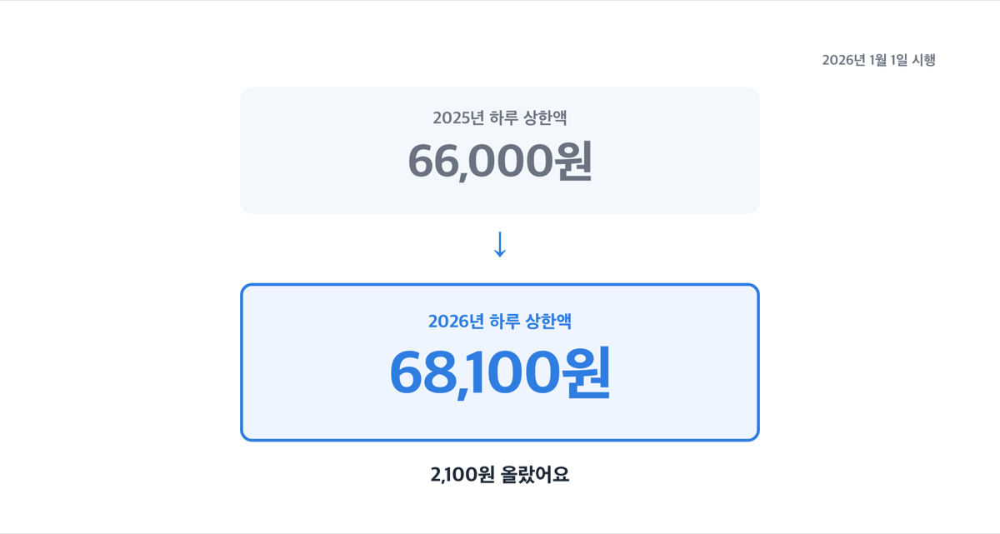
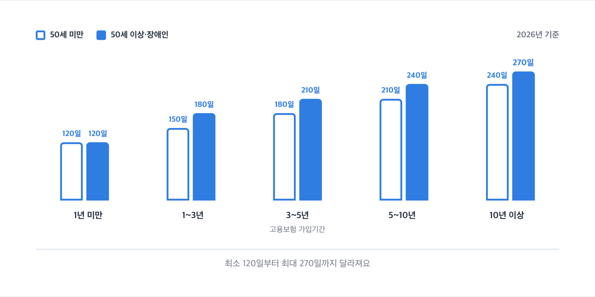
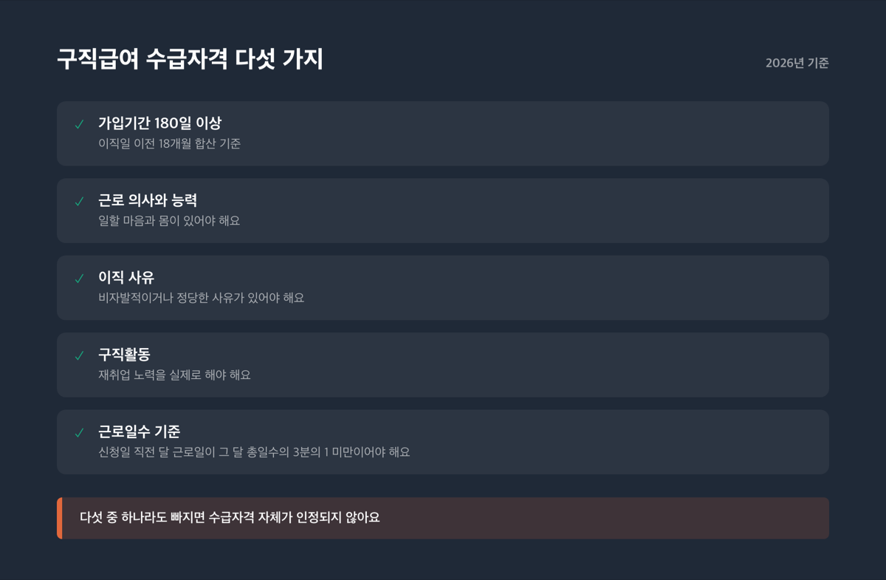
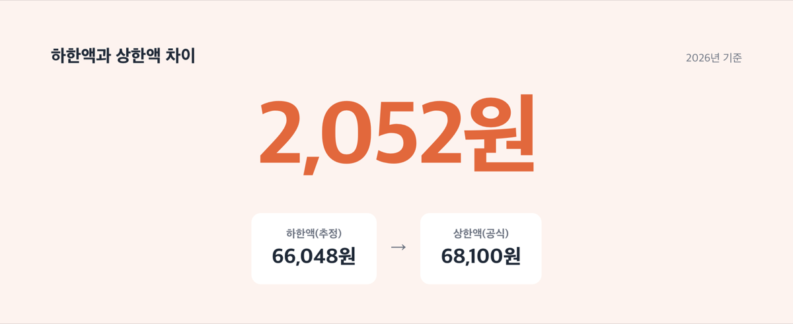

# 실업급여 금액 얼마씩 몇 달 받나, 2026년 상한 68,100원

📌 2026년 9월 1일 기준

2026년 1월부터 구직급여 하루 상한액이 68,100원으로 올랐어요. 최저임금이 오르면서 하한액이 상한액을 앞지를 뻔해 정부가 상한선부터 손을 봤거든요. 그런데 실제로 얼마를 몇 달 받는지는 이 숫자 하나로 안 끝나요.

**3줄 요약**
- 구직급여(실업급여)는 이직 전 평균임금의 60%를 상한·하한 안에서 매일 지급하는 제도예요.
- 2026년 1월 1일부터 하루 상한액이 66,000원에서 68,100원으로 올랐어요.
- 내 하루 지급액이 상한에 걸리는지 하한에 걸리는지부터 확인해야 실제로 받는 총액이 나와요.

하루에 얼마를 받는지, 몇 달을 받는지, 그리고 누가 받을 수 있는지 순서대로 볼게요.

## 구직급여가 정확히 뭔가요

고용보험에 가입한 근로자가 회사를 그만두고 구직 활동을 하는 동안 생활을 지탱하도록 국가가 지급하는 돈이에요. 뉴스에서는 흔히 '실업급여'라고 부르지만, 법에서 정한 정식 이름은 '구직급여'예요.

계산식은 하나예요. **구직급여일액(하루 지급액) = 기초일액 × 60%**, 이 하루 지급액에 소정급여일수(며칠치인지)를 곱하면 총 수급액이 나옵니다.

> 「고용보험법」 제45조·제46조 — 구직급여일액은 기초일액에 100분의 60을 곱한 금액으로 하고, 기초일액은 이직 전 3개월간 평균임금을 기준으로 산정한다.

기초일액은 원칙적으로 이직 전 3개월 평균임금이고, 통상임금이 더 높으면 통상임금을 써요. 왜 60%인가 하면, 구직 활동을 이어갈 정도로만 생활비를 보전해 주고 재취업할 유인은 남겨 두려는 설계로 보여요.

결국 이 60%라는 비율 자체보다, 상한과 하한이 어디에 걸리는지가 실제 지급액을 정합니다.

## 💰 하루 얼마 받나 — 상한 68,100원, 하한은 계산값

결론부터 말하면 하루 최대 68,100원이에요. 이건 정부가 국무회의를 거쳐 2025년 12월 16일에 확정한 숫자입니다.

| 계산 단계 | 2026년 확정 값 (원·시행일) | 근거 |
|---|---|---|
| 기초일액 상한 | 113,500원 | 2025-12-16 국무회의 의결 |
| 구직급여일액 상한(하루 최대) | 68,100원 | 위와 동일 |
| 시행일 | 2026년 1월 1일 | 대통령령 제35934호 |

2025년까지는 상한액이 66,000원이었어요. ==68,100원==으로 오른 건 2,100원 차이입니다.

상한액을 이렇게 올린 데는 이유가 있어요. 최저임금은 매년 자동으로 오르지만, 상한액은 국무회의를 거쳐야 바뀌는 별개 절차거든요. 그래서 2026년 최저임금(시간급 10,320원)이 오르면서 하한액도 자동으로 따라 올랐어요. 그 값이 기존 상한액(66,000원)을 넘어설 뻔했던 거예요. 정부는 이 역전을 막으려고 상한액부터 올렸습니다.

그럼 하한액은 정확히 얼마일까요. 여기서부터는 정부가 완성된 숫자로 직접 발표하지 않았다는 점을 먼저 밝혀야 해요.

> [!WARNING] 하한액 66,048원은 정부가 발표한 완성된 숫자가 아니라, 공식 산식에 2026년 최저임금을 대입해 나온 계산값이에요. 정확한 값은 신청할 때 관할 고용센터에서 확인하는 게 맞아요.

계산 과정은 이래요.

| 계산 단계 | 2026년 최저임금 기준 값 (원) |
|---|---|
| 2026년 최저임금(시간급) | 10,320원 |
| 최저기초일액(1일 8시간 기준) | 82,560원 |
| 하한액(최저기초일액×80%) | 66,048원 |

"1일 8시간"은 통상적인 전일제 근로자를 가정한 예시예요. 실제 소정근로시간은 사람마다 달라서 개인별 하한액도 이 값과 조금씩 달라질 수 있습니다.

> 「고용보험법」 제46조제1항제1호 — 기초일액이 최저기초일액으로 산정된 경우에는 그 기초일액에 100분의 80을 곱한 금액을 구직급여일액으로 한다.

'최저구직급여일액'이라고 부르는 게 바로 이 하한액이에요.

> 그럼 저는 월급이 낮으니까 하한액만 받는 거 아닌가요?

아니에요. 평균임금의 60%가 하한액보다 크면 그 계산값을 그대로 받아요. 다만 아래에서 보듯 상한과 하한 사이 폭이 워낙 좁아서, 계산값을 그대로 받는 사람이 생각보다 적을 뿐이에요.

> 솔직히 말하면 — 하한액(66,048원, 추정)과 상한액(68,100원)의 차이가 ==2,052원==밖에 안 나요. 결국 대부분은 둘 중 하나로 정해집니다.

세 가지 월급으로 직접 계산해 봤어요. 실제로는 이직 전 3개월간 받은 급여 총액을 그 기간 총일수로 나눠 기초일액을 구하지만, 여기서는 이해하기 쉽게 월급을 30일로 나눈 값으로 단순화했어요.

1. 월급 250만원 *(1일 평균임금 약 83,333원, 60%면 50,000원)* → 계산값이 하한액보다 낮아 **하한액 66,048원**을 그대로 받아요.
2. 월급 335만원 *(1일 평균임금 약 111,667원, 60%면 67,000원)* → 상한과 하한 사이라 **계산값 그대로 67,000원**을 받아요.
3. 월급 450만원 *(1일 평균임금 150,000원, 기초일액이 상한 113,500원을 넘어 상한으로 조정)* → **상한액 68,100원**을 받아요.

저라면 신청 전에 관할 고용센터에 먼저 전화를 겁니다. 하한액처럼 계산으로 나온 값은 개인 소정근로시간에 따라 조금씩 달라지거든요.

## 📅 몇 달 받나 — 소정급여일수와 수급기간

금액을 알았으면 이제 며칠치를 받는지가 남았어요. 이걸 '소정급여일수'라고 부르는데, 이직할 때 나이와 고용보험 가입기간으로 정해집니다.

| 가입기간 | 50세 미만 | 50세 이상·장애인 |
|---|---|---|
| 1년 미만 | 120일 | 120일 |
| 1~3년 | 150일 | 180일 |
| 3~5년 | 180일 | 210일 |
| 5~10년 | 210일 | 240일 |
| 10년 이상 | 240일 | 270일 |

같은 가입기간이어도 50세를 넘기면 소정급여일수가 더 길게 잡혀요. 가입 3~5년 구간을 보면 50세 미만은 180일인데 50세 이상은 210일입니다.

소정급여일수는 대기기간이 끝난 다음 날부터 세기 시작해요. 그리고 이 일수를 다 못 채우고 넘어가면 안 되는 기준선이 하나 더 있는데, 바로 수급기간이에요.

수급기간은 이직일 다음 날부터 12개월이에요. 소정급여일수가 아무리 많이 남아 있어도 이 12개월이 지나면 더는 받을 수 없습니다. 다만 임신·출산·육아나 질병·부상으로 취업이 불가능했던 기간은 최대 4년 한도로 미룰 수 있어요.

앞서 계산한 세 가지 하루 지급액에 소정급여일수를 곱하면 총 수급액이 나와요.

- 하한액 66,048원 × 120일 = 약 792만원 *(50세 미만, 가입 1년 미만 가정)*
- 67,000원 × 180일 = 약 1,206만원 *(가입 3~5년 가정)*
- 상한액 68,100원 × 240일 = 약 1,634만원 *(가입 10년 이상 가정)*

이 총액은 소정급여일수를 임의로 가정해 곱한 예시예요. 실제 총액은 본인의 가입기간과 나이에 맞는 소정급여일수를 표에서 찾아 계산해야 정확합니다.

## 누가 받을 수 있나 — 자격 다섯 가지

금액과 기간을 알아도 애초에 받을 자격이 안 되면 소용없죠. 자격 요건은 다섯 가지예요.

1. 가입기간 180일 이상 *(이직일 이전 18개월 동안 합산한 기준이에요)*
2. 근로 의사와 능력 *(일할 마음과 몸이 있는데도 취업하지 못한 상태여야 해요)*
3. 이직 사유 *(비자발적 이직이거나, 자발적이어도 정당한 사유가 있어야 해요)*
4. 구직활동 *(재취업 노력을 실제로 해야 해요)*
5. 근로일수 기준 *(신청일 직전 달의 근로일이 그 달 총일수의 3분의 1 미만이어야 해요)*

물론 자발적으로 그만둬도 인정되는 경우가 있어요. 임금체불, 최저임금 미달, 직장 내 괴롭힘, 통근이 어려워진 경우, 임신·출산·육아 때문인 경우는 정당한 사유로 인정돼요. 그런데 다른 회사로 옮기려고 그만둔 경우는 빠집니다.

> 「고용보험법」 제58조 — 중대한 귀책사유로 해고되거나 자기 사정으로 이직한 경우 중 대통령령으로 정하는 사유에 해당하지 않으면 수급자격이 없는 것으로 본다.

다섯 중 하나라도 걸리면 수급자격 자체가 인정되지 않아요.

## 정확한 내 금액, 어디서 확인하나

여기까지 본 숫자는 전부 공식 산식과 공식 통계를 그대로 대입한 값이에요. 그런데 개인마다 소정근로시간과 이직 전 급여가 달라서, 내 정확한 하루 지급액은 표만 보고는 나오지 않습니다.

정확한 하루 지급액과 소정급여일수는 관할 고용센터나 고용24에서 개인별로 확인하는 게 맞아요. 특히 하한액처럼 계산으로 나온 값은 신청 시점에 다시 확인하는 걸 권합니다.

## 생각보다 좁은 함정 — 정상 구간 2,052원

많은 사람이 "평균임금의 60%를 그대로 받겠지"라고 생각해요. 그런데 그 60%를 그대로 받는 구간은 대략 월급 330만원대에서 340만원대 사이, 아주 좁은 폭에만 걸립니다.

이 폭 아래면 전부 하한액으로, 위면 전부 상한액으로 정해져요. 하한액과 상한액 차이가 ==2,052원==밖에 안 나기 때문이에요.

이 관찰은 확인된 상한액(68,100원)과 계산으로 나온 하한액(66,048원, 추정)을 근거로 직접 뺄셈해 본 결과예요. 정부가 이렇게 문장으로 발표한 적은 없습니다.

## 실업급여 관련 궁금증 해결

**Q. 실업급여랑 구직급여, 이름이 다른데 같은 건가요?**
법에서 정한 정식 이름은 구직급여예요. 실업급여는 구직급여를 포함해 여러 급여를 묶어 부르는 이름이라, 이 글에서 말하는 금액은 전부 구직급여 기준입니다.

**Q. 회사 잘못으로 그만둔 것도 인정되나요?**
네. 임금체불, 최저임금 미달, 직장 내 괴롭힘처럼 정당한 사유면 자발적 이직이어도 인정돼요.

**Q. 소정급여일수를 12개월 안에 다 못 쓰면 어떻게 되나요?**
수급기간(12개월)이 지나면 남은 일수가 있어도 더는 받을 수 없어요. 다만 임신·출산·육아·질병으로 구직 활동을 할 수 없었던 기간은 최대 4년까지 미룰 수 있습니다.

**Q. 50세를 넘기면 더 받을 수 있나요?**
같은 가입기간이라도 50세 이상과 장애인은 소정급여일수가 더 길게 잡혀요. 가입 3~5년 구간이면 50세 미만은 180일, 50세 이상은 210일입니다.

**Q. 하한액 66,048원은 어디서 나온 숫자인가요?**
정부가 완성된 숫자로 발표한 적은 없고, 최저임금 계산식에 2026년 최저임금을 대입해 나온 값이에요. 정확한 값은 신청할 때 관할 고용센터에서 확인하세요.

정리하면, 2026년 구직급여는 하루 66,048원(추정)에서 68,100원(공식) 사이에서 정해져요. 가입기간과 나이에 따라 최소 120일부터 최대 270일까지 받습니다. 숫자 하나만 외우고 끝낼 문제가 아니라, 내 가입기간과 소정근로시간을 넣어 직접 대입해 봐야 실제 금액이 나와요. 정확한 자격 여부와 하루 지급액은 관할 고용센터나 고용24에서 다시 한번 확인하시길 권합니다.

참고: 고용노동부 보도자료 「｢고용보험법｣ 시행령 등 일부개정령안 국무회의 심의·의결」 · 법제처 찾기쉬운 생활법령정보 구직급여 안내 · 고용노동부고시 제2025-47호 2026년 적용 최저임금 고시
