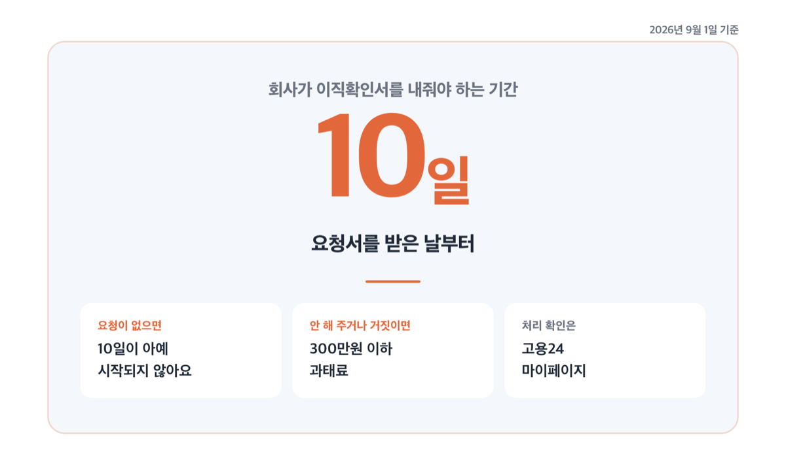
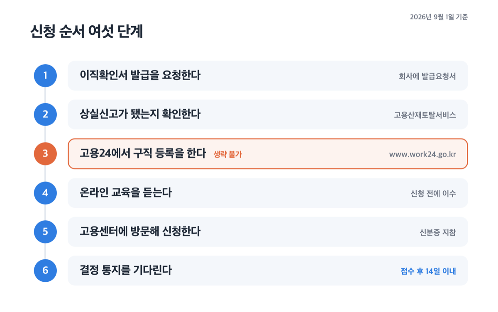
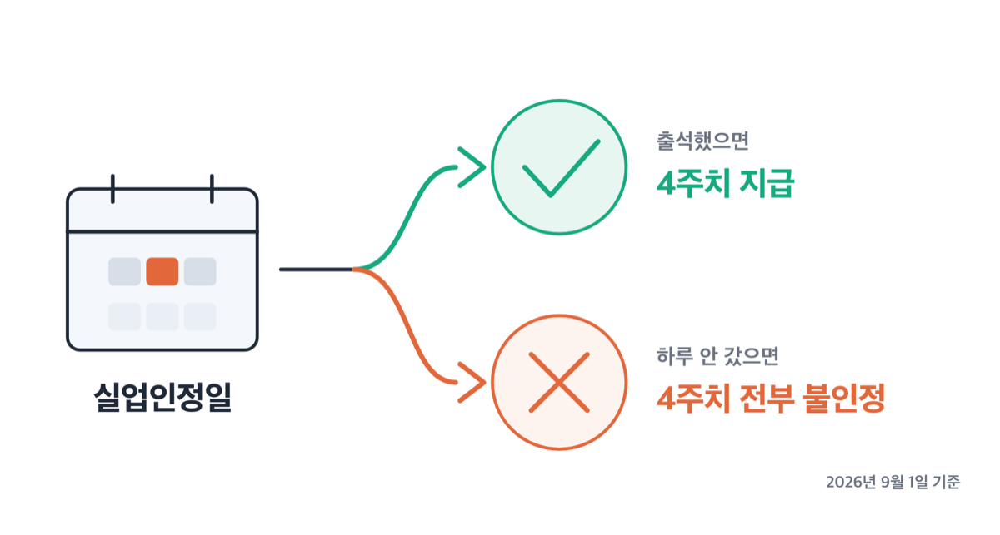

# 실업급여 신청 절차 2026, 이직확인서 10일·첫 인정일 14일

📌 2026년 9월 1일 기준

실업급여는 온라인으로 신청한다고들 하는데, 첫 신청만큼은 고용센터에 직접 가야 해요. 인터넷 제출은 접수를 앞당기는 절차이지 출석을 없애는 절차가 아닙니다.

**3줄 요약**

- 실업급여 신청은 법으로는 '실업의 신고'이고, 그 안에 구직 신청과 수급자격 인정신청이 함께 들어갑니다.
- 2026년 9월 1일부터 「실업인정 및 재취업지원규정」 개정본이 시행돼, 직업지도 참여는 시간과 상관없이 1회로만 인정됩니다.
- 먼저 확인할 것은 이직확인서예요. 요청해야 10일 기한이 시작되고, 처리 여부는 고용24 마이페이지에서 볼 수 있어요.

퇴사 다음 날부터 첫 입금까지 무엇을 언제 하는지, 순서대로 적었습니다.

## 실업급여 신청은 정확히 무엇을 신청하는 건가요

고용보험법이 정한 이름은 '실업의 신고'입니다. 이직한 뒤 지체 없이 고용센터에 출석해 실업을 신고하는 것이고, 이 신고 안에 ==구직 신청과 수급자격 인정신청이 함께== 들어가요. 흔히 말하는 '실업급여 신청'과 '수급자격 인정 신청'은 같은 절차를 다르게 부르는 말이에요.

왜 두 개가 한 묶음인지는 제도의 목적을 보면 풀립니다. 구직급여는 일을 못 구한 상태를 메워 주는 돈이라, 일을 찾고 있다는 사실이 전제예요. 그래서 구직 등록이 없으면 신청 자체가 성립하지 않아요.

고용센터가 결정하는 것은 두 가지입니다. 고용보험에 든 기간이 충분한지, 그리고 퇴사 사유가 비자발적인지.

이 두 가지를 판단하는 근거 서류가 바로 이직확인서예요.

## 📄 이직확인서와 처리 기한, 요청해야 10일이 시작됩니다

이직확인서는 퇴사 전 회사가 발급하는 서류로, 고용보험 가입기간·퇴직 사유·평균임금·1일 소정근로시간이 담깁니다. 고용센터는 이 서류로 피보험 단위기간과 이직 사유, 평균임금을 확인해요.

여기서 자주 어긋나는 대목이 하나 있어요. **이직확인서는 회사가 알아서 내는 서류가 아닙니다.** 근로자가 발급을 요청해야 회사의 의무가 생기고, 그때부터 기한이 돌아가요.

| 이직확인서 발급 요청 (근로자 → 회사) | 기준·기한 (요청일부터 계산) |
|---|---|
| 요청 방법 | 「이직확인서 발급요청서」(별지 제75호의3서식)를 회사에 제출 |
| 서식 받는 곳 | 고용24 '신청양식' |
| 요청 경로 | 인터넷·방문·팩스·우편 모두 가능 |
| 회사의 발급 기한 | 요청서를 받은 날부터 **10일 이내** |
| 안 해 주거나 거짓으로 쓰면 | 300만원 이하 과태료 |
| 처리 확인 | 고용24 마이페이지 → 민원처리 알림 |

*(회사가 이미 고용센터에 이직확인서를 냈거나, 일용직이라 근로내용 확인신고서를 냈다면 발급한 것으로 봐요)*

> **회사가 이직확인서를 안 써 준다는데요?**

그래도 신청은 됩니다. 요청하고 10일이 지나도 못 받았다면, 이직확인서 없이 수급자격 인정 신청을 할 수 있어요. 그다음은 고용센터장이 회사에 직접 제출을 요청하고, 요청받은 회사는 다시 10일 안에 내야 합니다. 내지 않거나 거짓으로 내면 이때도 300만원 이하 과태료예요.

저라면 퇴사가 확정된 날 발급요청서부터 냅니다. 10일은 회사가 늦장을 부려도 되는 기간이 아니라, 근로자가 기다려야 하는 최대 기간이거든요. 늦게 요청할수록 첫 입금도 그만큼 밀려요.

한 가지 더 있어요. 이직확인서와 '피보험자격 상실신고'는 창구가 다릅니다. 상실신고는 회사가 **근로복지공단**에 내고, 기한은 사유가 생긴 달의 다음 달 15일까지예요. 다만 근로자가 그전에 신고해 달라고 요구하면 회사는 지체 없이 처리해야 합니다. 확인은 근로복지공단 고용산재토탈서비스에서 해요.

기한이 여러 개인데 서로 다른 기관에서 돌아가서 헷갈려요. 한 번에 봅시다.

| 실업급여 신청 절차 | 누가 → 어디 | 기한 (기산일부터, 일·개월) |
|---|---|---|
| 피보험자격 상실신고 | 회사 → 근로복지공단 | 다음 달 15일까지 |
| 이직확인서 발급 | 회사 → 근로자 | 요청받은 날부터 10일 |
| 수급자격 인정 여부 결정·통지 | 고용센터 → 신청인 | 접수 후 14일 이내 |
| 대기기간 | — | 실업 신고일부터 7일간 미지급 |
| 1차 실업인정일 | 고용센터 지정 | 실업신고일부터 14일이 되는 날 |
| 수급기간 | — | 이직일 다음 날부터 12개월 |
| 결과에 이의 있을 때 | 신청인 → 고용복지센터 | 통지받은 날부터 90일 |

*(수급자격 결정 14일은 고용노동부 안내 기준이에요. 법에는 "결정하고 알려야 한다"까지만 있습니다)*

이 표에서 가장 조심해서 봐야 할 항목은 마지막에서 세 번째예요. **수급기간 12개월이 지나면 소정급여일수가 남아 있어도 못 받습니다.** 지급일수가 120~270일이니, 늦게 신청할수록 뒤가 잘려 나가요.

대기기간 7일도 기준을 잘못 잡기 쉬워요. 법이 정한 시작점은 수급자격이 인정된 날이 아니라 ==실업을 신고한 날==입니다. 최종 이직 당시 건설일용근로자였다면 이 7일 없이 신고일부터 지급 대상이 돼요.

## 신청 순서 여섯 단계

순서를 바꾸면 헛걸음이 됩니다. 특히 3번을 건너뛰고 센터에 가는 경우가 많아요.

1. **이직확인서 발급을 요청합니다.** 회사에 발급요청서를 내고, 고용24 마이페이지에서 처리 여부를 확인해요.
2. **상실신고가 됐는지 봅니다.** 근로복지공단 고용산재토탈서비스에서 확인해요.
3. **구직 등록을 합니다.** 고용24(www.work24.go.kr)에서 구직신청을 해요. 직업안정법에 따른 절차라 생략할 수 없어요.
4. **온라인 교육을 듣습니다.** 수급자격 신청 전에 실업급여 제도 교육을 반드시 이수해야 해요. 고용24에서 듣고, 못 들었으면 센터에서 현장 교육을 받을 수 있습니다.
5. **고용센터에 방문해 신청합니다.** 신분증을 들고 가서 수급자격 인정신청서와 재취업활동계획서를 내요. 개별 상담을 받고 일정을 안내받은 뒤 돌아옵니다.
6. **결과를 기다립니다.** 접수 후 14일 이내에 인정 여부가 통지되고, 수급자격증은 최초 실업인정일에 받아요.

어느 센터로 갈지는 거주지 관할이 원칙이에요. 다만 취업을 희망하는 지역, 퇴사한 회사 관할, 집보다 교통이 편한 인근 지역 센터에도 낼 수 있습니다. 내 관할 센터는 고용24 마이페이지에서 확인해요.

'수급자격 신청서 인터넷 제출' 서비스도 있어요. 세 가지를 모두 만족하는 상용근로자가 대상입니다. 상실신고서와 이직확인서가 모두 처리됐고, 피보험단위기간 180일 이상에 비자발적 이직(상실코드 22·23·31·32)이며, 이직일 기준 만 65세 미만인 경우예요. 이걸 쓰면 접수가 빨라지지만, 그 뒤에 센터에 출석하는 것은 그대로 남아요.

교육 이수 뒤 방문 시점은 센터가 안내하는 일정을 따르세요. 관할 센터마다 운영이 달라요.

## 실업인정일, 1차와 4차는 출석입니다

수급자격이 인정됐다고 돈이 자동으로 들어오지는 않아요. 지정된 실업인정일마다 그동안 무엇을 했는지 신고해야 그 기간의 실업이 인정되고, 인정된 날에 대해서만 지급됩니다.

법은 1주에서 4주 사이에서 센터장이 날을 지정하도록 했어요. 실제 운영 주기는 예규에 이렇게 적혀 있습니다.

| 회차 | 언제 | 방식 |
|---|---|---|
| 1차 | 실업신고일부터 14일이 되는 날 | 출석 |
| 2·3차 | 직전 인정일 다음 날부터 28일이 되는 날 | 온라인 |
| 4차 | 직전 인정일 다음 날부터 28일이 되는 날 | 출석 |
| 5차 이후 | 직전 인정일 다음 날부터 7~28일 사이 지정일 | 온라인 |

*(수급자가 몰리거나 집중 지원이 필요하면 4주 범위에서 탄력적으로 운영될 수 있어요)*

==1차와 4차를 뺀 회차는 방문 없이 온라인으로 신청==합니다. 창구는 고용보험 홈페이지의 실업인정 인터넷 신청 메뉴, 또는 고용보험 모바일 앱이에요. 본인인증은 공동인증서·금융인증서·PASS인증·디지털원패스 중 하나로 합니다.

여기서 가장 많이 놓치는 것이 시간이에요. 온라인 전송은 **실업인정일 당일 00시부터 17시 사이에만 됩니다.** 마감이 아니라 창구가 열려 있는 유일한 시간대예요.

인정을 받으면 담당자 확인을 거쳐 보통 다음 날 지정 계좌로 입금돼요. 1차 때 며칠분이 들어오는지는 원문에 숫자로 적혀 있지 않은데, 예규가 정한 14일에서 대기기간 7일을 빼는 방식으로 계산하면 8일분이 됩니다. 공휴일로 인정일이 앞뒤로 옮겨지면 이 일수는 달라져요.

## ⚠️ 여기서 자주 걸립니다

절차를 다 지켜도 돈이 안 나오는 경우가 있어요. 대부분 아래 네 가지예요.

**첫째, 출석일에 안 가면 그 기간 전부가 날아갑니다.** 지정된 날에 출석하지 않으면 법령에 정한 예외가 없는 한 해당 실업인정대상기간 전체를 인정하지 않아요. 하루 늦은 게 아니라 4주치가 통째로 사라지는 구조예요.

물론 사정이 생기면 인정일을 옮길 수 있어요. 예규가 정한 사유가 11가지인데, 취업, 면접·채용시험 응시, 국가시험 응시, 훈련기관 수강, 친족 병간호와 장례, 본인 결혼과 신혼여행, 친족 결혼식, 자녀 입학식·졸업식, 공민권 행사 같은 것들이에요. 「실업인정일 변경 신청서」(별지 제79호서식)에 사유를 적어 내면 되고, 센터가 증명자료를 요구할 수 있어요.

**둘째, 온라인 전송을 놓치면 구제는 한 번뿐이에요.** PC 고장이나 인증서 문제 같은 개인 사정이면 실업인정일부터 14일 이내에 센터에 출석해 변경 신청을 할 수 있는데, 이건 1회 한정입니다. 특별한 사유 없이 두 번째부터는 인정되지 않아요. 전산장애였다면 늦어도 다음 날까지 입증자료를 들고 방문해야 전날 전송한 것으로 처리됩니다.

**셋째, 재취업활동으로 안 쳐 주는 것들이 있어요.** 같은 회사에만 반복 지원하거나, 전화·인터넷으로 구인처를 알아보기만 하거나, 구인 중이 아닌 회사 명함만 내는 것은 인정되지 않아요. 구직 신청한 내용과 동떨어진 공고에 지원하는 것도 마찬가지예요. 어학 학원 수강도 구직활동과 거리가 멀어 인정하지 않습니다. 취업특강은 3회, 직업심리검사와 심리안정프로그램은 각 1회까지만 인정돼요.

허위 구직활동은 1회 적발이면 그 기간 부지급, 2회부터는 남은 수급기간 전체가 지급정지입니다. 부정수급이면 받은 돈을 반환하고 구직급여액의 2배 이하가 추가 징수되며, 회사와 짜고 했다면 5배 이하예요. 벌칙은 3년 이하 징역 또는 3천만원 이하 벌금, 공모한 경우 5년 이하 징역 또는 5천만원 이하 벌금입니다.

**넷째, 일한 사실은 금액과 무관하게 신고해야 해요.** 하루를 일했든, 일하고 임금을 못 받았든 신고 대상입니다. 월 60시간 이상 취업, 아르바이트로 실업급여일액 이상 소득, 사업자등록, 보험모집인·학습지교사 같은 활동이 여기 들어가요. 취업하면 취업한 날부터 2개월 이내에 신고하고, 취업 전날까지의 구직급여를 받습니다.

한 가지 더 짚자면, 실업인정을 대신 신청해 주는 것은 편의가 아니라 부정수급이에요. 본인이 직접 해야 합니다.

## 2026년 9월 1일부터 바뀐 것

오늘 자로 「실업인정 및 재취업지원규정」 개정본이 시행됐어요. 새 의무가 생긴 개정은 아니고, 이미 시행규칙과 지침이 바꿔 놓은 내용을 예규 문장에 맞춘 정리 개정입니다. 바뀐 것은 셋이에요.

1. 고용센터의 직업지도 프로그램에 참여했을 때 **8시간 이상이면 2회로 쳐 주던 규정이 없어졌어요.** 이제 참여 시간과 관계없이 1회입니다.
2. 일용근로자의 하루 근로를 최대 2주간의 구직활동으로 보던 단서가 사라지고, 해당일 1회의 구직활동으로 인정해요.
3. 이미 2022년에 폐지된 워크넷 이메일 입사 지원 횟수 제한 조문을 삭제했어요.

실질적으로 체감되는 것은 1번입니다. 긴 프로그램 하나로 두 번을 채우려던 계산은 이제 통하지 않아요.

재취업활동 횟수 자체는 수급자 유형에 따라 다릅니다. 2022년 7월부터 적용된 기준으로는 일반수급자가 1~4차 4주 1회, 5차부터 4주 2회이고, 5년간 3회 이상 받은 반복수급자와 소정급여일수 210일 이상인 장기수급자는 더 촘촘하게 적용돼요. 만 60세 이상과 장애인은 전 기간 4주 1회이고 자원봉사 같은 활동도 넓게 인정됩니다.

다만 내 차수에 몇 번이 필요한지는 담당자가 실업인정을 할 때마다 지정해 안내하고 수급자격증에 적어 줍니다. 그 안내를 기준으로 삼으세요.

## 실업급여 신청 절차 관련 궁금증 해결

**Q. 실업급여를 온라인으로만 신청할 수는 없나요?**
A. 없습니다. 수급자격 인정 신청은 신분증을 들고 고용센터에 방문하는 것이 원칙이에요. 재난 등으로 출석이 어렵다고 센터장이 인정하는 경우에만 고용정보시스템으로 신고할 수 있어요.

**Q. 이직확인서를 못 받았는데 신청 기한이 지나가면요?**
A. 이직확인서 없이 먼저 신청하세요. 시행규칙이 그렇게 하도록 열어 뒀고, 이후 센터가 회사에 직접 제출을 요청합니다. 저라면 10일을 다 기다리기보다 수급기간 12개월을 지키는 쪽을 택하겠어요.

**Q. 실업인정일이 공휴일이면 어떻게 되나요?**
A. 공휴일 전날이나 다음 날로 변경돼 지정됩니다. 날짜가 옮겨지면 그 기간에 인정받는 일수도 달라져요.

**Q. 인터넷으로 실업인정을 할 수 없는 경우도 있나요?**
A. 셋이 있어요. 산업재해 요양을 신청했거나 요양 중 휴업급여를 받는 경우, 전산장애 등으로 당일 17시까지 신청하지 못한 경우, 급여를 받을 계좌를 다른 계좌로 바꾸는 경우예요. 이때는 센터에 방문해야 합니다.

**Q. 결과가 납득이 안 되면요?**
A. 수급자격 신청 결과나 실업인정 결과에 이의가 있으면 결정서·통지서를 받은 날부터 90일 안에 심사청구를 할 수 있어요. 심사청구서는 고용복지센터에 냅니다.

퇴사 직후에 해야 할 일을 하나만 고르라면 이직확인서 발급요청서예요. 요청이 없으면 10일이 시작되지 않고, 그만큼 첫 입금이 뒤로 밀립니다. 그다음은 달력에 실업신고일과 그로부터 14일 뒤를 적어 두는 거예요. 1차 실업인정일은 출석이라, 그날 하루가 4주치를 좌우해요.

개인 사정에 따라 수급 요건 판단이 달라질 수 있으니, 내 상실코드와 피보험단위기간은 관할 고용센터나 고용노동부 상담(국번 없이 1350)에서 확인하세요.

참고: 고용보험법·시행령·시행규칙 · 고용노동부 「실업인정 및 재취업지원규정」(예규 제249호) · 고용24 실업급여 신청절차 안내 · 고용보험 구직급여 지급절차 · 정부24 구직급여 서비스 안내
