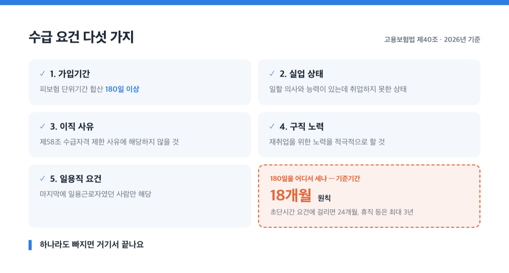
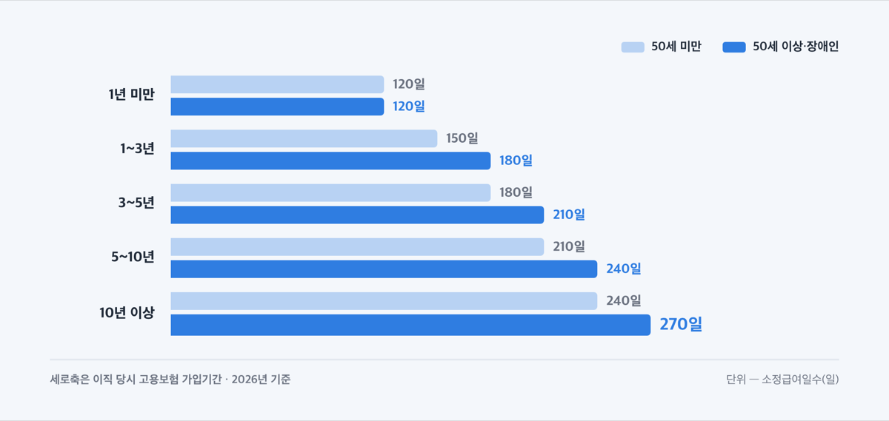
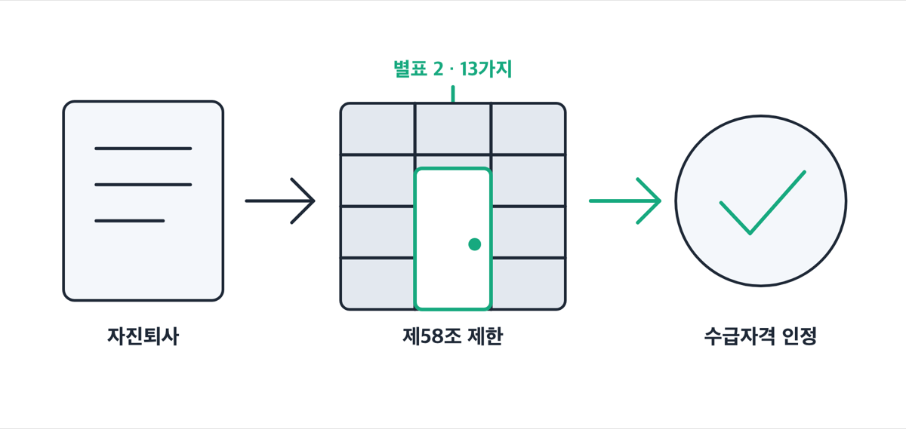
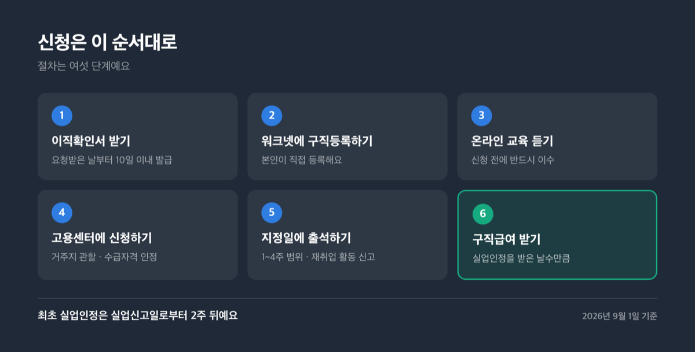
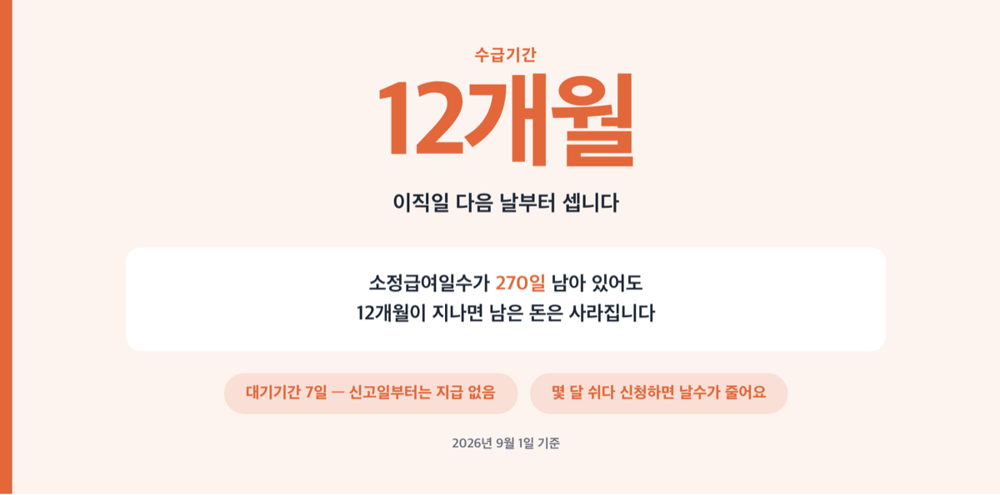

# 실업급여 수급 조건 5가지, 2026년 자진퇴사 예외 13가지

📌 2026년 9월 1일 기준

하루 68,100원. 2026년 실업급여가 하루에 줄 수 있는 최대 금액이에요. 그런데 이 금액을 받으려면 그 앞에 놓인 조건 다섯 개를 전부 통과해야 합니다.

**3줄 요약**

- 실업급여(구직급여)는 고용보험에 든 사람이 일을 그만두고 재취업을 준비하는 동안 받는 돈이에요.
- 2026년 1월 1일부터 하루 상한이 66,000원에서 68,100원으로 올랐고, 그 전에 그만둔 사람은 종전 66,000원을 적용합니다.
- 자진퇴사여도 고용보험법 시행규칙 별표 2의 13가지 사유에 들면 수급자격이 제한되지 않아요.

조건 다섯 가지, 금액과 일수, 자진퇴사가 인정되는 13가지 사유, 신청 순서, 자주 걸리는 것을 차례로 짚습니다.

## 실업급여 수급 조건, 다섯 개를 다 채워야 나옵니다

고용보험법 제40조가 정한 구직급여 수급 요건은 가입기간, 실업 상태, 이직 사유, 구직 노력, 그리고 일용근로자에게만 붙는 별도 요건입니다. 하나라도 빠지면 거기서 끝나요.

| 요건 | 내용 |
|---|---|
| 1. 가입기간 | 기준기간 동안 피보험 단위기간 합산 **180일 이상** |
| 2. 실업 상태 | 일할 의사와 능력이 있는데 취업하지 못한 상태 *(영리 목적 사업 운영도 「취업」에 들어가요)* |
| 3. 이직 사유 | 법 제58조의 수급자격 제한 사유에 해당하지 않을 것 |
| 4. 구직 노력 | 재취업을 위한 노력을 적극적으로 할 것 |
| 5. 일용직 요건 | 마지막에 일용근로자였던 사람만 해당 *(신청일 직전 달 초일부터 신청일까지 근로일수가 총일수의 1/3 미만 등)* |

기준기간은 원칙적으로 ==이직일 이전 18개월==이에요. 다만 질병·부상, 사업장 휴업, 임신·출산·육아휴직 같은 사유로 30일 이상 계속 보수를 받지 못했다면 그 일수만큼 늘려 최대 3년까지 봅니다. 이직 당시 1주 소정근로시간이 15시간 미만이면서 근로일수도 2일 이하였고 이직 전 24개월 중 90일 이상을 그렇게 일했다면 기준기간이 24개월이에요.

> 😕 6개월 넘게 다녔는데 180일이 안 된다고요?

그럴 수 있어요. 여기서 세는 180일은 달력 날짜가 아니라 **보수 지급의 기초가 된 날**만 더한 값이거든요. 실제 일한 날에 주휴 같은 유급휴일과 휴업수당을 받은 날이 더해지고, 무급으로 처리된 휴일은 빠집니다. 주 5일제에서 주휴 하루가 유급이면 주당 6일이 쌓이니 180일은 30주, 약 7개월이에요. 관공서 공휴일을 무급으로 두는 회사라면 그만큼 더 걸립니다.

앞서 구직급여를 받은 적이 있다면 그와 관련된 자격 상실일 이전 기간은 빼고 셉니다.

애초에 고용보험이 적용되지 않는 사람도 있어요. 1개월 소정근로시간 60시간 미만 또는 1주 15시간 미만이면 적용 제외인데, 같은 사업장에서 3개월 이상 계속 일했거나 일용근로자면 다시 적용 대상이 됩니다. 65세 이후에 새로 고용된 사람에게는 실업급여가 적용되지 않아요. 다만 65세 전부터 자격을 유지한 채 계속 고용됐다면 받습니다.

조건을 채웠다면 다음 질문은 하나입니다. 얼마를 며칠 받느냐죠.

## 💰 얼마를 며칠 받나 — 하루 68,100원과 66,048원 사이

구직급여일액은 기초일액, 그러니까 이직 전 평균임금의 60%예요. 여기에 위아래로 뚜껑이 씌워집니다.

| 항목 (2026년 기준) | 금액 |
|---|---|
| 하루 상한액 | **68,100원** *(2026.1.1 시행, 종전 66,000원)* |
| 기초일액 상한 | 113,500원 *(종전 110,000원)* |
| 하루 하한액 (법정 산식으로 계산한 값) | 66,048원 |
| 2026년 최저임금 시급 | 10,320원 *(적용기간 2026.1.1~12.31)* |

하한액은 시행령에 금액으로 적혀 있지 않고 산식으로 정해져 있어요. 최저기초일액에 80%를 곱하는 구조라, ==2026년 최저임금 10,320원 × 8시간 × 80%== 로 계산하면 하루 66,048원입니다.

상한 68,100원과 하한 66,048원의 차이는 하루 2,052원입니다. 30일로 환산하면 상한을 꽉 채워도 2,043,000원, 하한이어도 1,981,440원이에요. 월급이 두 배 차이 나던 두 사람이 실업급여에서는 6만원 남짓 차이로 만납니다.

**상한에 걸리는 지점은 1일 평균임금 113,500원**이에요. 월로 환산하면 약 345만원이고, 그 위로는 아무리 많이 받았어도 잘립니다.

2026년 1월 1일 전에 그만둔 사람은 종전 상한 66,000원을 적용합니다. 시행일 기준이 이직일이라 12월 말 퇴사와 1월 초 퇴사가 다르게 계산돼요.

받는 날수는 나이와 고용보험 가입기간으로 정해집니다.

| 가입기간 (이직 당시) | 50세 미만 | 50세 이상·장애인 |
|---|---|---|
| 1년 미만 | 120일 | 120일 |
| 1년 이상 3년 미만 | 150일 | 180일 |
| 3년 이상 5년 미만 | 180일 | 210일 |
| 5년 이상 10년 미만 | 210일 | 240일 |
| 10년 이상 | 240일 | **270일** |

장애인고용촉진 및 직업재활법상 장애인은 50세 이상 근로자와 같게 보아 이 표를 적용해요. 가입기간은 이직 당시 사업에서 고용된 기간인데, 종전 사업에서 자격을 잃은 날부터 3년 안에 새 사업에서 자격을 얻었다면 앞 기간을 합칩니다. 그 종전 이직으로 구직급여를 받았다면 그 기간은 빼요.

## 자진퇴사도 받는 예외 13가지 — 별표 2가 문을 엽니다

법 제58조는 두 가지를 막아요. 하나는 중대한 귀책사유로 해고된 경우, 다른 하나는 자기 사정으로 그만둔 경우입니다. 그런데 두 번째 갈래의 마지막 항목이 "고용노동부령이 정하는 정당한 사유에 해당하지 않는 사유"로 그만둔 경우라고 적혀 있어요.

뒤집으면 이렇게 됩니다. **고용노동부령이 정한 정당한 사유에 들면 자진퇴사여도 수급자격이 제한되지 않습니다.** 그 목록이 시행규칙 별표 2이고, 지금 13개예요.

| 별표 2 호수 | 정당한 이직 사유 (고용보험법 시행규칙 별표 2, 총 13가지) |
|---|---|
| 1 | 이직일 전 1년 안에 2개월 이상 — 근로조건 저하, 임금체불, 최저임금 미달, 연장근로 제한 위반, 휴업으로 평균임금 70% 미만 수령 |
| 2 | 종교·성별·신체장애·노조활동 등을 이유로 한 불합리한 차별대우 |
| 3 | 본인 의사에 반하는 성희롱·성폭력, 그 밖의 성적 괴롭힘 |
| 3의2 | 근로기준법 제76조의2에 따른 직장 내 괴롭힘 |
| 4 | 도산·폐업이 확실하거나 대량 감원이 예정된 경우 |
| 5 | 양도·인수·합병, 사업 폐지, 조직 축소, 신기술 도입, **경영 악화나 인사 적체** 등으로 퇴직을 권고받거나 희망퇴직에 응한 경우 |
| 6 | 사업장 이전·전근·가족과 동거하려는 이사 등으로 통근이 곤란해진 경우 *(왕복 3시간 이상이 기준이에요)* |
| 7 | 부모나 동거 친족을 30일 이상 간호해야 하는데 휴가·휴직이 안 되는 경우 |
| 8 | 중대재해가 난 사업장에서 시정명령 뒤에도 고쳐지지 않아 같은 위험에 노출된 경우 |
| 9 | 체력 부족·질병·부상 등으로 업무 수행이 곤란하고 전환배치·휴직이 안 되는 경우 *(의사 소견서와 사업주 의견으로 확인해요)* |
| 10 | 임신·출산·육아(8세 이하 또는 초등 2학년 이하)·의무복무로 일을 이어가기 어려운데 사업주가 휴가·휴직을 허용하지 않은 경우 |
| 11 | 법령 개정으로 회사 사업이 위법해지거나 금지된 재화·용역을 다루게 된 경우 |
| 12 | **정년 도래 또는 계약기간 만료** |
| 13 | 그 여건이면 통상의 다른 근로자도 그만두었을 것이라고 객관적으로 인정되는 경우 |

원리는 「스스로 냈느냐」가 아니라 「계속 다닐 수 있었느냐」예요. 고용보험 안내도 자발적 이직자여도 그만두지 않으려는 노력을 다했는데 사업주 쪽 사정으로 더 일하기 곤란해졌다면 이직의 불가피성을 인정한다고 적고 있어요. 반대로 중대한 귀책사유가 있으면 서류가 권고사직으로 되어 있어도 인정하지 않습니다.

### 계약만료와 재계약 거부는 갈래가 나뉩니다

12호가 가장 흔하게 쓰이는데, 같은 계약만료여도 판정이 달라져요. 고용노동부 고객상담센터가 2025년 2월 11일 밝힌 기준은 이렇습니다.

| 계약만료 상황 | 수급자격 판정 (고용노동부 고객상담센터 2025.2.11 기준) |
|---|---|
| 계약이 끝났는데 사업주가 재계약 의사를 밝히지 않은 경우 | 원칙적으로 인정 |
| 근로조건을 두고 의견이 달라 재계약이 성립하지 않은 경우 | 인정 |
| 조건에 이견이 없는데 쉬면서 급여를 받으려 한 정황이 뚜렷한 경우 | 제외 |
| 사업장이 정규직 전환 등 재계약을 제안했는데 근로자가 거부한 경우 | 제한 |

여기에 하나가 더 붙어요. **5인 이상 사업장에서 계속 근로기간이 2년을 넘으면 기간제법에 따라 기간의 정함이 없는 근로자가 됩니다.** 그러면 「계약기간 만료」라는 사유 자체가 성립하지 않아요. 사업 완료 기간이 정해진 일, 결원 대체, 학업·직업훈련, 만 55세 이상 고령자, 전문지식 활용 등은 예외입니다.

저는 여기가 실무에서 가장 많이 어긋나는 대목이라고 봐요. 2년 넘게 계약을 갱신해 온 사람이 「이번엔 계약만료니까 당연히 되겠지」 하고 나왔다가 제한 판정을 받는 구조거든요.

## 신청은 이 순서대로, 대기 7일이 있습니다

절차는 여섯 단계예요. 순서를 바꾸면 신청 자체가 막힙니다.

1. 퇴사하고 회사가 고용보험 상실 신고와 이직확인서를 처리하게 합니다. 근로자가 발급을 요청하면 **사업주는 요청받은 날부터 10일 이내에 발급해야 합니다.**
2. 워크넷에 본인이 직접 구직등록을 합니다.
3. 수급자격 신청자 온라인 교육을 듣습니다. 신청 전에 반드시 이수해야 해요.
4. 거주지 관할 고용센터에 수급자격 인정을 신청합니다.
5. 인정되면 1~4주 범위에서 고용센터가 지정한 날에 출석해 재취업 활동을 신고합니다. 최초 실업인정은 실업신고일로부터 2주 뒤예요.
6. 실업인정을 받은 날수만큼 구직급여가 나옵니다.

실업 신고일부터 **7일은 대기기간이라 지급하지 않습니다.** 마지막에 건설일용근로자였다면 신고일부터 바로 지급해요. 수급자격이 인정되지 않으면 90일 이내에 심사·재심사를 청구할 수 있어요.

사유별로 어떤 증빙을 내야 하는지는 관할 고용센터에서 확인하세요. 임금체불이면 급여 이체 내역, 통근 곤란이면 이사 후 주소와 경로처럼 사유마다 필요한 자료가 달라요.

## 자주 걸리는 것 넷

> [!WARNING]
> 수급기간은 이직일 다음 날부터 12개월입니다. 소정급여일수가 270일 남아 있어도 12개월이 지나면 남은 돈은 사라집니다.

첫째가 방금 그 12개월이에요. 퇴사하고 몇 달 쉬다 신청하면 받을 날수가 통째로 줄어듭니다. 임신·출산·육아 등으로 취업할 수 없어 신고한 경우에만 그 기간을 더해 최대 4년까지 늘려요.

둘째는 앞선 수급 이력입니다. 예전에 구직급여를 받았다면 그와 관련된 자격 상실일 이전 기간은 180일 계산에서도, 소정급여일수 계산에서도 빠져요.

셋째는 마지막 직장이 어디냐입니다. 수급자격은 **마지막에 이직한 사업**을 기준으로 판정해요. 자진퇴사한 뒤 다른 곳에 짧게 들어갔다가 비자발적으로 그만두면 받을 수 있다는 말이 여기서 나옵니다. 다만 마지막 직장의 이직 사유가 제한 사유가 아니어야 하고 180일도 그대로 채워야 해요. 마지막 사업장과 직전 사업장 양쪽에서 자격이 인정되면 둘 중 하나를 고를 수 있습니다.

넷째는 부정수급이에요. 아르바이트 소득이 구직급여일액을 넘거나, 1개월 60시간(주 15시간) 이상 일하거나, 사업자등록을 냈다면 신고 대상입니다. 걸리면 지급 제한에 반환명령, 부정수급액의 2배 이하 추가징수가 붙어요. 사업주와 짜면 5배 이하고, 10년 안에 3회 이상이면 3년 범위에서 새로 얻은 수급자격의 구직급여도 나오지 않습니다.

저라면 그만두기 전에 두 가지를 먼저 확인합니다. 내 피보험 단위기간이 180일을 넘겼는지, 그리고 내 퇴사 사유가 별표 2의 어느 호에 해당하는지요. ==이 둘은 퇴사한 뒤에는 바꿀 수 없어요.==

## 실업급여 수급 조건 관련 궁금증 해결

**Q. 회사가 사직서에 「개인 사정」이라고 적으면 그대로 끝인가요?**

A. 고용센터는 이직확인서의 상실사유를 보고 판단해요. 사실과 다르다면 근로조건 저하나 임금체불처럼 실제 사유를 뒷받침할 자료를 갖춰 소명하면 됩니다. 인정되지 않으면 90일 이내에 심사·재심사를 청구할 수 있어요.

**Q. 실업급여를 받는 중에 아르바이트를 하면 어떻게 되나요?**

A. 신고하면 됩니다. 1개월 60시간(주 15시간) 이상 취업, 그 미만이어도 일정 금액 이상 수령, 아르바이트 소득이 구직급여일액 이상인 경우, 사업자등록은 모두 신고 대상이에요. 신고하지 않으면 부정수급으로 2배 이하 추가징수가 따릅니다.

**Q. 두 회사를 다녔는데 어느 곳 기준으로 판정하나요?**

A. 원칙은 마지막에 이직한 사업이에요. 직전 사업장에서도 자격이 인정된다면 둘 중 하나를 고를 수 있습니다. 소정급여일수가 달라질 수 있으니 가입기간을 비교해 보세요.

**Q. 퇴사한 지 1년이 넘었는데 지금 신청해도 되나요?**

A. 수급기간이 이직일 다음 날부터 12개월이라 그 뒤로는 받을 수 없습니다. 남은 소정급여일수가 있어도 마찬가지예요.

**Q. 회사가 이직확인서를 안 줍니다.**

A. 근로자가 요청하면 사업주는 10일 이내에 발급해야 해요. 고용센터가 제출을 요청한 경우도 같은 10일입니다. 처리되지 않으면 관할 고용센터에 알리세요.

## 그래서 지금 확인할 것

실업급여는 「억울하게 나왔는가」로 정해지지 않아요. 180일이라는 숫자와 별표 2라는 목록, 두 개의 문턱을 넘었는지로 정해집니다. 자진퇴사라는 말에 지레 포기하고 신청조차 하지 않는 경우가 있는데, 임금체불·통근 곤란·직장 내 괴롭힘·육아처럼 목록에 이미 적혀 있는 사유라면 신청해 볼 만해요.

먼저 고용보험 홈페이지(ei.work24.go.kr)에서 내 피보험 단위기간을 확인하고, 퇴사 사유가 별표 2의 어느 호에 닿는지 맞춰 보세요. 개별 판정은 거주지 관할 고용센터나 고용노동부 고객상담센터(1350)에서 확인하시는 게 정확합니다.

참고: 고용보험법 · 고용보험법 시행령 · 고용보험법 시행규칙 [별표 2] · 고용보험법 [별표 1] · 고용노동부 보도자료 「고용보험법 시행령 등 일부개정령안 국무회의 심의·의결」 · 고용노동부 고시 제2025-47호 · 고용보험 홈페이지 「구직급여 지급대상」·「구직급여 지급절차」 · 고용노동부 고객상담센터 상담 답변
