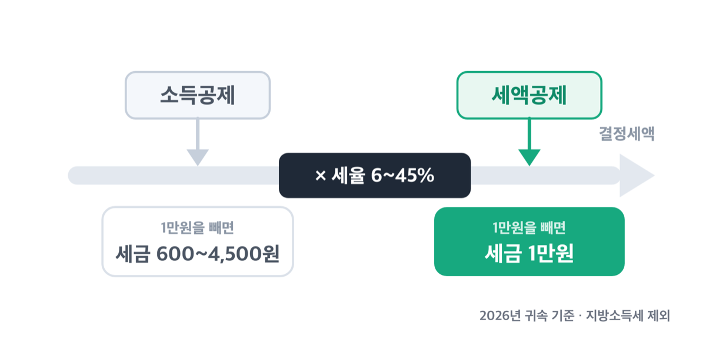
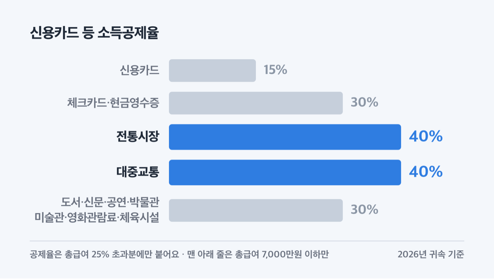
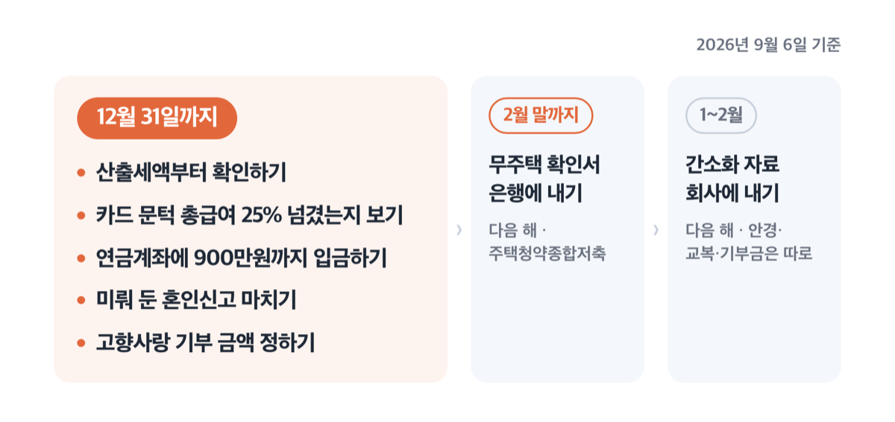
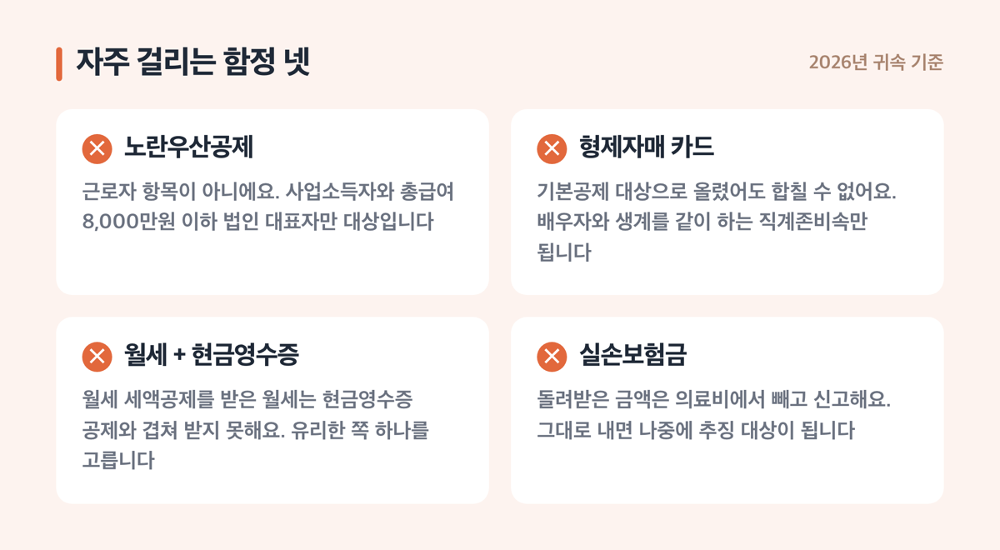

# 연말정산 환급 늘리는 순서, 2026년 자녀공제는 9세부터

📌 2026년 9월 6일 기준

공제 항목을 많이 챙길수록 환급이 늘어난다고들 하는데, 그렇지 않아요. ==챙기는 순서가 틀리면 넣은 만큼이 그대로 사라집니다.==

**3줄 요약**

1. 연말정산은 소득공제로 과세표준을 내린 뒤, 세액공제로 세금을 직접 빼는 2단계 계산이에요.
2. 2026년 귀속(2027년 1~2월 신고)부터 자녀세액공제 나이 요건이 8세에서 9세로 오르고, 교육비 부양가족 소득요건이 없어집니다.
3. 세액공제 합계가 산출세액을 넘으면 초과분은 사라지니, 12월 전에 내 산출세액부터 확인하세요.

먼저 이 순서를 정하는 법 조문 셋을 봅니다. 환급액의 상한이 거기서 정해져요.

> [!WARNING]
> 아래 금액과 요건은 2026년 9월 6일 현재 시행 중인 법령 기준이고, **2026년 귀속**(2027년 1~2월에 하는 연말정산)에 적용됩니다. 2026년 8월 3일 발표된 세제개편안은 대부분 2027년 귀속부터 적용이라 이 글의 값과 다릅니다.

## 환급은 왜 나오나 — 계산 순서가 답이에요

연말정산 환급금은 매달 미리 뗀 소득세와 1년치 결정세액의 차액이에요. 1년치 세금을 다시 계산해서, 더 냈으면 돌려주고 덜 냈으면 더 걷습니다.

계산은 아래 순서로 흘러가요.

| 계산 단계 (근로소득 연말정산, 위에서 아래 순서) | 무엇을 하나 |
|---|---|
| 총급여액 | 연간 근로소득에서 비과세소득을 뺀 금액 |
| − 근로소득공제 | 구간별 공제, 한도 2,000만원 |
| = 근로소득금액 | 여기서부터 공제가 붙어요 |
| − **소득공제** | 인적공제·연금보험료·특별소득공제·그 밖의 소득공제 |
| = 과세표준 | 세율을 곱할 대상 |
| × 기본세율 6~45% | 여기서 산출세액이 나와요 |
| = 산출세액 | **세액공제의 상한선** |
| − **세액공제** | 산출세액에서 직접 뺍니다 |
| = 결정세액 | 1년치 확정 세금 |
| − 기납부세액 | 매달 뗀 소득세. 남으면 환급, 모자라면 추가 납부 |

이래서 순서가 중요해요. **소득공제는 세율을 곱하기 전에 빠지고, 세액공제는 곱한 뒤에 빠집니다.** 같은 1만원인데 빠지는 위치가 달라요.

소득공제 1만원이 줄여 주는 세금은 600원에서 4,500원이에요. 기본세율 6~45%를 곱한 값이거든요. 세액공제 1만원은 그냥 1만원이고요. 세율을 곱하는 단계가 이미 지났으니까요.

> 이 두 값은 법에 적힌 금액이 아니라 세율을 곱해 얻은 값이에요. 지방소득세(소득세의 10%)는 넣지 않았습니다.

### 순서를 정하는 법 조문 셋

| 법이 정한 것 (소득세법·조세특례제한법, 2026년 귀속 기준) | 실제로 무슨 뜻인가 |
|---|---|
| 세액공제 합계가 산출세액을 넘으면 초과분은 없는 것으로 한다 | ==넘긴 만큼은 그대로 사라져요== |
| 초과하면 연금계좌세액공제부터 받지 않은 것으로 본다 | 가장 먼저 깎이는 게 연금계좌예요 |
| 못 받은 기부금은 10년 이내에 이월한다 | 기부금만 다음 해로 넘어가요 |

여기에 하나가 더 붙어요. **소득공제 종합한도 2,500만원**입니다. 특별소득공제(보험료 제외), 벤처투자조합 출자, 소기업·소상공인 공제부금, 청약저축, 우리사주조합 출자, 장기집합투자증권저축, 국민성장집합투자증권저축, 신용카드 소득공제를 다 더해서 2,500만원을 넘으면 초과분은 없는 것으로 봅니다.

> 😕 저는 세금을 거의 안 떼는데요. 공제를 채우면 그만큼 돌려받나요?

아니에요. 결정세액이 이미 0이면 더 뺄 세금이 없어서 환급도 없어요. 세액공제를 아무리 쌓아도 산출세액을 넘는 부분은 소멸합니다. 이월되는 건 기부금뿐이에요.

> 🤭 **솔직히 말하면** — 12월에 급하게 카드를 긁는 것보다, 내 산출세액이 얼마인지 한 번 보는 게 빨라요.

순서는 하나입니다. 산출세액을 먼저 보고, 그 안에서 세액공제를 채웁니다.

## 1단계 소득공제 — 과세표준을 내리는 항목들

소득공제는 세율을 곱하기 전 과세표준을 깎는 항목이고, 인적공제·연금보험료공제·특별소득공제·그 밖의 소득공제 넷으로 나뉘어요.

먼저 사람 수로 받는 인적공제입니다.

| 인적공제 항목 | 1년 공제액 |
|---|---|
| 기본공제 | 1명당 150만원 |
| 추가 — 경로우대(70세 이상) | 1명당 100만원 |
| 추가 — 장애인 | 1명당 200만원 |
| 추가 — 부녀자 | 50만원 |
| 추가 — 한부모 | 100만원 |

- 배우자와 부양가족은 연간 소득금액 **100만원 이하**여야 해요 *(근로소득만 있으면 총급여 500만원 이하)*
- 직계존속은 **60세 이상**, 직계비속·입양자는 **20세 이하** *(1965년 12월 31일 이전 출생이면 직계존속 요건을 채워요)*
- 형제자매는 20세 이하 또는 60세 이상 *(중간 나이대는 안 돼요)*
- 장애인은 **나이 제한이 없어요**
- 부녀자공제는 종합소득금액 3,000만원 이하만, 한부모공제와 겹치면 한부모를 적용해요

국민연금 등 공적연금 보험료 본인 부담분과 건강보험료·고용보험료·노인장기요양보험료는 전액 공제됩니다. 이건 회사가 알아서 잡아 줘요.

### 집과 관련된 소득공제

여기가 금액이 가장 큰 곳이에요.

| 항목 (주택 관련 소득공제) | 공제율 | 공제 한도 (1년, 원) |
|---|---|---|
| 주택임차차입금 원리금 상환액 | 40% | 주택마련저축과 합해 연 400만원 |
| 장기주택저당차입금 이자 상환액 | 이자 전액 | 조건별 600만~2,000만원 |
| 주택청약종합저축 | 40% | 납입 연 300만원까지 |

장기주택저당차입금 한도는 대출 조건에 따라 넷으로 나뉩니다.

1. 상환기간 15년 이상 + 고정금리 + 비거치식 분할상환 — **2,000만원**
2. 상환기간 15년 이상 + 고정금리 **또는** 비거치식 — **1,800만원**
3. 상환기간 10년 이상 + 고정금리 **또는** 비거치식 — **600만원**
4. 그 밖에 상환기간 15년 이상인 경우 — **800만원**

주택 요건이 붙어요. 취득 당시 기준시가 6억원 이하여야 하고, 취득할 때 무주택이거나 1주택인 세대의 세대주여야 합니다.

주택청약종합저축은 조건이 촘촘해요. 총급여 7,000만원 이하, 무주택 세대의 세대주 또는 세대주의 배우자입니다. 연 300만원까지 넣은 돈의 40%를 공제하니 최대 120만원이 과세표준에서 빠져요.

여기서 착각하기 쉬운 게 있어요. **120만원은 돌려받는 세금이 아니라 과세표준이 줄어드는 금액입니다.** 과세표준 5,000만원 구간(세율 24%)이라면 실제로 줄어드는 세금은 약 28만 8천원이에요. 120만원에 24%를 곱한 값이고, 지방소득세는 빼고 계산했어요.

- 무주택 확인서를 **다음 해 2월 말까지** 저축 취급기관에 내야 해요 *(안 내면 공제가 안 붙어요)*
- 가입일부터 **5년 안에 해지**하면 납입액 누계(연 300만원 한도)의 6%를 추징합니다
- 적용기한은 2028년 12월 31일 납입분까지예요

### 신용카드 등 사용금액 — 문턱부터 넘어야 해요

카드 공제는 총급여의 25%를 넘게 쓴 금액부터 시작해요. 총급여 4,000만원이면 1,000만원, 6,000만원이면 1,500만원을 먼저 써야 그 위부터 공제 대상이 됩니다.

문턱을 넘긴 금액에 붙는 공제율은 결제 수단과 사용처마다 달라요.

| 무엇으로 · 어디서 썼나 | 공제율 (총급여 25% 초과분에만 적용) |
|---|---|
| 신용카드 | 15% |
| 체크카드·현금영수증 | 30% |
| 전통시장 | 40% |
| 대중교통 | 40% |
| 도서·신문·공연·박물관·미술관·영화관람료·체육시설 | 30% |

맨 아래 문화·체육 항목은 총급여 7,000만원 이하만 적용돼요.

기본 공제한도는 자녀 수와 총급여로 나뉩니다.

| 자녀 등 | 총급여 7,000만원 이하 | 총급여 7,000만원 초과 |
|---|---|---|
| 없음 | 연 300만원 | 연 250만원 |
| 1명 | 연 350만원 | 연 275만원 |
| 2명 이상 | 연 400만원 | 연 300만원 |

여기에 전통시장과 대중교통 사용분으로 추가 한도가 붙어요. 총급여 7,000만원 이하는 **연 300만원**, 초과는 **연 200만원**입니다. 7,000만원 이하는 도서·공연 등 문화비도 이 추가 한도에 함께 들어가요.

그런데 순서가 여기서 또 걸려요. ==최저사용금액은 신용카드 사용분부터 차감합니다.== 신용카드로 쓴 돈으로 문턱을 다 못 채우면 체크카드·현금영수증에서, 그래도 모자라면 문화체육 → 전통시장·대중교통 순으로 깎아 나가요.

쉽게 말하면, 공제율이 낮은 신용카드가 문턱을 먼저 메우고, 공제율이 높은 체크카드는 문턱을 넘긴 뒤 구간에 남는 구조예요. 연초부터 체크카드만 쓰면 30% 구간이 문턱 메우는 데 소모됩니다.

저라면 총급여 25%를 넘길 때까지는 신용카드를 쓰고, 넘긴 다음부터 체크카드와 현금영수증으로 바꿉니다. 위 차감 순서가 법에 정해져 있어서 그래요.

공제 대상에서 빠지는 것도 꽤 많아요.

1. 건강보험료·고용보험료·노인장기요양보험료·국민연금 보험료·보장성보험료
2. 학교(대학원 포함)와 어린이집에 낸 수업료·입학금·보육비용·공납금
3. **평생교육시설과 학위취득과정 수업료, 직업능력개발훈련시설 수강료** *(2026년에 새로 빠졌어요)*
4. 국세·지방세, 전기료·수도료·가스료·전화료(인터넷 포함)·아파트관리비·TV 시청료·도로통행료
5. 상품권 등 유가증권 구입비
6. 자동차 구입비 *(시행령이 정한 중고차 구입금액 일부만 예외로 들어가요)*

가족 카드를 합칠 때도 선이 있어요. 배우자와 생계를 같이 하는 직계존비속은 합칠 수 있고, 소득 기준은 연간 소득금액 100만원 이하입니다. **형제자매는 기본공제 대상이어도 합칠 수 없습니다.**

## 2단계 세액공제 — 산출세액 안에서만 받아요

세액공제는 산출세액에서 직접 빼는 항목이에요. 1만원을 공제받으면 세금이 1만원 줄어듭니다.

| 항목 (2026년 귀속 세액공제) | 공제율 | 공제 한도 (1년, 원) |
|---|---|---|
| 근로소득세액공제 | 산출세액 130만원 이하 55%, 초과분 30% | 총급여에 따라 20만~74만원 |
| 자녀세액공제 (9세 이상) | 정액 | 1명 25만원, 2명 55만원 |
| 출산·입양 | 정액 | 첫째 30만원, 둘째 50만원, 셋째 이상 70만원 |
| 연금계좌 | 12% (총급여 5,500만원 이하 15%) | 연금저축 600만원, 퇴직연금 합산 900만원 |
| 보장성보험료 | 12% (장애인전용 15%) | 각각 연 100만원 |
| 의료비 | 15% (난임 30%, 미숙아 20%) | 총급여 3% 초과분, 부양가족 700만원 |
| 교육비 | 15% | 초·중·고 300만원, 대학생 900만원 |
| 기부금 | 15% (1,000만원 초과분 30%) | 소득금액 기준 별도 |
| 월세액 | 15% (총급여 5,500만원 이하 17%) | 연 1,000만원 |
| 혼인 | 정액 | 50만원, 생애 1회 |

### 연금계좌 — 가장 먼저 깎이는 항목이에요

연금저축은 연 600만원, 여기에 IRP(개인형 퇴직연금)나 DC형(확정기여형) 본인부담금을 더해 연 900만원까지 공제 대상이에요. 총급여 5,500만원 이하면 15%, 넘으면 12%입니다.

900만원을 다 채우면 총급여 5,500만원 이하는 135만원, 초과는 108만원이에요. 법에는 비율과 한도만 적혀 있어서, 900만원에 15%와 12%를 각각 곱해 얻은 값입니다. 중간에 덜 넣은 달이 있거나 다른 한도에 먼저 걸리면 이 값이 아니에요.

ISA(개인종합자산관리계좌) 만기 자금을 연금계좌로 옮겼다면 추가가 붙어요. 전환금액의 10%와 300만원 중 적은 금액이 한도입니다.

여기서 앞의 조문이 다시 걸려요. 감면과 공제 합계가 산출세액을 넘으면 **연금계좌세액공제부터** 받지 않은 것으로 봅니다. 산출세액이 작은 해에 900만원을 몰아 넣으면, 가장 먼저 잘려 나가는 게 이 항목이에요.

계좌에 넣을 수 있는 총액은 공제 한도와 별개로 연 1,800만원입니다.

### 의료비 — 문턱이 3%예요

의료비는 총급여의 3%를 넘게 쓴 금액부터 공제해요. 총급여 4,000만원이면 120만원, 6,000만원이면 180만원이 문턱입니다.

- 부양가족 의료비는 연 **700만원** 한도예요
- **본인, 6세 이하, 65세 이상, 장애인, 중증질환자·희귀난치성질환자·결핵환자, 미숙아·선천성이상아, 난임시술비는 한도가 없어요**
- 나이와 소득 제한이 없어요 *(기본공제 대상 나이를 넘긴 가족의 의료비도 합칠 수 있어요)*
- 안경·콘택트렌즈는 1명당 연 50만원까지, 산후조리원은 출산 1회당 200만원까지
- 보청기, 장애인 보장구, 처방받은 의료기기 구입·임차비도 들어가요
- 노인장기요양급여와 장애인활동지원급여의 **본인부담금**도 들어가요

빠지는 것 셋이 있어요. **실손의료보험금으로 돌려받은 금액**, 미용·성형수술 비용, 건강증진용 의약품 구입비입니다. 실손으로 받은 돈은 내가 부담한 게 아니니 그만큼 빼고 신고해야 해요.

### 교육비 — 2026년에 두 군데가 넓어졌어요

공제율은 15%예요. 본인 교육비는 한도가 없고 대학·대학원 학비, 직업능력개발훈련 수강료, 학자금대출 원리금 상환액까지 들어갑니다. 취학 전 아동과 초·중·고등학생은 1명당 연 300만원, 대학생은 1명당 연 900만원이에요.

2026년 귀속부터 달라진 게 둘입니다.

1. **부양가족 소득요건이 없어졌어요.** 그동안은 소득금액 100만원(총급여 500만원) 이하만 됐는데, 2026년 1월 1일 이후 지출분부터 이 요건이 사라집니다
2. **초등 저학년 예체능 학원비가 들어와요.** 과세기간 종료일 현재 9세 미만이거나 2학년 이하 초등학생의 예능학원·체육시설 교육비가 대상입니다

장애인 특수교육비는 한도도 나이·소득 제한도 없어요. 대학원 교육비는 본인 것만 되고 부양가족 분은 안 됩니다.

### 월세·기부금·혼인

월세 세액공제는 총급여 8,000만원 이하 무주택 세대의 세대주가 대상이고, 연 1,000만원까지의 15%를 공제해요. 총급여 5,500만원 이하면 17%로 올라갑니다. 1,000만원을 꽉 채우면 각각 170만원과 150만원인데, 이건 한도에 공제율을 곱해 얻은 값이에요.

- 대상 주택은 국민주택규모(85㎡, 수도권·도시지역 외 100㎡) 이하 **또는** 기준시가 4억원 이하 *(주거용 오피스텔과 고시원도 들어가요)*
- 임대차계약증서 주소지와 주민등록표 등본 주소지가 같아야 하고, 본인이 실제로 살아야 해요
- 배우자 등 기본공제대상자 명의로 맺은 계약도 됩니다
- 2026년부터 자녀·손자녀가 3명 이상이면 주택면적 기준이 **100㎡ 이하**로 넓어져요
- 2026년부터 세대주와 다른 시군구에 사는 **주말부부**는 세대주의 배우자도 추가로 공제받을 수 있어요 *(둘을 합쳐 연 1,000만원 한도예요)*

기부금은 15%, 1,000만원 초과분은 30%예요. 산출세액이 모자라 못 받은 기부금은 10년 이내에 이월됩니다. 정치자금·고향사랑·우리사주조합 기부금은 본인이 낸 것만 돼요.

혼인 세액공제는 50만원이고 생애 1회입니다. **==2026년 12월 31일 이전에 혼인신고를 한 경우까지만 적용됩니다.==** 2024년부터 2026년까지 3년 한시로 들어온 제도라 올해가 마지막이에요. 부부가 각각 받으니 합쳐서 최대 100만원이고요.

50만원을 받으려고 혼인신고 날짜를 정하라는 말은 아니에요. 다만 이미 하기로 정해 두고 미뤄 왔다면, 저는 2026년 안에 합니다.

특별소득공제·특별세액공제·월세 세액공제를 하나도 신청하지 않으면 표준세액공제 13만원을 받아요. 정치자금·고향사랑·우리사주조합 기부금 세액공제는 표준세액공제와 겹쳐 받을 수 있습니다.

## 2026년 귀속에서 달라지는 것

숫자가 바뀐 항목만 모았어요. 아래는 전부 2026년 귀속(2027년 초 신고)부터 적용됩니다.

| 무엇 | 종전 | 2026년 귀속 |
|---|---|---|
| 자녀세액공제 나이 | 8세 이상 | **9세 이상** |
| 교육비 부양가족 소득요건 | 소득금액 100만원 이하 | **폐지** |
| 교육비 예체능 학원비 | 취학 전 아동만 | **초등 2학년 이하 추가** |
| 고향사랑기부금 10만~20만원 구간 | 15% | **40%** |
| 신용카드 제외 항목 | 학교·어린이집 공납금 | **평생교육·직업훈련 수강료 추가** |
| 보육수당 비과세 | 월 20만원 | **자녀 1명당 월 20만원** |

자녀세액공제 나이는 단계적으로 올라가요. 2026년 9세, 2027년 10세, 2028년 11세, 2029년 12세입니다. 아동수당법이 바뀌어 13세 미만 아동에게 혜택이 겹치지 않게 하려는 조정이에요. 법 조문 본문에는 「13세 이상」으로 적혀 있는데, 부칙 특례로 2026년은 9세를 적용합니다.

**==2017년 1월 1일부터 12월 31일 사이에 태어난 자녀에게는 이 연령 기준을 적용하지 않습니다.==** 이 해에 태어난 아이는 나이 요건과 무관하게 자녀세액공제 대상이에요.

고향사랑기부금은 구간이 하나 생겼어요. 10만원 이하는 100/110을 곱하고, 10만원 초과 20만원 이하 구간은 40%, 20만원 초과분은 15%입니다. 종전에는 10만원 넘는 금액에 일괄 15%였어요. 특별재난지역에 정해진 기간 안에 기부하면 20만원 초과분이 30%가 됩니다.

매달 떼는 세금도 바뀝니다. 간이세액표의 자녀 공제액이 1명 20,830원, 2명 45,830원, 3명 이상은 45,830원에 초과 1명당 33,330원으로 올랐어요. 2026년 3월 1일 이후 원천징수분부터예요.

물론 매달 덜 떼면 통장에 들어오는 돈은 늘어요. 그런데 1년치 세금 총액은 그대로라 그만큼 환급액은 줄어듭니다.

2026년 귀속에 **없는** 것도 짚어 둘게요. 신용카드 소비증가분 추가공제 10%와 기부금 3,000만원 초과분 추가 10% 공제는 둘 다 2024년분에만 적용된 한시 조항이라 지금은 없습니다.

## 지금부터 12월까지, 순서대로 할 일

12월 31일이 지나면 손댈 수 없는 것부터 적었어요.

1. **내 산출세액을 먼저 확인합니다.** 여기가 세액공제의 상한선이에요. 결정세액이 이미 0에 가까우면 아래 항목을 채워도 돌아오는 게 없습니다
2. **카드 사용액이 총급여 25%를 넘었는지 봅니다.** 아직이면 신용카드로 채우고, 넘겼으면 남은 지출을 체크카드와 현금영수증으로 돌려요
3. **연금계좌에 12월 31일까지 입금합니다.** 연금저축 600만원, IRP를 더해 900만원까지예요. 입금일 기준이라 1월에 넣으면 다음 해로 넘어가요
4. **주택청약종합저축은 무주택 확인서를 챙깁니다.** 다음 해 2월 말까지 은행에 내야 공제가 붙어요
5. **혼인신고를 미뤄 뒀다면 12월 31일 전에 합니다.** 2026년이 이 공제의 마지막 해예요
6. **고향사랑 기부는 10만원과 20만원 구간을 보고 정합니다.** 10만원까지는 사실상 전액, 그 위 10만원 구간은 40%예요
7. **1~2월에 홈택스 연말정산 간소화에서 자료를 내려받아 회사에 냅니다.** 간소화에 안 잡히는 안경·교복·기부금 영수증은 직접 챙겨야 해요

간소화 서비스 개통일과 회사 일괄제공 신청 일정은 국세청 연말정산 종합 안내 페이지에서 확인하세요. 매년 12월에서 1월 사이에 공지가 올라옵니다.

## 자주 걸리는 함정 넷

공식 안내와 인터넷 요약이 어긋나는 곳을 모았어요.

**하나, 노란우산공제는 일반 근로자 항목이 아니에요.** 「직장인 절세」 목록에 자주 올라오는데, 조세특례제한법은 대상을 사업소득금액, 그리고 법인의 대표자로서 총급여 8,000만원 이하인 거주자로 한정하고 있어요. 월급만 받는 근로자는 해당하지 않습니다. 저는 이 항목이 들어간 절세 목록은 걸러요.

**둘, 형제자매 카드는 합칠 수 없어요.** 인적공제 기본공제 대상으로 올렸더라도 신용카드 소득공제는 안 됩니다. 합칠 수 있는 건 배우자와 생계를 같이 하는 직계존비속뿐이에요.

**셋, 월세 세액공제를 받은 월세는 현금영수증 공제와 겹쳐 받지 못합니다.** 반대로 총급여 요건을 못 채워 월세 세액공제를 못 받는다면, 그 월세를 현금영수증으로 처리해 신용카드 등 소득공제를 받을 수 있어요. 둘 중 유리한 쪽을 고르는 문제입니다.

**넷, 실손보험금으로 받은 의료비는 빼야 해요.** 병원에 낸 돈은 간소화에 잡히는데, 보험사에서 돌려받은 금액까지 그대로 신고하면 나중에 추징 대상이 됩니다.

여기에 하나 더요. 소득공제 종합한도 2,500만원은 신용카드와 청약저축을 크게 쓴 해에 조용히 걸립니다. 각 항목의 한도를 다 채웠는데 환급이 예상보다 적다면 이 한도를 확인해 보세요.

## 연말정산 환급 관련 궁금증 해결

**Q. 소득공제와 세액공제 중 뭐가 더 유리한가요?**

A. 같은 금액이면 세액공제예요. 세액공제 1만원은 세금을 1만원 줄이지만, 소득공제 1만원은 세율을 곱한 만큼인 600원에서 4,500원만 줄여요. 다만 소득공제는 과세표준 구간을 낮춰 세율 자체를 내리는 경우가 있어서, 구간 경계에 있으면 소득공제 효과가 더 커집니다.

**Q. 카드를 많이 썼는데 환급이 0원이에요. 왜 그런가요?**

A. 결정세액이 이미 0이면 더 뺄 세금이 없어서 환급이 나오지 않아요. 소득이 낮아 산출세액이 작거나, 근로소득세액공제와 인적공제만으로 세금이 다 상쇄된 경우예요. 이때 추가로 넣은 세액공제는 그냥 사라집니다.

**Q. 연금저축에 900만원을 다 넣으면 되나요?**

A. 연금저축 계좌 하나로는 600만원까지만 공제돼요. 나머지 300만원은 IRP나 DC형 퇴직연금 본인부담금으로 넣어야 900만원이 채워집니다. 계좌에 넣을 수 있는 총액은 연 1,800만원이지만, 공제받는 건 900만원까지예요.

**Q. 여덟 살 아이는 자녀세액공제를 못 받나요?**

A. 2026년 귀속부터 나이 요건이 9세 이상이라 원칙적으로는 대상이 아니에요. 다만 2017년에 태어난 자녀에게는 이 연령 기준을 적용하지 않습니다. 자녀 생년을 먼저 확인하세요.

**Q. 부모님 대학원 학비도 교육비 공제가 되나요?**

A. 대학원 교육비는 본인 것만 됩니다. 부양가족의 대학원 학비는 대상이 아니에요. 학부 등록금이라면 2026년부터 소득요건이 없어져 공제 범위가 넓어졌습니다.

연말정산은 12월에 뛰어서 뒤집기 어려운 계산이에요. 산출세액이라는 천장이 이미 정해져 있고, 그 아래에서 무엇을 먼저 채우느냐만 남거든요. 지금 홈택스에서 올해 낸 세금이 얼마인지 한 번 확인해 보세요. 그 숫자를 알고 나면 연금계좌에 얼마를 넣을지, 카드를 어떻게 쓸지가 정해집니다.

참고: 법제처 국가법령정보센터 「소득세법」·「소득세법 시행령」·「조세특례제한법」 · 국세청 「2026년 개정세법(연말정산)」 · 국세청 「2025년 원천징수의무자를 위한 연말정산 신고안내」 · 재정경제부 「2026년 세제개편안」
