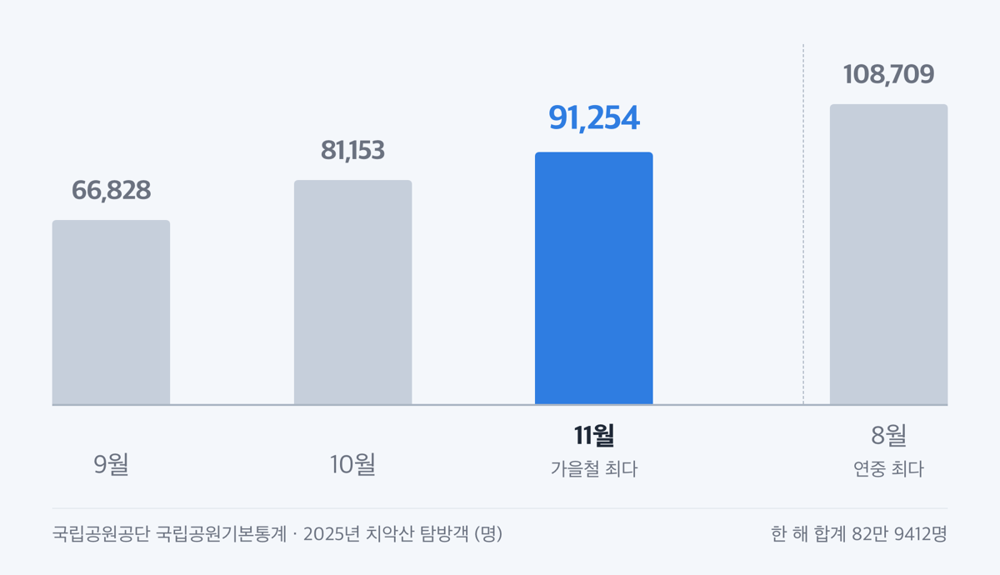
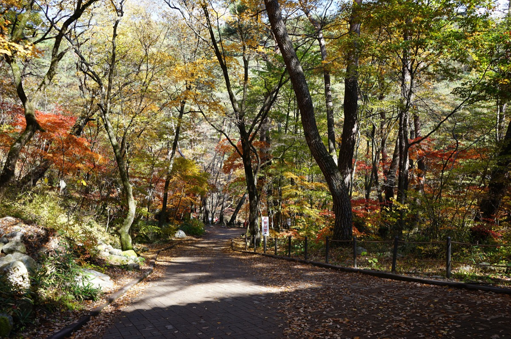
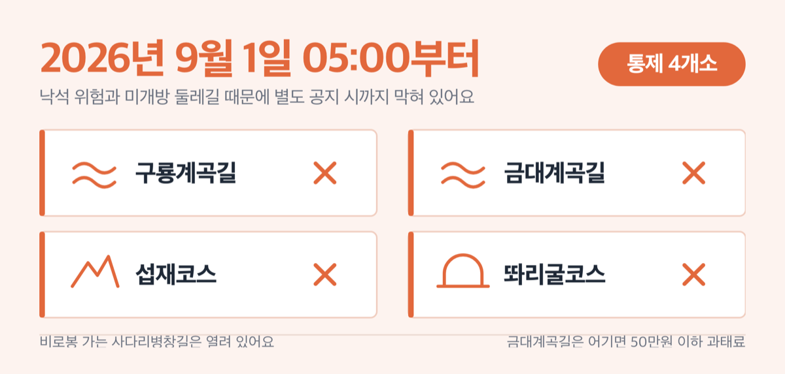

# '11월' 치악산 단풍 시기 2026, 구룡사 코스는 3.3km예요

📌 2026년 9월 6일 기준

9만 1254명이에요. 국립공원공단이 집계한 2025년 11월 치악산 탐방객 수인데, 10월(8만 1153명)보다 1만 명 많습니다. 치악산 단풍은 10월에 끝나지 않아요.

**3줄 요약**

- 치악산은 산림청 산림단풍 예측지도의 관측지점에 들어 있지 않아요. 절정일을 하루로 정해 주는 공식 예보가 애초에 없는 산입니다.
- 대신 국립공원공단 통계에서 2025년 11월 탐방객(9만 1254명)이 10월(8만 1153명)보다 많았어요. 단풍이 11월 초까지 이어진다는 근거예요.
- 구룡사~세렴폭포는 3.3km에 1시간 30분, 난이도 '하'예요. 구룡 제1·2·3 주차장은 무료이고 성수기 구간은 10월 1일부터 11월 15일까지입니다.

단풍 시기부터 주차·버스·통제구간까지, 2026년 9월 6일에 확인한 공식 자료로만 적었어요.

## 치악산은 단풍 절정 예보가 없어요, 그래서 탐방객 수를 봤어요

산림청은 해마다 '산림단풍 예측지도'를 냅니다. 전국 관측지점별로 단풍나무류·참나무류·은행나무가 언제 절정에 드는지 날짜를 적은 지도예요. 절정 기준은 각 수종의 단풍이 50% 이상 물들었을 때입니다.

그런데 ==치악산은 이 지도의 관측지점에 없어요.== 2025년 지도 세 장(단풍나무류·참나무류·은행나무)과 2024년 지도를 열어 라벨을 하나씩 읽어도 '치악산'이라는 이름이 나오지 않습니다. 지점이 없으니 치악산 절정일도 나올 수 없어요.

> 😕 그럼 인터넷에 도는 '치악산 절정 10월 ○일'은 뭔가요?

관측지점 값이 아니라 누군가 주변 값으로 잡은 날짜예요. 근거를 밝히지 않은 날짜는 그대로 믿기 어렵습니다. 그래서 이 글은 날짜를 하루로 못 정하는 대신, 근거가 확실한 숫자 두 종류를 앞에 둡니다.

발표 시점도 알아 두면 좋아요. 예측지도는 2024년에 9월 23일, 2025년에 10월 1일에 나왔습니다. 9월 하순에서 10월 초 사이에 그해 지도가 나오는 흐름이에요.

그럼 남는 근거는 하나입니다. 사람이 실제로 몇 명 다녀갔는지예요.

국립공원공단이 해마다 내는 국립공원기본통계에 공원별 월별 탐방객 수가 실려요. 치악산의 2025년 값을 뽑으면 이렇습니다.

| 2025년 | 치악산 탐방객 (명) |
|---|---|
| 9월 | 66,828 |
| 10월 | 81,153 |
| 11월 | **91,254** |
| 8월 (연중 최다) | 108,709 |

2025년 한 해 합계는 82만 9412명이에요. 표에서 눈여겨볼 것은 10월과 11월의 순서입니다.

**가을철 탐방객이 10월이 아니라 11월에 더 많았습니다.**

왜 이런 순서가 나오는지도 같은 통계가 설명해요. 전국 기준 해설이 「10월 강우일 수 및 강수량 대폭 증가로 전년 대비 탐방객 수가 감소했지만, 11월 단풍 절정으로 탐방객 수 증가」라고 적었습니다. 사람은 단풍이 든 뒤에 움직이는데, 그 시점이 11월로 밀렸다는 뜻이에요.

물론 탐방객 수는 단풍 관측값이 아니에요. 날씨나 연휴에도 흔들립니다. 그런데 단풍철 산행에서 사람을 움직이는 것은 결국 단풍이고, 치악산에서 그 무게추가 11월 쪽에 있다는 사실은 남아요.

## 2026년 치악산 단풍, 언제 가면 되나

공식 예보가 없으니 주변 관측지점 값을 봅니다. 아래는 산림청 2025년 예측지도에서 읽은 단풍나무류 절정일이에요. **치악산 값이 아니라 이웃 지점 값입니다.**

| 관측지점 (2025년) | 단풍나무류 절정일 |
|---|---|
| 용문산 (경기 양평, 1,157m) | 10월 26일 |
| 강원도립화목원 (강원 춘천) | 10월 28일 |
| 설악산 권금성 (강원 속초) | 10월 25일 |

같은 해 전국 평균은 단풍나무류 11월 1일, 참나무류 10월 31일, 은행나무 10월 28일이었어요. 산림청은 절정 시기가 최근 10년 평균보다 4~5.2일 늦어졌고, 해마다 수종별로 0.43~0.52일씩 밀리고 있다고 밝혔습니다. 2024년 자료에서는 그 원인으로 6~8월 평균기온이 지난 10년 평균보다 약 1.3℃ 올랐다는 점을 짚었어요.

이 값들을 바탕으로 2026년 시기를 예상해 보면 이렇습니다. 아래 넷은 전부 추정이에요. 근거는 옆에 적었습니다.

1. **구룡사·세렴폭포 계곡 구간: 10월 하순 ~ 11월 초** *(이웃 지점 10월 26~28일 + 해마다 0.43~0.52일씩 늦어지는 추세)*
2. **비로봉·남대봉 능선: 10월 중순 ~ 10월 하순** *(이웃 지점은 산 정상이 아니어서 능선은 더 이르게 봅니다)*
3. **가장 붐빌 주말: 10월 마지막 주말 ~ 11월 첫 주말** *(2025년 11월 탐방객이 10월보다 많았어요)*
4. **늦어도 이때까지: 11월 15일** *(국립공원 성수기가 11월 15일까지이고, 2025년 가을철 탐방로 통제도 11월 15일에 시작했어요)*

저라면 10월 마지막 주말보다 ==11월 첫 주말==을 잡습니다. 근거는 위 표 두 개예요. 이웃 지점 절정일이 이미 10월 말에 몰려 있고 해마다 조금씩 밀리는데, 실제 사람이 가장 많이 움직인 달도 11월이었으니까요.

> [!WARNING]
> 산림청 2026년 산림단풍 예측지도는 2026년 9월 6일 현재 발표 전이에요. 지도가 나와도 치악산은 관측지점이 아니라 이름이 실리지 않습니다. 9월 하순 이후 산림청 보도자료에서 가까운 지점(용문산·강원도립화목원) 날짜를 확인하시면 됩니다.

## 입장료·주차료 — 구룡 제1·2·3 주차장은 무료예요

돈 이야기부터 정리할게요. 국립공원 입장료는 2007년 1월 1일에 폐지됐습니다. 국립공원수입징수규칙 별표1의 사용료 항목에도 '입장료'가 아예 없어요. 사찰 문화재 관람료도 2023년 5월 4일부터 대한불교조계종 산하 사찰에서 무료로 바뀌었고, 구룡사 입장료는 무료입니다.

주차료는 주차장마다 달라요.

| 주차장 | 2026년 9월 6일 기준 요금 |
|---|---|
| 구룡 제1·2·3 주차장 | **무료** |
| 황골주차장 (중·소형) | 주중 4,000원 / 주말·성수기 5,000원 |
| 황골주차장 (경형) | 2,000원 |

구룡주차장이 무료인 이유는 원주시가 돈을 대기 때문이에요. 원주시는 2017년부터 해마다 약 5천만 원을 들여 구룡주차장을 무료로 열고 있습니다. 제1·2·3 주차장을 합치면 총면적 31,359㎡에 750대를 댈 수 있어요. 국립공원공단 시설 정보도 세 곳을 모두 '무료'로 적고 있습니다.

여기서 '성수기'라는 말을 정확히 봐야 해요. 국립공원 주차장의 성수기는 7월 1일~8월 31일과 **10월 1일~11월 15일**입니다. 주말은 토·일과 공휴일이고요.

즉 단풍철 전체가 성수기 요금 구간이에요.

- 구룡 제1주차장: 대형버스 34대, 소형 174대 *(성수기에는 현장 직원 유도를 따라야 해요)*
- 구룡 제2주차장: 362대, **승용차 전용**으로 대형차량은 못 들어가요
- 구룡 제3주차장: 189대 *(가장 작아요)*
- 금대주차장: 여름·가을 성수기에 한시적으로 열고, 금대분소까지 1.8km라 걸어서 30분쯤 걸려요

저라면 황골 대신 구룡 쪽으로 갑니다. 요금이 없는 데다 단풍 구간인 구룡사·세렴폭포 코스가 바로 거기서 시작하거든요.

> 🤭 **한 가지만 더** — 황골주차장에는 승용차 5부제가 걸려 있어요. 2026년 4월 8일부터 자원안보 위기경보가 해제될 때까지 시행이고, 10인승 이하 승용차가 대상입니다. 번호판 끝자리 1·6은 월요일, 2·7은 화요일, 3·8은 수요일, 4·9는 목요일, 5·0은 금요일에 못 들어가요. 평일에 황골로 가실 계획이면 치악산국립공원사무소(033-740-9900)로 그날 적용 여부를 확인하세요.

## 구룡사~세렴폭포 3.3km, 단풍만 보려면 이 코스

구룡사는 강원특별자치도 원주시 소초면 구룡사로 500에 있어요. 서기 668년 신라 문무왕 8년에 의상대사가 창건했다고 전해지고, 원주8경 제1경입니다. 아홉 마리 용 전설로 '九龍寺'였다가, 입구 거북바위 전설이 더해지면서 거북 구 자를 쓴 '龜龍寺'로 글자를 바꿨어요.

국립공원공단이 정한 코스 제원은 이렇습니다.

| 코스 | 거리·소요시간 | 난이도 |
|---|---|---|
| 구룡탐방지원센터~구룡사~세렴폭포 | 3.3km · 1시간 30분 | 하 |
| 구룡~구룡사~세렴폭포~사다리병창~비로봉 | 6km · 3시간 30분 | 상 |
| 황골탐방지원센터~입석사~비로봉 | 4.1km · 2시간 30분 | 중 |

단풍만 보실 거면 첫 줄이면 충분해요. 난이도가 '하'이고, 계곡을 따라 걷는 구간이라 물빛과 단풍이 함께 들어옵니다. 구룡지구에는 황장목숲길~전나무숲길 입구 0.6km 무장애탐방로도 있어요.

정상까지 가실 거면 시각을 꼭 보셔야 합니다. 치악산은 입산시간지정제를 운영하는데, 구룡지구 세렴안전지킴터 기준으로 **4~10월은 04:00~14:00, 11~3월은 05:00~13:00입니다.** 11월 1일부터 통과 마감이 한 시간 당겨져요. 비로봉(1,288m)까지 3시간 30분이 걸리니, 11월에 오르시려면 늦어도 오전 중에 세렴을 지나야 합니다.

## 차 없이 간다면 41번 버스예요

구룡사로 들어가는 시내버스는 41번과 41-2번 둘뿐입니다. 기점은 관설동종점, 종점이 구룡사예요.

| 노선 | 관설동종점 첫차~막차 |
|---|---|
| 41번 (평일) | 06:25 ~ 20:20, 평균 60분 간격 |
| 41번 (주말·공휴일) | 07:30 ~ 20:20, 평균 75분 간격 |
| 41-2번 (일·공휴일) | 08:30 · 11:30 · 14:25 · 17:25 (하루 4회) |

돌아 나오는 구룡사발 막차는 21:30이에요. 요금은 일반 기준 카드 1,600원, 현금 1,700원입니다. 41-2번은 토요일에는 운행하지 않아요.

일요일과 공휴일에는 41번 시각표 가운데 8:30·11:30·14:25·17:25 회차가 41-2번으로 바뀝니다. 시각은 같으니 정류장에서는 둘 중 먼저 오는 차를 타시면 돼요.

## 단풍철에 걸리는 것 넷

공식 안내를 다 읽어도 현장에서 걸리는 것이 있어요. 넷만 짚습니다.

1. **통제 중인 구간이 4개소예요.** 2026년 9월 1일 05:00부터 별도 공지 시까지 구룡계곡길·금대계곡길·섭재코스·똬리굴코스가 막혀 있습니다. 낙석 위험과 미개방 둘레길이 이유예요.
2. **비로봉 가는 두 갈래 중 계곡길만 막혔어요.** 세렴폭포에서 사다리병창길로 오르는 노선은 열려 있습니다 *(단풍철 주력 노선은 그대로예요)*.
3. **11월 15일 이후에는 능선 일부가 닫힙니다.** 2025년에는 가을철 산불조심기간이 10월 20일~12월 15일, 탐방로 통제가 11월 15일~12월 15일이었어요. 통제 구간은 황골삼거리~곧은재, 향로봉~영원산성삼거리였습니다.
4. **금대계곡길은 과태료가 걸린 구간이에요.** 자연공원법 제28조 제1항에 따른 출입금지라 어기면 50만원 이하 과태료가 나옵니다.

향로봉 탐방로 예약제는 3월 3일~4월 30일과 11월 15일~12월 15일에만 돌아갑니다. ==10월 하순에서 11월 초 사이 단풍철에는 예약 없이 가실 수 있어요.==

## 치악산 단풍 관련 궁금증 해결

**Q. 2026년 절정이 정확히 며칠인가요?**
A. 치악산은 산림청 예측지도 관측지점이 아니라 공식 절정일이 나오지 않아요. 이웃 지점 값과 탐방객 통계로 보면 계곡 구간은 10월 하순~11월 초입니다. 9월 하순 이후 산림청이 그해 지도를 내면 용문산·강원도립화목원 날짜를 함께 보세요.

**Q. 입장료나 관람료를 내나요?**
A. 국립공원 입장료는 2007년 1월 1일에 폐지됐고, 사찰 문화재 관람료도 2023년 5월 4일부터 무료로 바뀌었어요. 구룡 제1·2·3 주차장도 무료입니다.

**Q. 등산은 어려운데 단풍만 볼 수 있나요?**
A. 구룡탐방지원센터에서 세렴폭포까지 3.3km, 1시간 30분이고 난이도가 '하'예요. 더 짧게 걸으시려면 구룡지구 무장애탐방로 0.6km가 있습니다.

**Q. 주말에 차를 가져가도 되나요?**
A. 구룡 제1·2·3 주차장은 750대 규모이고 요금이 없어요. 다만 성수기에는 현장 직원 유도에 따라야 하고, 제2주차장은 승용차만 들어갑니다.

**Q. 단풍철에 원주에서 열리는 축제가 있나요?**
A. 2026 원주 댄싱카니발은 9월 18일~20일이라 단풍철보다 한 달 이릅니다. 그 밖의 행사는 원주시 관광 안내(033-737-5103)로 확인하세요.

치악산 단풍을 날짜 하나로 정해 주는 공식 자료는 없어요. 대신 국립공원공단이 세어 둔 사람 수가 있고, 그 숫자는 11월을 가리킵니다. 10월 마지막 주에 못 가셨다고 접지 마시고 11월 첫 주말을 보세요. 다만 11월 1일부터 입산 마감이 13시로 당겨지니, 비로봉까지 가실 계획이면 그날은 아침에 움직이셔야 합니다. 통제 구간과 그해 산불조심기간은 치악산국립공원사무소(033-740-9900)에서 출발 전에 확인하시면 돼요.

참고: 국립공원공단 「2026 국립공원기본통계」 · 국립공원공단 치악산 통제정보·요금안내·탐방코스·입산시간지정제 · 국립공원수입징수규칙 · 산림청 「2025년 산림단풍 예측지도」 보도자료 · 치악산사무소 공고 제2026-23호 · 원주시청 「치악산국립공원 구룡주차장 무료 개방」 보도자료 · 원주시 교통정보센터 시내버스 시간표·요금정보 · 국가유산청 문화재 관람료 무료 전환 보도자료
