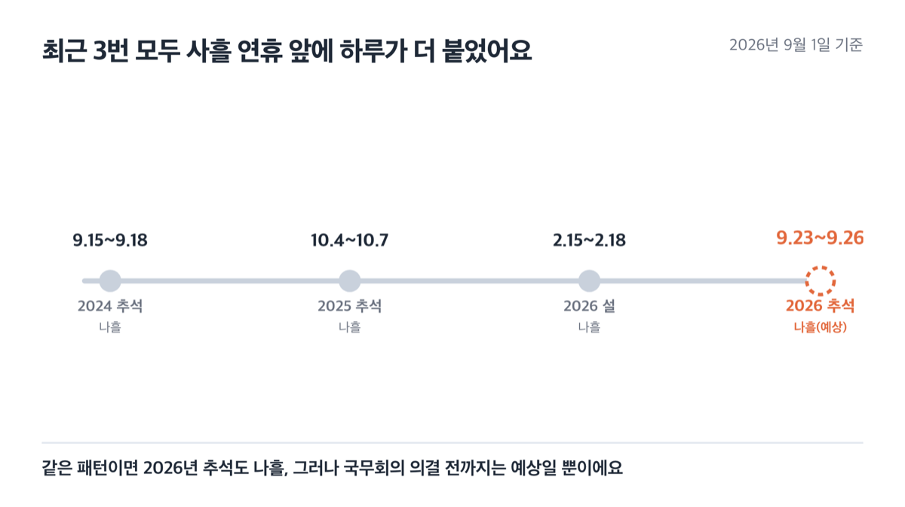
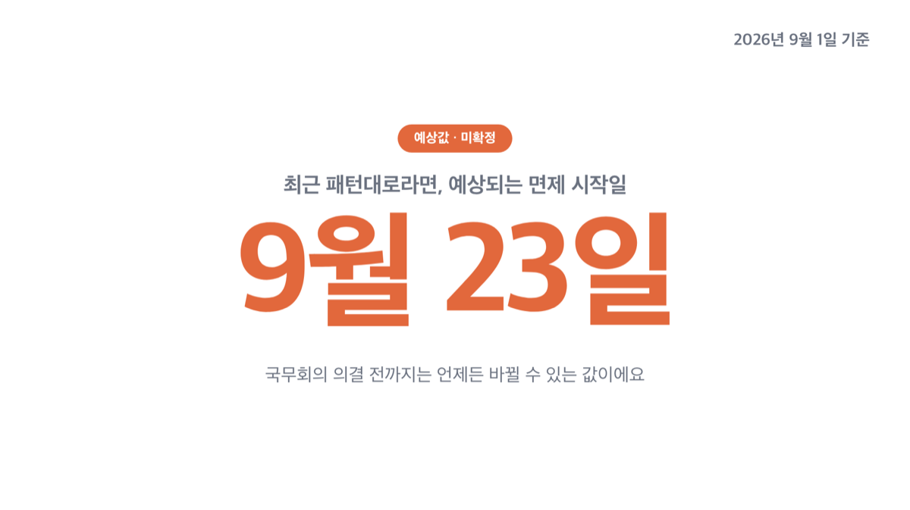
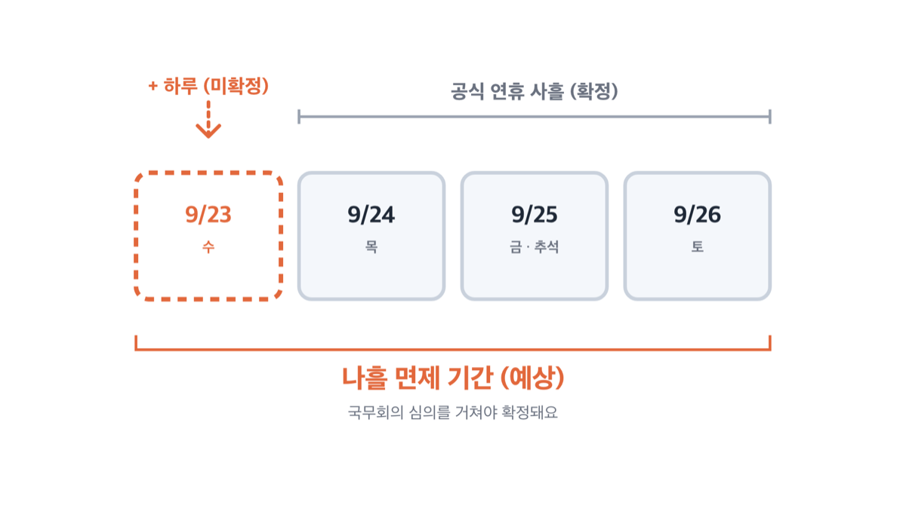
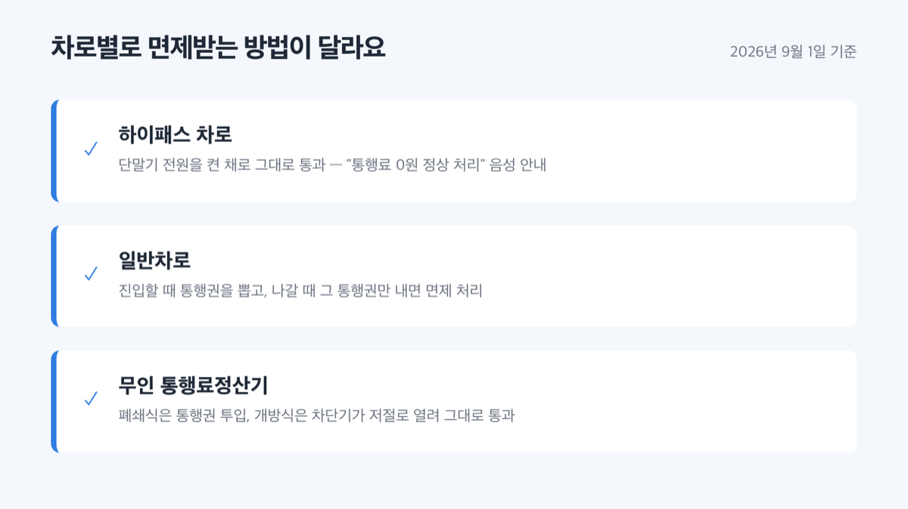
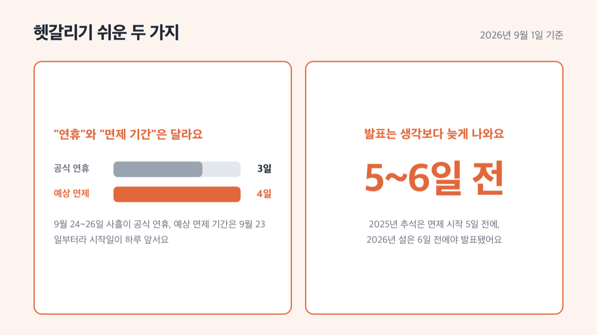

# 추석 고속도로 통행료 면제, 2026년은 9월 23일부터 예상

📌 2026년 9월 1일 기준

추석 통행료 면제, 해마다 나오니까 이번에도 당연히 정해졌겠거니 싶으실 텐데 아니에요. 2026년 9월 1일 기준으로 국토교통부도 한국도로공사도 아직 발표하지 않았어요. 다만 최근 3번의 패턴으로 며칠이나 면제될지는 미리 짐작할 수 있어요.

**3줄 요약**
- 추석 연휴엔 고속도로 통행료를 나흘간 안 받는 게 최근 패턴인데, 2026년 몫은 아직 정부가 공식 발표하지 않았어요.
- 최근 3번 사례를 그대로 적용하면 ==9월 23일(수) 0시부터 9월 26일(토) 24시==까지, 나흘간 면제될 가능성이 높아요.
- 정확한 날짜는 9월 중순쯤 나올 국토교통부·한국도로공사 발표로 다시 확인하셔야 해요.

여기서는 2026년 추석 날짜부터 예상되는 면제 기간과 그 근거, 실제 이용 방법과 발표 확인법까지 순서대로 정리했어요.

## 2026년 추석 날짜부터 정확히 짚어요

2026년 추석(음력 8월 15일)의 양력 날짜는 9월 25일(금)입니다. 전날인 9월 24일(목)과 다음날인 9월 26일(토)까지 사흘이 관공서 공휴일이에요.

여기에 대체공휴일은 붙지 않아요. 정부가 발표한 2026년 월력요항을 보면, 대체공휴일이 있는 연휴는 이름에 아예 "대체공휴일"을 함께 적어 뒀어요. 3·1절이나 부처님오신날 연휴가 그래요. 그런데 추석 연휴는 "추석연휴 및 일요일, 4일"이라고만 적혀 있어서, 대체공휴일 표기가 없어요.

그래서 주 5일제 기준으로 실질적으로 쉬는 날은 9월 24일부터 9월 27일(일)까지 나흘이에요.

**실질적으로 쉬는 날(나흘)과 통행료 면제 기간은 달라요.**

## 통행료 면제, 왜 아직 발표가 없을까

명절 당일과 전날, 다음날 사흘은 원래 통행료가 면제되는 게 기본 방식이에요. 그런데 여기에 하루를 더 붙여 나흘로 늘리는 건 그때그때 정부가 따로 결정해야 하는 절차예요. 이 확대는 ==국무회의 심의==를 거쳐야 확정돼요.

> 국토교통부가 2026년 설 연휴 보도자료 각주에 적어 둔 문장이에요.
>
> "명절기간(2.16일~2.18일) 외에 고속도로 통행료 면제일 확대(2.15일 추가)를 위해 국무회의 심의 필요(유료도로법 시행령 제8조제2항)"

'국무회의 심의 필요'라고 적어 뒀어요. 정부 마음대로 미리 정해 둘 수 있는 사안이 아니라는 뜻이에요.

> 😕 그런데 작년에도, 재작년에도 하루 더 붙었으니 이번에도 당연히 그렇지 않을까요?

물론 그럴 가능성이 높은 건 맞아요. 그러나 법으로 자동 확정되는 게 아니라 매번 국무회의를 거쳐야 하는 절차라서, 3번 연속 같은 패턴이었다고 4번째도 같으리라는 보장은 없어요.

## 최근 3번을 보면 패턴이 보여요

| 시점 | 실제 면제 기간 | 발표일 |
|---|---|---|
| 2024년 추석 | 9월 15일~9월 18일, 나흘 | - |
| 2025년 추석 | 10월 4일~10월 7일, 나흘 | 2025년 9월 29일 |
| 2026년 설 | 2월 15일~2월 18일, 나흘 | 2026년 2월 9일 |

셋 다 공식 연휴 사흘 앞에 하루를 더 붙여 나흘을 만들었어요. 앞에 붙은 하루는 전부 연휴가 시작되기 바로 전날이었고요.

발표 시점도 볼 만해요. 2025년 추석은 면제 시작 5일 전에, 2026년 설은 6일 전에야 보도자료가 나왔어요.

**"1~2주 전에 나오겠지" 하고 기다리면 계속 헛걸음이에요.**

## 2026년 추석은 언제부터 언제까지 면제될까 (예상)

| 항목 | 2026년 추석 예상값(미확정) | 예상 근거 |
|---|---|---|
| 면제 기간 | 9월 23일(수) 0시~9월 26일(토) 24시, 나흘 | 최근 3번 모두 공식 연휴 사흘 앞에 하루를 더한 패턴 |
| 발표 시기 | 9월 18~19일경 | 2025년 추석·2026년 설 모두 면제 시작 5~6일 전에 발표 |

발표 간격을 뒤집어 계산해 봤어요. 명절 시작 5~6일 전에 나왔다는 걸 2026년 추석(9월 25일)에 그대로 적용하면 ==9월 18일에서 19일 사이==가 나와요.

> [!WARNING]
> 위 표는 확정 발표가 아니라 최근 사례로 짐작한 예상값이에요. 국무회의 의결 전까지는 언제든 바뀔 수 있어요.

이 예상치는 정부 발표가 나오면 그 즉시 바뀔 수 있는 값이에요. 저라면 발표 전까지는 9월 23일을 확정값으로 여기지 않고, 9월 18일 이후에 국토교통부나 한국도로공사 홈페이지를 한 번 더 확인할 것 같아요.

## 통행료, 실제로 어떻게 면제받나

면제 기간에는 따로 신청할 게 없어요. 요금소를 그냥 지나가면 자동으로 처리돼요.

1. **하이패스 차로** — 단말기 전원을 켠 채로 그대로 통과하면 "통행료 0원이 정상 처리되었습니다"라는 음성 안내가 나와요. *(카드 잔액 걱정 안 하셔도 돼요)*
2. **일반차로** — 진입할 때 통행권을 뽑고, 나갈 때 그 통행권만 내면 바로 면제 처리돼요. *(청계·판교처럼 바로 요금을 내는 곳은 정차 후 그대로 통과하시면 돼요)*
3. **무인 통행료정산기** — 폐쇄식은 평소처럼 통행권을 넣고, 개방식은 진입할 때 차단기가 저절로 열려서 그대로 지나가면 돼요. *(정산기에 사람이 없어도 당황할 필요 없어요)*
4. **경계에 걸쳐 있을 때** — 면제 시작 전날 진입해서 시작일에 나가거나, 마지막 날 들어가서 다음날 나가도 면제돼요. *(날짜 경계에 딱 걸려도 손해 안 봐요)*

민자고속도로도 대상이에요. 2025년 설과 2025년 추석 자료 모두 "민자고속도로 포함"이라고 따로 적어 뒀어요.

## 헷갈리기 쉬운 함정 셋

1. **"공식 연휴"와 "면제 기간"은 항상 다른 날짜예요.** 2026년 추석 공식 연휴는 9월 24일~26일 사흘인데, 예상되는 면제 기간은 9월 23일~26일로 시작일이 하루 앞서요. *(달력의 빨간 날만 보고 계산하면 하루를 놓쳐요)*
2. **발표는 생각보다 늦게 나와요.** 2025년 추석은 면제 시작 5일 전, 2026년 설은 6일 전에야 발표됐어요. *(1~2주 전에 나올 거라 기대하면 계속 검색만 하게 돼요)*
3. **한국도로공사가 매번 자체 발표를 내는 건 아니에요.** 2025년 추석 때는 국토교통부만 발표했고, 도로공사 게시판에는 관련 글이 없었어요. *(도로공사 사이트만 계속 새로고침하면 못 볼 수도 있어요)*

🤭 **솔직히 말하면** — 매번 같은 패턴이라 예측은 쉬운데, 그 예측을 공식 확정처럼 말하는 글이 많아요. 확정 전까지는 예상은 예상으로 남겨 두는 게 맞아요.

## 추석 고속도로 통행료 면제 관련 궁금증 해결

**Q. 2026년 추석 통행료 면제 날짜가 아직 확정된 게 아닌가요?**
A. 네, 2026년 9월 1일 기준으로 아직 확정되지 않았어요. 최근 3번 사례로 짐작한 예상 기간일 뿐이라, 정부 발표가 나오면 그때 최종 날짜를 다시 확인하셔야 합니다.

**Q. 그럼 예상되는 면제 기간은 정확히 언제인가요?**
A. 최근 패턴대로라면 9월 23일(수) 0시부터 9월 26일(토) 24시까지, 나흘이에요. 다만 이 값도 국무회의를 거쳐야 최종 확정돼요.

**Q. 대체공휴일은 없나요?**
A. 2026년 추석 연휴에는 대체공휴일이 붙지 않아요. 관공서 공휴일은 9월 24일, 25일, 26일 사흘이고, 여기에 일요일인 27일이 이어지는 정도예요.

**Q. 하이패스가 없어도 면제받을 수 있나요?**
A. 네, 일반차로에서도 받을 수 있어요. 진입할 때 뽑은 통행권을 진출할 때 그대로 내면 바로 면제 처리돼요.

**Q. 민자고속도로도 면제 대상인가요?**
A. 네, 포함돼요. 2025년 설과 2025년 추석 자료 모두 "민자고속도로 포함"이라고 따로 명시했어요.

예상은 계획용이고, 확정은 발표 이후예요.

결국 지금 확실한 건 2026년 추석이 9월 25일이라는 것과, 정부가 아직 통행료 면제를 발표하지 않았다는 것 둘뿐입니다. 저는 이럴 때 9월 20일 전후로 국토교통부 보도자료 게시판을 한 번 더 열어 보는 걸 권해요. 나흘 예상치는 계획을 세우는 참고 자료로 쓰시고, 실제 귀성 일정은 공식 발표가 뜬 뒤에 확정하세요.

이 글은 2026년 9월 1일 기준으로 확인된 국토교통부·한국도로공사·한국천문연구원 자료와 최근 3번의 사례를 근거로 작성했어요. 2026년 추석 통행료 면제의 정확한 기간은 아직 확정되지 않았으니, 실제 귀성길에 오르기 전에 국토교통부나 한국도로공사 홈페이지에서 최종 발표를 다시 확인하시길 권해요.

참고: 한국천문연구원 「2026년 월력요항」 · 국토교통부 보도자료 「설 연휴 고속도로 통행료 4일간 면제」 · 국토교통부 「2025 추석 특별교통대책」 · 한국도로공사 보도참고자료 「설 명절 면제기간 고속도로 이용 안내」
