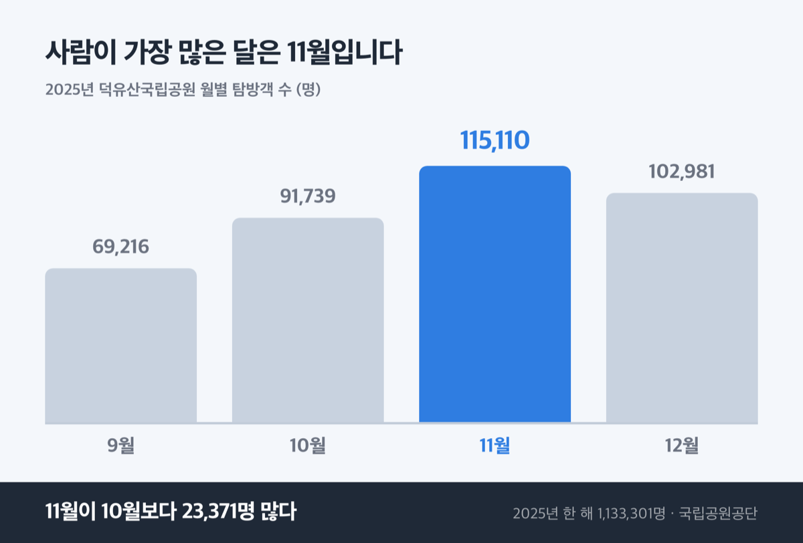
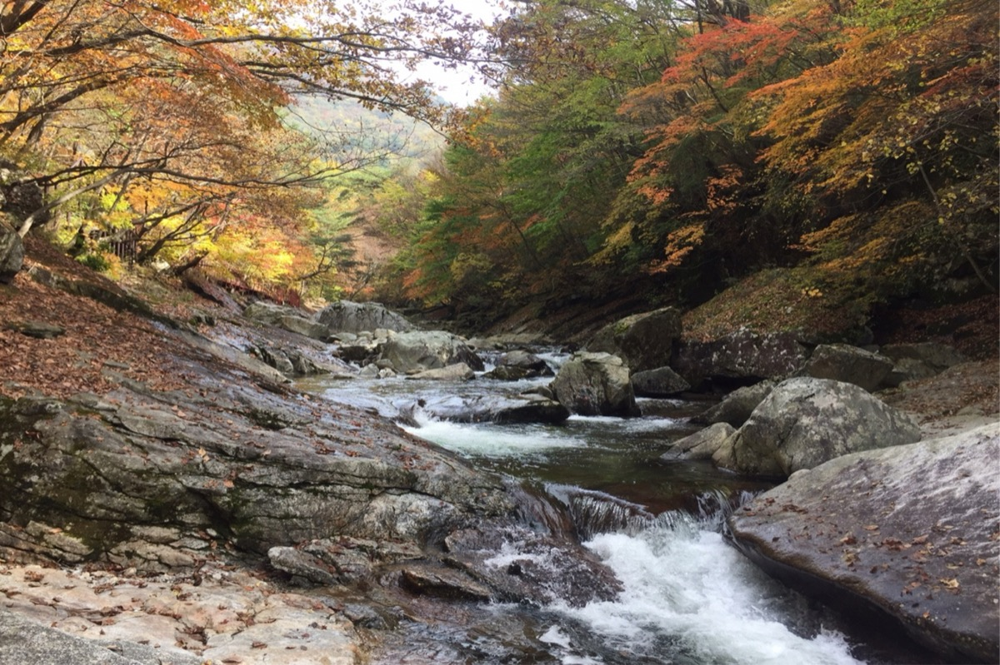
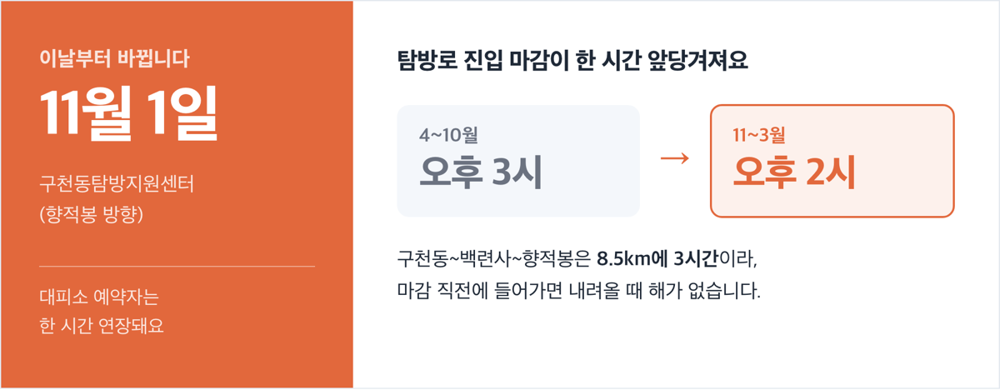
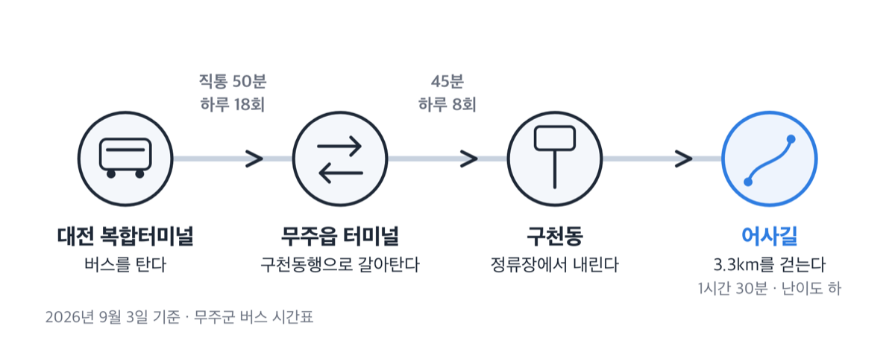

# 덕유산 단풍 시기, 2026년 10월은 주차료 5000원 성수기입니다

📌 2026년 9월 3일 기준

덕유산 단풍 보러 가는데 입장료가 얼마냐는 말이 자주 나와요. 입장료는 없어요. 2007년 1월 1일에 폐지됐고, 단풍철에 실제로 돈이 나가는 곳은 주차장입니다.

**3줄 요약**

1. 덕유산은 정상 향적봉이 1,614m, 적상산이 1,034m로 고도 차이가 580m나 나서 같은 산인데도 물드는 시기가 2주쯤 달라져요.
2. 10월 1일부터 11월 15일까지는 국립공원 주차료가 성수기 요금으로 올라 소형차 5,000원이고, 11월 1일부터는 입산 가능 시각도 한 시간 앞당겨집니다.
3. 곤도라를 탈 계획이면 10월부터 주말·공휴일이 사전 예약제라 탑승일 2주 전 오후 5시를 먼저 확인하세요.

시기와 요금, 코스, 통제 순서로 적었어요.

## 🍁 2026년 덕유산 단풍, 언제가 절정인가

산림청의 2026년 산림단풍 예측지도는 9월 3일 현재 아직 발표되지 않았습니다. 최근 발표일이 2023년 9월 25일, 2024년 9월 23일, 2025년 10월 1일이었으니 **9월 하순에서 10월 초 사이에 나올 것으로 봐요.** 이건 세 해의 발표일 범위로 잡은 추정입니다.

그래서 지금 쓸 수 있는 가장 단단한 값은 덕유산국립공원사무소가 스스로 정해 공고한 '가을 성수기' 기간이에요. 탐방객이 몰릴 것으로 보고 대형버스 출입까지 제한하는 기간이니, 사무소가 판단한 단풍철 그 자체입니다.

**덕유산국립공원 적상지구 가을 성수기 공고 기간 (연도별 실제 공고값)**

| 연도 | 성수기 기간 |
|---|---|
| 2025년 | 10월 13일(월) ~ 11월 9일(일), 28일간 |
| 2024년 | 10월 12일(토) ~ 11월 10일(일), 30일간 |

두 해 모두 10월 둘째 주에 시작해 11월 첫째 주 주말까지 갔어요. 2026년 공고는 작년 패턴대로면 10월 중순에 올라옵니다.

구간별로는 이렇게 봅니다.

1. **향적봉·설천봉 정상부** *(추정: 10월 중순 ~ 10월 하순)* — 사무소가 적상산 절정을 10월 말~11월 초로 밝혔고, 향적봉은 적상산보다 580m 높아요.
2. **구천동 계곡·어사길** *(추정: 10월 하순 ~ 11월 초)* — 남쪽으로 붙어 있는 금원산의 2025년 단풍나무류 절정이 10월 25일이었어요.
3. **적상산** *(추정: 10월 말 ~ 11월 초·중순)* — 사무소가 2019년에 밝힌 절정 예상이 10월 26일~11월 3일입니다.

왜 정상부가 먼저 물드나. 산림청은 단풍 절정을 '해당 수종이 50% 이상 물들었을 때'로 잡고, 이 시점은 기온이 떨어지는 순서를 따라갑니다. 고도가 높은 쪽이 먼저 식으니 향적봉이 앞서고 계곡이 뒤따라요.

> [!WARNING]
> 위 세 구간 값은 전부 추정입니다. 산림청 관측지점 목록에 덕유산은 들어 있지 않아서, '산림청이 덕유산 절정을 며칠로 봤다'고 말할 수 있는 자료는 없어요. 인접 관측지점과 사무소 공고를 근거로 잡은 범위입니다.

한 가지 더. 산림청은 2025년 보도자료에서 단풍 절정이 최근 10년과 비교해 4~5.2일 늦어졌고 **매년 0.43~0.52일씩 늦어지는 흐름**이라고 밝혔어요. 2019년 공지의 10월 26일을 그대로 믿으면 며칠 이르게 잡는 셈입니다.

### 사람이 가장 많은 때는 11월입니다

2025년 덕유산 월별 탐방객 수를 보면 가을에는 11월이 10월보다 많아요.

**2025년 덕유산국립공원 월별 탐방객 수 (단위: 명)**

| 월 | 탐방객 수 |
|---|---|
| 9월 | 69,216 |
| 10월 | 91,739 |
| 11월 | 115,110 |
| 12월 | 102,981 |

11월이 10월보다 23,371명 많습니다. 국립공원공단도 2025년 10월은 강우일 수와 강수량이 크게 늘어 탐방객이 줄었고, 11월에 단풍 절정으로 늘었다고 자체 분석에 적었어요. 2025년 한 해 덕유산을 찾은 사람은 1,133,301명입니다.

저라면 **10월 마지막 주 평일**에 갑니다. 정상부와 계곡의 물든 시기가 겹치는 구간이면서, 사무소가 혼잡을 경고한 10월 말·11월 초 주말을 비켜 갈 수 있어요.

## 입장료는 없고 주차료는 성수기 요금입니다

국립공원 입장료는 2007년 1월 1일에 폐지됐어요. 국립공원수입징수규칙 별표1의 '사용료 징수기준'에도 입장료 항목이 아예 없고, 주차장·야영장·대피소 시설사용료와 체험료만 있습니다. 사찰 문화재 관람료도 2023년 5월 4일부터 대한불교조계종 산하 사찰은 무료로 전환됐어요.

돈이 나가는 곳은 주차장입니다. 아래는 2026년 1월 1일 이용분부터 시행되는 값이에요.

**국립공원 주차장 정액요금 (당일 1구역 기준, 단위: 원)**

| 차종 | 주중 | 주말 및 성수기 |
|---|---|---|
| 소형 | 4,000 | 5,000 |
| 중·대형 | 6,000 | 7,500 |

소형은 승용차 전 차종과 15인승 이하 승합차, 1톤 이하 화물차예요. 중·대형은 16인승 이상 승합차와 1톤 초과 화물차입니다.

여기서 헷갈리는 대목이 둘 있어요.

1. **성수기는 7월 1일~8월 31일과 10월 1일~11월 15일입니다** *(단풍철은 통째로 성수기라 평일에 가도 주말 요금이 될 수 있어요)*
2. **주차장의 '주중'은 공휴일을 뺀 월요일~금요일입니다** *(같은 규칙 안에서 야영장 같은 일반 시설은 주중을 일요일~목요일로 따로 잡아요)*

왜 단풍철 전체가 성수기냐. 규칙 제3조가 성수기를 날짜로 못 정해 뒀기 때문이에요. 단풍이 늦게 오든 이르게 오든 10월 1일이면 요금이 올라갑니다.

깎을 수 있는 것도 정리했어요.

- 경형차와 이륜차는 **소형 요금의 50%** *(주중 2,000원, 주말·성수기 2,500원)*
- 전기차는 **충전을 위한 최초 1시간에 한해 면제**
- 그린카드로 결제하면 **주차요금 10% 할인** *(예약자 본인만)*
- 제1종 저공해자동차는 **50% 감면**
- 국가보훈 상이등급 1~3급, 심한 장애인과 보호자 1명은 **100% 감면**

> 😕 무주군 관광 사이트에는 주차료가 무료라고 적혀 있던데요?

무주군 문화관광 '주요관광요금안내' 페이지의 덕유산 항목은 머리에 '주차요금: 무료'라고 적어 두고 바로 아래에 요금표를 함께 싣습니다. 그 표의 차종 구분도 경형·중소형·대형 세 갈래인데, 2026년 1월 1일 시행 규칙은 소형과 중·대형 둘로만 나눠요. **요금을 정하는 곳은 국립공원공단이니 위 표를 기준으로 잡으세요.**

## 어느 코스로 갈까 — 20분과 3시간

향적봉까지 가는 길은 크게 둘이고, 걷는 시간이 9배 달라집니다.

**덕유산 주요 단풍 코스 (국립공원공단 공식 제원)**

| 코스 | 거리 · 소요 | 난이도 |
|---|---|---|
| 설천봉 ~ 향적봉 | 0.6km · 20분 | 중 |
| 구천동탐방지원센터 ~ 백련사 ~ 향적봉 | 8.5km · 3시간 | 중 |
| 구천동 어사길(덕유대~안심대) | 3.3km · 1시간 30분 | 하 |
| 백련사 ~ 오수자굴 ~ 중봉 | 4.2km · 2시간 | 중 |
| 서창공원지킴터 ~ 안국사(적상산) | 3.8km · 2시간 | 중 |

설천봉까지는 무주덕유산리조트 곤도라로 올라갑니다. 설천봉이 해발 1,520m이고 거기서 향적봉까지 0.6km, 20분이에요. 선로 길이 2,659m를 올라가면 정상까지 20분만 걸으면 되는 구조입니다.

**관광곤도라 왕복은 대인 25,000원, 소인 20,000원**이에요. 향적봉대피소 이용객용 편도는 대인 20,000원, 소인 16,000원입니다. 생후 36개월 미만은 무료고, 소인은 36개월부터 초등학생까지예요. 경로(65세 이상)·국가유공자·보훈대상자·장애인 1~3급은 본인 30% 할인입니다.

운행시간은 8월 31일부터 11월 1일까지가 춘추계 기준이에요. 토요일 상행 09:00~17:00, 일요일 상행 09:00~16:00, 월~목 상행 10:00~16:00입니다. **11월 2일부터는 비수기 시간표로 바뀌어 토·일 상행이 09:30에 시작해요.**

> 😕 곤도라 타면 20분이라는데, 그냥 가서 표 사면 되죠?

10월부터 2월까지는 주말과 공휴일이 사전 예약제입니다. **탑승일을 포함해 2주 전 오후 5시부터 예약**을 받아요. 주중은 영업시간 안에 현장 발권이 되고, 3월부터 9월까지는 사전 예약제를 운영하지 않습니다. 즉 단풍철 주말에 곤도라를 타려면 2주 전에 움직여야 해요.

체력이 부담되면 어사길이 답입니다. 3.3km에 1시간 30분, 난이도 '하'로 등록된 유일한 계곡 코스고, 무주 구천동 일사대 일원과 파회·수심대 일원이 명승으로 지정된 구간이에요.

한 문장으로 정리하면, 정상 사진이 목적이면 곤도라, 계곡이 목적이면 어사길입니다.

## 입산 시각과 통제 — 11월 1일에 기준이 바뀝니다

덕유산은 동절기를 11~3월, 하절기를 4~10월로 잡아요. **10월과 11월의 기준이 다릅니다.**

**덕유산 입산시간지정제 (탐방로 진입 가능 시각)**

| 통제지점 | 4~10월 | 11~3월 |
|---|---|---|
| 구천동탐방지원센터(향적봉 방향) | 04:00 ~ 15:00 | 05:00 ~ 14:00 |
| 설천봉 | 04:00 ~ 16:00 | 05:00 ~ 15:00 |
| 서창공원지킴터·치목(적상지구) | 04:00 ~ 15:00 | 05:00 ~ 14:00 |
| 안성탐방지원센터 | 04:00 ~ 15:00 | 05:00 ~ 14:00 |

11월 1일부터 진입 마감이 한 시간 앞당겨집니다. 구천동에서 향적봉으로 올라가려면 10월에는 오후 3시까지 들어갈 수 있지만 11월에는 오후 2시가 끝이에요. 8.5km에 3시간 걸리는 코스라 마감 직전에 들어가면 내려올 때 해가 없습니다. 향적봉대피소와 삿갓재대피소 예약자는 한 시간 연장돼요.

가을에 걸리는 통제가 셋 더 있습니다.

1. **가을철 산불조심기간 탐방로 통제** — 2025년에는 11월 15일부터 12월 15일까지였어요. 다만 이때도 향적봉으로 가는 두 길(설천봉~향적봉 0.6km, 구천동~백련사~향적봉 8.5km)과 서창~안국사 3.8km, 황점~삿갓골재 3.4km는 열려 있었습니다. 막히는 것은 능선과 종주 구간이에요. 2026년 기간은 예년대로면 11월 중순에 공고됩니다.
2. **적상산 대형버스 출입제한** — 가을 성수기에 안국사·전망대 주차장 진입부 1.5km 구간에서 11인승 이상 차량 출입을 제한해요. 유턴은 안국사 사고지 주차장에서 합니다.
3. **9월 13일(일) 적상산 차량 전면 통제** — 13시 30분부터 16시까지 대형주차장~전망대~안국사 삼거리 구간이 막혀요. 조선왕조실록 적상산 사고 포쇄이안 재연 행사 때문입니다.

9월 3일 현재 덕유산은 부분통제 상태예요. 8월 31일 오전 9시 기준으로 **칠연삼거리~칠연폭포**와 **안국사~안렴대** 두 구간이 막혀 있고 나머지 법정 탐방로는 열려 있습니다. 8월에 호우특보로 전면통제와 개방이 네 번 반복됐으니, 출발 전날 국립공원공단 탐방통제 현황을 한 번 열어 보세요.

반가운 것도 하나 있어요. 덕유산의 탐방로예약제는 설천봉~향적봉과 안성~동엽령 두 구간에 5월 19일~6월 22일만 적용됩니다. **단풍철에는 국립공원 탐방로 예약이 필요 없어요.** 예약이 걸리는 것은 곤도라와 야영장·대피소입니다.

## 무주까지 가는 법과 주차장 세 곳

무주에는 철도역이 없습니다. 기차로 가면 경부선 영동역에서 버스로 27km를 더 가야 해요. 서울에서 영동역까지 214km에 2시간 40분, 부산은 3시간 10분, 대구는 2시간입니다.

자가용은 통영대전고속도로 무주IC를 씁니다. 서울에서 약 3시간, 대구에서 약 2시간 30분, 부산에서 약 3시간 30분이에요.

**덕유산국립공원 등록 주차장**

| 주차장 | 주소 | 수용 |
|---|---|---|
| 구천동주차장 | 무주군 설천면 삼공리 411 | 370대(대형 50·소형 320) |
| 파회주차장 | 무주군 설천면 삼공리 223 | 153대(대형 6·소형 147) |
| 적상 상부댐 주차장 | 무주군 적상면 북창리 산119-8 | 적상분소 063-322-4174 |

안성탐방지원센터에도 44대를 세울 수 있어요. 성수기 주말에 소형 320칸이 차면 대안이 파회주차장뿐이라, 저는 이 셋 중 어디로 갈지를 출발 전에 정해 두는 편을 권합니다. 적상산 진입도로는 산성교에서 적상호까지 약 8km 구간이 급경사·급커브라 사고 주의 안내가 붙어 있어요.

차 없이 갈 수도 있습니다.

1. **시외버스** — 무주읍 버스터미널에서 구천동까지 45분, 하루 8회예요. 08:00 · 09:50 · 11:50 · 14:00 · 14:25 · 17:05 · 19:25 · 20:00에 출발하고 설천과 리조트 입구를 지납니다.
2. **직행 노선** — 구천동 버스정류장에서 서울행이 13:50 한 편, 대전행이 07:45·08:50·11:40·15:20·18:40, 전주행이 07:10·13:55·16:10에 있어요.
3. **농어촌버스** — 무주읍 터미널에서 구천동 방면으로 하루 5회(08:10·11:00·13:00·16:00·17:50) 운행합니다.
4. **리조트 무료 셔틀** — 무주관광안내소 위 P1 주차장에서 05:00·07:20·10:30·16:30에 출발해요. 15인승 차량이라 좌석이 부족하면 탑승이 거절될 수 있고, 무주읍 출발 차량은 경유지 하차가 안 됩니다.

주차 공간이 걱정이면 대전 복합터미널에서 무주읍까지 50분 직통이 하루 18회 있어요. 여기서 구천동행으로 갈아타는 방법이 있습니다.

### 하룻밤 자려면

덕유대 일반야영장은 6명 기준 일반형이 **주중 6,000원, 주말·성수기 9,000원**이고 8명 기준 대형이 **주중 9,000원, 주말·성수기 12,000원**입니다. 전기를 쓸 수 없고 주차료는 별도예요. 총 434동이고 입실은 오후 2시, 퇴실은 다음 날 정오입니다.

능선에서 1박을 할 계획이면 삿갓재대피소가 침상 1인 **주중 20,000원, 주말·성수기 30,000원**이고 정원 40명이에요. 향적봉대피소는 38석이고 예약을 네이버예약으로 받습니다. 요금과 잔여 좌석은 향적봉대피소(063-322-1614)로 확인하세요. 이곳은 전기를 제공하지 않아 침상 콘센트도 쓸 수 없어요.

적상산에 올라갈 계획이면 하나만 더 챙기세요. 상부 전망대와 안국사 화장실이 물 부족으로 이용이 불편할 수 있어서, 사무소가 올라가기 전에 아래쪽 공중화장실을 쓰라고 안내합니다. 거창 방향에서 오면 구천동주차장 화장실(무주군 설천면 구천동1로 167)이 경로에 있어요.

## 덕유산 단풍 시기 관련 궁금증 해결

**Q. 단풍철에 열리는 축제가 있나요?**
A. 무주군 공식 관광 사이트 '무주의 축제'에 등록된 축제는 9월 반딧불축제와 6월 산골영화제 둘입니다. 10~11월 축제는 목록에 없어요. 제30회 무주반딧불축제는 2026년 9월 4일부터 9월 12일까지 9일간 열립니다.

**Q. 안국사나 백련사에서 관람료를 받나요?**
A. 안국사는 2019년까지 성인 2,000원을 받았고 징수자가 대한불교조계종 안국사였어요. 조계종 산하 사찰 관람료가 2023년 5월 4일부터 무료로 전환됐으니 지금은 받지 않는 것으로 봅니다. 무주군 요금 안내에도 안국사 항목에 금액 없이 문의 전화(063-322-6162)만 있어요.

**Q. 곤도라 대신 차로 설천봉까지 올라갈 수 있나요?**
A. 설천봉으로 가는 길은 곤도라입니다. 탑승장은 무주군 설천면 만선로 185이고 주차는 리조트 주차장을 씁니다. 입장 마감은 평일 15:30, 주말·공휴일 16:00이에요.

**Q. 향적봉 상고대는 언제 볼 수 있나요?**
A. 향적봉 상고대는 국립공원 기본통계에 경관자원으로 올라 있지만 시기를 밝힌 공식 자료는 나와 있지 않습니다. 기온에 따라 달라지니 출발 전 덕유산국립공원사무소(063-322-3174)에 문의하세요.

**Q. 단풍철 주말에 대형버스로 단체 방문이 되나요?**
A. 적상지구는 가을 성수기에 11인승 이상 차량의 안국사·전망대 진입이 제한됩니다. 불법 주정차는 자연공원법에 따라 과태료가 부과될 수 있고 지자체·경찰 합동단속도 예고돼 있어요.

## 정리하면 이렇습니다

덕유산 단풍은 향적봉부터 10월 중순에 시작해 적상산으로 11월 초까지 내려옵니다. 입장료는 없고, 10월 1일부터 11월 15일까지 소형차 주차료가 5,000원이에요. 곤도라 왕복은 25,000원이고 10월부터 주말은 2주 전 예약이 필요합니다. 11월 1일에는 입산 마감이 한 시간 앞당겨집니다.

2026년 절정 예측과 가을 통제 공고는 10월 중순에서 11월 중순 사이에 순서대로 올라와요. 출발 3일 전과 전날, 두 번만 확인하면 됩니다. 확인할 곳은 국립공원공단 탐방통제 현황 페이지와 덕유산국립공원사무소(063-322-3174)입니다.

참고: 국립공원공단 「국립공원수입징수규칙」(2025-11-28 개정) · 국립공원공단 덕유산 입산시간지정제·탐방통제 현황·탐방코스 정보 · 국립공원 예약시스템 덕유대1 야영장·삿갓재대피소 안내 · 「2026 국립공원기본통계」 · 산림청 「2025년 산림단풍 예측지도」 보도자료 · 덕유산국립공원 적상산 가을 성수기 공고 · 무주군 문화관광 교통·축제·요금 안내 · 무주군 시외버스·농어촌버스 시간표 · 무주덕유산리조트 곤도라·셔틀버스 안내 · 국가유산청 2023-05-01 보도자료
