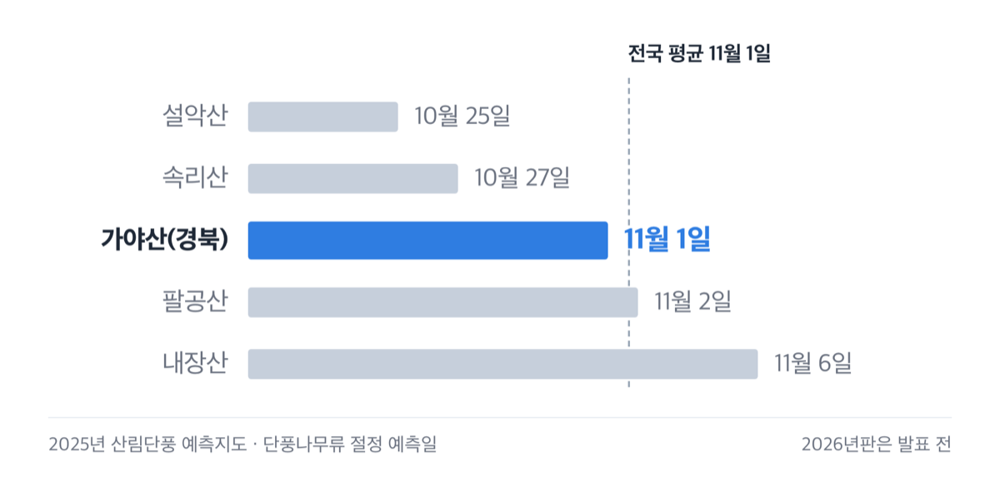
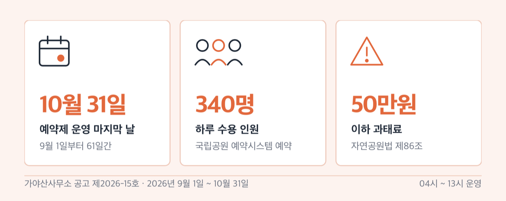
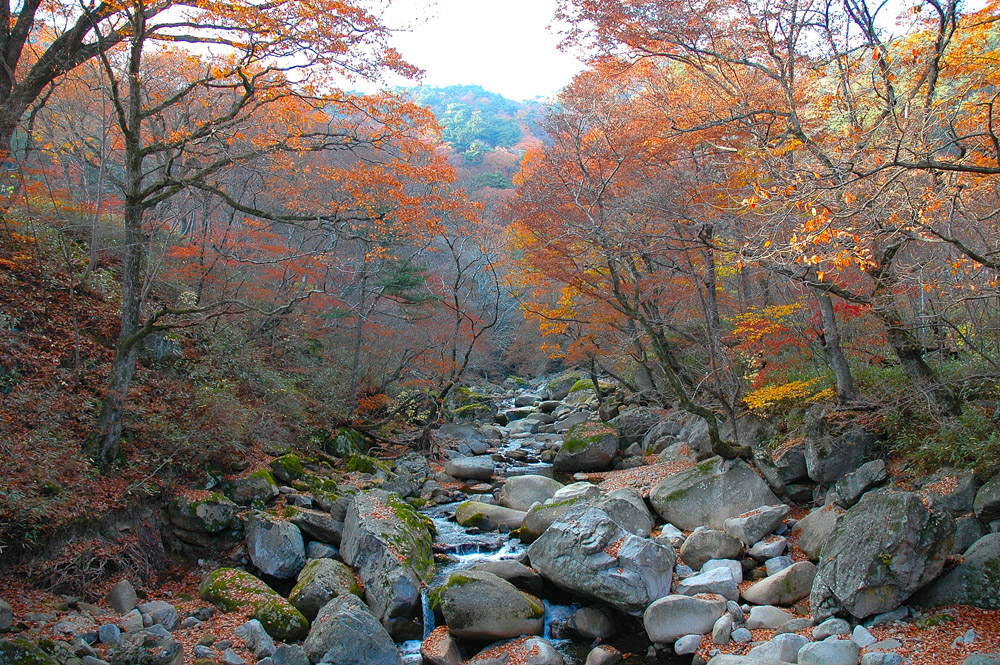

# 가야산 단풍 시기 2026, 만물상은 하루 340명 예약제

📌 2026년 9월 6일 기준

절정 날짜만 맞추면 된다고들 하는데, 가야산은 날짜보다 예약과 입산 시각이 먼저예요. 만물상은 예약 없이는 못 걷고, 11월이 되면 아침에 들어갈 수 있는 시각 자체가 바뀝니다.

**3줄 요약**

1. 가야산 단풍 절정은 10월 말에서 11월 상순 구간, 그중 11월 첫째 주 전후가 유력해요. 2026년 예측지도는 아직 나오지 않아 2025년 예측값과 올해 기온 전망으로 잡은 구간입니다.
2. 만물상 탐방로는 2026년 9월 1일부터 10월 31일까지 하루 340명 인터넷 예약제로 운영돼요.
3. 11월 1일부터 동절기 기준이 적용돼 입산 가능 시각이 한 시간 늦어지고, 통제 시각은 한 시간 빨라집니다.

이 글은 직접 다녀온 기록이 아니라 산림청·기상청·국립공원공단·합천군 안내를 하나씩 확인해 쓴 글이에요. 단풍 시기부터 예약, 소리길 거리, 주차료까지 순서대로 봅니다.

> [!WARNING]
> 2026년 산림단풍 예측지도는 2026년 9월 6일 현재 발표 전이에요. 2025년판 발표일이 10월 1일이었으니 올해도 9월 말에서 10월 초에 나올 것으로 봅니다. 아래 날짜는 그 전까지 쓰는 임시 기준이에요.

## 단풍 시기, 10월 말에서 11월 상순 사이예요

먼저 '절정'이 무슨 뜻인지부터요. 산림청이 말하는 단풍 절정은 ==그 수종의 단풍이 50% 이상 물들었을 때==입니다. 나무 절반이 물들면 절정이라, 사진으로 보던 그 붉은 계곡은 절정 며칠 전부터 이미 시작돼요.

2026년 가야산 절정일을 숫자로 밝힌 발표는 아직 없어요. 그래서 기준점을 2025년 예측지도에서 가져왔습니다.

| 지점 (2025년 단풍나무류 예측지도 기준) | 절정 예측일 |
|---|---|
| 설악산 | 2025년 10월 25일 |
| 속리산 | 2025년 10월 27일 |
| **가야산(경북)** | **2025년 11월 1일** |
| 팔공산 | 2025년 11월 2일 |
| 내장산 | 2025년 11월 6일 |
| 전국 평균 (단풍나무류) | 2025년 11월 1일 |

*(가야산은 전국 평균과 같은 날이에요. 설악산 소식을 보고 출발하면 일주일쯤 이릅니다)*

여기에 올해 날씨를 얹습니다. 기상청이 2026년 8월 24일에 낸 3개월 전망을 보면 9월과 10월은 평년보다 기온이 높을 확률이 50%, 11월은 60%예요. 10월 경남권 평년 기온은 15.4~16.2℃로 잡혀 있고요.

기온이 높으면 단풍은 늦어져요. 산림청도 절정이 최근 10년 대비 4~5.2일 늦어졌고, 단풍나무류는 해마다 0.43일씩 밀린다고 밝혔습니다. 지난해 기준점과 올해 기온 전망이 같은 쪽을 가리키니, 2026년 가야산 단풍 절정은 ==10월 말에서 11월 상순, 그중 11월 첫째 주 전후==로 봅니다. 확정된 예측이 아니라 두 자료를 이어 붙인 구간이에요.

> 😕 **10월 중순 연휴에 가면 헛걸음인가요?**
> 계곡 아래쪽은 이르지만 능선은 다릅니다. 상왕봉은 해발 1,430m대 정상부라 아래보다 먼저 물들어요. 10월 중순이면 정상 쪽 능선, 11월 초면 홍류동 계곡과 소리길로 무게를 옮기는 편이 맞아요. 홍류동(紅流洞)이라는 이름 자체가 단풍이 너무 붉어 계곡 물이 붉게 보인다고 붙은 이름이거든요.

정확한 절정일은 산림청 산림단풍 예측지도 2026년판이 나오면 그 날짜로 다시 맞추세요. 기상청 3개월 전망도 2026년 9월 23일 11시에 새 판이 나옵니다.

## 만물상은 10월 31일까지 하루 340명, 예약 없이는 못 들어가요

가야산에서 가장 유명한 만물상 코스는 지금 예약제로 묶여 있어요. 가야산사무소가 2026년 8월에 낸 공고 제2026-15호에 그대로 적혀 있습니다.

| 만물상 탐방 예약제 (2026년 공고 기준) | 값 |
|---|---|
| 운영 기간 | 2026년 9월 1일 ~ 10월 31일 (61일간) |
| 대상 구간 | 가야산 만물상 탐방로 (3.0km, 편도형) |
| 운영 시간 | 04시 ~ 13시 |
| 하루 수용 인원 | 340명 |
| 예약 방법 | 국립공원 예약시스템 인터넷 예약 |
| 위반 시 | 자연공원법 제86조에 따라 50만원 이하 과태료 |

예약제는 10월 31일에 끝나지만 절정은 11월 첫째 주 전후라, 두 기간이 서로 어긋나요. 10월 안에 만물상을 걷겠다면 예약이 필요하고, 11월에 간다면 예약 기간은 지났지만 이번에는 아래에서 다룰 입산 시각이 바뀝니다.

예약은 이렇게 합니다.

1. 국립공원 예약시스템(reservation.knps.or.kr)에 접속해 회원 가입을 합니다.
2. 가야산국립공원 탐방 예약에서 날짜를 고릅니다. 하루 340명이 상한이에요.
3. 예약자 본인 확인이 되도록 신분증을 챙깁니다.
4. 04시부터 13시 사이에 백운동탐방지원센터에서 출발합니다.

예약 개시일은 국립공원 예약시스템의 가야산국립공원 탐방 예약에서 확인하세요. 운영 기간이 10월 31일에 끝나고 하루 상한이 340명이라, 날짜를 정했으면 곧바로 잡는 편이 안전합니다.

만물상은 오르막과 내리막을 일곱 번 반복하는 험한 길이에요. 국립공원공단도 초보자와 몸 상태가 좋지 않은 사람은 용기골 쪽을 쓰라고 적어 뒀습니다. 저라면 단풍철 첫 산행으로는 만물상 대신 용기골을 고릅니다.

## 11월 1일부터 입산 시각이 한 시간 늦어집니다

가야산은 입산시간지정제 대상이에요. 들머리마다 들어갈 수 있는 시각과 되돌아 나와야 하는 시각이 정해져 있습니다. 그런데 이 기준이 11월 1일에 바뀌어요.

| 통제지점 (앞은 입산 가능, 뒤는 통제 시각) | 4~10월 | 11~3월 |
|---|---|---|
| 백운동 (만물상 구간) | 04:00~13:00 | 05:00~12:00 |
| 백운동 (용기골 구간) | 04:00~14:00 | 05:00~13:00 |
| 토신골 (상왕봉 방향) | 04:00~14:00 | 05:00~13:00 |
| 상왕봉·남산제일봉 정상 | 04:00~16:30 | 05:00~15:30 |

**왜 11월에 바뀌는가** — 해가 짧아져서예요. 어두워지기 전에 내려오게 하려고 들어가는 시각을 늦추고 나오는 시각을 당깁니다. 그래서 ==11월 1일 하루 사이에 산에서 쓸 수 있는 시간이 두 시간 줄어들어요==. 입산이 한 시간 늦어지고 통제가 한 시간 빨라지니까요.

단풍 절정이 11월 첫째 주 전후라는 것과 겹쳐 보면 계산이 나옵니다. 가장 예쁠 때 산에 쓸 수 있는 시간이 가장 짧아요.

> 🤭 **솔직히 말하면** — 새벽 5시에 백운동에서 출발하는 계획을 세우고도, 전날 밤 대구에서 출발하는 첫 시외버스가 6시 40분이라는 것을 나중에 알게 되는 경우가 많습니다. 대중교통으로 가면 정상 코스는 시간이 빠듯해요.

가야산 탐방로는 2026년 8월 31일 04시부터 전 구간이 다시 열려 있습니다.

## 소리길, 6km와 7.3km는 재는 끝점이 달라요

정상까지 오르지 않고 단풍만 보겠다면 해인사 소리길이 답이에요. 국립공원공단은 이 길을 "길이 험하지 않고 저지대여서 남녀노소 누구나 쉽게 탐방할 수 있다"고 적었습니다.

| 소리길 구간 (국립공원공단 기준) | 거리 | 걷는 시간 |
|---|---|---|
| 소리길 입구 ~ 농산정 | 4.1km | 1시간 40분 |
| 농산정 ~ 길상암 | 1.0km | 30분 |
| 길상암 ~ 영산교(종점) | 0.9km | 20분 |
| 합계 | 약 6.0km | 약 2시간 30분 |

합천군 안내에는 같은 길이 7.3km, 도보 2~3시간으로 적혀 있어요. 틀린 값이 아닙니다. 국립공원공단은 영산교까지 재고, 합천군은 대장경테마파크 주차장에서 해인사까지 재거든요. 영산교에서 해인사까지 더 걸으면 7.3km가 됩니다. **어디까지 걷는 코스인지를 정하고 값을 고르세요.**

걷다 보면 가야산 19명소 중 15곳을 지납니다. 홍류동, 농산정, 낙화담, 제월담 같은 곳이에요. 길상암에서 영산교까지는 무장애 탐방로가 깔려 있고 장애인 전용 주차 구역과 전망대, 쉼터가 각각 하나씩 있습니다.

다만 농산정과 길상암 사이 목재데크 왼쪽에는 낙석 위험 구간이 있어요. 돌계단 200m쯤은 경사도 있습니다.

출발점 주소는 이렇습니다.

1. 소리길 입구 기준 — 대장경테마파크주차장, 경남 합천군 가야면 야천리 987
2. 소리길탐방지원센터 기준 — 황산2구마을회관주차장, 경남 합천군 가야면 매화산로 661
3. 탐방지원센터 자체 주소 — 경남 합천군 가야면 황산리 976-1 *(연중 운영이에요)*
4. 정상 코스로 갈 때 — 백운동주차장, 경북 성주군 수륜면 가야산식물원길 17 *(대형 25대, 소형 92대)*

## 돈은 얼마나 드나 — 입장료는 없고 주차료만 있어요

가야산 단풍 여행에서 가장 자주 헷갈리는 것이 입장료예요. 결론부터요. 안 냅니다.

| 항목 | 금액 |
|---|---|
| 국립공원 입장료 | 없음 (2007년 1월 폐지) |
| 해인사 문화재 관람료 | 무료 (2023년 5월 4일부터) |
| 해인사 주차장 승용차 | 4,000원 |
| 해인사 주차장 경차 | 2,000원 |
| 해인사 주차장 대형버스 | 6,000원 |
| 대장경테마파크 어른 1인 | 5,000원 |

*(주차료는 합천군과 해인사 안내가 같은 값이에요)*

국립공원 주차장을 쓴다면 경형자동차와 제1종 저공해자동차는 주차장 사용료 50% 감면, 전기차는 충전을 위한 최초 1시간 면제예요. 그린카드로 결제하면 주차요금의 10%가 깎입니다.

대중교통은 대구 쪽이 압도적으로 편해요. 대구 서부정류장에서 해인사까지 시외버스로 1시간, 하루 14회 다닙니다. 첫차가 6시 40분, 막차가 20시예요. 합천군 교통 부서 요금표 기준으로 일반 8,900원, 중·고등학생 7,100원, 초등학생 4,500원입니다. 합천읍에서 들어간다면 군내버스 가야선이 6시 40분, 10시 20분, 13시 30분, 16시 20분에 있고 요금은 1,000원이에요.

1박을 하실 계획이라면 야영장 요금표의 집중수요기간을 확인해 보세요. 백운동자동차야영장은 주중 20,000원인데, ==10월 1일부터 11월 15일까지가 집중수요기간이라 30,000원==이에요. 단풍철은 전부 비싼 쪽입니다.

> [!WARNING]
> 대장경테마파크는 월요일 휴관이고 3~10월은 09:00~18:00, 11~2월은 09:00~17:00 운영이에요. 폐장 1시간 전까지 들어가야 합니다. 소리길 출발점이 이곳 주차장이라 일정을 붙여 짜기 좋아요.

## 놓치기 쉬운 것 넷

**1. 해인사 홈페이지에 아직 입장료 3,000원 표가 걸려 있어요.** 국가유산청은 2023년 5월 4일부터 조계종 사찰 관람료를 국가가 지원하는 방식으로 바꿨고, "3,000원의 관람료를 징수했던 해인사"라고 과거형으로 적었습니다. 합천군 페이지도 무료관람이에요. 그 표는 낡은 안내입니다.

**2. 합천군 안에서 시외버스 요금이 두 가지로 적혀 있어요.** 교통 부서 페이지는 8,900원에 1시간, 문화관광 페이지는 6,600원에 1시간 30분으로 나옵니다. 노선별 요금표가 붙어 있는 교통 부서 쪽이 1차 근거예요. 표를 살 때 매표소에서 다시 확인하세요.

**3. 산림청 자료 안에서도 가야산 날짜가 두 개예요.** 2025년 보도자료 본문은 11월 11일, 같은 보도자료 첨부 예측지도는 11월 1일로 적혀 있습니다. 본문이 "속리산 → 가야산 → 내장산 순"이라고 쓰면서 내장산(11월 6일)보다 뒤인 11월 11일을 적어 순서가 맞지 않아요. 그래서 이 글은 지도값 11월 1일을 앞세웠어요.

**4. 만물상 예약 기간과 절정이 어긋나요.** 예약제는 10월 31일까지, 절정은 11월 첫째 주 전후예요. 만물상 능선의 단풍과 홍류동 계곡의 단풍 중 무엇을 볼지 먼저 정하고 날짜를 잡으세요.

## 가야산 단풍 시기 관련 궁금증 해결

**Q. 2026년 가야산 단풍 절정일이 정확히 며칠인가요?**
A. 확정 발표는 아직 없어요. 산림청 산림단풍 예측지도 2026년판이 나오면 날짜가 나옵니다. 2025년판이 10월 1일에 발표됐으니 9월 말에서 10월 초를 보시면 돼요. 그 전까지는 10월 말~11월 상순 구간으로 잡는 편이 안전합니다.

**Q. 만물상을 예약 없이 걸으면 어떻게 되나요?**
A. 자연공원법 제28조 위반으로 같은 법 제86조에 따라 50만원 이하 과태료 대상이에요. 예약 기간은 2026년 9월 1일부터 10월 31일까지입니다.

**Q. 등산 못 해도 단풍을 볼 수 있나요?**
A. 소리길이 그 답이에요. 저지대 계곡길이고 길상암에서 영산교까지는 무장애 탐방로가 깔려 있어요. 전 구간을 걷지 않고 무장애 구간만 왕복해도 됩니다.

**Q. 11월에 가면 몇 시까지 산에 있을 수 있나요?**
A. 11월 1일부터 동절기 기준이라 상왕봉과 남산제일봉 정상 통제가 15시 30분이에요. 백운동 만물상 구간은 12시에 통제됩니다. 하절기보다 한 시간씩 빨라요.

**Q. 대구에서 당일치기가 되나요?**
A. 됩니다. 대구 서부정류장에서 1시간이고 하루 14회 다녀요. 첫차 6시 40분에 들어가 소리길을 걷고 18시 40분이나 20시 차로 나오면 하루가 맞습니다.

---

날짜부터 다시 정리하면 이렇습니다. 만물상을 목표로 한다면 10월 안에 예약하고 04시~13시 운영 시간에 맞춰야 하고, 붉게 물든 계곡을 목표로 한다면 11월 첫째 주 전후에 소리길로 가는 쪽이 맞아요. 저라면 11월 첫째 주 주말에 소리길을 1순위로 잡고, 만물상은 10월 중순에 따로 하루를 냅니다.

가장 먼저 하실 일은 하나예요. 9월 말에 나올 산림청 예측지도로 날짜를 확정하고, 만물상 계획이라면 그 전에 예약부터 여세요.

참고: 산림청 「2025년 산림단풍 예측지도 발표」 · 기상청 3개월 전망(2026년 9~11월) · 국립공원공단 가야산 탐방 예약제 공고 제2026-15호 · 국립공원공단 입산시간지정제 · 국가유산청 사찰 관람료 보도자료 · 합천군 해인사·소리길·교통 안내
