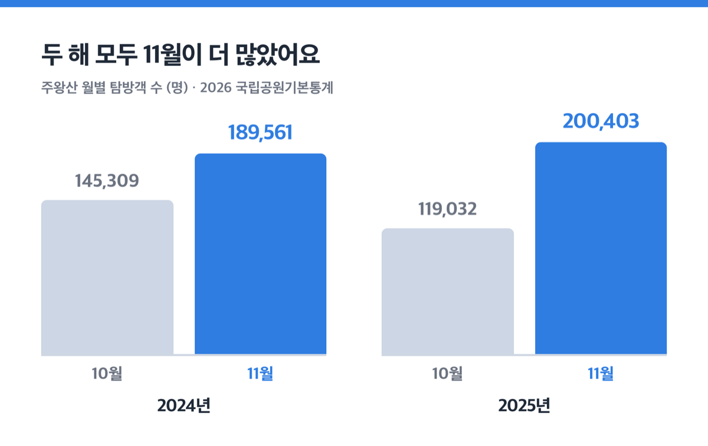
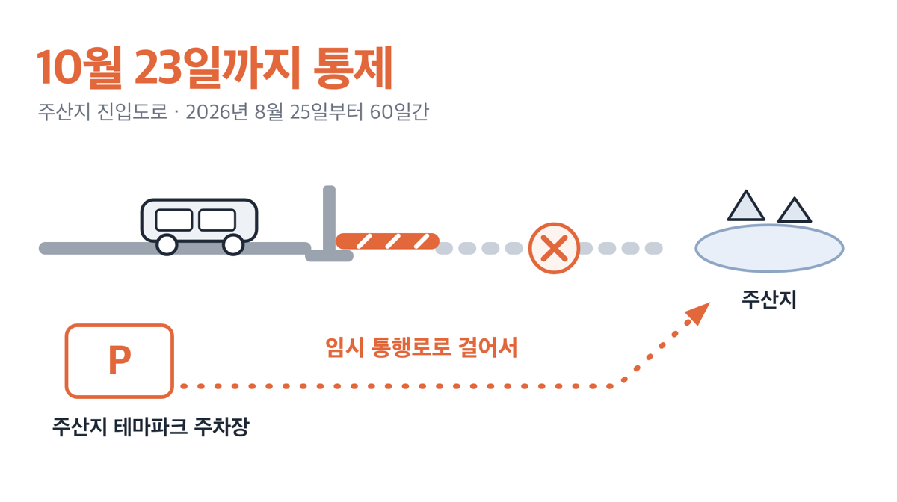
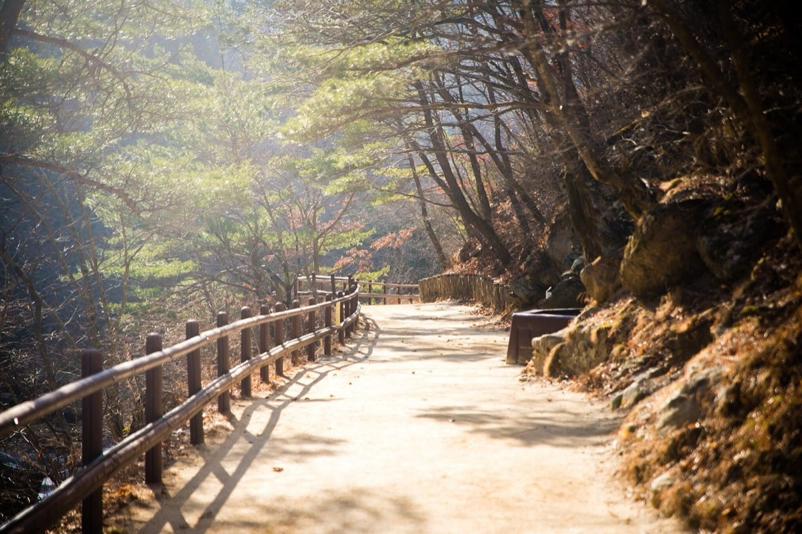

# '주차료 5천원' 주왕산 단풍 시기 2026, 11월이 더 붐빕니다

📌 2026년 9월 3일 기준

20만 403명이에요. 2025년 11월 한 달 동안 주왕산을 찾은 탐방객 수예요. 같은 해 10월은 11만 9,032명이었으니, 인파의 정점은 10월이 아니었습니다.

**3줄 요약**

- 국립공원공단은 주왕산 단풍철을 「10월 중순부터 11월 초순까지」로 안내해요. 산림청 예측으로 2025년 주왕산 단풍나무류 절정일은 10월 26일이었어요.
- 2026년 1월 1일 이용분부터 야영장 요금이 올랐고, 주차료는 10월 1일~11월 15일이 성수기 구간이라 평일에 가도 깎이지 않습니다.
- 절골~가메봉은 예약해야 들어가고 1일 정원은 1,350명이에요. 주산지 진입도로는 10월 23일까지 차로 못 들어갑니다.

가서 찍은 사진 대신, 국립공원공단·산림청·청송군이 내놓은 자료만 놓고 날짜와 요금을 맞춰 봤어요. 절정 시기부터 시작할게요.

> [!WARNING]
> 2026년 가을 산불조심기간 탐방로 통제 공고는 아직 나오지 않았어요. 2025년에는 11월 10일에 공고가 올라와 **11월 15일부터 통제가 시작됐습니다.** 11월 중순 이후 일정이라면 출발 전에 주왕산 탐방통제 현황 페이지를 다시 보세요.

## 2026년 절정 시기, 지금 말할 수 있는 것

산림청이 매년 「산림단풍 예측지도」를 내놓고 거기에 주왕산 절정일이 산 이름 단위로 적혀 있어요. 최근 두 해 값은 이렇습니다.

| 연도 | 산림청 예측 절정일 (주왕산, 수종별) |
|---|---|
| 2024년 | 단풍나무류 10월 16일 · 참나무류 10월 24일 · 은행나무 10월 22일 |
| 2025년 | 단풍나무류 10월 26일 |

여기서 「절정」은 눈대중이 아니에요. **해당 수종의 단풍이 50% 이상 물든 시점**을 절정으로 잡습니다. 국립수목원과 권역별 공립수목원 9곳, 국립산림과학원이 쌓아 온 생물계절 관측자료와 산악기상정보를 넣어 계산한 값이에요.

한 해 사이에 열흘이 움직인 게 눈에 띌 거예요. 그런데 방향은 한쪽으로 기울어 있어요. 산림청은 절정 시기가 최근 10년 평균보다 **4~5.2일 늦어졌다**고 밝혔어요. 매년 단풍나무류 0.43일, 참나무류 0.52일, 은행나무 0.50일씩 밀리는 추세예요. 2025년 전국 평균 예측만 봐도 단풍나무류가 11월 1일이었어요.

예측지도 발표일은 2023년 9월 25일, 2024년 9월 23일, 2025년 10월 1일이었어요. 세 해 모두 9월 하순에서 10월 초에 나왔으니 2026년 지도도 그 무렵을 보면 됩니다. 공식 예고는 따로 없어요.

==저라면 10월 하순을 1순위로 잡고, 11월 첫 주를 예비로 둡니다.== 2년 예측일이 10월 16일과 10월 26일이고 국립공원공단 안내가 11월 초순까지 걸쳐 있으니, 한 주를 비워 두는 쪽이 안전해요.

## 10월보다 11월에 더 몰립니다

2026 국립공원기본통계에 실린 주왕산 월별 탐방객 수예요.

| 연도 | 10월 탐방객 (명) | 11월 탐방객 (명) |
|---|---|---|
| 2024년 | 145,309 | 189,561 |
| 2025년 | 119,032 | 200,403 |

2년 연속으로 11월이 10월을 앞질렀어요. 국립공원공단도 2025년 총평에 「10월 강우일 수 및 강수량 대폭 증가로 전년 대비 탐방객 수가 감소했지만, 11월 단풍 절정으로 탐방객 수 증가」라고 적었어요. 2025년 연간 탐방객은 67만 2,143명으로 2021년 이후 5년 중 가장 많았어요.

> 😕 단풍 절정은 10월 하순이라면서, 왜 11월에 더 몰린다는 거예요?

절정일과 사람이 몰리는 날은 같지 않아요. 절정은 산 위쪽 기준이고, 사람들이 걷는 주왕계곡 아래쪽은 그보다 늦게 물들어요. 게다가 10월에 비가 잦으면 그 주 일정이 통째로 11월로 밀립니다. 2025년이 그랬어요.

정리하면 이렇습니다. **색은 10월 하순이 좋고, 사람은 11월에 더 많아요.**

## 💰 주차료와 야영장 요금 — 단풍철은 전부 성수기입니다

먼저 오해 하나를 정리할게요. 국립공원 입장료는 **2007년 1월에 폐지됐어요.** 국립공원공단 주왕산 요금안내에 실린 요금 항목은 주차장·야영장·영리목적 영상촬영료 셋뿐이에요.

주차료는 시간제가 아니라 정액요금이에요. 당일 1구역 기준으로 한 번 내면 끝입니다.

| 차종 | 주중 (원) | 주말·집중수요기간 (원) |
|---|---|---|
| 소형 (승용차 전 차종·15인승 이하 승합·1톤 이하 화물) | 4,000 | 5,000 |
| 중·대형 (16인승 이상 승합·1톤 초과 화물) | 6,000 | 7,500 |

여기서 단풍철 계획이 하나 어긋나요. 집중수요기간이 **10월 1일~11월 15일**로 정해져 있어서, ==단풍철에 가면 평일에도 5,000원을 냅니다.== 「평일에 가면 주차료가 싸다」는 계산은 이 기간에 통하지 않아요. 주차장 규정에서 주말은 토요일·일요일·공휴일이에요.

감면은 이렇게 적용돼요.

| 대상 | 주차장 사용료 감면 |
|---|---|
| 국가보훈대상자 상이등급 1~3급 · 장애의 정도가 심한 장애인 | 100% (동행인 1명 포함) |
| 그 밖의 국가보훈대상자 · 심하지 않은 장애인 · 의사상자 | 50% |
| 제1종 저공해자동차 | 50% |
| 경형자동차 · 이륜차 | 소형 요금의 50% 적용 |
| 전기자동차 | 충전을 위한 최초 1시간 100% |
| 그린카드(에코머니 로고 있는 카드) | 주차요금 10% 할인 |

감면 사유가 둘 이상 겹치면 **이용자에게 유리한 한 가지만** 적용해요. 두 개를 더해 주지 않습니다.

하루 더 묵을 계획이면 상의야영장 요금도 보세요. 자동차 야영지는 주중 2만원, 주말·집중수요기간 3만원이에요. 특화야영장은 5만 5천원과 7만원, 카라반은 7만 5천원과 10만원이고 모두 1박·1구역·4인·차량 1대 기준이에요. 정원을 넘기면 1인당 1만원씩 최대 2인까지 더 냅니다.

야영장의 「주말」은 **금·토요일과 법정공휴일 전일**이에요. 주차장의 주말과 정의가 다르니 금요일 1박은 이미 주말 요금입니다. 샤워장은 09:30~22:30 운영이고 3분당 500원, 전기는 최대 600Wh까지예요. 공용냉장고와 전기차 충전소는 운영하지 않아요. 문의는 054-873-0230이에요.

2026년 1월 1일 이용분부터 야영장·대피소 시설사용료가 인상됐어요. 대신 19세 미만 자녀 2명 이상인 다자녀 가구와 지역주민에게 10% 감면이 새로 생겼어요. 현장에서 증빙을 확인한 뒤 사후에 감면해 줍니다.

## 2026년 가을, 미리 알아야 할 통제와 예약제

2026년 9월 3일 기준으로 주왕산 탐방로는 전 구간 개방 상태예요. 9월 1일 04:00부터 「탐방로 전면 개방」 공지가 걸려 있어요. 그런데 단풍철 일정에 걸리는 것이 셋 있어요.

**첫째, 주산지 진입도로가 막혀 있어요.** 청송군이 주산지 관광지 조성사업을 하면서 **2026년 8월 25일부터 10월 23일까지 60일간** 농어촌도로 301호선 일부 구간을 통제해요. 차는 주산지 테마파크 주차장(주산지리 112)에 대고 임시 통행로로 걸어 들어가야 합니다. 문의는 청송군 관광정책과 054-870-6239예요.

물론 걸어서 못 갈 거리는 아니에요. 그런데 주산지는 새벽 물안개를 보러 가는 곳이라 차를 못 대면 동선이 크게 바뀌어요. 저는 주산지를 넣을 계획이라면 10월 24일 이후로 미룹니다. 10월 하순 절정 예측과도 오히려 맞아요.

**둘째, 절골~가메봉 구간은 예약해야 들어가요.** 2026년 1일 정원은 **1,350명**, 입장시간은 **09:00~15:00**이에요. 예약은 국립공원 예약시스템(reservation.knps.or.kr)에서 해요.

1. 예약시스템에서 「탐방로예약제」를 열고 주왕산 절골~가메봉을 고른다
2. 날짜를 골라 남은 인원을 확인하고 인원수를 넣는다
3. 예약 확인 문자를 받고, 당일 신분증과 함께 절골분소에서 확인받는다

2026년 9월 3일 기준으로 예약 화면에 열려 있는 날짜는 9월 16일부터 10월 31일까지예요. 2025년에는 9월 16일부터 11월 14일까지 60일간 운영했으니, 11월 일정을 잡는다면 예약 화면을 한 번 더 확인하세요. 같은 날 기준 예약 인원은 10월 24일 229명, 10월 31일 111명이었어요. 정원 1,350명에 여유가 있지만 절정 주말은 빠르게 찹니다. 예약 없이 들어가면 자연공원법에 따라 **50만원 이하 과태료** 대상이에요.

**셋째, 10월과 11월의 입산 가능 시각이 달라요.** 하절기와 동절기 기준이 11월에 바뀝니다.

| 통제장소 | 10월 (하절기) | 11월 (동절기) |
|---|---|---|
| 금은광이·후리메기·장군봉(백련암)·주봉(기암교) 입구 | 04:00~15:00 | 05:00~14:00 |
| 너구마을 탐방로 입구 · 대문다리 입구 | 04:00~15:00 | 05:00~14:00 |
| 절골분소~대문다리 | 04:00~16:00 | 05:00~15:00 |

11월에 가면 들어갈 수 있는 시각이 한 시간 늦어지고 마감은 한 시간 빨라져요. 긴 코스를 잡았다면 이 두 시간이 그대로 깎입니다.

## 코스와 청송사과축제, 하루에 묶는 법

주왕산국립공원 주소는 경상북도 청송군 주왕산면 공원길 169-7이고, 사무소 전화는 054-870-5300이에요. 주왕계곡 코스의 들머리 대전사 옆 주차장은 상의주차장, 갓바위 코스 들머리 주차장은 용전주차장이에요. 시외버스는 「주왕산」 터미널이 시외버스 통합예매(txbus.t-money.co.kr)에 등록돼 있어 조회와 발권이 됩니다. 노선과 시각은 그 화면과 청송군 교통 안내에서 확인하세요.

코스는 일곱 개예요. 거리와 소요시간은 국립공원공단 기준값이에요.

| 코스 | 거리 | 소요시간 |
|---|---|---|
| 주왕계곡코스 | 5.3km | 2시간 10분 |
| 가메봉코스 | 7.2km | 4시간 5분 |
| 주봉코스 | 10.1km | 4시간 40분 |
| 절골코스 | 13.5km | 7시간 5분 |
| 장군봉~금은광이코스 | 약 11.8km | 5시간 25분 |
| 월외코스 | 13km | 4시간 35분 |
| 갓바위코스 | 편도 13.3km | 편도 6시간 45분 |

처음이면 주왕계곡코스예요. 상의주차장에서 용추폭포까지가 평탄한 흙길이라 국립공원공단도 「유모차, 휠체어도 무리 없이 이동할 수 있고, 가을철 단풍이 절경인 탐방코스」로 안내해요. 완만한 경사라 온 가족이 함께 걷는 산책 코스로 적었어요.

반대로 장군봉 구간은 급경사 암벽 탐방로예요. 국립공원공단이 「어린이와 노약자는 가급적 피하는게 좋다」고 명시한 구간이에요. 단풍과 기암을 위에서 내려다보는 그림은 여기가 낫지만, 대가가 분명합니다.

11월 초에 간다면 축제를 하나 얹을 수 있어요. **제20회 청송사과축제가 2026년 11월 4일부터 8일까지 5일간** 열려요. 주제는 「지금 청송! 사과로 물들다」, 장소는 용전천 현비암 일원(청송읍 월막리 362)이고 입장료는 무료예요. 일부 체험 프로그램만 유료고, 문화체육관광부 지정 문화관광축제라 온라인 축제도 함께 돌아가요. 문의는 054-870-6237이에요.

축제장은 청송읍이고 국립공원 입구는 주왕산면 상의리예요. 같은 청송군이지만 다른 곳이니, 두 곳을 하루에 넣을 계획이면 이동시간을 지도로 미리 재 두세요.

## 자주 걸리는 것 넷

공식 안내를 그대로 읽었을 때와 실제 일정이 어긋나는 대목을 모았어요.

1. **요금 성수기와 인파 성수기가 어긋나요.** 요금 기준 성수기는 10월 1일~11월 15일인데, 2025년 실제 인파는 11월에 20만명이 넘었어요. 11월 16일 이후는 성수기 요금이 아니지만 사람은 아직 남아 있을 수 있어요.
2. **평일 주차료 할인은 단풍철에 없어요.** 10월 1일부터 11월 15일까지는 요일과 무관하게 소형 5,000원이에요.
3. **주차장과 야영장의 「주말」이 서로 달라요.** 주차장은 토·일·공휴일, 야영장은 금·토·공휴일 전일이에요. 금요일에 야영하면 주말 요금입니다.
4. **11월 중순은 통제 가능 구간이에요.** 2025년에는 산불조심기간이 10월 20일에 시작됐지만 탐방로 통제는 11월 15일부터였어요. 통제는 12월 15일까지 이어졌고 12월 16일 05:00에 부분 개방됐어요.

넷 중 셋이 날짜 문제예요. **주왕산 단풍은 코스보다 날짜에서 결과가 달라집니다.**

## 주왕산 단풍 시기 관련 궁금증 해결

**Q. 2026년 주왕산 단풍 절정일은 며칠인가요?**
A. 산림청 예측지도가 나오면 산 이름 단위로 절정일이 공개돼요. 발표는 최근 세 해 모두 9월 하순~10월 초였어요. 그전까지는 2025년 10월 26일, 2024년 10월 16일이라는 예측값과 국립공원공단의 「10월 중순~11월 초순」 안내를 기준으로 잡으면 됩니다.

**Q. 입장료가 있나요?**
A. 국립공원 입장료는 2007년 1월에 폐지됐어요. 주왕산 요금안내에 실린 요금은 주차장·야영장·영리목적 영상촬영료 셋뿐이에요. 사찰 관람료는 2023년 5월 4일부터 조계종 산하 사찰이 무료로 전환됐고, 대전사 방문 계획이라면 사찰에 한 번 확인하세요.

**Q. 절골 예약은 꼭 해야 하나요?**
A. 절골~가메봉 구간은 예약제예요. 1일 정원 1,350명, 입장시간 09:00~15:00이고 예약 없이 들어가면 50만원 이하 과태료 대상입니다. 주왕계곡코스나 주봉코스는 예약 없이 걸을 수 있어요.

**Q. 당일치기로 가능한가요?**
A. 주왕계곡코스가 5.3km에 2시간 10분이라 당일로 넉넉해요. 10월에는 04:00부터, 11월에는 05:00부터 입산할 수 있어요. 주봉코스(10.1km·4시간 40분)까지 넣으려면 11월에는 입산 마감이 14:00이라 아침 일정을 앞으로 당겨야 합니다.

**Q. 주차 공간이 넉넉한가요?**
A. 상의주차장은 2024년 11월 18일부터 2025년 8월 31일까지 전면 개선공사로 운영을 멈췄던 곳이에요. 단풍철 주말 주차 상황은 출발 전에 주왕산국립공원사무소(054-870-5300)로 물어보고 가세요.

날짜를 하나만 고르라면, 저는 10월 마지막 주 평일에 주왕계곡코스를 걷고 24일 이후에 주산지를 붙입니다. 2025년 예측 절정일이 10월 26일이고 진입도로 통제가 10월 23일에 풀리고 예약 화면도 10월 31일까지 열려 있어서, 세 조건이 겹치는 구간이 거기예요. 11월 첫 주 주말을 고르면 청송사과축제까지 얹히는 대신 20만명 쪽에 서게 돼요. 색을 고를지 여유를 고를지, 그 선택입니다.

참고: 국립공원공단 주왕산국립공원 요금안내·탐방통제 현황·코스별 난이도·입산시간지정제 안내 · 국립공원 예약시스템 · 국립공원수입징수규칙(2026년 1월 1일 시행) · 2026 국립공원기본통계 · 산림청 「2025년 산림단풍 예측지도」 보도자료 · 청송군 「제20회 청송사과축제」 보도자료 · 한국관광공사 대한민국 구석구석 · 문화재청 2023년 5월 1일 보도자료
