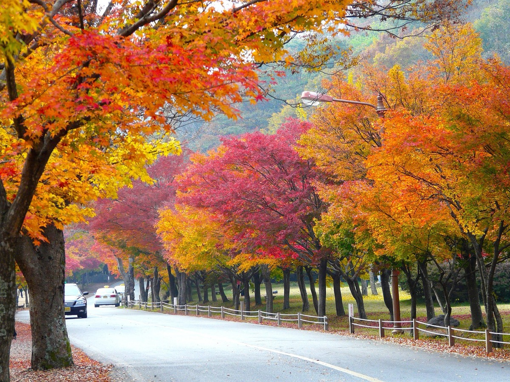
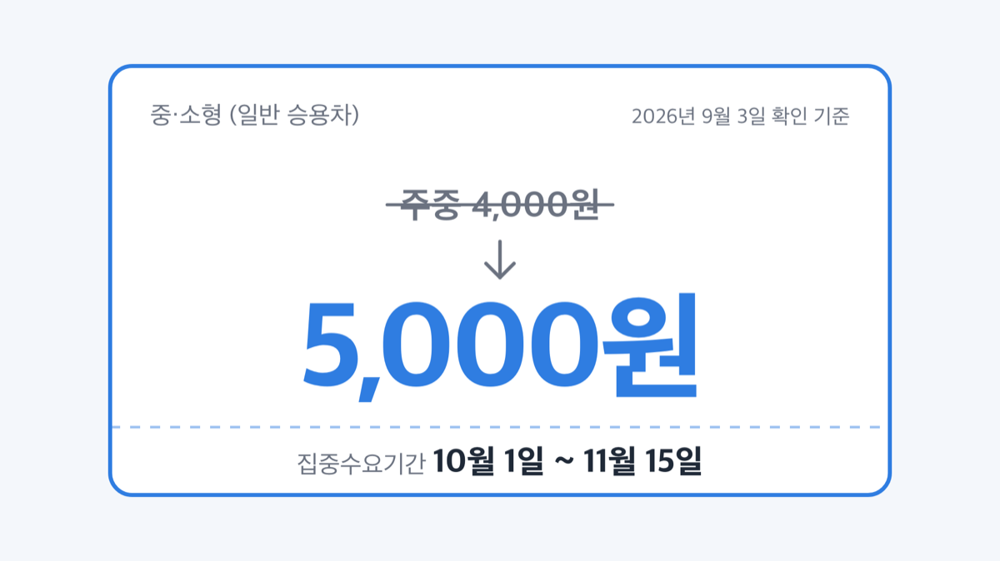
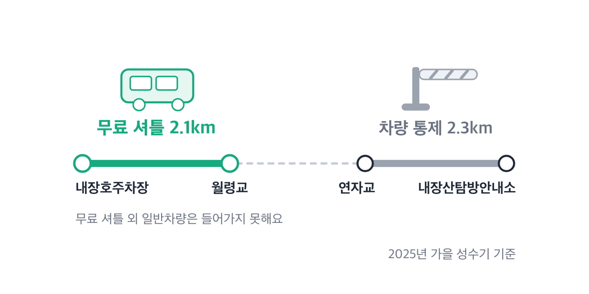

# 내장산 단풍 시기 2026, 11월 초중순 예상과 주차 5천원

📌 2026년 9월 3일 기준

내장산에 입장료가 있다고들 하는데, 없어요. 국립공원 입장료는 2007년 1월에 폐지됐고 지금 내는 돈은 주차료입니다. 그런데 그 주차료가 단풍철엔 평일에도 주말 값이에요.

**3줄 요약**

1. 내장산은 우리나라 자생 단풍 11종이 모인 곳이고, 잎이 작아 '애기단풍'으로 불려요.
2. 국립공원 입장료는 2007년 1월 폐지돼 지금 내는 돈은 주차료·야영장 사용료뿐입니다. 다만 10월 1일부터 11월 15일까지는 평일에도 주말 요금이 매겨져요.
3. 절정일과 차량 통제·셔틀 일정은 해마다 10월과 11월 초에 발표돼요. 출발 전 국립공원공단 내장산 공원별 알림과 정읍시 보도자료를 확인하세요.

절정 시기, 주차, 차량 통제와 셔틀, 가는 법 순서로 적었어요.

## 2026년 절정 시기와 애기단풍 11종

내장산 단풍의 절정 시기는 해마다 정읍시가 11월 초에 보도자료로 발표해 왔어요. 최근 2년 발표값은 아래와 같습니다.

| 연도 (정읍시 발표 기준) | 발표일 | 발표 내용 |
|---|---|---|
| 2025년 | 11월 7일 | 절반 가량 물듦, "다음 주중에 절정" 예상 |
| 2024년 | 11월 11일 | 절반 이상 물듦, "주말인 16~17일에 절정" 예상 |

두 해 모두 11월 중순 쪽으로 밀린 값이에요. 정읍시는 2024년 발표에서 그 이유까지 밝혔습니다. ==당초 절정은 10월 말로 예상됐으나 이상기후에 따른 기온 상승으로 늦어진 것으로 분석==했다는 설명이에요.

여기가 핵심입니다. 단풍은 달력이 아니라 기온을 따라가요. 가을 기온이 높으면 물드는 시점이 통째로 뒤로 밀리고, 그래서 '10월 말 단풍'이라는 오래된 감각이 최근에는 맞지 않습니다.

2026년은 어떨까요. 국립공원공단은 2026년 8월 31일에 설악산 대청봉 일대에서 첫 단풍을 관측했다고 밝혔고, 그때 평균기온은 약 16℃였어요. 같은 자료에서 설악산국립공원사무소 권기현 대청분소장은 "예년과 비슷한 시기에 단풍이 관찰될 것으로 보인다"고 했습니다. 다만 이 말은 설악산을 두고 한 것이지 내장산을 두고 한 것은 아니에요.

> [!WARNING]
> 아래 2026년 시기는 추정값입니다. 2024년 11월 16~17일, 2025년 11월 둘째 주라는 공식 발표 두 개와 국립공원공단의 "예년과 비슷" 전망을 겹쳐 본 값이에요. 정읍시가 그해 절정일을 따로 발표하니, 11월 초에 정읍시 보도자료를 다시 확인하세요.

**추정 기준으로 2026년 절정 구간은 11월 초에서 중순 사이로 봅니다.** 숙소나 기차를 미리 잡아야 한다면 이 구간을 잡고, 정확한 날짜는 11월 초 발표에 맞춰 조정하는 편이 안전해요.

시기를 잡았으면 그 시기에 무엇이 물드는지도 볼 만해요.

내장산이 단풍 명소로 꼽히는 이유는 나무 종류가 많아서예요. 정읍시 설명으로는 우리나라 자생 단풍 11종의 서식지이고, 당단풍·좁은단풍·털참단풍·복자기·고로쇠·왕고로쇠·신나무 등이 함께 자랍니다.

종마다 잎 모양이 다른 것도 구경거리예요. 목록으로 보면 이렇습니다.

1. 신나무 — 잎이 3갈래 *(가장 단순해서 구분이 쉬워요)*
2. 고로쇠나무 — 5~7갈래
3. 당단풍 — 9~10갈래 *(내장산에서 흔히 보이는 잎 모양이에요)*

잎이 작고 고우며 진한 붉은빛을 띠어서 '애기단풍'이라고 불러요. 대표 명소는 일주문에서 내장사로 이어지는 '단풍터널'과 우화정입니다.

## 입장료는 없고, 사찰 관람료는 따로 봐야 해요

국립공원 입장료는 2007년 1월에 폐지됐어요. 국립공원공단이 내장산에서 받는 요금은 주차료, 야영장 사용료, 샤워장 이용료, 촬영료뿐이고 요금안내 페이지에 입장료 항목 자체가 없습니다.

사찰 관람료는 별개예요. 2023년 5월 4일부터 조계종 산하 사찰의 문화재관람료가 무료로 바뀌었고, 전국 64개 사찰에서 감면이 이뤄졌어요. 절이 요금을 안 받는 대신 국가가 그 감면분을 지원하는 구조라 그렇습니다. 지원 규모는 2023년 419억원, 2024년 552억원이었어요.

내장사가 이 감면 대상에 드는지는 내장산국립공원사무소(063-538-7875~6)로 확인하세요.

## 🚗 주차 — 무료는 두 곳, 유료는 평일도 주말 요금

내장산 지구 주차장은 이렇게 나뉩니다.

| 주차장 (2026년 9월 3일 확인 기준) | 요금 | 규모 · 운영기간 |
|---|---|---|
| 내장주차장 (구 제1주차장) | 유료 | 7,154㎡ · 연중 |
| 봉룡주차장 (구 제2주차장) | 유료 | 15,882㎡ · 가을 성수기 한시 |
| 야영장주차장 (구 제3주차장) | 유료 | 8,548㎡ · 여름·가을 성수기 한시 |
| **내장호주차장 (구 제4·5주차장)** | **무료** | **94,000㎡ · 연중** |
| 추령주차장 | 무료 | 5,390㎡ · 연중 |

내장호주차장은 정읍시 내장호반로 273-6, 추령주차장은 순창군 복흥면 서마리 25-1이에요. 크기를 보면 답이 나옵니다. ==무료인 내장호주차장이 94,000㎡로 나머지를 다 합친 것보다 넓어요.==

유료 주차장의 요금은 아래와 같습니다.

| 차종 (2026년 9월 3일 확인 기준) | 주중 | 주말 · 집중수요기간 |
|---|---|---|
| 경형 (1,000cc 이하) | 2,000원 | 2,000원 |
| 중·소형 (일반 승용차) | 4,000원 | 5,000원 |
| 대형 (36인승 이상 승합, 5톤 이상 화물) | 6,000원 | 7,500원 |

여기서 '주말'은 토·일과 법정공휴일이고, '집중수요기간'은 7월 1일부터 8월 31일까지와 ==10월 1일부터 11월 15일까지==예요.

> 😕 "평일에 가면 주차비 싸지 않나요?"

아니요. 단풍철은 통째로 집중수요기간에 들어갑니다. 10월 1일부터 11월 15일 사이라면 화요일에 가도 승용차 5,000원이에요. 사람을 분산시키려고 만든 기간 요금이라 요일이 아니라 날짜로 걸립니다.

깎이는 경우도 있어요. 방문 전에 해당하는지만 보면 됩니다.

| 감면 대상 (2026년 9월 3일 확인 기준) | 감면 폭 (내장산 주차료·시설사용료 기준) |
|---|---|
| 국가보훈대상자 1~3급 | 시설사용료 100% |
| 국가보훈대상자 4~7급·등급 외 | 시설사용료 50% |
| 장애의 정도가 심한 장애인 (보호자 1명 포함) | 시설사용료 100% |
| 장애의 정도가 심하지 않은 장애인 | 시설사용료 50% |
| 5·18민주유공자 | 시설사용료 50% |
| 제1종 저공해자동차 | 주차장사용료 50% |
| 전기자동차 | 충전을 위한 최초 1시간에 한해 감면 |
| 그린카드 (에코머니 로고가 있는 카드) | 주차요금 10% 할인 |

주차장사용권을 잃어버리면 그날 운영개시 시각을 출차시간으로 잡아 요금을 매깁니다. 종일 주차한 값이 나온다는 뜻이에요.

## 차량 통제와 무료 셔틀, 2025년엔 이랬어요

단풍철 내장산은 안쪽으로 차가 들어가지 못해요. 2025년 가을 성수기 기준으로 통제 구간과 셔틀 운행은 이랬습니다.

| 항목 (2025년 가을 성수기 기준) | 내용 |
|---|---|
| 통제구간 ① | 내장호주차장 ~ 월령교, 2.1km |
| 통제구간 ② | 연자교 ~ 내장산탐방안내소, 2.3km |
| 통제소 | 내장호 · 월령교 · 연자교 3곳 |
| 셔틀 운행기간 | 2025년 10월 25일(토) ~ 11월 16일(일) |
| 셔틀 구간 | 내장호주차장 ~ 월령교, 2.1km |
| 셔틀 운행시간 | 주중 09:00~17:00 / 주말 08:00~17:00 |
| 셔틀 요금 | 무료 (45인승 등) |

점심시간인 12시에서 13시 사이에는 20~30분 간격으로 다니거나 운행하지 않아요. 운행 구간에는 무료 셔틀 외 일반차량이 들어가지 못합니다.

셔틀이 무료인 이유는 이 노선이 관광 상품이 아니라 통제의 짝이기 때문이에요. 차를 막았으니 걸어 들어갈 2.1km를 대신 실어 나르는 것이고, 그래서 통제 기간과 셔틀 운행 기간이 붙어 다닙니다.

2026년 일정은 아직 공고 전이에요. 다만 국립공원공단은 2024년 10월 2일과 2025년 10월 5일에 차량 통제 공고를, 2024년 10월 17일과 2025년 10월 20일에 셔틀 안내를 올렸습니다. **추정하자면 통제 공고는 10월 초, 셔틀 안내는 10월 중·하순에 나옵니다.** 공고 원문에도 "성수기 여건에 따라 운행일자·시간 등은 변경될 수 있음"이라고 적혀 있으니 출발 전날 한 번 더 보는 편이 낫습니다.

## 당일치기 순서와 가는 법

저라면 유료 주차장을 노리지 않고 내장호주차장에 차를 대고 셔틀을 탑니다. 무료인 데다 94,000㎡라 단풍철 오전에 댈 곳을 못 찾을 위험이 가장 낮고, 셔틀 출발지가 바로 거기예요. 유료 주차장을 기웃거리다 만차를 만나면 결국 내장호로 되돌아 나와야 합니다.

순서는 이렇습니다.

1. 내장호주차장(정읍시 내장호반로 273-6)에 주차 — 무료
2. 같은 곳에서 월령교행 무료 셔틀 승차 *(주말은 08:00부터, 주중은 09:00부터예요)*
3. 월령교에서 내려 일주문 방향 단풍터널과 우화정 구경
4. 내장산탐방안내소(정읍시 내장산로 1207)에서 코스 확인 *(매주 월요일 휴관이에요)*
5. 돌아오는 셔틀은 17:00까지 — 12~13시는 배차가 벌어지니 그 시간대를 피해 이동

탐방안내소에서는 유모차 4대, 휠체어 3대를 빌려줘요. 탐방코스는 자연관찰로, 서래봉, 전망대, 신선봉, 능선일주 등 9개입니다. 당일치기로 단풍만 볼 계획이면 탐방안내소에서 시작하는 자연관찰로 코스가 무난해요.

차 없이 온다면 갈아타는 곳이 정해져 있어요.

기차와 버스 모두 정읍에서 시내버스로 갈아탑니다. 기차는 정읍역에서 정읍터미널로 이동한 뒤 시내버스 171번·171-1번을 타고 내장터미널에서 내리면 내장탐방지원센터로 이어져요. 고속·시외버스는 정읍터미널에서 171번을 타면 됩니다.

| 출발지 | 수단 | 걸리는 시간 |
|---|---|---|
| 용산역 | 기차 | 3시간 30분 |
| 서대전역 | KTX | 1시간 30분 |
| 광주역 | 기차 | 1시간 30분 |
| 센트럴(호남)·동서울터미널 | 고속버스 | 3시간 30분 |
| 광주광천터미널 | 시외버스 | 1시간 30분 |
| 부산종합버스터미널 (전주 경유) | 시외버스 | 4시간 30분 |

자동차로 온다면 광주에서 내장산IC가 1시간, 대전에서 정읍IC가 2시간, 서울에서 줄포IC 경유가 3시간 30분 걸려요. 다만 단풍철 진입로 정체는 이 소요시간에 들어 있지 않습니다.

시내버스 171번의 요금과 배차 간격은 정읍시 교통 안내로 확인하세요.

## 내장산 단풍 시기 관련 궁금증 해결

**Q. 2026년 절정일은 언제 알 수 있나요?**
A. 정읍시는 2024년 11월 11일, 2025년 11월 7일에 그해 절정 예상일을 발표했어요. 2026년 값도 11월 초 정읍시 보도자료에서 확인하시면 됩니다.

**Q. 가을에 열리는 축제가 있나요?**
A. 정읍시 공식 축제 목록에 단풍 이름을 단 축제는 없어요. 2025년 가을 공식 행사는 10월 25~26일 내장산관광특구 일원에서 열린 '내장산 웰니스페스타'였습니다. 트레일러닝 대회(사전 신청 300명, 18km·11km 두 코스)와 웰니스 체험 프로그램으로 꾸려졌어요. 2026년 개최 여부와 일정은 정읍시 문화관광 누리집에서 확인하세요.

**Q. 셔틀버스는 돈을 내나요?**
A. 무료입니다. 2025년 기준 내장호주차장에서 월령교까지 2.1km를 주중 09:00~17:00, 주말 08:00~17:00에 운행했어요.

**Q. 케이블카 요금은 얼마인가요?**
A. 내장산 케이블카는 국립공원공단이 운영하는 시설이 아니에요. 요금과 운행 시간은 운영사 현장 안내로 확인하세요.

**Q. 야영장 가격은요?**
A. 내장야영장은 1박 1구역에 주중 15,000원, 주말·집중수요기간 19,000원이에요. 자동차야영장 '솔막'은 1박 55,000원, 주말·집중수요기간 70,000원입니다. 야영장은 금요일도 주말 요금이니 금·토 1박을 계획한다면 이틀 다 주말 값으로 잡으세요.

## 정리하면

단풍 날짜는 아무도 미리 못 정하지만, 돈이 드는 부분은 이미 정해져 있어요. 무료 주차장이 어디인지, 언제부터 평일도 주말 요금인지, 셔틀이 몇 시에 끊기는지는 지금 알 수 있는 값입니다. 이 셋만 잡아 두면 절정일이 며칠 밀려도 계획이 흔들리지 않아요.

출발 전 확인할 곳은 두 군데입니다. 절정일과 가을 행사는 정읍시, 차량 통제와 셔틀 일정은 국립공원공단 내장산 공원별 알림이에요. 현장 문의는 내장산국립공원사무소 063-538-7875~6, 내장산탐방안내소 063-538-7874로 하시면 됩니다.

참고: 국립공원공단 내장산국립공원 요금안내·공원시설안내·교통편안내 · 국립공원공단 내장산 공원별 알림(차량 출입 통제 공고, 무료 셔틀버스 운행 안내) · 국립공원공단 보도자료(2026.08.31) · 정읍시 보도자료(2025.11.07, 2024.11.11, 2025.10.22) · 정읍시 문화관광 누리집 · 국가유산청 보도자료(2023.05.01, 2023.12.27)
