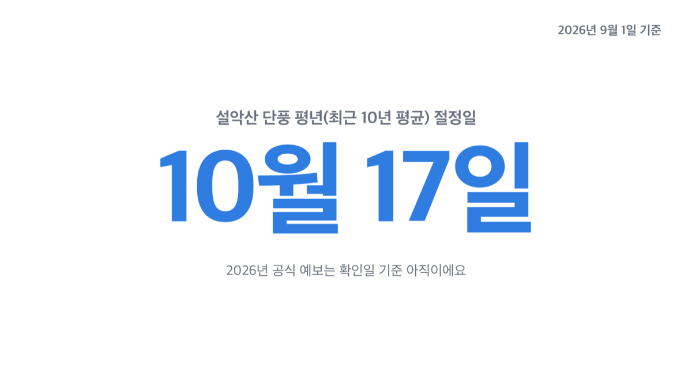
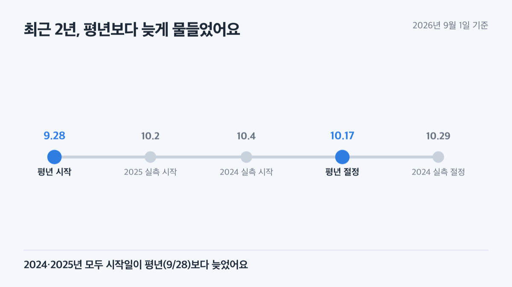
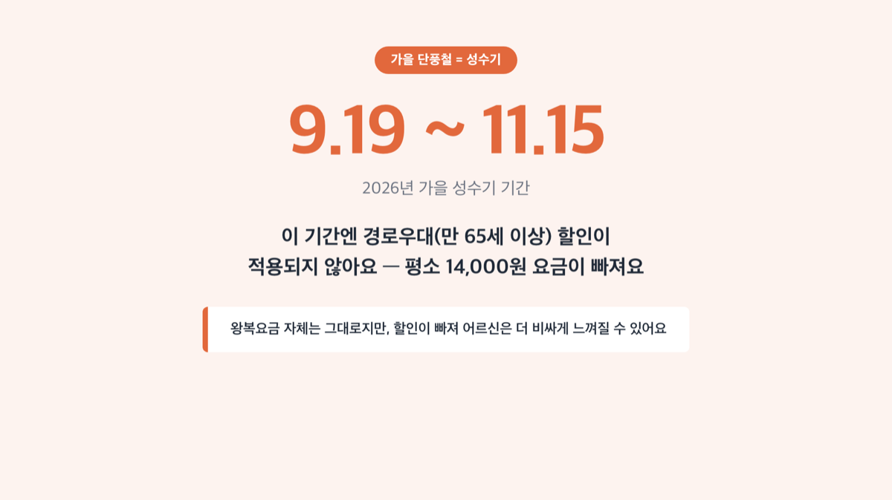
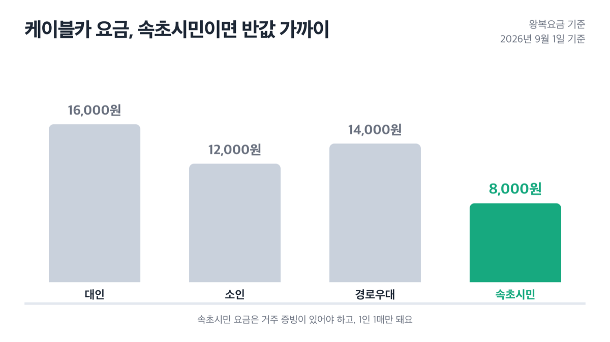
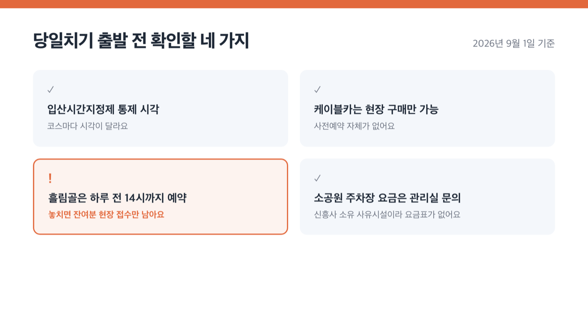
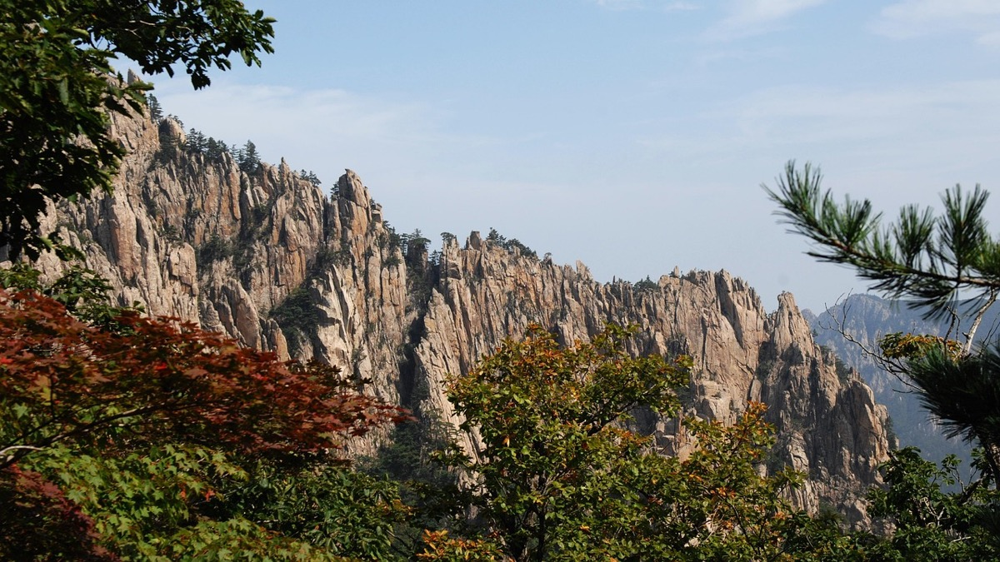
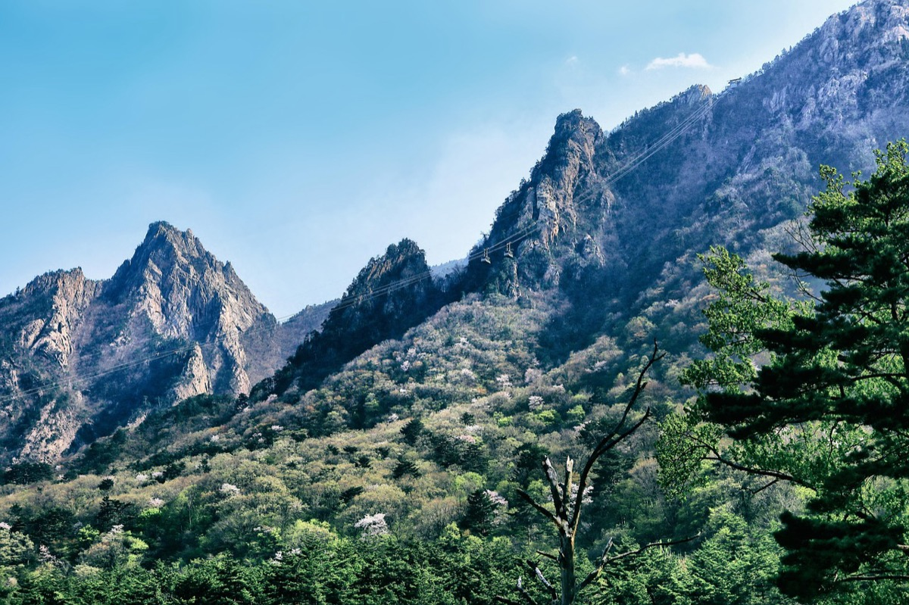
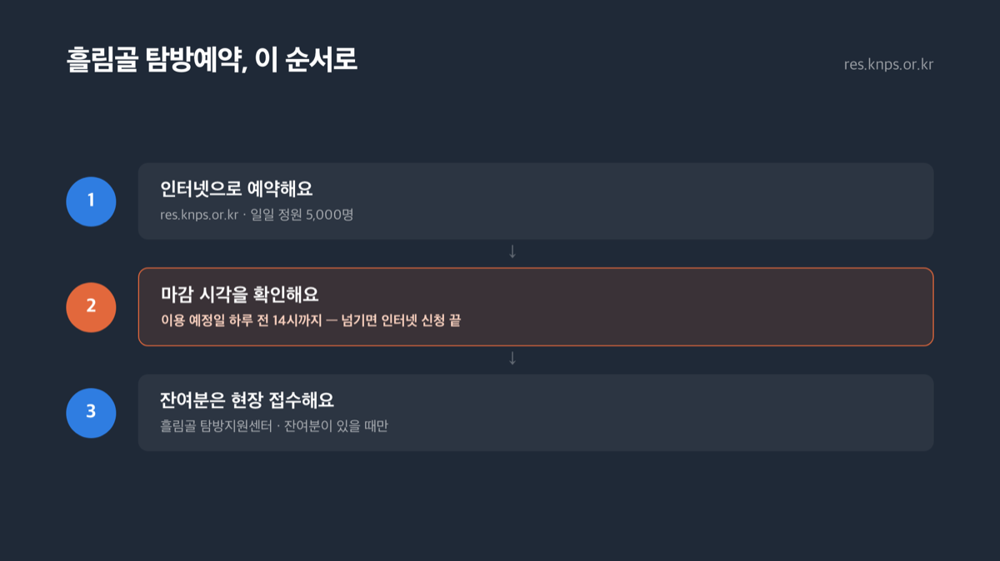

# 설악산 단풍 시기 2026, 평년 절정일 10월 17일

📌 2026년 9월 1일 기준

10월 17일이에요. 설악산 단풍이 가장 짙어지는 절정일, 평년 기준 값이에요. 다만 2026년 공식 예보는 아직 안 나왔어요.

**3줄 요약**
- 설악산 단풍 평년 절정일은 ==10월 17일==, 2026년 공식 예보는 확인일 기준 아직 안 나왔어요.
- 2026년은 8월 31일에 대청봉에서 첫 색 변화가 이미 관측됐어요.
- 케이블카는 ==사전예약 불가==, 흘림골은 10~11월만 예약제로 운영돼요.

> [!WARNING]
> 아래 날짜는 최근 10년 평년값이에요. 2026년 실제 절정일은 기상청과 산림청 모두 확인일(2026년 9월 1일) 기준으로 아직 발표하지 않았어요. 9월 중순 이후 다시 확인하세요.

이 글에서는 평년·최근 실측 날짜부터 케이블카 요금과 운영, 코스별 소요시간, 입산시간과 예약제, 가는 법과 주차까지 순서대로 정리했어요.

## 📅 언제가 절정일까 — 평년과 최근 실측

기상청은 그 산 전체 나뭇잎의 20%가 물들면 '시작'으로, 80% 이상 물들면 '절정'으로 판정해요. 사람 눈으로 보는 감각은 저마다 다르니까, 관측 지점의 잎 색 변화 비율로 기준을 통일해 재는 거예요.

| 구분 | 시작일 | 절정일 |
|---|---|---|
| 평년(10년 평균) | 9월 28일 | 10월 17일 |
| 2024년 실측 | 10월 4일 | 10월 29일 |
| 2025년 실측 | 10월 2일 | 미발표 |

기상청은 2025년 절정일을 따로 발표하지 않았어요.

> 그럼 그냥 10월 17일에 맞춰 가면 되는 거 아닌가요?
> 그렇게 딱 떨어지면 편하겠지만, 최근 2년 다 시작일이 평년보다 늦었어요. 2024년은 절정일도 평년보다 12일이나 늦었고요. 그래서 저라면 10월 17일보다 며칠 뒤로 방문일을 잡겠어요.

2026년에는 8월 31일 국립공원공단 설악산국립공원사무소가 대청봉(해발 1,708m) 일대에서 첫 색 변화를 확인했다고 밝혔어요. 일부 잎이 노란색과 붉은색으로 변하기 시작한 초기 단계라 기상청이 정의하는 20% 기준의 공식 '단풍 시작'에는 아직 못 미쳤고요. 대청분소장 권기현은 "예년과 비슷한 시기에 단풍이 관찰될 것으로 보인다"고 말했어요.

실시간 진행 상황은 기상청 날씨누리의 '유명산 단풍현황' 페이지에서 볼 수 있어요. 다만 확인일(2026년 9월 1일) 기준으로는 "현재 서비스 기간이 아닙니다"라는 문구만 떠요. 강원지방기상청이 운영하는 '강원 단풍·기상 융합서비스'는 지난해 9월 22일부터 11월 7일까지 47일간 열렸으니, 올해도 9월 중하순쯤 다시 열릴 걸로 보여요.

## 🚡 케이블카 요금과 운영시간

설악 케이블카는 왕복요금만 팔아요. 편도 탑승권은 없어요. 요금은 대인·소인 기본 구간과 국가유공자·경로우대·속초시민 할인 대상 구간으로 나뉘어요.

| 구분 | 왕복요금(원) |
|---|---|
| 대인(중학생 이상) | 16,000원 |
| 소인(36개월~초등학생) | 12,000원 |
| 유아(36개월 미만) | 무료 |
| 국가유공자·중증장애(1·2급) 대인 | 13,000원 |
| 국가유공자·중증장애(1·2급) 소인 | 9,500원 |
| 경로우대(만 65세 이상) | 14,000원 |
| 속초시민(거주 증빙, 1인 1매) 대인 | 8,000원 |
| 속초시민(거주 증빙, 1인 1매) 소인 | 6,000원 |

경로우대 할인은 성수기엔 적용되지 않는다고 명시돼 있어요. 2026년 성수기는 7월 18일~8월 23일, 9월 19일~11월 15일이에요. 가을 단풍철(9월 19일 이후)은 이 성수기에 그대로 들어가니까, 어르신과 함께 간다면 미리 확인하세요.

예약은 안 돼요. 케이블카 공식 홈페이지에는 기상 변동의 영향을 받는 시설이라 사전 예약을 받지 않고 당일 현장 구매만 가능하다고 안내돼 있어요. 운행시간도 고정돼 있지 않아서 그날그날 홈페이지 첫 화면에 새로 게시돼요.

환불은 탑승 10분 전까지는 전액, 그 이후엔 요금의 20%를 뺀 나머지만 돌려줘요. 강풍 등으로 운행이 중단되면 미사용 탑승권은 전액 환불돼요.

케이블카 회사는 주차장을 운영하지 않아요. 홈페이지에도 "국립공원 주차장 요금은 당사와는 무관함을 알려드립니다"라고 명확히 적어 놨어요.

> 솔직히 말하면 — 왕복요금 자체는 성수기에도 그대로예요. 다만 경로우대 할인이 빠지니까 어르신 입장에선 가을에 오히려 더 비싸게 느껴질 수 있어요.

## 입장료·관람료, 지금은 완전히 무료예요

설악산은 입장료가 없어요. 2007년 1월 1일부터 전국 국립공원 입장료가 폐지됐고, 2026년 지금까지 그대로예요. 국립공원공단 설악산 요금안내 페이지에도 입장료 항목 자체가 없어요.

신흥사 문화재관람료도 마찬가지예요. 2023년 5월 4일부터 국가가 전국 65개 사찰의 문화재관람료를 대신 부담하면서 전액 무료로 바뀌었어요. 국가유산청 원문 보도자료엔 절 이름이 하나하나 나오진 않지만, 신흥사가 이 65곳에 들어간다고 전한 언론 보도가 여럿이에요.

오래된 블로그 글엔 아직도 "신흥사 입장료 3,500원"이라고 적힌 게 남아 있어요. 2023년 5월 시행 이전 요금이 검색에 계속 걸리는 거라, 지금 기준으로는 안 맞는 정보예요. 검색해서 나온 글의 작성일부터 먼저 확인하세요.

## 코스 고르기 — 당일치기로 되는 코스, 1박2일이 필요한 코스

| 코스명 | 소요시간 | 난이도 |
|---|---|---|
| 비룡폭포(토왕폭전망대) | 1시간 30분 | 하 |
| 금강굴 | 2시간 | 하 |
| 울산바위 | 2시간 | 중 |
| 양폭 | 3시간 10분 | 하 |
| 대청봉(오색) | 4시간 | 상 |
| 대청봉(설악동) | 10시간 40분 | 상 |
| 공룡능선 | 14시간 40분 | 상 |

이 중 대청봉(설악동)과 공룡능선은 하루 안에 왕복하기 어려워서 1박2일로 잡아야 하는 코스예요. 대청봉(오색)은 편도만 4시간이라 왕복이면 8시간이 훌쩍 넘어요. 새벽에 나서지 않으면 일몰 전에 못 내려와요.

당일치기로 단풍만 보고 오려면 저라면 비룡폭포나 금강굴, 울산바위 중 하나를 고르겠어요. 셋 다 2~3시간 안팎이고 난이도도 하~중이라 왕복해도 해 지기 전에 내려올 수 있거든요.

출발 전에 확인할 네 가지가 있어요.

- 입산시간지정제 통제 시각 *(코스마다 시각이 달라요)*
- 케이블카는 현장 구매만 가능해요 *(사전예약 자체가 없어요)*
- 흘림골로 갈 계획이면 하루 전 14시까지 예약해요 *(놓치면 잔여분 현장 접수만 남아요)*
- 소공원 주차장 요금은 관리실에 직접 물어봐요 *(신흥사 소유 사유시설이라 요금표 자체가 없어요)*

## 입산시간과 흘림골 예약제, 놓치면 못 들어가요

하절기(4~10월)엔 통제지점마다 입산 가능한 시각이 정해져 있어요. 단풍철에도 그대로 적용돼요.

| 통제지점 | 진행방향 | 하절기(4~10월) 입산~통제 |
|---|---|---|
| 비선대 | 양폭 방향 | 03:00~14:00 |
| 비선대 | 마등령 방향 | 03:00~11:00 |
| 남설악(오색) | 대청봉 방향 | 03:00~12:00 |
| 한계령 | 한계령삼거리 방향 | 03:00~12:00 |

대피소를 예약했으면 탐방지원센터에서 통제시간을 1~2시간 늘려줘요.

흘림골(용소폭포삼거리 방향)은 ==10~11월만== 탐방예약제로 운영돼요. 그 외 달엔 예약 없이 입산시간지정제만 지켜요.

| 항목 | 흘림골 예약제 내용(10~11월 기준) |
|---|---|
| 운영기간 | 10~11월만 |
| 10월 운영시간 | 08:00~15:00(1시간 단위) |
| 11월 운영시간 | 09:00~14:00(1시간 단위) |
| 일일 정원 | 5,000명 |
| 예약 방법 | 인터넷 예약(res.knps.or.kr), 잔여분만 현장 접수 |
| 예약 마감 | 이용 예정일 ==하루 전 14시==까지 |

이 마감 시각을 넘기면 인터넷으로는 신청할 수 없습니다. 잔여분이 있어야 흘림골 탐방지원센터에서 현장 접수를 받을 수 있어요.

제 판단엔 이 두 달만 예약제를 두는 이유가 단풍철에 몰리는 인원을 조절하려는 목적일 것 같아요. 1~9월과 12월은 같은 구간에 예약제 없이 입산시간지정제만 적용되거든요.

## 가는 법과 주차 — 대중교통과 소공원 주차장

속초와 동서울종합터미널을 잇는 시외버스는 하루 37회 다녀요(첫차 06:00, 막차 21:00). 요금은 등급에 따라 16,400원~26,800원 사이예요.

속초 시내버스는 7번(첫차 06:47, 막차 18:10)과 7-1번(첫차 06:30, 막차 19:45)이 소공원 방면으로 다니고, 두 노선이 엇갈려서 15~20분 간격으로 잡을 수 있어요. 정확한 요금은 승차할 때 확인하세요.

설악동 소공원 주차장은 국립공원공단이 아니라 신흥사가 소유하고, 사찰이 개인에게 임대해 운영하는 사유시설이에요. 그래서 국립공원공단 요금안내 페이지에도 이 주차장 금액은 없고 관리실 전화번호(033-636-4050)만 안내돼 있어요. 정확한 요금은 이 번호로 직접 확인하세요.

## 설악산 단풍 관련 궁금증 해결

**Q. 설악산 입장료가 아직 있나요?**
A. 없어요. 2007년에 국립공원 입장료가 전국적으로 폐지됐고, 2023년 5월부턴 신흥사 문화재관람료도 무료로 바뀌었어요.

**Q. 케이블카를 미리 예약할 수 있나요?**
A. 안 돼요. 기상 변동의 영향을 받아 사전예약을 받지 않고, 당일 현장 구매만 가능해요.

**Q. 흘림골은 아무 때나 갈 수 있나요?**
A. 아니에요. 10~11월만 탐방예약제로 운영되고, 이용일 하루 전 14시까지 인터넷으로 예약해야 해요.

**Q. 소공원 주차장 요금은 얼마인가요?**
A. 국립공원공단 요금표엔 없어요. 신흥사 소유 사유시설이라 관리실(033-636-4050)로 직접 문의해야 정확한 금액을 알 수 있어요.

**Q. 2026년 절정일이 언제인지 확정됐나요?**
A. 확인일(2026년 9월 1일) 기준으로 아직이에요. 평년 절정일인 10월 17일을 기준으로 계획을 잡고, 9월 중순 이후 기상청 발표를 다시 확인하세요.

정리하면, 평년 절정일 10월 17일을 기준 삼되 최근 2년 흐름을 보면 그보다 며칠 늦춰 잡는 편이 안전해요. 출발 전엔 케이블카 홈페이지에서 그날 운행시간을 확인하고, 흘림골로 갈 계획이면 하루 전 14시 예약 마감을 놓치지 마세요. 9월 중순부터는 기상청과 국립공원공단이 내놓는 실측 소식을 다시 확인하고 날짜를 조정하는 게 가장 확실합니다.

참고: 국립공원공단 설악산국립공원 요금안내·코스별난이도 안내 · 국립공원공단 입산시간지정제 안내 · 국립공원공단 '고객의 소리' 주차료 관련 답변 · 국립공원 예약시스템 흘림골 탐방예약제 안내 · 설악 케이블카 공식 홈페이지 · 기상청 보도자료(2024·2025년 설악산 단풍) · 강원지방기상청 보도자료 · 국가유산청 문화재관람료 무료 전환 보도자료 · 경향신문·전매일보(2026년 8월 31일 보도) · 버스타고 노선조회 · 속초시 대중교통정보
