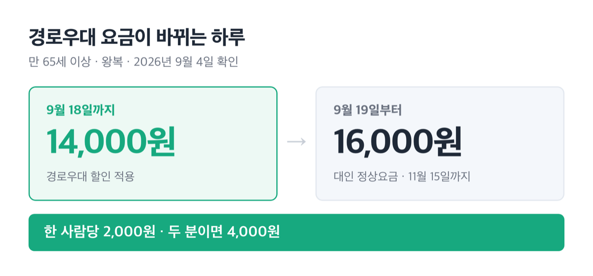
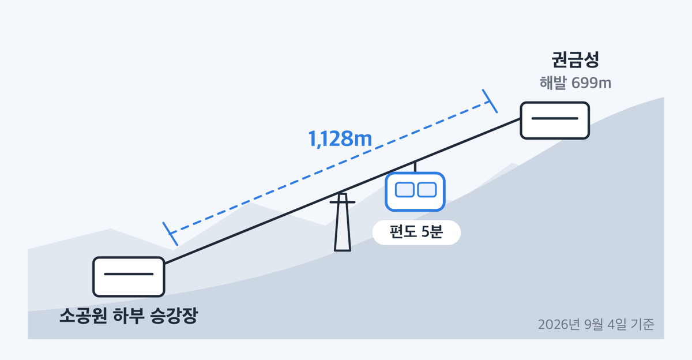
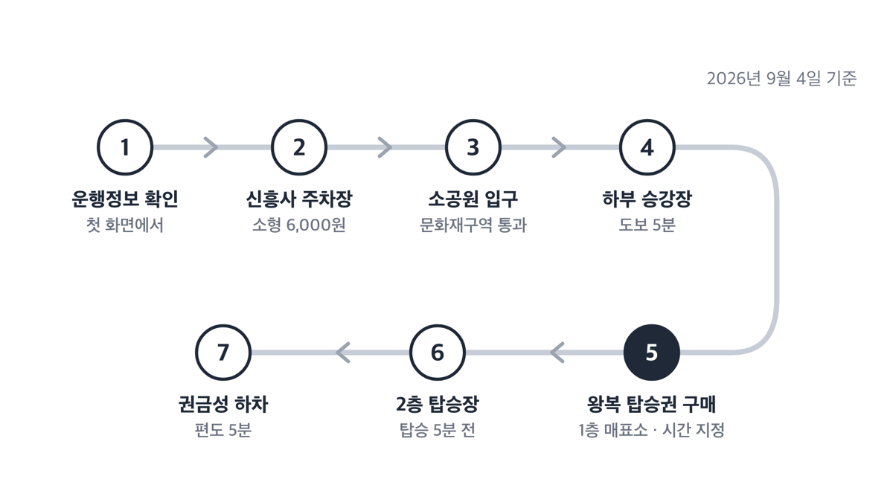
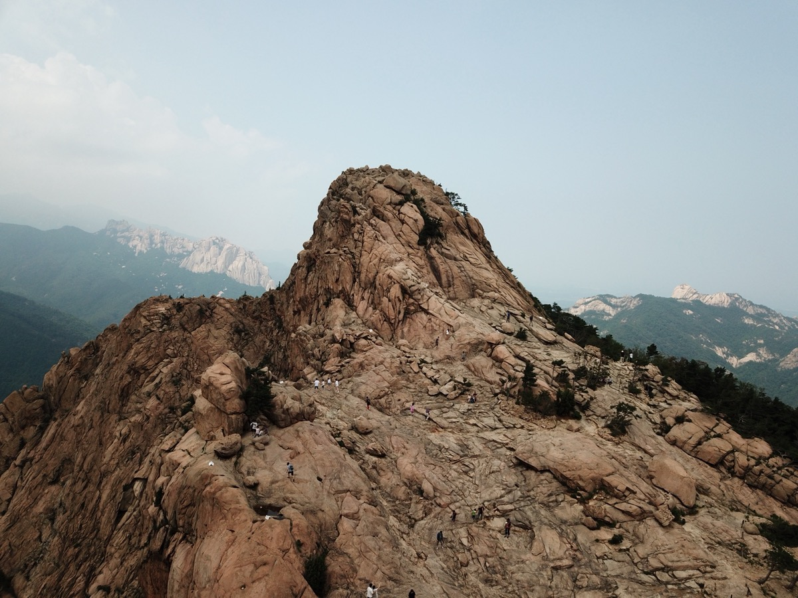
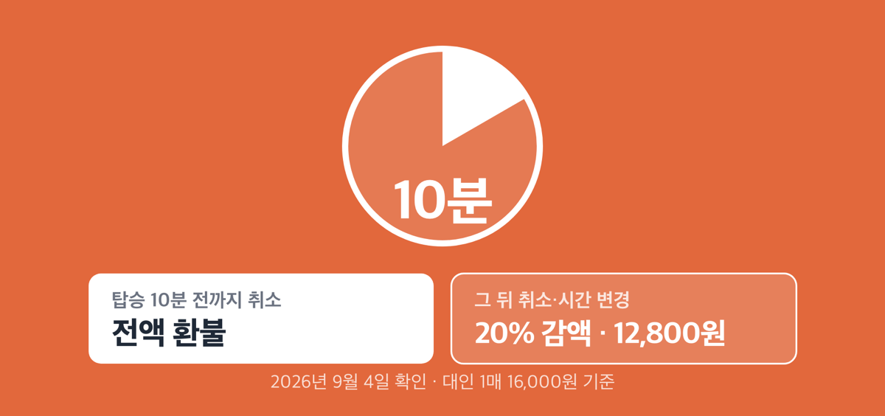

# 설악산 케이블카 예약 없어요, 2026년 왕복 16,000원 현장 발권

📌 2026년 9월 4일 기준

설악산 케이블카는 예약할 방법이 없습니다. 사전 예약 제도 자체가 없고, 당일 하부 승강장 1층 매표소에서 현장 구매만 됩니다. 그래서 미리 확인할 것은 예약 사이트가 아니라 그날의 운행시간과 매표 마감 시각이에요.

**3줄 요약**

- 설악 케이블카(속초 소공원~권금성)는 사전 예약을 받지 않고, 당일 현장 매표소에서만 표를 팝니다.
- 왕복 요금은 대인 16,000원·소인 12,000원이고, 편도 탑승권은 아예 판매하지 않아요.
- 2026년 9월 19일부터 11월 15일까지는 경로우대 할인이 적용되지 않습니다.

요금과 할인 제외 기간, 현장 발권 순서, 환불 기준을 차례로 적었어요.

## 예약 창구가 없는 이유

설악 케이블카의 판매 방식은 당일·현장·왕복 셋입니다. 운영사 공식 안내는 기상 변동의 영향을 늘 받는다는 이유를 들어 "사전 예약은 받지 않으며, 당일 현장 구매만 가능합니다"라고 적어 두었어요. 같은 내용이 자주 묻는 질문에도 한 번 더 나옵니다.

기상을 이유로 든 데는 까닭이 있어요. 강풍·낙뢰·시야 악화 같은 현장 안전 판단이 나오면 곧바로 운행을 멈추거든요. 미리 팔아 두면 멈출 때마다 전부 환불해야 하죠. 대신 운행이 중단되면 사용하지 않은 탑승권은 전액 환불해 줍니다.

공식 홈페이지에는 결제나 예매 기능이 없어요. 표를 사는 곳은 하부 승강장 1층 매표소 한 곳입니다.

> 😕 그럼 주말 아침에 갔다가 표가 없으면 헛걸음 아닌가요?

여기서 개념 하나만 바꾸면 됩니다. 예약이 없으니 '매진'도 없고, 대신 ==판매 회차와 대기시간==이 움직여요. 공식 공지도 "탑승권은 현장 상황과 대기 인원에 따라 판매 회차가 달라질 수 있습니다"라고만 적습니다. 그래서 확인할 값은 남은 표가 아니라 그날의 매표 마감 시각과 예상 대기시간이에요.

## 왕복 16,000원, 편도는 안 팝니다

2026년 9월 4일 확인한 공식 요금표입니다. 전부 부가세가 포함된 왕복 요금이에요.

**설악 케이블카 일반 왕복 요금 (2026년 9월 4일 확인, 부가세 포함·편도 없음)**

| 구분 | 대상 | 왕복 요금 (부가세 포함, 원) |
|---|---|---|
| 대인 | 중학생 이상 | 16,000원 |
| 소인 | 37개월~초등학생 | 12,000원 |
| 유아 | 36개월 미만 | 무료 |

대인 2명에 소인 2명인 네 식구라면 16,000원 두 장과 12,000원 두 장으로 56,000원입니다. 공식 페이지는 단가만 밝히고 합계를 적지 않으니, 할인 대상이 섞이면 이 금액이 아니에요.

편도가 없는 데는 이유가 있습니다. 권금성에서 걸어 내려오는 등산로가 없어서 올라간 사람은 반드시 케이블카로 내려와야 하거든요. 그래서 왕복 요금 한 가지만 팝니다.

**설악 케이블카 할인 왕복 요금 (2026년 9월 4일 확인, 현장 증빙 확인 후 적용)**

| 구분 | 대상 | 왕복 요금 (현장 증빙 확인 후, 원) |
|---|---|---|
| 대인 할인 | 국가유공자, 장애 중증 및 1·2급 | 13,000원 |
| 소인 할인 | 장애 중증 및 1·2급 | 9,500원 |
| 경로우대 | 만 65세 이상 | 14,000원 |
| 속초시민 대인 | 속초시 거주 증빙, 1인 1매 | 8,000원 |
| 속초시민 소인 | 속초시 거주 증빙, 1인 1매 | 6,000원 |

할인을 받을 때 꼭 확인해야 하는 조건 셋입니다.

1. **중복 적용이 안 됩니다** *(경로우대이면서 속초시민이어도 한 가지만 적용돼요)*
2. **증빙은 본인이 직접 들고 가야 해요** — 장애인 복지카드와 국가유공자 카드는 사본과 사진이 인정되지 않습니다
3. **속초시민 할인은 1인 1매**입니다 *(거주 증명 신분증을 보여주면 정상요금의 50%예요)*

주차는 별도예요. 케이블카 전용 주차장이 없어서 신흥사 유료 주차장을 쓰는데, 소형 6,000원·대형 9,000원이고 이 요금은 케이블카 회사와 무관합니다. 주차장 문의는 033-636-4050이에요. 문화재구역 입장료는 신흥사(033-636-8755)로 확인하세요.

## 단풍철엔 경로 할인이 빠져요

2026년 할인 비적용 기간은 두 구간입니다.

- **2026년 7월 18일 ~ 8월 23일** *(여름 성수기)*
- **2026년 9월 19일 ~ 11월 15일** *(설악산 단풍철 전체가 여기 들어가요)*

이 기간에 빠지는 것은 경로우대 하나입니다. 장애·국가유공자·속초시민 할인은 연중 상시라 그대로 적용돼요. 그래서 만 65세 이상은 평소 14,000원이던 요금을 단풍철에는 대인 정상요금인 16,000원으로 내야 합니다.

한 사람당 2,000원이니 부모님 두 분이면 4,000원 차이예요. 커피 두 잔 값이지만, 몰랐다가 매표소에서 알게 되면 기분이 상하는 금액이죠.

> [!WARNING]
> 9월 19일이 경계입니다. 9월 18일까지는 경로우대 14,000원이 되고, 19일부터는 16,000원입니다.

> 🤭 **솔직히 말하면** — 저라면 어르신을 모시고 가는 일정은 9월 18일 이전이나 11월 16일 이후로 잡습니다. 요금도 요금이지만, 공식 안내가 "대부분의 주말은 많은 편"이라고 적어 둔 그 구간이 정확히 단풍철이거든요.

## 헛걸음 안 하는 순서

운행시간이 매일 달라집니다. 그래서 운영사도 자주 묻는 질문에서 "홈페이지 첫 화면 상단에 매일 새롭게 게시되는 운행시간을 반드시 참고"하라고 안내합니다. 첫 화면 운행정보 영역에 운행상태·운영시간·매표마감·대기시간이 함께 뜹니다.

**공식 실시간 운행정보에서 확인한 값 (2026년 9월 4일 09시 10분 갱신)**

| 항목 | 값 (2026년 9월 4일 09시 10분 기준) |
|---|---|
| 9월 4일(금) 운영시간 | 09:00 ~ 17:30 |
| 9월 5일(토) 운영시간 | 08:30 ~ 17:30 |
| 매표 마감 | 17:30 |
| 그 시각 대기시간 | 없음 (정상 운행, 자유탑승) |

같은 금요일과 토요일인데 시작 시각이 30분 다릅니다. 이래서 어제 본 시간표가 오늘 맞지 않아요. 9월 4일 자료에서는 운영 종료와 매표 마감이 17:30으로 같았는데, 이 값도 매일 첫 화면에서 다시 보는 게 안전합니다.

주소는 강원특별자치도 속초시 설악산로 1085입니다. 내비게이션에는 '설악케이블카'로 검색하거나 이 주소를 넣으면 돼요. 대표전화는 033-636-4300입니다.

차가 없으면 속초시외버스터미널에서 7번이나 7-1번 시내버스를 타고 종점인 설악산 주차장에서 내리면 됩니다. 서울에서 속초까지는 고속버스 2시간 30분, 시외버스 2시간 10분이고 약 30분 간격으로 다녀요.

현장에서 밟는 순서는 이렇습니다.

1. 출발 전 공식 홈페이지 첫 화면에서 **운행상태·운영시간·매표마감·대기시간**을 확인해요
2. 신흥사 유료 주차장에 주차합니다 *(소형 6,000원)*
3. 문화재구역 입구를 지나 소공원 입구로 들어가요
4. 소공원에서 **도보 5분**이면 하부 승강장입니다
5. **1층 매표소**에서 왕복 탑승권을 삽니다 — 이때 탑승 시간이 정해져요
6. **탑승시간 5분 전**에 2층 탑승장으로 올라갑니다
7. 편도 5분을 타고 권금성에서 내려요

운행 간격은 손님이 적으면 10~15분, 많으면 5분입니다. 왕복 탑승 시간만 따지면 10분이고 권금성 관람 시간에는 제한이 없어요.

올라가는 구간은 1,128m, 도착지인 권금성은 해발 699m입니다.

다만 마지막 회차는 사정이 다릅니다. 마지막 운행 케이블카를 타면 권금성에서 20분 정도밖에 머물지 못해요. 마지막 케이블카는 반드시 타야 하니까요.

저라면 마지막 회차 표는 안 삽니다. 왕복 10분을 빼고 나면 사진 몇 장 찍고 바로 내려와야 하는 일정이라, 16,000원을 쓴 값이 안 나와요.

## 설악산 케이블카 환불, 탑승 10분 전을 넘기면 20%가 사라집니다

가장 많이 걸리는 것이 환불 기준이에요. 표에 탑승 시간이 정해져 있다는 사실 자체를 모르고 사는 사람이 많거든요.

**설악 케이블카 취소·환불 기준 (2026년 9월 4일 확인)**

| 취소 시점·상황 | 환불·수수료 기준 (왕복 탑승요금 기준) |
|---|---|
| 탑승 10분 전까지 취소 | 전액 환불 |
| 그 이후 취소·시간 변경 | 탑승요금의 20% 감액 후 지급 |
| 탑승 시간을 놓쳤을 때 | 수수료 20% 부담 후 시간 재배정 |
| 악천후로 운행 중단 | 사용하지 않은 탑승권 전액 환불 |
| 탑승권 분실 | 재발급 불가 |

대인 1매 16,000원을 탑승 10분 전을 넘겨 취소하면 20%를 뺀 12,800원을 돌려받습니다. 시간을 바꾸는 것도 같은 20%예요. 표를 먼저 사 두고 식당에서 밥을 먹다가 시간을 넘기는 경우가 여기 걸립니다.

현장에서 놓치기 쉬운 것 넷입니다.

1. **유모차는 캐빈에 못 실어요** — 탑승장 건물 외부 오른쪽 무료 보관소에 맡깁니다
2. **휠체어는 탑승 가능**합니다 *(엘리베이터로 2층 탑승장까지 올라가요)*
3. **캐빈에 냉방도 난방도 없어요** — 한겨울과 한여름 복장을 그대로 생각하면 됩니다
4. **권금성 화장실은 물 대신 거품식**이라 소공원에서 미리 다녀오는 편이 나아요

설악산국립공원은 전 지역이 금연입니다.

## 설악산 케이블카 예약 관련 궁금증 해결

**Q. 인터넷으로 미리 표를 살 수 있나요?**
A. 운영사 공식 홈페이지에는 결제나 예매 기능이 없습니다. 공식이 안내하는 구매 경로는 당일 하부 승강장 1층 매표소 한 곳이에요.

**Q. 편도만 사서 걸어 내려올 수 있나요?**
A. 안 됩니다. 편도 탑승권을 판매하지 않고, 권금성에서 내려오는 하산 등산로도 없어서 반드시 왕복으로 타야 해요.

**Q. 단체로 가면 할인이 되나요?**
A. 단체 할인은 없습니다. 수학여행은 별도 문의 사항이라 033-636-4300으로 확인하세요.

**Q. 표에 적힌 탑승 시간을 놓쳤어요.**
A. 수수료 20%를 내고 시간을 다시 배정받으면 됩니다. 대인 16,000원 기준으로 3,200원을 더 내는 셈이에요.

**Q. 쉬는 날이 있나요?**
A. 한국관광공사 안내 기준으로 연중무휴입니다. 다만 강풍·낙뢰·시야 악화 같은 현장 안전 판단으로 그날 운행이 멈출 수 있어서, 출발 전 첫 화면 운행상태를 보고 나서는 편이 안전해요.

## 정리하면

설악산 케이블카에서 미리 준비할 수 있는 것은 예약이 아니라 시간 계산입니다. 그날 운영시간과 매표 마감을 확인하고, 마지막 회차를 피해 도착 시각을 잡고, 만 65세 이상이 있다면 9월 19일이라는 경계를 기억하면 돼요.

값이 움직이는 것 셋만 다시 짚습니다. **운행시간은 매일, 대기시간은 실시간, 판매 회차는 현장 상황에 따라 달라집니다.** 이 셋은 출발 전에 공식 홈페이지 첫 화면에서 확인하세요.

참고: 설악 케이블카 공식 「이용 안내」 및 공지사항 · 설악 케이블카 당일 운행정보 · 한국관광공사 「대한민국 구석구석」 설악산 케이블카
