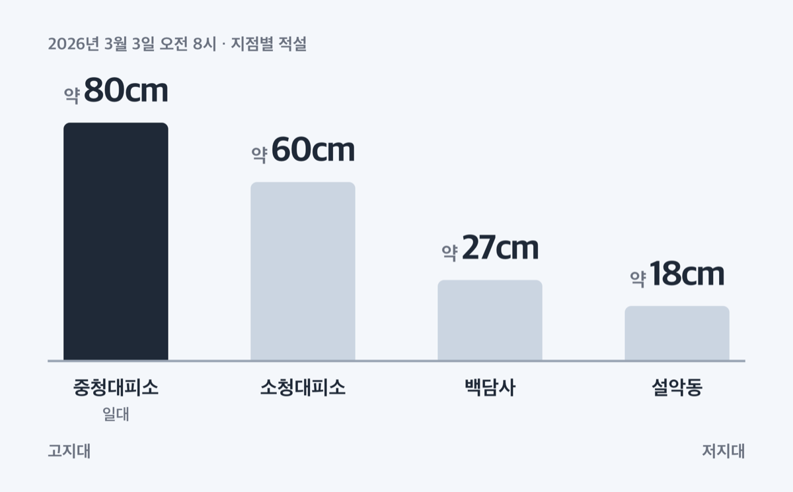
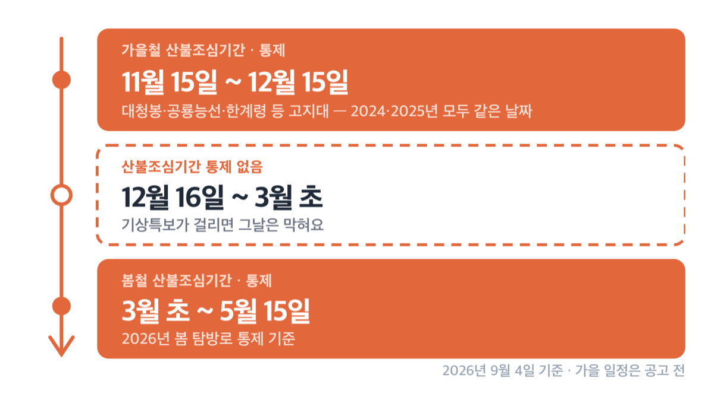
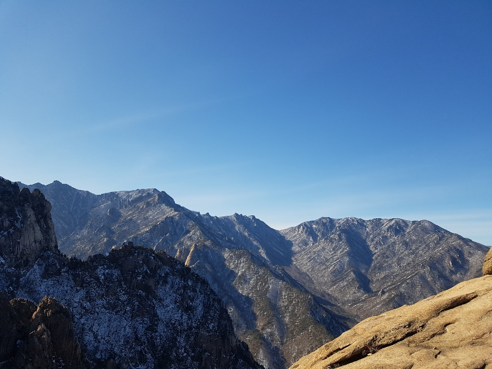
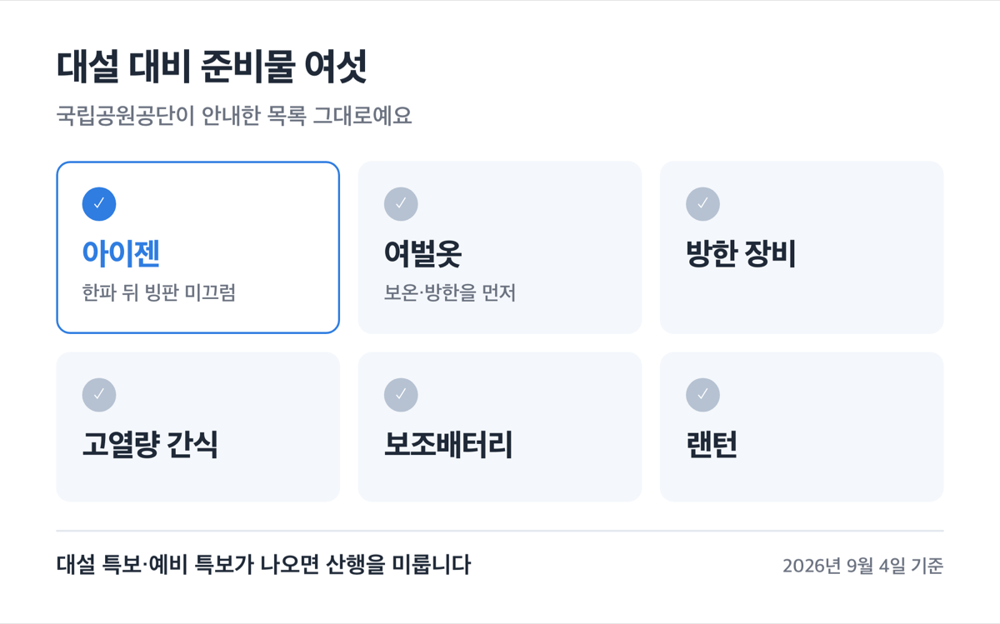

# 설악산 첫눈 시기 10월 20일, 2026 눈꽃과 통제 일정

📌 2026년 9월 4일 기준

10월 20일이에요. 설악산에 눈이 처음 내린 날인데, 그날 산 전체가 하얘진 건 아니었어요. 대청봉과 중청 일대에 1cm가 쌓인 날입니다.

**3줄 요약**

- 고지대 첫눈은 2023·2024·2025년 모두 10월 19일에서 21일 사이에 관측됐어요.
- 산 전체가 눈에 덮이는 것은 11월 중순부터이고, 소청봉과 대청봉에는 이듬해 5월 초까지 눈이 남습니다.
- 정작 그 시기에 대청봉 방향 길이 막혀요. 2024년과 2025년 모두 11월 15일부터 12월 15일까지 통제했어요.

첫눈 관측일, 눈이 실제로 쌓이는 시기, 막히는 구간과 열리는 구간, 동절기 입산 시각, 케이블카와 버스 요금까지 순서대로 적었어요.

## 설악산 첫눈, 최근 3년은 사흘 안에 몰려 있어요

국립공원공단 설악산국립공원사무소가 발표한 고지대 첫눈 관측일은 이렇습니다.

| 연도 | 첫눈 관측일 | 그날 고지대 상태 |
|---|---|---|
| 2025년 | 10월 20일 | 중청대피소 최저기온 영하 1℃, 약 1cm 쌓임 |
| 2024년 | 10월 19일 | (2025년 발표에 비교 기준으로 기재) |
| 2023년 | 10월 21일 | (2025년 발표에 비교 기준으로 기재) |

최근 3년의 첫눈 관측일이 모두 ==10월 19일에서 21일 사이==예요. 대청봉이 해발 1,708m라 아래쪽이 아직 단풍일 때 정상부만 먼저 영하로 떨어지기 때문이에요. 2026년 8월 31일에 사무소가 대청봉 첫 단풍을 발표했고, 정상부 20% 이상 단풍은 9월 중순으로 전망했어요. 단풍이 먼저 오고 눈이 그 위에 옵니다.

다만 세 해 표본이라 "해마다 10월 20일"로 못 박히는 값은 아니에요. 공단은 관측일만 발표하고 평년값을 따로 내지 않아요.

> 😕 첫눈 소식 봤으니 다음 주말에 가면 눈꽃 산행이 되겠네요?

아니에요. 10월 하순의 첫눈은 대청봉·중청 이야기고, 산 전체가 눈에 덮이는 것은 다른 시점입니다. 같은 사무소가 다른 발표에서 "설악에 첫눈이 내리는 11월 중순"이라고 썼어요. 고지대 첫눈과 산 전체 설경 사이에 3~4주가 있는 셈이에요.

## 🚫 눈꽃과 적설, 그런데 그때 대청봉 길이 막힙니다

눈이 얼마나 쌓이는지는 실측값이 있어요. 2026년 3월 3일 오전 8시 기준입니다.

| 지점 | 적설 (2026년 3월 3일 오전 8시, cm) |
|---|---|
| 중청대피소 일대 | 약 80cm |
| 소청대피소 | 약 60cm |
| 백담사 | 약 27cm |
| 설악동 | 약 18cm |

같은 고도 차이가 눈 양에도 그대로 나타나요. 설악동에서 18cm를 보고 올라가면 중청에서는 80cm를 만나는 겁니다. 이 눈은 늦게까지 남아요. 2026년 5월 4일 새벽에도 소청봉에서 대청봉 구간에 약 5cm가 내렸고, 2024년에는 5월 15일에 많은 눈이 내려 탐방로 개방이 미뤄졌어요.

나뭇가지에 얼어붙어 하얗게 맺히는 상고대는 더 이릅니다. 2023년에는 11월 6일 오후 5시경 중청대피소 일대에서 관측이 시작됐고, 그때 최저기온이 영하 6.5℃, 최대풍속이 28.9m/s였어요. 상고대는 눈보다 바람과 습도에 영향을 받는 현상이라 적설이 없어도 생겨요.

그런데 눈이 가장 좋을 시기에 정상 길이 닫혀요. 가을철 산불조심기간 통제입니다.

| 항목 | 2025년 | 2024년 |
|---|---|---|
| 통제 기간 | 11월 15일 ~ 12월 15일 | 11월 15일 ~ 12월 15일 |
| 통제 구간 | 대청봉·공룡능선·한계령 등 고지대 전 구간 | 공룡능선·서북능선·오색~대청봉 등 고지대 대부분 |
| 개방 구간 | 비선대·울산바위·토왕성폭포전망대·주전골 등 저지대 | 비선대·울산바위·흘림골·주전골 등 저지대 |

두 해가 날짜까지 같았어요. 2025년에는 영시암삼거리에서 봉정암 구간만 교량 교체 공사로 11월 10일부터 닷새 앞당겨 막았고, 곰배령은 11월 1일부터 12월 15일까지 통제했어요. 2026년 가을 일정은 9월 4일 기준 아직 공고 전이니, 10월 말에 국립공원공단 누리집 통제정보를 다시 보세요.

봄에도 같은 통제가 있어요. 2026년 봄철 산불조심기간은 전국 기준 1월 20일부터 5월 15일까지였고, 설악산 탐방로 통제는 3월 초부터 5월 15일까지였습니다. 본사 발표와 사무소 발표가 하루 차이라 "3월 초부터"로 잡는 게 맞아요.

> [!WARNING]
> 두 통제 사이인 ==12월 16일부터 이듬해 3월 초까지==는 산불조심기간 통제가 없습니다. 다만 기상특보가 걸리면 그때그때 막혀요. 2026년 3월 1일에는 대설특보로 오전 10시부터 고지대가 통제됐습니다.

저라면 눈꽃 산행 일정을 12월 하순에서 2월 초 사이에 잡습니다. 산불조심기간 두 구간을 피하면서 적설이 가장 두꺼운 시기가 거기뿐이에요. 대신 그 기간은 기상특보 하나로 계획이 무너지니 출발 전날과 당일 아침에 통제정보를 보는 것을 전제로 깔아야 해요.

물론 눈이 적은 해도 있어요. 2026년 2월에는 사무소가 "예년에 비해 눈이 거의 없어 메마른 상태"라고 밝혔습니다. 적설은 해마다 달라져요.

## 동절기 입산 시간, 대청봉은 11시면 끝이에요

설악산은 입산시간지정제를 씁니다. 통제지점마다 들어갈 수 있는 시각과 더 이상 올라갈 수 없는 시각이 정해져 있고, 11월부터 이듬해 3월까지 동절기 시각이 따로 적용돼요. 아래는 겨울에 많이 쓰는 구간입니다.

| 통제지점 · 방향 | 동절기(11~3월) | 하절기(4~10월) |
|---|---|---|
| 남설악 · 오색 → 대청봉 | 04:00~11:00 | 03:00~12:00 |
| 한계령 · 한계령 → 한계령삼거리 | 04:00~10:00 | 03:00~12:00 |
| 비선대 · 비선대 → 마등령 | 04:00~10:00 | 03:00~11:00 |
| 비선대 · 비선대 → 양폭 | 04:00~12:00 | 03:00~14:00 |
| 백담 · 백담 → 수렴동 → 소청 | 04:00~13:00 | 03:00~14:00 |
| 한계산성 · → 대승령 | 04:00~12:00 | 03:00~13:00 |
| 남교리 · 남교리 → 대승령 | 04:00~11:00 | 03:00~12:00 |

동절기에는 통제 시각이 하절기보다 한두 시간 앞당겨져요. 오색에서 대청봉으로 붙는 최단 코스가 11시면 닫힌다는 뜻이에요. 대피소를 예약했으면 연장이 붙습니다. 비선대는 희운각 예약자 1시간·양폭 예약자 2시간, 남설악과 한계령은 소청·희운각 예약자 1시간, 백담은 소청 예약자 1시간·수렴동 예약자 2시간이에요.

명부도 씁니다. 비선대는 동절기 12시 이후 입산자부터, 한계산성은 12시 이후부터, 남교리는 11시 이후부터 출입자 명부를 작성해요.

소공원에서 울산바위·토왕성폭포전망대·비선대·권금성으로 가는 저지대 원점회귀 구간은 시각표가 다릅니다. 일몰 후부터 이튿날 일출 2시간 전까지만 막혀요. 오색 약수터에서 용소폭포 구간도 같습니다.

기상청 특보가 발효되면 이 시각과 무관하게 입산이 통제됩니다.

## 케이블카·버스·주차, 겨울에 달라지는 것

권금성 설악 케이블카는 걸어 오를 필요 없이 해발 약 700m까지 올라가요. 왕복 요금은 이렇습니다.

| 구분 | 대상 | 왕복 요금 (부가세 포함, 원) |
|---|---|---|
| 대인 | 중학생 이상 | 16,000원 |
| 소인 | 37개월 ~ 초등학생 | 12,000원 |
| 유아 | 36개월 미만 | 무료 |
| 경로우대 | 만 65세 이상 (성수기 할인 비적용) | 14,000원 |
| 국가유공자·장애 중증 | 대인 기준 | 13,000원 |
| 속초시민 | 거주 증빙, 1인 1매 | 8,000원 |

부가세 포함 금액이고 왕복만 팝니다. 편도 탑승권이 없어요. 단체 할인도 없고 할인은 중복되지 않습니다. 2026년 할인 비적용 기간은 7월 18일부터 8월 23일까지, 9월 19일부터 11월 15일까지예요. 장애·국가유공자·속초시민 할인은 연중 적용되고 경로우대만 이 기간에서 빠집니다.

겨울 계획에서 가장 걸리는 것은 예약이 아예 안 된다는 점이에요. 사전 예약을 받지 않고 당일 현장 구매만 됩니다. 기상 변동에 늘 영향을 받는 시설이라 그래요. 운행시간도 계절과 기후에 따라 달라져서 공식 누리집 첫 화면 상단에 매일 새로 올라와요. 출발 아침에 그 시각을 보고 움직이면 됩니다.

편도 5분, 왕복 10분이고 간격은 한산할 때 10~15분, 붐빌 때 5분이에요. 권금성 체류 시간 제한은 없지만 ==마지막 케이블카는 반드시 타야 합니다==. 걸어 내려오는 등산로가 없어요. 마지막 편으로 올라가면 위에서 20분쯤밖에 못 봅니다. 강풍이나 악천후로 운행이 멈추면 미사용 탑승권은 전액 환불됩니다.

가는 법은 이렇습니다.

1. 주소는 강원도 속초시 설악산로 1085이고, 내비게이션에는 "설악케이블카"로 검색합니다.
2. 속초 시외버스터미널에서 7번이나 7-1번 시내버스를 타고 종점인 설악산소공원에서 내립니다.
3. 공원 입구에서 탑승장까지 걸어서 5분입니다.
4. 유모차는 탑승할 수 없어요. 탑승장 건물 외부 우측 무료보관소에 맡깁니다.

시내버스 첫차와 막차는 아래와 같아요. 7번과 7-1번에 강원여객과 동해상사가 함께 들어옵니다.

| 노선 (운수사) | 첫차 | 막차 |
|---|---|---|
| 7 (강원여객) | 06:47 | 19:00 |
| 7 (동해상사) | 09:20 | 18:26 |
| 7-1 (강원여객) | 06:30 | 20:35 |
| 7-1 (동해상사) | 07:21 | 20:00 |

요금은 속초시 안에서 현금 1,700원, 카드 1,530원이에요. 교통카드가 10% 싸고, 하차 후 1시간 30분 안에 한 번 무료 환승이 됩니다. 현금으로 타면 환승이 안 되고, 같은 번호 노선을 다시 타는 것도 환승으로 잡히지 않아요.

내설악 백담사 쪽은 셔틀버스를 씁니다. 용대향토기업에서 백담사매표소까지 약 7km, 15~18분이에요. 걸으면 2시간 걸리는 길입니다. 편도 요금은 18세 이상 2,500원, 18세 이하 1,200원이고, 앞차가 떠난 뒤 첫 매표 손님 기준 30분 간격으로 출발하되 좌석이 차면 바로 떠나요.

| 기간 | 운행시간 |
|---|---|
| 10월 1일 ~ 10월 30일 | 07:00 ~ 19:00 |
| 10월 31일 ~ 11월 14일 | 07:00 ~ 18:00 |
| 11월 15일 ~ 12월 31일 | 09:00 ~ 17:00 |
| 1월 1일 ~ 5월 15일 | 09:00 ~ 17:00 |

가을 성수기 12시간에서 겨울 8시간으로 줄어요. 인제군 대중교통정보 기준이니 방문 전에 033-462-3009로 한 번 확인하세요.

주차는 설악동 소공원 주차장을 씁니다. 케이블카 전용주차장이 없어요. 이 주차장은 신흥사 소유 토지를 신흥사가 민간에 임대해 운영하는 곳이라 국립공원공단 소관이 아니에요. 요금은 관리실 033-636-4050으로 확인하세요. 문화재구역 입장료는 신흥사 033-636-8755로 확인하시면 됩니다.

## 준비물과 대피소, 그리고 남는 일정 감각

국립공원공단이 대설 대비 준비물로 안내한 것은 여벌옷, 방한 장비, 고열량 간식, 아이젠, 보조배터리, 랜턴입니다. 아이젠이 공식 안내 목록에 들어 있어요. 눈이 온 뒤 한파가 이어지면 빙판 미끄럼 사고 위험이 커지기 때문이에요. 눈이 많이 내리면 왔던 길로 되돌아 내려오거나 가까운 대피소로 이동하고, 되도록 2인 이상 산행하라고 권합니다. 대설 특보나 예비 특보가 나오면 산행을 미루라는 것도 같은 안내에 있어요.

설악산사무소는 늦가을 산행에 대해 이렇게 당부했습니다. 보온·방한용품을 여벌옷까지 먼저 꼽고, 그다음을 이렇게 이었어요.

> "…비상식량, 상비약품, 랜턴 및 보조배터리 등을 철저히 준비해야 한다. 특히 입산시간지정제에 따라 탐방 시간을 확인하고 안내 체계가 잘 갖춰진 지정된 탐방로를 이용해야 하며, 되도록 2인 이상 동반 산행을 권장한다."

대피소는 예약이 전부예요. 예약 없이는 이용할 수 없고 비예약자는 전원 하산 조치됩니다. 국립공원 전 구간에서 비박도 금지예요. 예약자 본인만 쓸 수 있어서 단순 동행인이나 대리인은 이용할 수 없고, 신분 확인이 맞지 않으면 숙박이 안 됩니다.

| 항목 | 기준 |
|---|---|
| 입실시간 | 동절기 15:00~18:00 / 하절기 15:00~19:00 |
| 자동 취소 | 이용일 당일 19시 이후 미도착 시 |
| 특보 통제 시 | 사무소가 일괄 취소하고 전액 환불 |

특보로 입산이 통제되면 본인이 먼저 취소하지 마세요. 직접 취소하면 위약금이 생기니 033-801-0900으로 연락하는 게 맞습니다. 침구와 식자재 운영은 2022년 12월 공지 기준으로 설악산 소속 대피소가 담요 대여와 침낭 판매를 중단하고 즉석밥과 생수만 팔았어요. 예약 전에 033-801-0941로 현재 운영 상태를 물어보고 짐을 싸세요.

과태료도 겨울에 특히 걸립니다. 샛길 등 출입금지 구역 무단출입은 1차 20만원에서 3차 50만원, 흡연이나 인화물질 소지는 1차 60만원에서 3차 200만원이에요. 2025년 11월 3일 기준으로 그해 흡연 693건, 출입금지 위반 556건이 단속됐어요. 눈이 덮인 길에서는 정규 탐방로 경계가 잘 안 보여서 무단출입이 의도 없이도 생겨요.

## 설악산 첫눈·눈꽃 관련 궁금증 해결

**Q. 2026년 첫눈은 언제 오나요?**
A. 지난 세 해 관측일이 10월 19일에서 21일 사이였어요. 이 폭 안에서 예상하고, 실제 발표는 설악산사무소 보도자료로 나오니 10월 중순부터 국립공원공단 누리집을 보시면 됩니다.

**Q. 첫눈 소식이 나오면 바로 눈꽃 산행이 되나요?**
A. 안 됩니다. 10월 하순 첫눈은 대청봉과 중청 일대 이야기예요. 산 전체가 눈에 덮이는 것은 11월 중순부터입니다.

**Q. 아이젠은 꼭 있어야 하나요?**
A. 국립공원공단이 대설 대비 준비물에 아이젠을 넣어 안내하고 있어요. 착용 관련 현장 기준은 산행 전 033-801-0900으로 확인하세요.

**Q. 눈은 언제까지 남아 있나요?**
A. 2026년에는 5월 4일 새벽에도 소청봉에서 대청봉 구간에 약 5cm가 내렸어요. 2024년에는 5월 15일 눈으로 탐방로 개방이 미뤄졌습니다.

**Q. 겨울에 대청봉을 오를 수 있는 시기가 언제인가요?**
A. 가을철 통제가 끝나는 12월 16일부터 봄철 통제가 시작되는 3월 초까지가 산불조심기간 통제가 없는 구간이에요. 다만 기상특보가 걸리면 그날 막힙니다.

## 정리하면 이렇습니다

설악산 눈은 10월 하순에 정상부에서 시작해 11월 중순에 산 전체로 내려오고 5월 초까지 남아요. 그런데 눈이 제일 좋은 11월 중순부터 12월 15일까지가 가을철 산불조심기간이고, 3월 초부터 5월 15일까지가 봄철 산불조심기간이에요. 결국 대청봉 눈꽃을 보려면 12월 하순에서 2월 초 사이를 노리게 됩니다.

첫눈이 왔다는 소식만 보고 대청봉 계획을 세우면 저지대에서 발길을 돌려요. 통제 구간과 입산 시각을 먼저 확인하고 날짜를 정하는 순서가 맞습니다.

참고: 국립공원공단 설악산국립공원사무소 보도자료 「설악산국립공원, 첫 눈」·「설악산 고지대 상고대 관측」·「설악산 대청봉, 첫 단풍 관측」·「설악산 가을철 산불예방 대응 강화」·「2024년 가을철 설악산국립공원 탐방로 통제」·「설악산국립공원, 대설주의보로 탐방로 통제」·「설악산 봄철 산불예방 탐방로 통제」·「설악산 고지대 눈」 · 국립공원공단 입산시간지정제·통제정보·안전정보센터 대설 행동요령 · 국립공원 예약시스템 설악산 대피소 이용 안내 · 설악 케이블카 이용안내 · 속초시 버스정보시스템 · 인제군 대중교통정보 백담셔틀 운행안내
