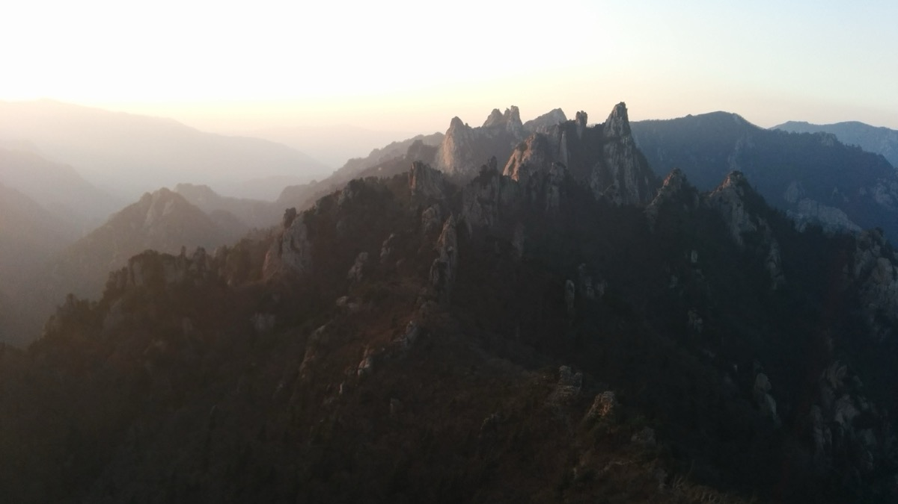
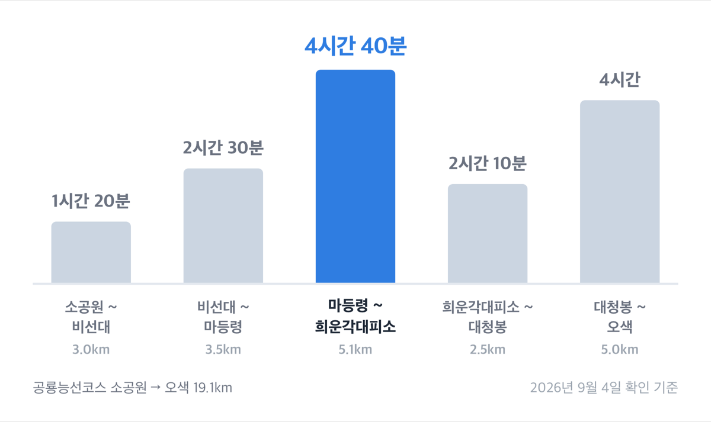
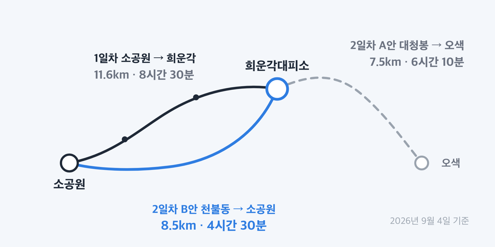
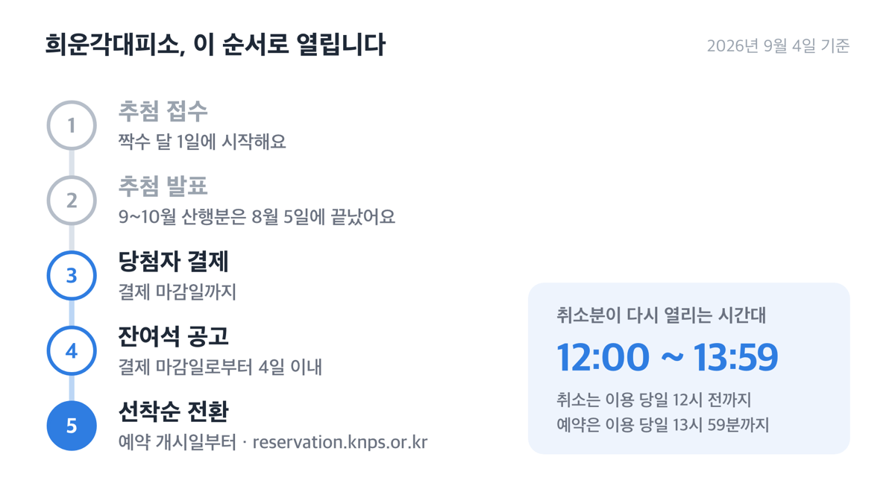
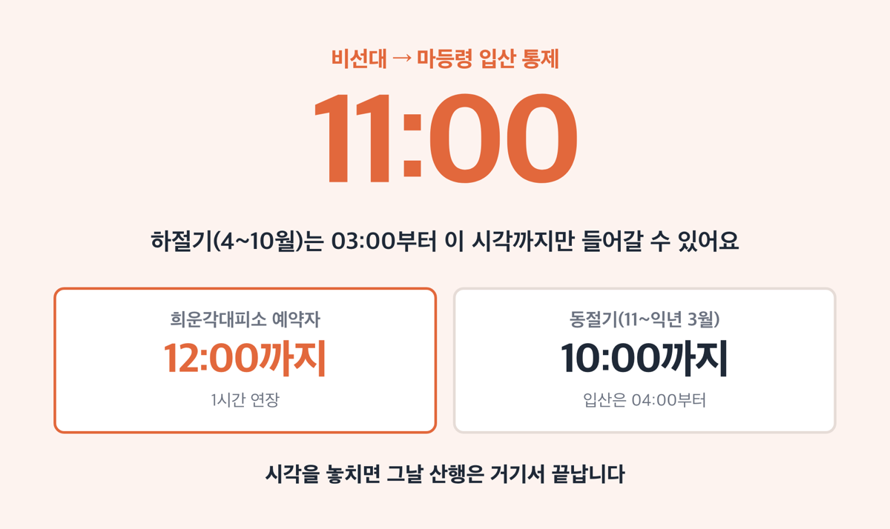
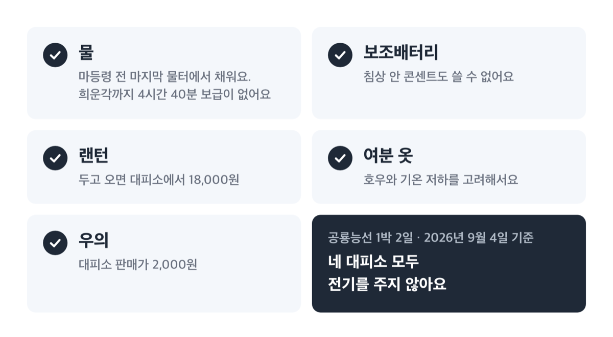

# 설악산 공룡능선 '14시간 40분', 2026 가을 1박 2일 끊는 법

📌 2026년 9월 4일 기준

14시간 40분이에요. 국립공원공단이 공룡능선코스에 붙여 둔 소요시간인데, 쉬는 시간과 밥 먹는 시간은 여기 들어 있지 않습니다. 그래서 이 코스는 애초에 당일치기가 아니라 1박 2일로 지정돼 있어요.

**3줄 요약**

- 설악산 공룡능선코스는 소공원에서 오색까지 19.1km, 국립공원공단 기준 14시간 40분·난이도 상·1박 2일 코스예요.
- 2026년 8월 17일 22시 30분부터 설악산은 전 구간 개방 상태이고, 봄철 산불조심기간인 3월 4일~5월 15일에는 공룡능선이 통제됩니다.
- 중간 숙소인 희운각대피소는 추첨 예약제라, 9~10월 산행은 추첨이 끝난 뒤의 잔여석과 취소분을 잡아야 해요.

구간별 시간, 대피소 요금과 예약 일정, 입산 통제 시각, 준비물 순서로 갑니다.

## 공룡능선코스는 어디부터 어디까지인가

공룡능선코스의 구성은 소공원, 비선대, 마등령, 희운각대피소, 대청봉, 오색입니다. 소공원에서 출발해 오색으로 내려오는 **편도** 코스로 지정돼 있어요.

여기서 헷갈리는 게 하나 있어요. **코스 이름이 공룡능선코스라고 해서 19.1km 전부가 공룡능선인 건 아닙니다.** 공단이 능선의 시작점으로 적어 둔 곳은 마등령이고, 마등령에서 희운각대피소까지 ==5.1km 4시간 40분==이 흔히 말하는 공룡능선 본 구간이에요. 나머지 14km는 그 구간에 들어가기 위한 접근로와 하산로입니다.

왜 5.1km에 4시간 40분이나 걸리느냐면, 공단 설명에 **평지가 없다**고 적혀 있어서 그래요. 시속으로 환산하면 1시간에 1.1km입니다. 산길에서 이 정도 속도는 계속 손을 쓰고 오르내린다는 뜻이에요.

공룡능선은 국립공원 대표경관 100경 가운데 **국립공원 제1경**으로 뽑힌 구간입니다. 동시에 영동과 영서가 나뉘는 분수령이라 구름이 자주 껴요. 같은 날 같은 능선에서 시야가 트였다 막혔다 하는 이유가 이것입니다.

**19.1km를 구간별로 끊으면 이렇게 나옵니다.** 공단이 발표한 다섯 구간의 거리와 소요시간이에요.

| 구간 | 거리 | 소요시간 |
|---|---|---|
| 소공원 ~ 비선대 | 3.0km | 1시간 20분 |
| 비선대 ~ 마등령 | 3.5km | 2시간 30분 |
| **마등령 ~ 희운각대피소** | **5.1km** | **4시간 40분** |
| 희운각대피소 ~ 대청봉 | 2.5km | 2시간 10분 |
| 대청봉 ~ 오색 | 5.0km | 4시간 |

*(공룡능선코스, 2026년 9월 4일 확인 기준)*

비선대에서 마등령까지 3.5km는 전형적인 오르막이고, 여기도 **평지가 전혀 없다**고 적혀 있어요. 공룡능선에 들어서기도 전에 이미 2시간 30분짜리 오르막 하나를 넘는 구조입니다.

**1박 2일로 나누면 첫날이 8시간 30분입니다.** 공단은 코스 전체 합계만 발표하고, 1박 2일을 어디서 끊어야 하는지는 알려주지 않아요. 아래는 위 구간값을 더한 값입니다.

| 구분 | 거리 | 소요시간 |
|---|---|---|
| 1일차 (소공원→희운각대피소) | 11.6km | 8시간 30분 |
| 2일차 A안 (희운각→대청봉→오색) | 7.5km | 6시간 10분 |
| 2일차 B안 (희운각→비선대→소공원) | 8.5km | 4시간 30분 |

*(공단 구간값을 더한 계산값이고, 쉬는 시간·식사·정체는 들어 있지 않아요)*

2일차 B안은 희운각에서 천불동계곡으로 내려오는 길이에요. 대청봉을 밟지 않는 대신 소공원으로 되돌아옵니다. 이 길로 가면 전체가 20.1km 13시간이 되고, 출발지로 원점 회귀해요.

**저라면 B안, 천불동으로 내려옵니다.** 근거는 두 가지예요. 첫째, 위 표에서 2일차 시간이 6시간 10분에서 4시간 30분으로 1시간 40분 줄어들어요. 둘째, 소공원 주차장에 차를 두고 갔다면 오색으로 내려가는 순간 차를 회수할 방법을 따로 만들어야 합니다. 대청봉을 꼭 밟아야 하는 산행이 아니라면 저는 원점 회귀를 고릅니다.

## 희운각대피소 예약, 추첨이 끝난 뒤에 잡는 법

설악산에서 지금 예약을 받는 대피소는 네 곳입니다.

| 대피소 | 정원 | 대기 |
|---|---|---|
| 희운각대피소 | 80명 | 8명 |
| 소청대피소 | 50명 | 5명 |
| 수렴동대피소 | 16명 | 2명 |
| 양폭대피소 | 8명 | 1명 |

*(2026년 9월 4일 국립공원 예약시스템 기준)*

공룡능선 1박 2일에서 실제로 노릴 곳은 **희운각대피소**예요. 마등령~희운각 구간의 끝점이자 1일차 종착지라서 그렇습니다. 정원 80명으로 네 곳 중 가장 크기도 해요. 양폭대피소는 정원이 8명이라 계획의 축으로 삼기 어렵습니다.

**요금은 2만원 아니면 3만원입니다.**

| 구분 | 주중 | 주말·집중수요기간 |
|---|---|---|
| 독립형(칸막이), 1인 1박 | 20,000원 | 30,000원 |

- **주중**은 일요일~목요일이에요 *(법정공휴일 전날은 빠져요)*
- **주말**은 금요일·토요일과 법정공휴일 전날입니다
- **집중수요기간**은 7월 1일~8월 31일, 그리고 10월 1일~11월 15일이에요
- 독립형은 2인용을 포함해요

여기에 감각을 하나 붙이면 이렇습니다. **9월 평일은 2만원인데, 10월은 평일이어도 3만원이에요.** 10월 1일부터 집중수요기간이 시작되기 때문입니다. 둘이 가면 9월 평일 4만원, 10월 6만원이에요. 공단이 1인 요금만 발표해서 두 배로 계산한 값입니다.

> 😕 대피소를 못 잡으면 그냥 당일로 다녀오면 안 되나요?

공식 소요시간이 14시간 40분입니다. 그리고 뒤에서 볼 입산 통제 시각이 걸려요. 비선대에서 마등령 방향으로는 하절기에도 11시까지만 들어갈 수 있습니다. 소공원 입구는 일몰 후부터 다음 날 일출 2시간 전까지 탐방이 제한됩니다. **대피소 없이 이 코스를 하루에 끝내는 계획은 제도가 막고 있는 쪽에 가깝습니다.**

**예약은 추첨제이고, 접수는 짝수 달 1일입니다.**

2023년에 올라온 옛 공지를 보고 「매월 1일과 15일 선착순」으로 알고 계신 경우가 있어요. **2026년 기준은 추첨제입니다.**

| 접수 시작일 | 발표일 | 사용기간 |
|---|---|---|
| 6월 1일 | 6월 5일 | 7월 1일 ~ 8월 31일 |
| 8월 1일 | 8월 5일 | **9월 1일 ~ 10월 31일** |
| **10월 1일** | **10월 6일** | 11월 1일 ~ 12월 31일 |
| 12월 1일 | 12월 7일 | 2027년 1월 1일 ~ 2월 28일 |

*(2026년 국립공원 예약 연간 일정표)*

표를 보면 답이 나와요. **9~10월 산행분 추첨은 8월 5일에 이미 끝났습니다.** 지금 그 기간을 노린다면 남은 길은 잔여석과 취소분이에요.

잔여석은 결제 마감일로부터 4일 이내에 공고되고, 예약 개시일에 선착순 예약으로 전환됩니다. 취소분은 규정에서 시각을 읽어낼 수 있어요.

1. 예약은 **이용 당일 13시 59분**까지 열려 있어요
2. 취소는 **이용 당일 12시** 전까지 가능해요
3. 대기 예약자는 사용예정일 이틀 전 밤 12시에 일괄 취소돼요

즉 ==당일 12시부터 13시 59분 사이==에 빈 곳이 다시 열릴 여지가 남아 있습니다. 예약은 국립공원 예약시스템(reservation.knps.or.kr) 대피소 탭에서 해요.

**취소는 3일 전까지가 안전선입니다.**

| 취소 시점 (사용예정일 기준) | 환불액 (결제금액 기준) |
|---|---|
| 사용예정일 3일 전, 또는 결제 당일 | 전액 |
| 2일 전 | 10% 공제 |
| 1일 전 | 20% 공제 |
| 당일 12시 전 | 30% 공제 + 부도자 제한 |
| 그냥 안 감 | 환불 없음 + 부도자 제한 |

부도자로 걸리면 1회에 1개월, 2회 이상이면 3개월 예약이 제한돼요. 벌칙을 받은 뒤 1년간 추가 부도가 없으면 기록은 사라집니다. **동반자 인원을 줄일 때도 당일 12시 전에 취소해야 해요.** 다만 기상특보로 접근이 곤란하다고 사무소가 인정하면 위약금은 물리지 않습니다.

만 19세 미만은 보호자 동의서와 서류를 내거나 보호자가 함께 가야 숙박할 수 있어요. 국가보훈 대상자 상이등급 1~3급과 장애의 정도가 심한 장애인은 보호자 1명을 포함해 100% 감면됩니다. 감면은 본인이 방문해야 적용되고, 서류는 발급일로부터 90일 이내 원본만 인정돼요. 사진이나 캡처본은 받지 않습니다.

## 입산 시각을 놓치면 그날 산행은 거기서 끝납니다

입산시간지정제는 탐방로마다 들어갈 수 있는 시각과 통제 시각을 정해 두는 제도예요. 공룡능선에 걸리는 지점만 뽑으면 이렇습니다.

| 통제지점·방향 | 하절기(4~10월) | 동절기(11~익년 3월) |
|---|---|---|
| 비선대 → 마등령 | 03:00 ~ 11:00 | 04:00 ~ 10:00 |
| 비선대 → 양폭 | 03:00 ~ 14:00 | 04:00 ~ 12:00 |
| 오색 → 대청봉 | 03:00 ~ 12:00 | 04:00 ~ 11:00 |
| 한계령 → 한계령삼거리 | 03:00 ~ 12:00 | 04:00 ~ 10:00 |

*(앞 시각이 입산 가능, 뒤 시각이 통제. 설악산국립공원 입산시간지정제)*

왜 비선대에서 마등령 방향만 11시로 짧게 잡혀 있을까요. 그 문을 통과한 사람은 마등령까지 2시간 30분, 거기서 희운각까지 4시간 40분을 더 걸어야 하기 때문이에요. **통제 시각은 「해가 지기 전에 오늘 목적지에 닿을 수 있는가」를 거꾸로 계산한 값입니다.**

**희운각대피소 예약자는 비선대탐방지원센터에서 통제 시각을 1시간 연장받습니다.** 하절기 기준 12시까지 진입할 수 있어요. 양폭대피소 예약자는 2시간, 오색·한계령에서 출발하는 소청·희운각 예약자는 1시간 연장됩니다.

하절기에 소공원을 3시에 출발하면 비선대에 4시 20분쯤 닿아요. 통제까지 6시간 40분이 남으니 시간 자체는 넉넉합니다. 문제는 반대편이에요. 그대로 걸으면 희운각 도착이 11시 30분쯤인데, **대피소 입실은 15시부터입니다.** 하절기 입실 시간은 15시~19시, 동절기는 15시~18시예요.

> **솔직히 말하면** — 이 3시간 반을 어떻게 쓸지가 이 산행의 진짜 변수예요. 능선 위에서 시간을 벌며 천천히 걷든, 첫날 출발을 늦추든 계획에 넣어 두는 게 낫습니다.

기상청 기상특보가 발효되거나 날씨가 크게 나빠지면 입산이 통제돼요. 공단도 공룡능선 설명에 **기상이 나쁠 때는 탐방하지 않는 것이 좋다**고 적어 두었습니다. 노면이 고르지 않아 체력이 떨어지면 헛디딤으로 인한 발목 부상 위험이 크다는 문장도 같은 곳에 있어요. **저라면 예보가 흔들리는 날에는 위약금 30%를 물고 취소합니다.** 통제 여부는 설악산국립공원사무소 033-801-0900으로 확인할 수 있어요.

## 🎒 준비물은 대피소 판매 목록이 알려 줍니다

공단이 공룡능선코스 안내에 직접 적어 둔 주의사항은 세 가지예요.

1. 공룡능선 진입 전까지 **체력을 안배**할 것
2. 노면이 고르지 못해 체력이 소진되면 **발목 부상 위험**이 크다는 것
3. **식수는 희운각대피소에 가야 확보된다**는 것

세 번째가 가장 실무적입니다. 마등령에 이르기 전 마지막 물터가 있고, 여기서 물을 준비하라고 적혀 있어요. 그 뒤로는 희운각까지 4시간 40분 동안 보급 지점이 없습니다.

전기도 없어요. **네 대피소 모두 이용객에게 전기를 제공하지 않고, 침상 안 콘센트도 쓸 수 없습니다.** 보조배터리를 챙기라는 말이 여기서 나옵니다.

대피소에서 살 수 있는 물건과 값이에요. 네 곳 모두 품목과 가격이 같습니다.

| 판매 품목 (4개 대피소 공통) | 가격 (1개당, 원) |
|---|---|
| 생수 500ml / 2L | 1,500원 / 3,000원 |
| 햇반 210g | 3,000원 |
| 에너지바 / 연양갱 | 1,500원 / 1,000원 |
| 부탄가스 / EPI가스 | 2,500원 / 4,500원 |
| 랜턴 | 18,000원 |
| 우의 | 2,000원 |
| 아이젠 일반형 / 체인형 | 10,000원 / 28,000원 |
| 건전지 AA·AAA | 각 2,500원 |
| 여행용 휴지 | 1,000원 |

*(2026년 9월 4일 확인, 소청·희운각·양폭·수렴동 공통)*

목록이 랜턴·우의·부탄가스·건전지로 짜여 있다는 사실 자체가 답이에요. **이 산에서 사람들이 가장 자주 빠뜨리는 물건이 저것들입니다.** 대피소는 산행 안전물품 위주로만 팔고 위생용품 같은 개인 준비물은 미리 챙기라고 안내하고 있어요.

호우와 기온 저하를 고려해 여분의 옷과 간단한 먹거리를 준비하라는 문장도 공단 안내에 있습니다. 그리고 초행자에게는 개인 산행보다 단체 산행을 권한다고 적혀 있어요.

## 놓치기 쉬운 것 넷

**첫째, 중청대피소는 예약 목록에 없습니다.** 설악산 공원시설안내 페이지에는 115석으로 남아 있지만, 예약시스템 설악산 탭에 뜨는 곳은 소청·희운각·양폭·수렴동 네 곳뿐이에요. 2023년 9월 공지에 「중청대피소 이용 제한 기간: 2023년 11월 1일 ~ 공사 완료 시까지」라고 적혀 있습니다. 철거 후 신축 공사 때문이에요. 대청봉 바로 아래에서 하룻밤 자는 계획은 지금 성립하지 않습니다.

**둘째, 정원 숫자가 페이지마다 다릅니다.** 시설안내에는 소청이 62석, 수렴동이 10석으로 적혀 있는데 예약시스템에서는 50명과 16명이에요. 실제로 예약을 받는 쪽은 예약시스템입니다.

**셋째, 봄에는 이 코스가 통째로 막힙니다.** 2026년 봄철 산불예방 고지대 통제는 3월 4일부터 5월 15일까지였고, 첨부 지도에서 마등령삼거리~희운각과 비선대~마등령이 모두 통제 구간으로 표시됐어요. 이 기간에는 대피소도 이용할 수 없습니다.

**넷째, 2026년 가을철 통제 일정은 아직 공고 전입니다.** 참고로 2025년에는 11월 15일부터 12월 15일까지 마등령~한계령, 비선대~희운각, 오색~대청봉이 모두 통제됐어요. 11월 이후 산행을 계획한다면 설악산국립공원 「공원별 알림」 게시판의 가을철 산불조심기간 공지를 먼저 확인하세요.

## 설악산 공룡능선 관련 궁금증 해결

**Q. 공룡능선만 걷는 데 실제로 얼마나 걸리나요?**
A. 마등령에서 희운각대피소까지 5.1km에 4시간 40분입니다. 다만 그 구간에 들어가려면 소공원에서 마등령까지 6.5km를 3시간 50분 더 올라야 해요.

**Q. 9월과 10월 대피소 요금이 왜 다른가요?**
A. 10월 1일부터 11월 15일이 집중수요기간이라 그렇습니다. 9월 평일은 20,000원, 10월은 평일이어도 30,000원이에요.

**Q. 추첨에서 떨어졌는데 방법이 없나요?**
A. 잔여석은 결제 마감일로부터 4일 이내에 공고되고 예약 개시일에 선착순으로 전환돼요. 취소는 이용 당일 12시 전까지, 예약은 당일 13시 59분까지 가능합니다.

**Q. 대피소에 침낭이나 매트가 있나요?**
A. 개인 장비로 준비해 가는 쪽이 안전합니다. 판매 품목에 침구류가 없어요. 필요한 장비 구성은 예약 전에 국립공원 예약 고객센터 1670-9201로 확인하세요.

**Q. 차는 어디에 세우나요?**
A. 소공원 주차장(강원도 속초시 설악산로 1032)을 씁니다. 탐방 출발점인 소공원 입구는 설악산로 1091이에요. 주차 요금과 만차 여부는 주차장 관리실 033-636-4050으로 확인하세요. 그린카드가 있으면 주차요금의 10%가 할인됩니다.

## 결국 순서는 예약이 먼저입니다

이 글은 직접 걸어 본 기록이 아니라 국립공원공단과 예약시스템에 올라 있는 2026년 9월 4일 기준 숫자를 확인해 정리한 것이에요. 그래서 코스의 감상 대신 시간·요금·통제라는 세 축만 다뤘습니다.

정리하면 순서는 이래요. 희운각대피소부터 확보하고, 그 날짜의 하절기·동절기 구분에 맞춰 비선대 통과 시각을 역산하고, 마지막으로 물과 전기를 어떻게 해결할지 정하는 것입니다. **거리 19.1km보다 앞에 있는 건 언제나 예약과 시각이에요.**

산행 당일의 통제 여부와 기상은 설악산국립공원사무소 033-801-0900, 예약 관련은 국립공원 예약 고객센터 1670-9201에서 확인하실 수 있어요. 부상이나 만성질환이 있다면 난이도 상 코스에 나서기 전에 의료 전문가와 먼저 상의하세요.

참고: 국립공원공단 설악산국립공원 「코스별난이도 — 공룡능선코스」 · 국립공원공단 「탐방로 통합검색」 · 국립공원공단 「입산시간지정제」 · 국립공원공단 「통제정보 — 설악산」 · 국립공원 예약시스템 「대피소 이용안내」 · 국립공원 예약시스템 「예약·환불정책」 · 국립공원 예약시스템 「2026년 국립공원 예약 연간 일정 안내」 · 설악산국립공원사무소 「봄철 산불예방을 위한 고지대 통제기간 알림」 · 설악산국립공원사무소 「중청·소청·희운각 대피소 운영 공지」
