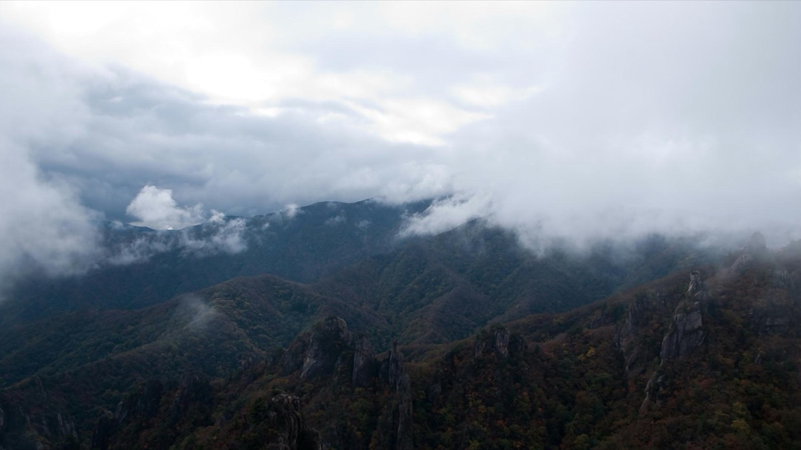
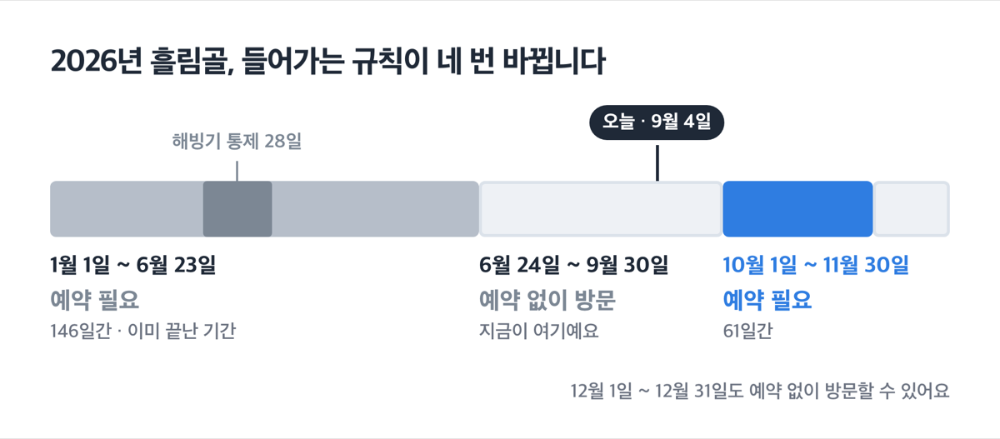
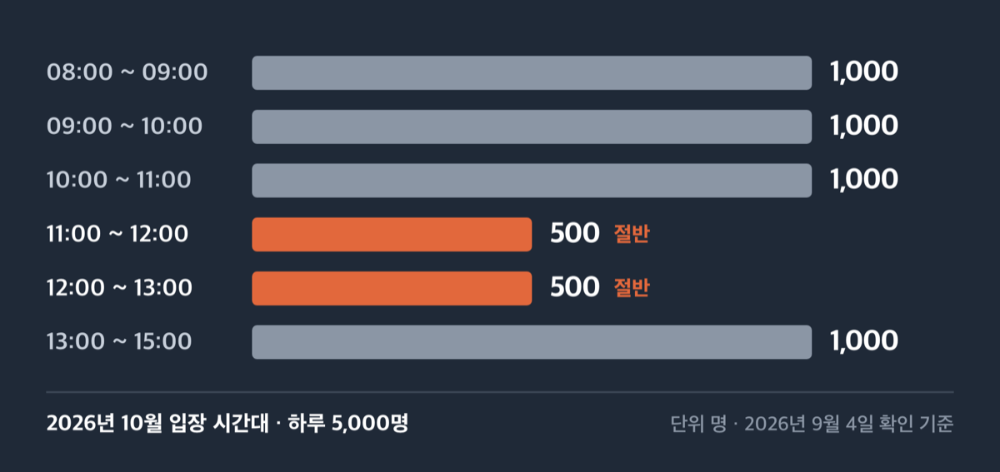
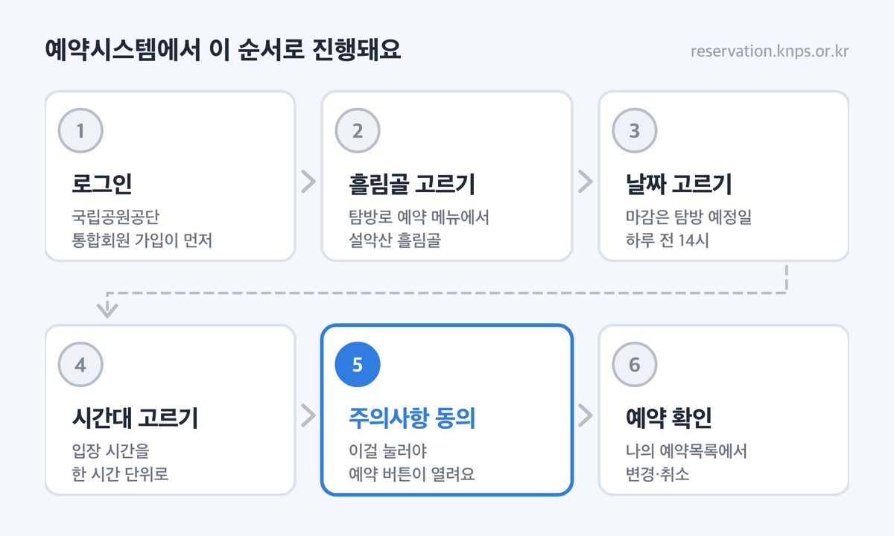
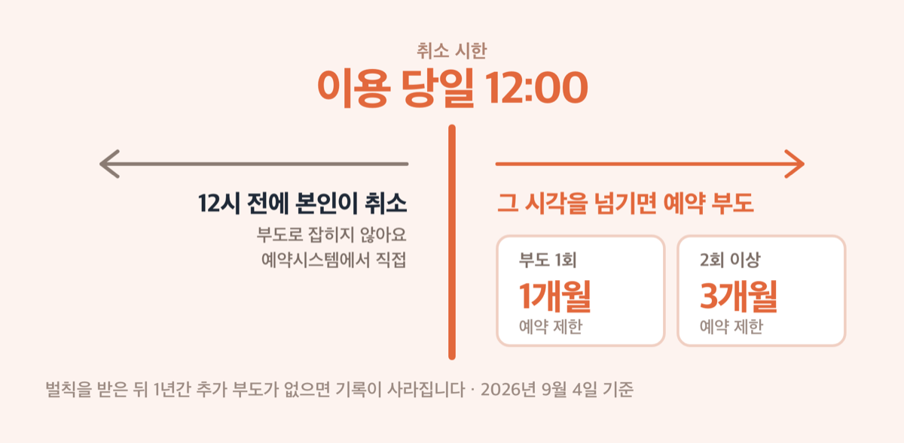

# '10월 1일 10시' 설악산 흘림골 예약, 2026년 11월분이 열려요

📌 2026년 9월 4일 기준

흘림골은 예약해야 들어간다고들 하는데, 9월에는 아니에요. 예약제가 6월 24일부터 9월 30일까지 쉬고 있거든요. 예약이 다시 필요해지는 것은 10월 1일부터입니다.

**3줄 요약**

- 흘림골 탐방 예약제는 흘림골탐방지원센터에서 용소폭포 삼거리까지 편도 3.1km 구간에 걸리고, 하루 5,000명을 시간대로 나눠 받아요.
- 2026년에는 10월 1일부터 11월 30일까지 예약이 필요하고, 그 앞 기간인 6월 24일~9월 30일은 예약 없이 갈 수 있어요.
- 10월분 예약은 9월 1일 10시에 이미 열렸고, 11월분은 10월 1일 오전 10시에 선착순으로 열립니다.

날짜와 정원, 예약 순서, 그리고 예약보다 더 자주 걸리는 것들을 차례로 적었어요.

## 흘림골 예약제, 3.1km 한 구간에만 걸립니다

흘림골 탐방 예약제의 대상은 흘림골탐방지원센터에서 용소폭포 삼거리까지 편도 3.1km, 일방통행, 소요 시간 2시간 30분입니다. 설악산 전체가 아니라 이 한 구간에만 걸려요. 반대 방향으로 거슬러 오르는 것도 안 됩니다.

이 구간만 지정한 이유는 안전이에요. 설악산국립공원사무소가 지난 6월 공고한 운영 사유는 '이용자 안전'이고, 근거는 자연공원법 제28조 제1항과 제29조 제1항이에요. 흘림골은 2015년 낙석사고가 있었던 구간이라 안전시설을 보강했고, 지금도 취약지점 22개소에 경광등이 서 있어요.

> 🤭 **솔직히 말하면** — 이 제도에서 사람들이 가장 많이 헷갈리는 것은 코스가 아니라 날짜예요. 예약이 필요한 기간과 필요 없는 기간이 한 해 안에서 네 번 바뀌거든요.

## 🗓 9월과 10월, 들어가는 규칙이 다릅니다

2026년 흘림골은 이렇게 나뉘어요.

| 2026년 기간 | 들어가는 방법 |
|---|---|
| 1월 1일 ~ 6월 23일 | 예약 필요 *(146일간, 이미 끝난 기간이에요)* |
| 3월 4일 ~ 3월 31일 | 해빙기 통제 *(28일간)* |
| 6월 24일 ~ 9월 30일 | 예약 없이 방문 *(지금이 여기예요)* |
| **10월 1일 ~ 11월 30일** | **예약 필요** *(61일간)* |
| 12월 1일 ~ 12월 31일 | 예약 없이 방문 |

2027년부터는 10월~11월 61일에만 예약제를 운영합니다. 올해 상반기까지 예약제였던 것이 오히려 예외였던 셈이에요.

운영 시간도 기간마다 달라져요. 예약이 필요한 기간에는 시간대를 골라 예약하고, 예약이 없는 기간에는 입산시간지정제가 적용됩니다.

| 언제 | 운영 시간 |
|---|---|
| 10월 (가을성수기, 예약제) | 08:00 ~ 15:00 |
| 11월 (예약제) | 09:00 ~ 14:00 |
| 하절기 4~10월 (예약 없는 기간) | 03:00 ~ 14:00 |
| 동절기 11월~다음 해 3월 (예약 없는 기간) | 04:00 ~ 14:00 |

10월만 15시까지로 한 시간 늘려 운영해요.

## 하루 5,000명인데 시간대로 쪼갭니다

흘림골 예약 정원은 하루 5,000명이에요. 넉넉해 보이죠. 그런데 이 5,000명을 한 번에 푸는 게 아니라 입장 시간대별로 나눠 놓습니다.

| 2026년 10월 입장 시간대 | 시간대 정원 (명) |
|---|---|
| 08:00 ~ 09:00 | 1,000 |
| 09:00 ~ 10:00 | 1,000 |
| 10:00 ~ 11:00 | 1,000 |
| 11:00 ~ 12:00 | 500 |
| 12:00 ~ 13:00 | 500 |
| 13:00 ~ 15:00 | 1,000 |

11시 이후 두 칸이 500명으로 줄어드는 게 눈에 띄어요. 이 구간은 편도 2시간 30분이고 10월 운영은 15시에 끝납니다. 12시에 들어가면 나오는 시각이 14시 30분이에요.

늦게 출발할수록 여유가 없어진다는 뜻입니다.

> 😕 10월분이 9월 1일에 열렸으면 이미 늦은 것 아닌가요?

2026년 9월 4일에 예약시스템을 조회해 봤어요. 아래가 그때 숫자입니다.

| 시간대 | 10월 10일(토) | 10월 14일(수) |
|---|---|---|
| 08:00 ~ 09:00 | 0 / 1,000 | 0 / 1,000 |
| 09:00 ~ 10:00 | 56 / 1,000 | 8 / 1,000 |
| 10:00 ~ 11:00 | 135 / 1,000 | 0 / 1,000 |
| 11:00 ~ 12:00 | 21 / 500 | 3 / 500 |
| 12:00 ~ 13:00 | 0 / 500 | 0 / 500 |
| 13:00 ~ 15:00 | 0 / 1,000 | 0 / 1,000 |

*(예약 인원 / 정원, 2026년 9월 4일 조회 기준. 계속 바뀌는 값이에요.)*

물론 단풍이 드는 주말은 이 숫자가 빠르게 올라갈 수 있어요. 그래도 지금 화면에 보이는 것은 대부분 빈칸입니다. 저는 사람이 몰리는 칸을 피해서 평일 이른 시간대를 고르는 쪽이에요. 10월 14일 수요일 08~09시가 1,000명 정원에 0명이었거든요.

## 예약 순서와 개시일 10시 요령

예약은 인터넷으로만 받아요. 전화 예약은 안 됩니다. 국립공원 예약시스템(https://reservation.knps.or.kr)에서 아래 순서로 진행돼요.

1. 예약시스템에 접속해 로그인합니다 *(국립공원공단 통합회원 가입이 먼저예요. 로그인하지 않으면 예약 화면 자체가 열리지 않아요)*
2. 탐방로 예약에서 설악산 흘림골을 고릅니다
3. 날짜를 고릅니다 *(마감은 ==탐방 예정일 하루 전 14시==까지예요)*
4. 입장 시간대를 한 시간 단위로 고릅니다
5. 주의사항에 동의합니다 *(흘림골은 이 동의를 눌러야 예약 버튼이 열려요)*
6. 마이페이지의 '나의 예약목록'에서 예약번호를 눌러 변경하거나 취소합니다

예약 화면에는 요금이나 결제 항목이 없어요. 시간대를 고르고 나면 결제 단계 없이 예약이 끝납니다.

개시일에는 한 가지 요령이 있어요. ==11월분은 10월 1일 오전 10시==에 선착순으로 열리는데, 10시 전에 페이지를 미리 열어 두면 화면에는 이전 달 달력이 그대로 보여요. 자동으로 바뀌지 않으니 10시가 되면 브라우저 새로고침을 눌러야 새 달력이 나옵니다.

> [!WARNING]
> 대기 예약이 없어요. 선착순으로 마감되면 그걸로 끝이고, 한 사람이 걸 수 있는 예약은 1개월에 4건까지입니다. 개시일이 법정공휴일이나 임시공휴일과 겹치면 다음 평일로 밀려요.

인터넷으로 못 잡았다면 방법이 하나 더 있어요. 잔여분에 한해 흘림골탐방지원센터에서 현장 접수를 받습니다. 다만 남아 있을 때만 되는 것이라 계획으로 삼기는 어려워요.

## ⚠️ 예약보다 자주 걸리는 것 넷

**첫째, 취소 시한이 따로 있어요.** 못 가게 됐다면 ==이용 당일 12시 전==에 본인이 예약시스템에서 취소해야 합니다. 그 시각을 넘기면 예약 부도로 잡혀요. 부도 1회면 1개월, 2회 이상이면 3개월 동안 예약이 제한되고, 벌칙을 받은 뒤 1년간 추가 부도가 없으면 기록이 사라집니다.

**둘째, 예약 없이 들어가면 과태료 처분 대상이에요.** 공고문은 자연공원법 두 조항을 함께 걸어 뒀어요.

| 어떤 위반이냐 | 과태료 (1차 / 2차 / 3차) |
|---|---|
| 출입이 제한·금지된 지역에 들어간 경우 *(법 제86조제2항제2호)* | 20만원 / 30만원 / 50만원 |
| 제한·금지된 행위를 한 경우 *(법 제86조제1항제6호)* | 60만원 / 100만원 / 200만원 |

*(국립공원공단 과태료 기준표. 공고문은 두 조항을 함께 적었고 어느 쪽이 적용되는지는 사안에 따라 달라져요.)*

**셋째, 주차예요.** 들머리는 흘림골탐방지원센터, 주소는 강원도 양양군 서면 오색리 산1-71입니다. 차는 오색마을 주차장에 대야 하고, 44번 국도변인 한계령도로에는 주차할 수 없어요.

**넷째, 날씨입니다.** 기상악화나 기상특보가 발효되면 탐방을 중지하고 하산해야 해요. 예약이 있어도 마찬가지입니다. 경광등이 있는 취약지점 22개소는 머무르지 말고 빠르게 지나가야 하고요.

저라면 출발 전날 밤에 예약시스템 공지를 한 번 더 확인하고 나섭니다. 통제는 예약과 별개로 걸리거든요.

## 설악산 흘림골 예약 관련 궁금증 해결

**Q1. 지금 흘림골에 가려면 예약해야 하나요?**
A. 9월 30일까지는 예약 없이 들어갈 수 있어요. 대신 입산시간지정제가 적용돼서 하절기 기준 03시부터 14시 사이에 들어가야 합니다.

**Q2. 10월분 예약은 언제 열렸나요?**
A. 9월 1일 오전 10시에 열렸어요. 이미 열려 있는 상태이고 선착순으로 남은 만큼 잡을 수 있습니다. 11월분이 10월 1일 오전 10시로 남아 있어요.

**Q3. 예약을 못 했는데 현장에서 되나요?**
A. 잔여분이 있으면 흘림골탐방지원센터에서 현장 접수를 받아요. 전화로는 예약할 수 없습니다.

**Q4. 예약해 놓고 안 가면 어떻게 되나요?**
A. 이용 당일 12시 전에 본인이 취소하면 부도로 잡히지 않아요. 관리자가 대신 취소한 경우는 부도로 처리되고, 1회면 1개월·2회 이상이면 3개월 예약이 막힙니다.

**Q5. 일행 인원은 어떻게 잡나요?**
A. 한 사람이 걸 수 있는 예약 건수는 1개월에 4건이에요. 한 건에 넣을 수 있는 인원은 로그인 후 예약 화면에서 지정하고, 미리 확인하고 싶다면 예약 문의 1670-9201로 물어보세요.

## 오늘 기준으로 정리하면

9월 30일까지는 예약 없이 갈 수 있고, 10월 1일부터 11월 30일까지는 예약이 있어야 흘림골탐방지원센터를 통과할 수 있어요. 10월분은 9월 1일에 열려 지금 화면에 떠 있고, 11월분은 10월 1일 오전 10시에 열려요. 11월분 화면을 볼 생각이라면 10시 정각 새로고침 하나만 기억하면 돼요.

혹시 11월 날짜를 지금 조회했는데 '예약가능 탐방로가 없습니다'라고 뜬다면 오류가 아니에요. 아직 예약 상품이 만들어지지 않아서 그렇습니다.

코스와 통제 상황은 설악산국립공원 오색분소 033-801-0973, 설악산국립공원사무소 033-801-0900으로 확인할 수 있어요. 예약 화면 문제는 예약 문의 1670-9201이 평일 9시부터 18시까지 받습니다.

참고: 설악산국립공원사무소 「설악산국립공원 탐방 예약제(흘림골) 운영 변경 공고」 · 국립공원 예약시스템 흘림골 이용안내 · 국립공원공단 「2026년 국립공원 예약 연간 일정 안내」 · 국립공원 예약시스템 예약·환불정책 · 국립공원공단 과태료 부과 안내 · 국립공원공단 입산시간지정제 안내
