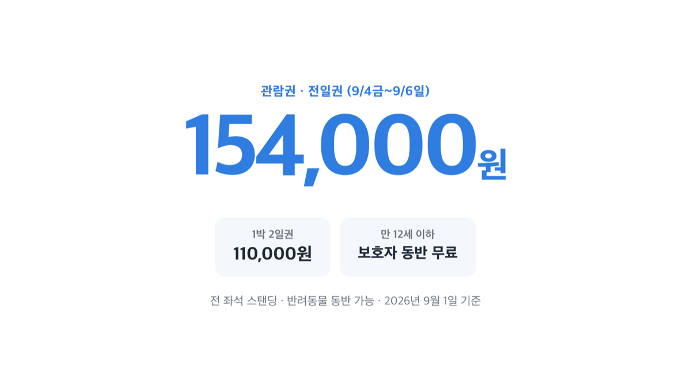
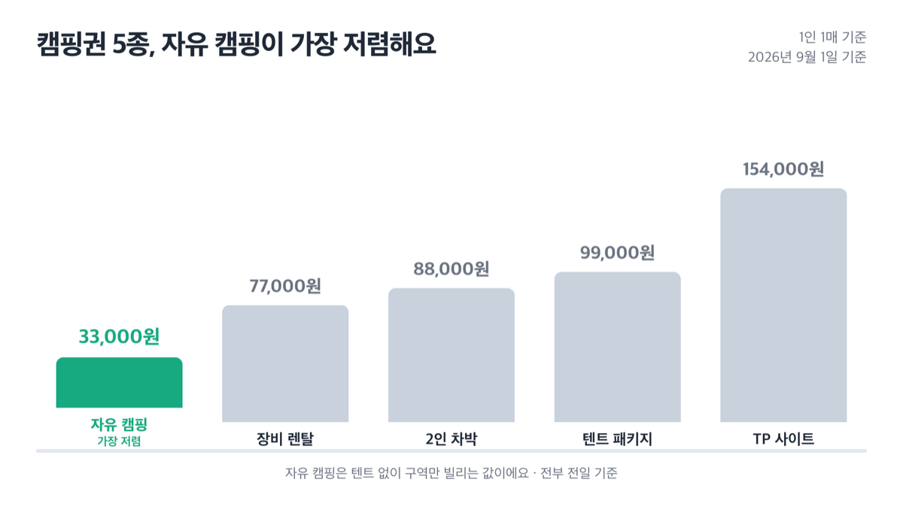
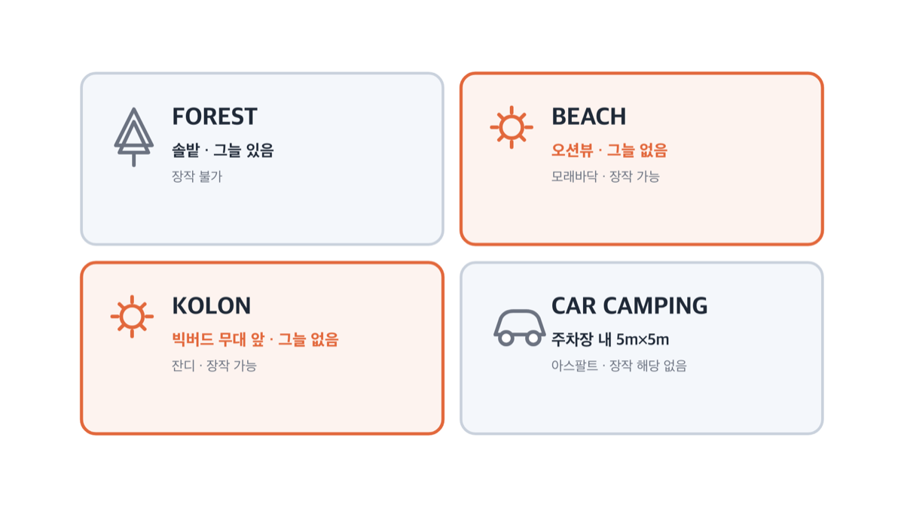
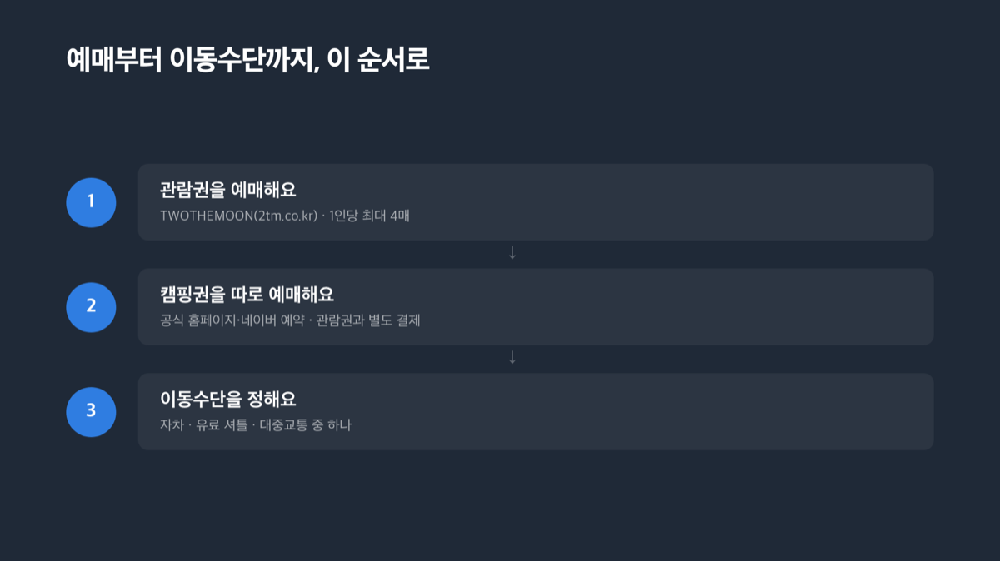
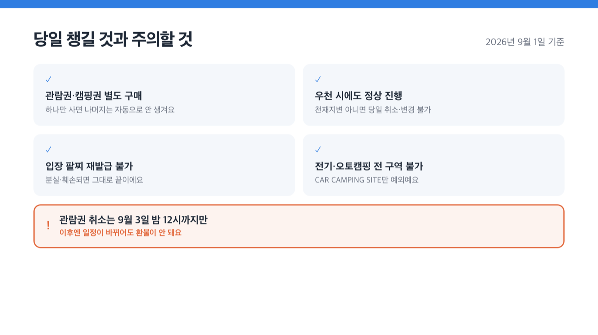
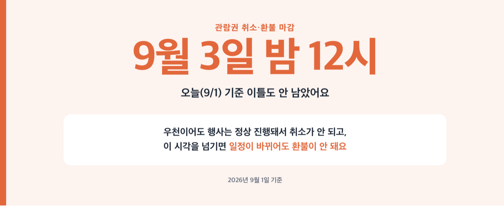

# 신안 증도 캠핑 페스티벌 2026, 캠핑권·관람권 따로 사요

📌 2026년 9월 1일 기준

캠핑권만 사면 공연은 못 봐요. 관람권을 따로 사야 들어갈 수 있어요. 신안 증도 짱뚱어해수욕장에서 9월 3일부터 열리는 더 그레이트풀 캠프 2026, 오늘이 딱 이틀 전이에요.

**3줄 요약**
- 더 그레이트풀 캠프 2026은 신안 증도 짱뚱어해수욕장에서 열리는 캠핑·음악 페스티벌이에요.
- 전야제는 9월 3일 무료로 열리고, 공연 관람권은 9월 4일부터 6일까지 유효해요.
- 캠핑권과 관람권은 완전히 다른 상품이라 각각 사야 하고, 관람권 취소는 9월 3일 밤 12시까지만 돼요.

가격부터 캠핑 구역, 예매·교통, 놓치기 쉬운 것까지 순서대로 정리했어요.

> [!WARNING]
> 캠핑권과 공연 관람권은 완전히 다른 상품이에요. 하나만 사면 나머지 하나는 자동으로 따라오지 않아요. 오늘(9월 1일) 기준으로 관람권 취소·환불 마감(9월 3일 밤 12시)이 이틀도 안 남았고, 우천이어도 행사는 정상 진행돼서 취소가 안 돼요.

## 더 그레이트풀 캠프 2026이 뭔가요

더 그레이트풀 캠프(THE GRATEFUL CAMP) 2026은 전라남도 신안군 증도면 짱뚱어해수욕장 일대에서 베리하이(VERYHIGH)가 주최하는 캠핑·음악 페스티벌이에요. 무료 전야제는 9월 3일 목요일, 유료 공연 관람권의 유효 기간은 9월 4일 금요일부터 6일 일요일까지예요.

공식 홈페이지 어디에도 "3박 4일"이라는 표현은 없어요. 다만 9월 3일 전야제(사이트 17시 오픈)와 관람권 유효 기간(9월 4일~6일)을 더하면 목요일부터 일요일까지 나흘이 되니까, 언론이 이걸 3박 4일로 표현한 것으로 보여요.

😕 **"관람권만 있으면 텐트도 칠 수 있는 거 아니에요?"**
아니에요. 관람권은 무대 앞에서 공연을 보는 값이고, 캠핑권은 야영 구역 하나를 쓰는 값이라 애초에 다른 상품으로 설계돼 있어요. 그래서 캠핑을 하려면 관람권과 별개로 캠핑권을 따로 결제해야 해요.

결국 두 번 결제해야 해요.

## 💰 관람권과 캠핑권 가격이 따로예요

먼저 공연만 보는 관람권 가격이에요.

| 종류 | 기간 | 가격 |
|---|---|---|
| 전일권 | 9/4(금)~9/6(일) | 154,000원 |
| 1박 2일권 | 9/5(토)~9/6(일) | 110,000원 |

만 12세 이하는 성인 보호자와 함께면 무료로 들어갈 수 있고, 반려동물도 데려갈 수 있어요. 전 좌석이 스탠딩이라 좌석을 미리 지정받는 개념 자체가 없어요.

캠핑을 하려면 아래 다섯 종류 중 하나를 따로 사야 해요. 전부 전일 기준, 1인당 1매만 살 수 있어요.

| 종류 | 구성 | 가격 |
|---|---|---|
| 자유 캠핑(1인) | 텐트 없이 구역만 | 33,000원 |
| 장비 렌탈(1인) | 텐트1+매트1+침낭1 | 77,000원 |
| 2인 차박 | 차량 옆 지정 구역(2인 기준) | 88,000원 |
| 2~3인 텐트 패키지 | 돔텐트1+매트2+침낭2 *(1인 추가 시 +20,000원)* | 99,000원 |
| TP 사이트(2인) | TP텐트1+야전침대2+침낭2 | 154,000원 |

자유 캠핑은 1인당 33,000원이라 둘이 가면 66,000원이에요. 그런데 2인 차박은 2인 기준 88,000원이라 1인당으로 나누면 44,000원, 오히려 자유 캠핑보다 인당 만원 넘게 더 비싸요. ==차박은 텐트 없이 차 옆에 구역을 따로 받는 값==이라 그만큼 더 받는 셈이에요.

가장 저렴하게 캠핑만 하려면 자유 캠핑(33,000원) + 관람권 1박 2일권(110,000원)을 더해 1인 143,000원부터예요. 여기에 텐트까지 필요하면 장비 렌탈(77,000원)로 바꿔서 1인 187,000원 정도로 잡으면 돼요.

## 캠핑 구역 넷 중 어디가 맞나요

더 그레이트풀 캠프의 캠핑 구역은 포레스트, 비치, 콜론, 카 캠핑 넷이에요. 캠핑권 1매당 3m×3m 구역을 받고, 4인 그룹이면 6m×6m로 합동 배치도 가능해요.

| 구역 | 특징 | 장작 |
|---|---|---|
| FOREST | 솔밭, 그늘 있음 | 불가 |
| BEACH | 오션뷰·갯벌뷰, 모래바닥, 그늘 없음 | 가능 |
| KOLON | 빅버드 무대 앞 잔디, 그늘 없음 | 가능 |
| CAR CAMPING | 관객 주차장 내 5m×5m, 아스팔트 | 해당 없음 |

9월 초 신안은 낮에 그늘 없이 서 있으면 꽤 덥거든요. 저라면 낮 시간을 오래 보낼 계획이면 포레스트를, 밤에 바다를 보며 앉아 있고 싶으면 비치를 고르겠어요.

다만 어느 구역이든 전기와 오토캠핑은 전 구역에서 안 돼요. 차량을 구역 옆에 대는 형태의 오토캠핑 자체가 금지고, 예외는 CAR CAMPING SITE뿐이에요. 야영장·개수대·샤워장·화장실·충전소만 있고 데크나 분전함 같은 오토캠핑용 시설은 없어요.

## 언제부터 언제까지 있을 수 있나요

| 날짜 | 사이트 운영 | 티켓부스 |
|---|---|---|
| 9/3(목) 전야제 | 17:00 오픈 | 16:00~23:00 |
| 9/4(금) | 10:00 오픈 | 10:00~23:00 |
| 9/5(토) | - | 10:00~20:00 |
| 9/6(일) | 15:00 종료 | - |

일자별 하이라이트 공연도 정해져 있어요. 9월 3일은 비키니시티 공연과 김일두의 캠프파이어, 9월 4일은 서울전자음악단과 강산에, 9월 5일은 장기하와 신타로 사카모토(일본), 9월 6일은 오전 훌라 댄스와 '또 맛나요' 포트럭 파티로 마무리하고 오후 3시에 사이트를 닫아요. 라인업은 22개 팀, 무대는 빅버드·파라다이스풀·코스모스·비치사이드 넷이에요.

물론 공연만 보고 싶으면 이 시간표까지 다 외울 필요는 없어요. 그런데 마지막 날 15시에 사이트가 완전히 닫힌다는 것만은 기억해 두는 게 좋아요. 짐 정리 시간을 못 잡으면 서둘러 나가야 하거든요.

F&B(식음료)는 15개 팀이 들어와요. 주류는 입장할 때 신분증을 확인받고 발급되는 '성인 인증 팔찌'가 있어야 살 수 있고, 이 팔찌는 분실·훼손되면 재발급이 안 돼요.

## 🚌 예매와 가는 방법

1. **관람권 예매** — TWOTHEMOON(www.2tm.co.kr)에서 사요. 1인당 최대 4매까지 살 수 있어요.
2. **캠핑권 예매** — 공식 홈페이지(thegratefulcamp.com) 또는 네이버 예약 시스템(네이버페이 가능, 외국인도 이용 가능)에서 사요. 관람권과 별도로 결제해야 해요.
3. **이동수단 결정** — 자차, 유료 셔틀, 대중교통 중 하나를 고르면 돼요.

증도까지 대중교통만으로 가기는 쉽지 않아서, 공식 홈페이지에서 서울·광주송정역·지도터미널 세 곳에서 출발하는 유료 셔틀을 따로 팔아요.

| 노선 | 종류 | 가격 |
|---|---|---|
| 서울↔행사장 | 편도 | 80,000원 |
| 서울↔행사장 | 왕복(금 출발) | 105,000원 |
| 서울↔행사장 | 왕복(토 출발) | 105,000원 |
| 광주송정역↔행사장 | 편도 | 22,000원 |
| 지도터미널↔행사장 | 편도 | 11,000원 |
| 전야제(9/3) 서울 왕복 | 왕복 전용 | 88,000원 |

서울 출발 탑승지는 서울역 15번 출구, 합정역 홀트아동복지회 앞, 잠실 롯데마트 제타플렉스 앞, 사당역 서울교통공사 별관 앞 네 곳이에요. 서울↔행사장은 약 4시간 30분에서 5시간, 광주송정역은 약 1시간 30분, 지도터미널은 약 30분 걸려요.

예약 마감은 탑승 전날 오후 3시예요. 좌석은 비지정 선착순이고요.

저라면 셔틀부터 먼저 예약해요. 좌석이 선착순이라 뒤로 미루면 아예 못 타는 경우가 생기거든요.

셔틀 말고 짱뚱어해수욕장·우전해수욕장·증도면(중동리) 세 권역에 숙소를 잡으면 행사장을 오가는 **무료 순환셔틀**도 이용할 수 있어요. 정류장은 행사장 입구·증도면 복지센터·증도면 숙박업체 밀집지역·우전해수욕장 주차장·엘도라도 리조트·우전리 마을회관 여섯 곳이고, 9월 4~5일은 낮부터 새벽까지 순환하다가 공연 종료 20분 뒤 막차가 떠나요. 9월 6일은 오전 9시 40분부터 낮 12시까지만 운행하고 끝나요.

주차장이 다 차면 우전해수욕장 주차장에 대고 이 무료 셔틀로 행사장까지 올 수 있다고 안내돼 있어요. 주차장 유료 여부나 수용 대수, 사전 예약 필요 여부는 출발 전에 고객센터(070-7717-0926, 평일 10:00~17:00)로 직접 확인하세요.

## 놓치기 쉬운 것 다섯

- **관람권과 캠핑권은 별도 구매** *(하나만 사면 나머지 하나는 자동으로 안 생겨요)*
- **우천 시에도 정상 진행** *(천재지변이 아니면 당일 취소·변경이 안 돼요)*
- **입장 팔찌 재발급 불가** *(분실·훼손되면 그대로 끝이에요)*
- **전기·오토캠핑 전 구역 불가** *(CAR CAMPING SITE만 예외예요)*
- **관람권 취소는 9월 3일 밤 12시까지만** *(이후엔 일정이 바뀌어도 환불이 안 돼요)*

유료 셔틀도 취소 규정이 따로 있어요. 서울·광주송정역·지도터미널·전야제 셔틀 전부 같은 기준이에요.

| 시점 | 수수료 |
|---|---|
| 관람일 11일 전 | 없음 |
| 10~7일 전 | 30% |
| 6~3일 전 | 40% |
| 2일 전~당일 | 취소·환불 불가 |

캠핑권은 이 표에 안 들어가요. 캠핑권 상품 페이지에는 캠핑 전용 취소·환불 조항이 따로 없고, 옷 사이즈 교환 안내 같은 일반 쇼핑몰 표준 약관만 걸려 있어요. 캠핑권을 취소해야 할 상황이면 구매 전에 고객센터로 먼저 확인해 두는 게 안전해요.

## 신안 증도 캠핑 페스티벌 관련 궁금증 해결

**Q. 관람권만 사면 캠핑도 할 수 있나요?**
아니에요. 관람권과 캠핑권은 완전히 다른 상품이라 캠핑을 하려면 캠핑권을 따로 사야 해요.

**Q. 비가 오면 취소되나요?**
일반적인 우천은 정상 진행이에요. 천재지변이나 중대한 사회적 사안이 아니면 예정대로 진행하고, 당일 취소·변경은 안 돼요.

**Q. 반려동물을 데려가도 되나요?**
네, 관람권 기준으로 동반 입장이 가능해요.

**Q. 9월 3일 전야제에도 무료 순환셔틀이 도나요?**
공개된 무료 순환셔틀 시간표는 9월 4일·5일·6일 세 장뿐이에요. 9월 3일에 사이트에 들어가려면 유료 셔틀이나 자차를 이용하는 편이 확실해요.

**Q. 아직 예매가 가능한가요?**
행사가 이틀 앞으로 다가왔지만, 매진 여부는 그때그때 달라져요. 지금 예매가 열려 있는지는 TWOTHEMOON이나 공식 홈페이지에서 바로 확인하는 게 가장 정확해요.

더 그레이트풀 캠프는 매년 라인업과 캠핑 구역 구성이 조금씩 바뀌어 왔어요. 올해도 가격과 구성이 작년과 똑같을 거라고 미리 단정하지 않는 게 좋습니다.

참고: THE GRATEFUL CAMP 2026 공식 홈페이지(thegratefulcamp.com) · TWOTHEMOON 예매 페이지(2tm.co.kr)
