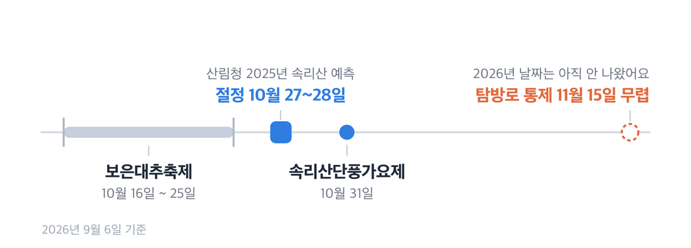
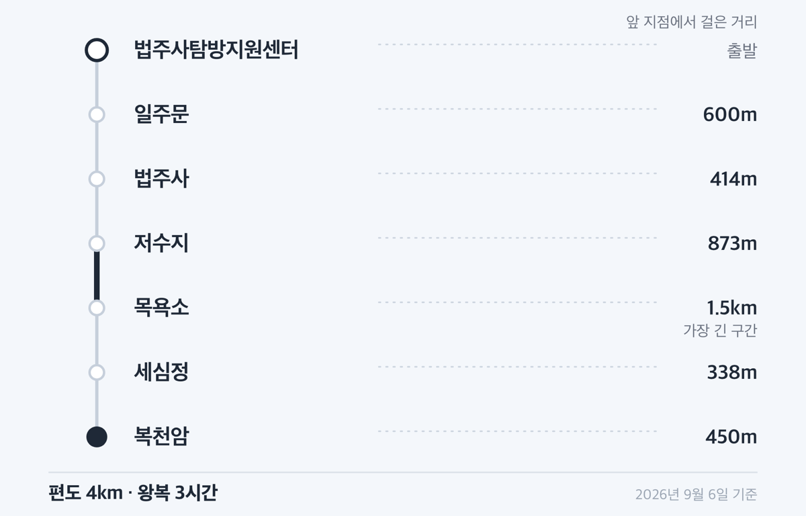
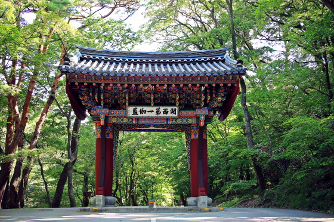
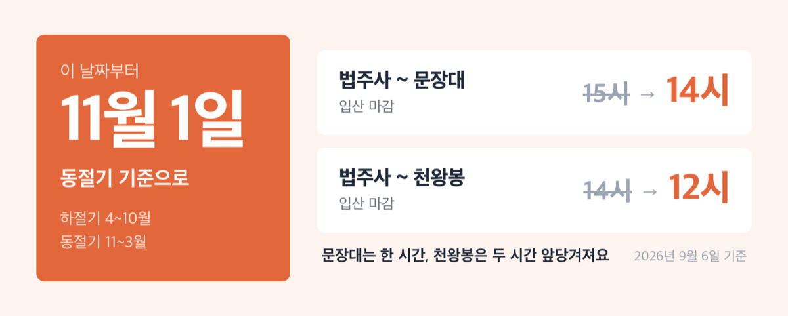

# '0원' 속리산 단풍 시기 2026, 절정은 10월 말입니다

📌 2026년 9월 6일 기준

입장료가 0원이에요. 국립공원 입장료는 2007년 1월 1일에 폐지됐고, 전국에서 그 입장료를 처음 걷은 곳이 1970년 속리산이었습니다. 그러니 단풍철 속리산에서 돈이 드는 건 주차와 버스뿐이에요.

**3줄 요약**

- 속리산 단풍 절정은 10월 말에서 11월 초예요. 산림청이 2025년 예측에서 속리산 단풍나무류 절정일을 10월 27일로 봤고, 보은군은 2026년 10월 31일을 「단풍 절정기」로 잡아 가요제를 엽니다.
- 국립공원 입장료는 2007년 1월 1일 폐지, 조계종 사찰 문화재 관람료는 2023년 5월 4일 무료 전환이에요. 남는 돈은 주차료와 차비입니다.
- 11월 1일부터 입산시간지정제 기준이 동절기로 바뀌어 법주사~문장대 입산 마감이 15시에서 14시로 앞당겨져요.

절정 시기부터 주차, 세조길 시간, 차비, 단풍철에만 걸리는 규제까지 순서대로 적었어요.

## 🍁 2026년 절정은 언제쯤인가

먼저 밝힐 것이 있어요. **산림청 2026년 산림단풍 예측지도는 9월 6일 기준 아직 나오지 않았습니다.** 발표 시점은 2024년이 9월 23일, 2025년이 10월 1일이었어요. 그러니 올해 예측지도는 9월 하순에서 10월 초에 나올 것으로 봅니다.

대신 근거로 쓸 수 있는 값이 둘 있어요. 하나는 산림청이 **속리산을 이름으로 찍어** 절정일을 밝힌 2025년 예측이고, 다른 하나는 보은군이 이미 확정 공고한 2026년 행사 날짜입니다.

| 수종 | 속리산 절정일 (2025년 산림청 예측) |
|---|---|
| 은행나무 | 2025년 10월 25일 |
| 단풍나무류 | 2025년 10월 27일 |
| 참나무류 | 2025년 10월 28일 |

여기서 「절정」은 감으로 매긴 말이 아니에요. **각 수종의 단풍이 50% 이상 물들었을 때**를 절정으로 잡은 값입니다. 그래서 지도상 절정일 며칠 전에 가면 초록이 섞이고, 며칠 뒤에 가면 잎이 떨어져 있어요.

> 😕 작년 값을 올해에 그대로 써도 되나요?

그대로 쓰면 조금 이릅니다. 산림청은 단풍 절정이 **해마다 단풍나무류 0.43일, 참나무류 0.52일, 은행나무 0.50일씩 늦어지고 있다**고 분석했어요. 최근 10년과 견주면 이미 4~5.2일이 밀렸습니다. 산림청은 2024년 보도자료에서 그 원인으로 6~8월 평균기온이 지난 10년 평균보다 약 1.3℃ 올라간 점을 짚었어요.

그 흐름을 2025년 값에 1년만 얹으면 이렇게 됩니다.

| 구간 | 2026년 절정 추정 |
|---|---|
| 세조길·법주사 계곡 | 10월 말 ~ 11월 초 |
| 문장대·천왕봉 능선 | 10월 하순 |

==위 두 줄은 추정값이에요.== 산림청 속리산 관측값(10월 25~28일)에 해마다 늦어지는 폭을 얹고, 보은군이 10월 31일을 절정기로 잡은 것을 함께 본 값입니다. 공식 예측은 이달 하순 산림청 발표를 보시면 돼요.

보은군 쪽 근거도 짚고 갑니다. **속리산단풍가요제가 2026년 10월 31일(토)** 속리산 잔디공원에서 열려요. 보은군이 그 행사를 소개하는 페이지에 「속리산 단풍 절정기에 본선을 실시하는 전국 단위 가요제」라고 적었습니다. 행정이 예산을 들여 무대를 세우는 날을 절정기로 본다는 뜻이에요.

## 입장료·관람료·주차료 — 얼마 드나

입장료는 0원입니다. 국립공원공단 통계 연혁에 **「2007.01.01. 국립공원 입장료 폐지」**가 적혀 있고, 국립공원수입징수규칙 별표1 「사용료 징수기준」에도 입장료 항목이 아예 없어요. 그 표에 남은 것은 주차장·야영장·대피소·생태탐방원·민박촌 시설사용료와 체험료뿐입니다.

속리산은 바로 그 입장료가 시작된 곳이기도 해요. **1970년 5월 1일, 전국 국립공원 가운데 입장료를 처음 걷은 곳이 속리산입니다.**

사찰 관람료도 정리됐어요. 2023년 5월 4일부터 대한불교조계종 산하 사찰의 문화재 관람료가 무료로 전환됐습니다. 국가유산청은 그 배경으로 「1970년부터 국립공원 입장료와 통합 징수되던 문화재 관람료가 2007년 1월 입장료 폐지 이후에도 계속 유지되면서 탐방객과 갈등을 빚어왔다」고 적었어요. 그리고 **감면 시행 기념행사를 연 곳이 법주사 일주문**이었습니다.

법주사는 조계종 제5교구 본사예요. 그래서 지금은 관람료 없이 들어가는 것으로 봅니다. 다만 성보박물관을 포함해 당일 운영 사항이 궁금하시면 법주사 종무실(043-543-3615)로 물어보시면 돼요.

돈이 드는 건 주차입니다. 그런데 여기서 한 번 걸려요.

> [!WARNING]
> **속리산에는 국립공원공단이 직영하는 주차장이 없습니다.** 공단 요금안내 페이지가 「속리산국립공원내 주차장 현황(화북주차장, 선유동주차장) - 현재 임대중으로 속리산국립공원에서 직영하는 주차장은 없음」이라고 적어 뒀어요. 같은 페이지의 그린카드 주차 할인은 「국립공원 직영 주차장 및 야영장」이 대상이라, 속리산에서는 그 할인을 기대하지 않는 편이 맞습니다.

공단 시설 정보에 요금과 규모까지 등록된 속리산 주차장은 두 곳뿐이에요.

| 주차장 | 규모 · 문의 |
|---|---|
| 선유동주차장 (괴산군 청천면) | 소형 91대 · 대형 12대 / 043-832-4347 |
| 오송주차장 (화북지구, 상주시 화북면) | 소형 82대 · 대형 28대 / 054-533-3389 |

두 곳 모두 「유료」로 등록돼 있고 이용 방법이 「전화문의, 방문」이에요. 금액은 위 번호로 확인하세요.

중앙 규정인 국립공원수입징수규칙(2025년 11월 28일 개정)의 정액 주차료는 이렇습니다. 단위는 원이에요.

| 차종 (2026년 시행 규칙, 1일 정액) | 주중 / 주말·성수기 |
|---|---|
| 소형 (승용 전 차종, 승합 15인승 이하, 화물 1톤 이하) | 4,000 / 5,000 |
| 중·대형 (승합 16인승 이상, 화물 1톤 초과) | 6,000 / 7,500 |

여기서 **주차장의 성수기는 7월 1일~8월 31일과 10월 1일~11월 15일**이고, 주말은 토·일·공휴일이에요. 단풍철 주말은 성수기와 주말이 겹치니 위 표의 오른쪽 값이 기준입니다. 경형차와 이륜차는 소형의 50%, 전기차는 충전을 위한 최초 1시간에 한해 100% 감면할 수 있어요. 정기버스는 무료입니다.

법주사 입구 쪽은 사정이 다릅니다. **법주사 대형·소형주차장은 공단 시설 목록에도, 보은군 공영주차장현황에도 올라 있지 않아요.** 그날 요금은 속리산국립공원사무소(043-542-5267~9)나 보은군 민원과 교통팀(043-540-3091)에 미리 확인하고 출발하세요.

보은군이 관리하는 속리산 일대 주차장은 **다섯 곳 전부 무료**입니다.

| 무료 주차장 (보은군 속리산휴양사업소 관리) | 주차면수 |
|---|---|
| 말티재주차장 (주차타워) | 212면 |
| 연꽃단지주차장 (정이품송 인근) | 116면 |
| 솔향공원주차장 (주차타워) | 101면 |
| 관문주차장 (속리산로 481) | 21면 |
| 모노레일주차장 (속리산로 611) | 18면 |

보은군 주차장 조례에는 경형차·저공해차 50% 감면, 등록 장애인과 65세 이상 경로우대자 직접 운전 차량 50% 감면 같은 규정이 있어요. 그런데 위 다섯 곳이 지금 다 무료라서, 이 감면이 실제로 걸릴 곳은 보은읍 전통시장 위탁 주차장 쪽뿐입니다.

## 세조길 왕복 8km, 시간을 어떻게 잡나

세조길은 속리산 20개 탐방코스 가운데 **난이도가 「하」인 두 코스 중 하나**예요. 나머지 하나는 정이품송에서 출발하는 불목이옛길(4.6km, 1시간 30분)입니다. 단풍만 보러 가는 당일치기라면 사실상 답이 정해져 있어요.

거리와 시간은 기관마다 적는 방식이 달라요.

| 출처 | 구간 · 거리 · 시간 |
|---|---|
| 국립공원공단 세조길코스 | 체험학습관~저수지~세심정~복천암 / 4km / 1시간 20분 |
| 보은군 세조길 안내 | 법주사탐방지원센터~복천암 / 왕복 8km / 3시간 |
| 속리산사무소 무장애지도 | 체험학습관~세심정 / 편도 3.5km |

거리는 맞아떨어집니다. 편도 4km를 두 번 걸으면 8km니까요. **시간은 편도 1시간 20분과 왕복 3시간 사이에 20분쯤 차이가 있어서, 왕복 3시간으로 넉넉히 잡는 편이 안전해요.** 사진 찍고 쉬는 시간까지 더하면 어차피 3시간 쪽에 가깝습니다.

구간별 거리는 보은군이 이렇게 적어 뒀어요. 법주사탐방지원센터에서 600m 걸으면 일주문, 거기서 414m가 법주사, 다시 873m 가면 저수지, 1.5km 더 가면 목욕소, 338m 뒤가 세심정, 마지막 450m가 복천암입니다.

여기서 걸음을 어디까지 옮길지가 하루를 정해요. **세심정에서 길이 나뉩니다.** 세심정에서 문장대까지 3.3km가 더 붙고, 체험학습관에서 문장대까지 왕복으로 잡으면 6.6km 편도에 3시간 30분, 난이도 「중」이에요. 천왕봉까지 도는 천왕봉1코스는 16.1km에 8시간, 난이도 「상」입니다.

저라면 단풍철 첫 방문에는 세조길 왕복만 하고 문장대는 접습니다. 문장대는 편도 3시간 30분인데 입산 마감 시각이 따로 걸려 있어서(다음 절), 늦게 도착하면 출발 자체가 막히거든요.

휠체어나 유모차를 밀고 가실 계획이면 짚어 둘 것이 있어요. 속리산사무소 무장애지도(2025년판)를 보면 체험학습관에 장애인주차장·장애인화장실과 「장애물 없는 생활환경」 인증 표시가 있고, 목욕소 부근에 휠체어 대여 표시가 있습니다. **다만 목욕소에서 세심정으로 가는 한 구간에 「접근불가」 표시가 있어요.** 세심정까지 완주를 목표로 잡지 않는 편이 낫습니다.

속리산 관광안내소는 속리산시외버스터미널 맞은편(속리산면 법주사로 223, 043-542-3006)에 있고, **유모차 10대와 휠체어 5대를 보유**하고 있어요.

곁길로 오리숲길도 있습니다. 속리산시외버스터미널에서 일주문까지 1.5km, 일주문에서 법주사까지 800m로 왕복 4.6km에 1시간 30분이에요. 법주사 입구 숲길이 5리, 곧 2km에 달해서 「오리숲」이라는 이름이 붙었습니다. 숲길 옆에 황톳길이 있어 맨발로 걸을 수 있어요.

## 어떻게 가나 — 시외버스와 축제 일정

속리산 진입의 주력은 시외버스예요. **보은시외버스터미널에서 속리산행이 하루 14회 있고, 요금은 일반 2,400원**입니다. 중고생은 30%, 아동은 50% 할인이라 각각 1,900원과 1,200원이에요.

속리산에서 나올 때는 이 노선을 씁니다.

| 속리산터미널 출발 | 일반 요금 |
|---|---|
| 보은 | 2,400원 |
| 청주 | 9,600원 |
| 대전 | 9,900원 |
| 서울 강남 | 19,900원 |
| 동서울 | 19,500원 |

개별 출발 시각은 여기에 옮기지 않았어요. **보은군 시간표 페이지에는 최종수정일이 2026년 3월 9일로 찍혀 있는데, 표 안에는 「기준 : 2023.12.13.」이 따로 적혀 있습니다.** 단풍철 막차를 시간표만 믿고 계산하면 위험해요. 속리산터미널 쪽 시각은 속리산관광협의회(043-544-6622)나 터미널에 전화로 확인하고 움직이세요.

농어촌버스는 보은에서 08:30, 12:00, 15:30 세 번 속리산을 지납니다. 하루 3회니까 이걸 주력으로 잡기는 어려워요.

택시는 중형 기준 기본거리 900m에 기본운임 4,000원, 이후 81m당 100원인데 **거리·시간 운임에 복합할증 60%가 붙습니다.** 호출료는 1,000원, 시계외 운행은 20% 더 붙어요.

축제 일정에서 하나 짚고 갈 것이 있어요.

| 2026년 행사 | 날짜 |
|---|---|
| 보은대추축제 | 10월 16일(금)~10월 25일(일), 10일간 |
| 속리산단풍가요제 | 10월 31일(토) |

**대추축제 열흘과 단풍 절정 추정 시기가 서로 어긋납니다.** 대추축제는 뱃들공원과 속리산 일원에서 열리고 10월 25일에 끝나요. 그러니 축제 장터와 단풍을 한 번에 보려는 계획은 10월 셋째~넷째 주에, 단풍만 보려는 계획은 10월 마지막 주에 두는 편이 맞습니다. 2025년 축제가 2026년 충청북도 지정축제 최우수축제로 뽑혔어요.

## 단풍철에 걸리는 규제 셋

하나. **입산시간지정제 기준이 11월 1일에 바뀝니다.** 속리산은 4~10월을 하절기, 11~3월을 동절기로 나눠요.

| 법주사 지구 구간 | 하절기(4~10월) / 동절기(11~3월) |
|---|---|
| 법주사~문장대 | 04:00~15:00 / 05:00~14:00 |
| 법주사~천왕봉 | 04:00~14:00 / 05:00~12:00 |
| 화북탐방지원센터~문장대 | 04:00~15:00 / 05:00~14:00 |

같은 문장대 길인데 **11월 1일부터는 한 시간 늦게 열리고 한 시간 일찍 닫힙니다.** 법주사에서 천왕봉으로 가는 길은 마감이 14시에서 12시로 두 시간 앞당겨져요. 절정이 10월 말에서 11월 초로 걸쳐 있으니, 11월 첫 주에 문장대를 노리신다면 도착 시각을 그만큼 앞으로 당겨 잡으셔야 합니다. 표에 「세조길」이라는 이름은 없어요. 세조길은 법주사~문장대 구간의 앞부분에 듭니다.

둘. **탐방로 예약제가 두 구간에 걸립니다.** 속리산국립공원사무소 공고 제2026-24호 기준이에요.

| 예약제 구간 (2026년) | 운영기간 · 정원 |
|---|---|
| 용화지구(운흥리)~묘봉~미타사 | 9월 1일~10월 31일 / 310명·일 |
| 첨성대~도명산~학소대 | 10월 1일~10월 31일 / 480명·일 |

묘봉 구간은 7km에 왕복 5시간, 입장 마감 14시이고 **주차가 불가**예요. 집결 위치가 운흥리 통제소입니다. 도명산 구간은 약 6km에 왕복 4시간, 입장 마감 15시이고 신일기업화양동주차장을 쓸 수 있어요. 예약은 국립공원 예약시스템(reservation.knps.or.kr)에서 하고, **도명산은 15시까지 현장접수도 됩니다.** 근거는 자연공원법 제28조 1항이고, 예약 없이 들어가면 같은 법에 따라 50만원 이하 과태료가 부과될 수 있습니다.

**문장대·천왕봉·세조길은 예약 대상이 아니에요.** 공고문 대상구간 표에 없습니다.

셋. **가을철 산불조심기간 통제가 11월 중순에 시작됩니다.** 2025년에는 산불조심기간이 10월 20일~12월 15일, 탐방로 통제기간이 11월 15일~12월 15일이었어요. 2026년 통제기간은 속리산국립공원사무소 공지로 나옵니다. 작년처럼 10월 중순에 올라올 것으로 보고, 11월 중순 이후 산행을 계획하신다면 출발 전에 국립공원공단 탐방통제 현황을 한 번 여세요.

그런데 통제가 시작된다고 해서 모든 길이 막히는 건 아니에요. 2025년 통제지도를 보면 **법주사~세심정~신선대 5.6km, 세심정~문장대 3.3km, 세심정~천왕봉은 11월 15일 이후에도 열려 있었습니다.** 막힌 것은 도화리~천왕봉, 천왕봉~형제봉 7.1km, 용화지구~묘봉 같은 능선 종주와 외곽 구간이었어요. 산불조심기간에 통제하는 목적이 화기 접근과 구조 난도가 높은 구간 관리라, 관리인력이 상주하는 주 탐방로는 남겨 두는 구조입니다.

곁들여 하나 더. **화양구곡길 전기 셔틀버스는 2026년 7월 1일~9월 15일 운행이라 단풍철에는 다니지 않아요.** 그리고 속리산에는 국립공원 예약시스템에 등록된 야영장이 없고, 탐방코스 데이터의 대피소 목록도 비어 있습니다. 산에서 하룻밤을 계획하실 수 없다는 뜻이에요. 당일치기이거나 속리산면 숙소에서 1박하는 쪽으로 잡으셔야 합니다.

## 속리산 단풍 시기 관련 궁금증 해결

**Q. 주말은 얼마나 붐비나요?**

2025년 속리산 월별 탐방객을 보면 10월이 163,855명, 11월이 182,395명이에요. 연간 1,222,806명 가운데 두 달이 28%를 넘게 차지합니다. **11월이 10월보다 18,540명 더 많아요.** 단풍이 늦어지면서 사람도 11월로 밀려간 셈입니다.

**Q. 평일에 가면 뭐가 다른가요?**

주차료 기준이 달라져요. 국립공원 주차장 규정에서 **주중은 공휴일을 제외한 월~금**이고 주말은 토·일·공휴일입니다. 소형 기준 주중 4,000원, 주말·성수기 5,000원이에요. 참고로 같은 규칙 안에서 야영장 같은 일반 시설의 주중은 일~목이라 기준이 다릅니다.

**Q. 문장대까지 갈지 세조길만 볼지 어떻게 정하나요?**

도착 시각으로 정하시면 됩니다. 체험학습관에서 문장대는 편도 6.6km에 3시간 30분, 난이도 「중」이에요. 10월 안에 가시면 입산 마감이 15시, 11월부터는 14시입니다. 오전 도착이 아니면 세조길 왕복(왕복 8km, 3시간)으로 잡는 쪽이 현실적이에요.

**Q. 아이나 어르신과 함께 가도 되나요?**

세조길과 오리숲길은 난이도가 낮고 유모차·휠체어 대여도 관광안내소에 있어요. 다만 위에 적은 목욕소~세심정 사이 「접근불가」 구간이 있으니 세심정까지 밀고 갈 계획은 세우지 마세요.

## 저라면 이렇게 잡습니다

10월 마지막 주 평일에 갑니다. 근거는 셋이에요. 산림청 속리산 관측값이 10월 25~28일에 몰려 있고, 보은군이 10월 31일을 절정기로 잡았고, **11월 1일부터 입산시간이 한 시간씩 줄기 때문입니다.** 주말을 피하면 주차료도 소형 기준 1,000원 낮아지고, 11월로 밀려간 인파도 비켜 갈 수 있어요.

코스는 세조길 왕복입니다. 편도 4km, 왕복 3시간으로 잡고 남는 시간에 법주사와 오리숲길을 걸어요. 차비는 보은에서 2,400원, 입장료와 관람료는 0원이니 하루 예산에서 큰 몫은 주차료와 식사뿐입니다.

출발 전에 두 가지만 확인하세요. 첫째, 산림청 2026년 산림단풍 예측지도가 이달 하순에서 다음 달 초에 나옵니다. 그 값이 나오면 위 추정보다 그쪽을 쓰시면 돼요. 둘째, 속리산국립공원사무소(043-542-5267~9)에 그날 탐방로 개방 상황을 물어보세요. 2026년 8월 28일에도 집중호우로 계곡 전 구간이 통제됐다가 9월 1일에 전면개방됐습니다. 산은 날씨로 하루아침에 닫힙니다.

참고: 산림청 「2025년 산림단풍 예측지도」 보도자료 · 국립공원공단 속리산 요금안내·탐방코스·입산시간지정제 · 국립공원수입징수규칙(2025.11.28. 개정) · 속리산국립공원사무소 공고 제2026-24호 「탐방로 예약제 운영 공고」 · 속리산국립공원사무소 「가을철 산불조심기간 및 통제기간 알림」 · 「2026 국립공원기본통계」 · 보은군 문화관광 세조길·오리숲길·축제 안내 · 보은군청 시외버스·농어촌버스·택시운임·공영주차장현황 · 국가유산청 「문화재 관람료 무료 전환」 보도자료
