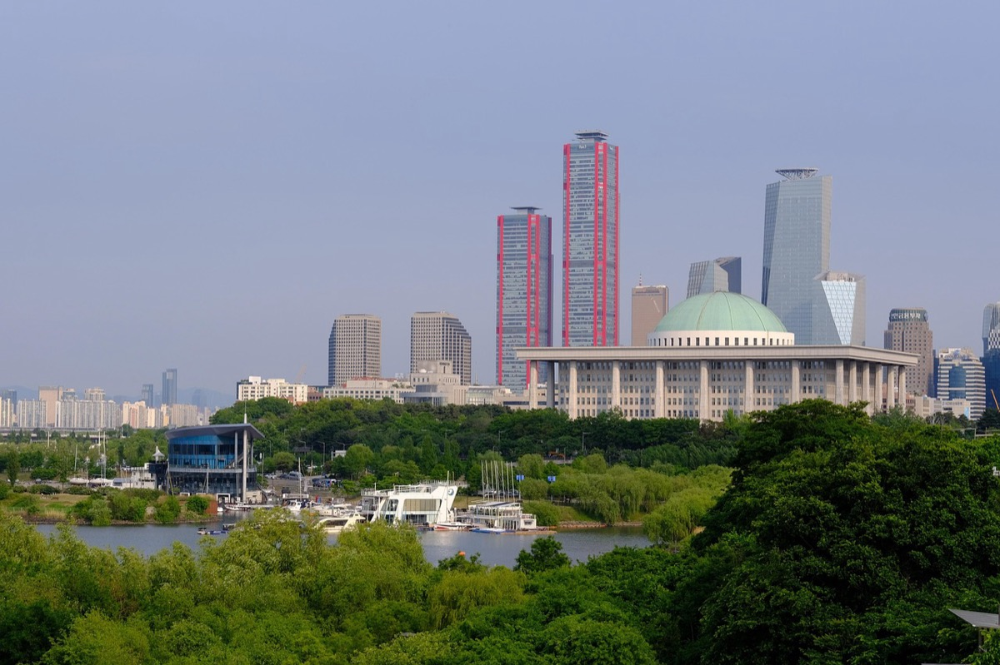
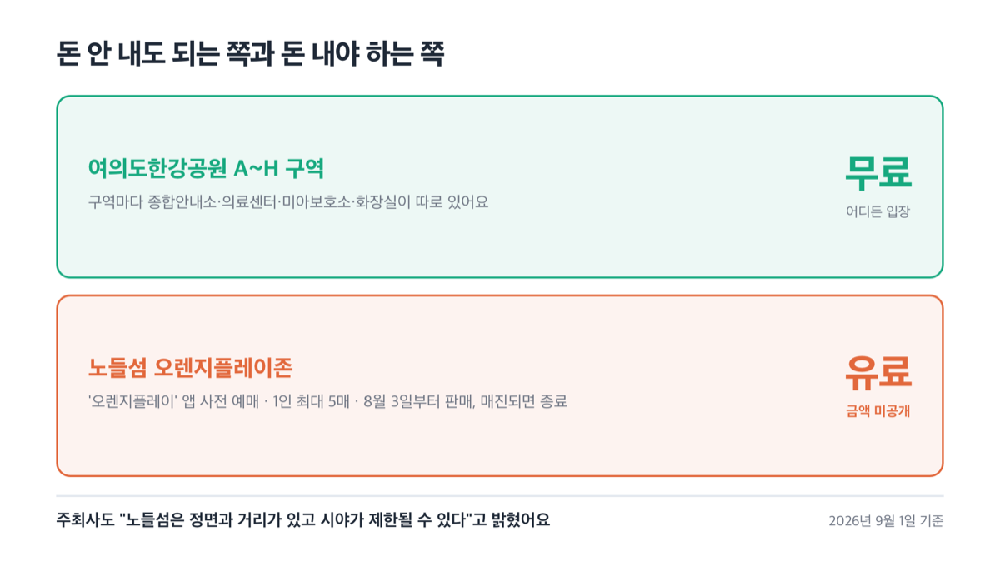
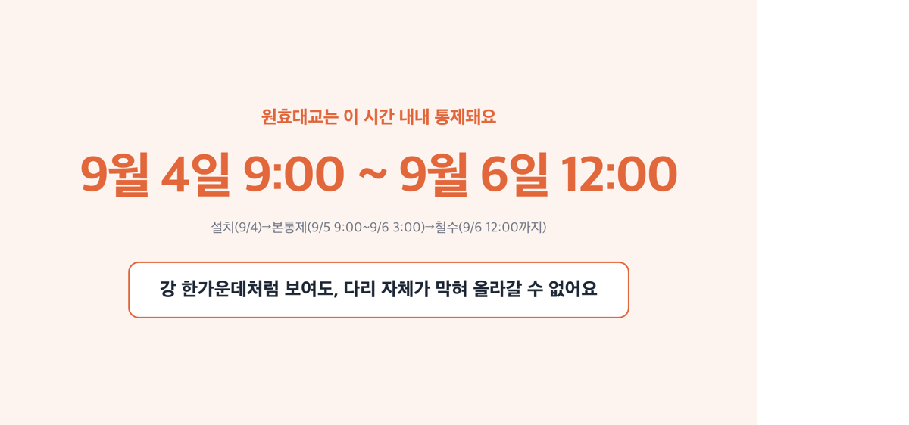
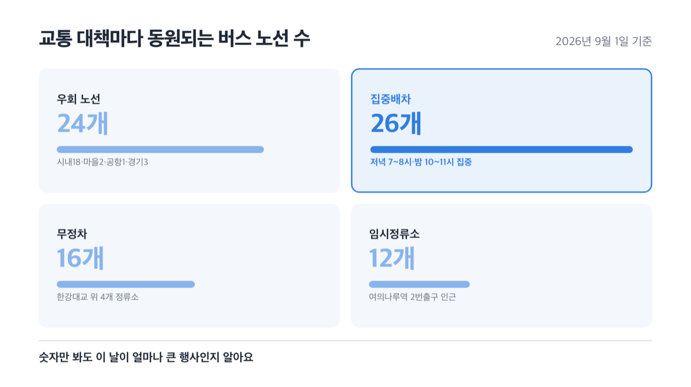
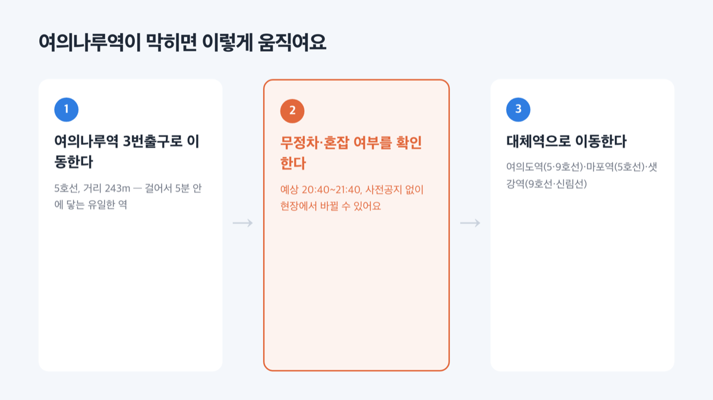
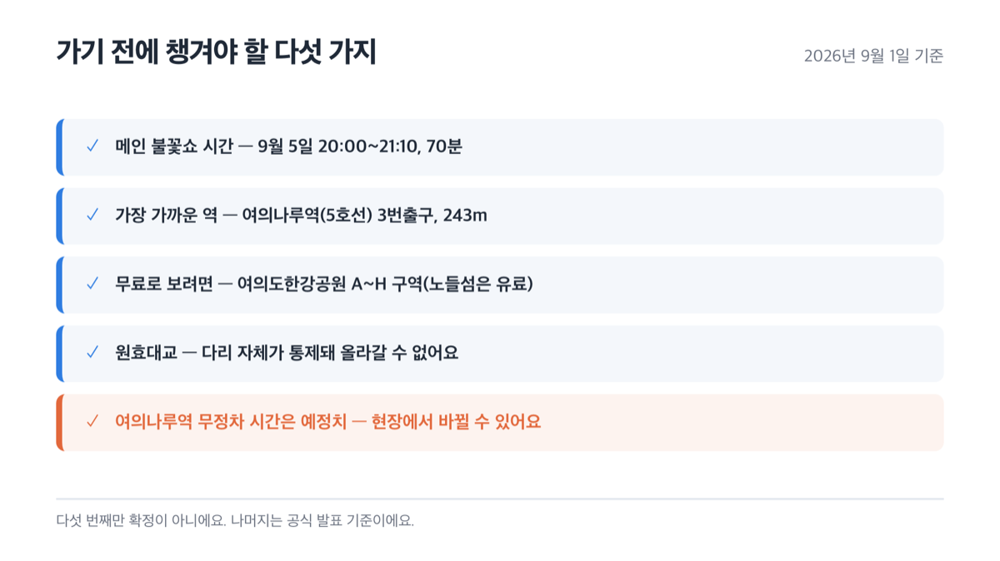

# 여의도 불꽃축제 2026, 원효대교에서는 못 봐요

📌 2026년 9월 1일 기준

여의도 불꽃축제를 검색하면 노들섬이 무료 명당이라는 글이 아직도 보여요. 그런데 올해는 아니에요. 헷갈려서 서울시와 한화 공식 자료를 하나씩 다 확인해 봤어요.

**3줄 요약**
1. 한화와 함께하는 서울세계불꽃축제 2026이 9월 4~5일 이틀간 여의도 한강공원에서 열려요. 올해 처음 전야제가 생겨서 하루짜리 축제가 이틀로 늘었어요.
2. 메인 불꽃쇼는 9월 5일 오후 8시부터 70분 동안 영국·미국·한국 순서로 진행돼요. 노들섬은 올해부터 전체가 유료 '오렌지플레이존'으로 바뀌었어요.
3. 여의동로와 원효대교가 최대 9시간 넘게 막히니까, 가기 전에 지하철 경로와 대체역부터 확인해야 해요.

일정과 통제 구간, 무료로 볼 수 있는 곳, 지하철·버스로 가는 법까지 확인한 대로 순서대로 정리했어요.

## 🎆 여의도 불꽃축제 2026, 이번엔 뭐가 다른가

올해로 22회째인 '한화와 함께하는 서울세계불꽃축제 2026'은 '당신의 빛을 찾아서'라는 테마로 열려요. 이번엔 한국, 미국, 영국 세 나라가 나와요.

가장 크게 바뀐 건 기간이에요. 그동안은 토요일 하루만 하던 축제에 올해 처음 ==전야제==가 생겨서, 9월 4일(금)부터 9월 5일(토)까지 이틀로 늘었어요.

저는 이걸 인파가 하루에 몰리지 않게 나누려는 취지로 봐요. 서울시가 이 행사를 '매년 100만 명 이상이 찾는다'고 소개할 정도니까요.

| 구분 | 날짜 | 시간 |
|---|---|---|
| 전야제 | 9월 4일(금) | 사전행사 13:00~19:00 |
| 본행사 | 9월 5일(토) | 사전행사 13:00~19:00 · 개막식 19:40~20:00 · 메인 불꽃쇼 20:00~21:10 |

메인 불꽃쇼는 총 70분이에요. 다음 표처럼 세 나라가 5분씩 쉬면서 번갈아 쏴요.

| 시간 | 참가국·팀 |
|---|---|
| 20:00~20:15 | 영국(Pyrotex Fireworx) |
| 20:20~20:35 | 미국(Ace Pyro) |
| 20:40~21:10 | 한국(Hanwha) |

행사장은 여의도 한강공원 일대, 정확히는 마포대교 남단부터 한강철교까지예요. 서울시는 이 구간을 '여의도·이촌한강공원 일대'라고 불러요.

## 얼마 드나 — 무료 구역과 유료존

여의도한강공원은 A~H 구역으로 나눠 전부 무료로 열려요. 구역마다 종합안내소·의료센터·미아보호소·화장실이 따로 있어요. 돈 안 내고 보고 싶으면 이 구역 어디든 들어가면 돼요.

문제는 노들섬이에요. 작년까지 어떤 정보가 돌았든, 올해는 노들섬 전체가 '오렌지플레이존'이라는 유료 구역으로 바뀌었어요. 쉽게 말하면 섬 하나를 통째로 유료 관람석으로 만든 거예요.

사전에 '오렌지플레이' 앱에서 티켓을 사야 들어갈 수 있고, 1인당 최대 5매까지 살 수 있어요. 8월 3일부터 팔기 시작해서 다 팔리면 끝이에요.

결국 노들섬은 이제 공짜가 아니에요.

구체적인 금액은 오렌지플레이 앱에서 확인하세요. 공식 페이지에는 구역마다 다르다고만 나와 있어요.

> [!WARNING]
> 노들섬은 주최사가 스스로 "메인 불꽃 연출 정면 구역과 거리가 있고, 일부 시야가 제한될 수 있다"고 밝혔어요. 돈 내고 들어가도 정면으로 보이는 곳이 아니라는 뜻이에요.

😕 그래도 노들섬이 강 한가운데니까 더 잘 보이지 않을까요?
주최사가 직접 정면이 아니라고 밝혔어요. 저라면 처음 가는 거면 무료 구역에서 먼저 봐요. 가격도 안 나와 있는 곳에 먼저 돈을 걸 이유가 없거든요.

현장에 못 가도 보는 방법은 있어요. 유튜브 '한화TV' 채널이 오후 6시 30분부터 9시 30분까지 생중계하고, '오렌지플레이' 앱에서는 멀리서도 배경음악을 실시간으로 들을 수 있어요.

🤭 솔직히 말하면 — 한화 사이트에 "내가 있는 곳이 불꽃 명당!"이라는 카드가 있어서 눌러봤는데, 관람 명당 지도가 아니라 이 생중계 안내였어요. 명당이라는 말에 낚였어요.

## 🚧 교통통제 — 몇 시부터 몇 시까지, 어디가 막히나

여의동로(마포대교 남단~63빌딩 앞)는 9월 5일 오후 3시부터 밤 12시까지, ==9시간== 동안 막혀요. 파크원타워부터 여의동 주민센터까지도 같은 시간에 막히는데, 이 구간은 아파트 주민이나 행사 관련 차량만 사거리로 들어갈 수 있어요.

통제 시간이 밤 12시를 넘어서까지 이어질 수 있어요. 도로 위에 사람이 하나도 없어야 영등포경찰서가 해제를 허락하기 때문이에요.

원효대교는 더 오래 막혀요. 9월 4일 오전 9시부터 설치를 시작해요. 9월 5일 오전 9시부터 9월 6일 오전 3시까지는 본통제 구간이고, 그 뒤 9월 6일 낮 12시까지 철수 작업을 해요.

결국 원효대교 위에서는 못 봐요.

63빌딩 앞 여의도한강공원 주차장은 9월 4일 오후 6시부터 9월 5일 밤 12시까지 통째로 닫혀요. 이 주차장 하나만 닫히고, 대체 주차장 지원은 없어요.

한강에서도 배는 못 다녀요. 마포대교부터 한강철교까지는 9월 5일 오후 5시부터 불꽃쇼가 끝날 때까지 전체 통제고, 서강대교부터 한강대교까지는 시간대별로 순차 통제해요.

| 구간 | 통제 시간 |
|---|---|
| 여의동로(마포대교 남단~63빌딩 앞) | 9/5(토) 15:00~24:00 |
| 파크원타워~여의동주민센터 | 9/5(토) 15:00~24:00 |
| 63빌딩 앞 주차장 | 9/4(금) 18:00~9/5(토) 24:00 폐쇄 |
| 원효대교(설치~철수 전체) | 9/4(금) 9:00~9/6(일) 12:00 |
| 한강 수상(마포대교~한강철교) | 9/5(토) 17:00~불꽃쇼 종료까지 |

물론 걷거나 대중교통을 타면 이 통제와 상관없이 움직일 수 있어요. 그런데 자전거는 다르더라고요.

여의도·이촌 일대 공공자전거(따릉이)와 8개 업체 PM(전기자전거 등 개인형 이동장치)은 9월 4일 오전 8시부터 9월 6일 오전 7시까지 대여·반납이 안 돼요. 따릉이 대여소만 34개소, 거치대 537대가 문을 닫아요.

> 혹시 서울시 보도자료 원문을 직접 찾아보다가 폐쇄 종료일이 "9월 28일"이라고 적힌 걸 보셨다면 오타예요. 9월 6일이 일요일인 걸 보면 본문에 적힌 6일 오전 7시가 맞아요.

이촌·노량진·여의도 인근 도로와 다리는 불법 주정차 합동단속 대상이에요. 계도에 응하지 않으면 바로 견인돼요.

😕 그래도 차 있으면 편하지 않을까요?
주차장은 닫히고, 도로는 9시간 넘게 막히고, 불법주정차는 단속해요. 저는 이번엔 차보다 지하철을 권해요.

## 가는 법 — 지하철·버스로 여의도 닿는 법

지하철이 가장 편해요. 서울시가 본행사 전후로 5호선 18회, 9호선 65회, 합쳐서 83회를 증회해요.

행사장 인근 21개 역에는 안전요원을 평소보다 3~5배 많이 둬요.

공식 안내에는 오는 방법이 일곱 개나 나와 있어요. 그런데 실제로 걸어서 5분 안에 닿는 역은 딱 하나, 여의나루역(5호선) 3번출구뿐이에요. 거리는 243m예요.

| 역 | 출구·거리 |
|---|---|
| 여의나루역(5호선) | 3번출구 243m |
| 여의도역(5·9호선) | 5번출구 1.3km |
| 샛강역(9호선·신림선) | 3번출구 1.5km |
| 대방역(1호선·신림선) | 6번출구 2km |
| 신길역(1·5호선) | 1번출구 2.2km |
| 마포역(5호선) | 4번출구 2.4km |
| 이촌역(4호선·경의중앙선) | 4번출구 4.4km |

물론 여의나루역도 사람이 몰리면 무정차로 지나치거나 출구를 닫을 수 있어요. 한화 자료 기준으로는 오후 8시 40분부터 9시 40분까지 한 시간인데, 서울교통공사가 ==사전공지 없이 현장에서만== 그때그때 정한다고 밝혔어요.

그래서 이 시간은 확정이 아니라 예정치로 봐야 해요. 그럴 땐 여의도역(5·9호선), 마포역(5호선), 샛강역(9호선·신림선)으로 가면 돼요.

버스 노선도 달라져요. 여의동로와 원효대교를 동시에 지나는 노선 24개(시내버스 18·마을버스 2·공항버스 1·경기버스 3)는 우회해요.

귀갓길이 몰리는 저녁 7~8시와 밤 10~11시에는 26개 노선이 여의도환승센터·여의도역으로 집중배차돼요.

한강대교 위 4개 정류소(노들섬 2곳, 한강대교 전망카페 2곳)는 안전사고를 막으려고 무정차 구간으로 지정됐어요. 9월 5일 오후 4시부터 9시 20분까지 16개 노선이 이 구간을 그냥 지나가요.

전야제 날엔 여의나루역 2번출구 근처에 임시정류소가 오후 6시 20분부터 9시 30분까지 조기 운영돼요. 기존 정류소보다 약 120m 옮겨졌고, 12개 노선이 이걸 이용해요.

이렇게까지 해도 헷갈리면 120다산콜재단(서울시 상담전화)에 문자상담·보이는 ARS(자동응답시스템)·서울톡으로 24시간 물어볼 수 있어요.

## 명당이라는 말에 낚이지 않는 법

검색하다 보면 실제와 다른 정보가 꽤 섞여 있어요. 제가 확인하면서 걸린 것만 모았어요.

1. 노들섬 '무료 명당' *(이번엔 전체가 유료예요, 위에서 설명한 그대로)*
2. 노들섬 정면 시야 *(주최사가 직접 "일부 시야 제한"이라고 밝혔어요)*
3. 원효대교 관람 *(다리 자체가 9월 4일부터 6일까지 거의 계속 통제라 올라갈 수조차 없어요)*
4. 63빌딩 앞 주차장 이용 *(9월 4일 저녁부터 통째로 폐쇄, 대체 주차장 지원 없음)*
5. 여의나루역 통제 시간 *(사전공지 없는 현장 결정이라 예정 시각이 바뀔 수 있어요)*

## 여의도 불꽃축제 관련 궁금증 해결

**Q. 노들섬에서 공짜로 볼 수 있나요?**
A. 아니에요. 올해는 전체가 유료 '오렌지플레이존'이에요. '오렌지플레이' 앱에서 미리 예매해야 하고, 1인 최대 5매까지 살 수 있어요.

**Q. 여의나루역이 막히면 어디로 가야 하나요?**
A. 여의도역(5·9호선), 마포역(5호선), 샛강역(9호선·신림선)으로 이동하면 돼요.

**Q. 차 가져가도 되나요?**
A. 63빌딩 앞 주차장은 폐쇄되고 별도 지원 주차장도 없어요. 그래도 차를 써야 한다면 카카오T 주차가 여의도역·용산역·노량진역·합정역 인근에서 사전예약을 받으니 그걸 확인하세요.

**Q. 비 오면 축제가 취소되나요?**
A. 당일에는 한화 불꽃축제 홈페이지나 120다산콜재단으로 확인하는 게 정확해요. 공식 자료에 우천 대응 방침은 따로 나와 있지 않아요.

**Q. 현장에 못 가면 어떻게 보나요?**
A. 유튜브 '한화TV' 채널이 오후 6시 30분부터 9시 30분까지 생중계해요. '오렌지플레이' 앱에서는 멀리서도 불꽃 배경음악을 실시간으로 들을 수 있어요.

정리하면, 돈을 아예 안 써도 여의도한강공원 A~H 구역 어디서든 볼 수 있어요. 다만 가는 길은 자동차보다 지하철이 훨씬 나아요.

이번엔 노들섬 유료화나 원효대교 완전통제처럼 작년과 달라진 게 많아요. 저는 지난해 기억만 믿고 움직이면 오히려 헛걸음할 수 있다고 봐요.

궁금한 게 더 있으면 서울시 문화예술과(02-2133-2550), 교통정책과(02-2133-2210), 한화 불꽃축제 운영사무국(02-519-9778)으로 바로 물어보는 게 제일 빨라요.

참고: 서울시 보도자료 「"100만 인파 안전 최우선"… 서울시, 서울세계불꽃축제 종합대책 가동」 · 한화 서울세계불꽃축제 공식 사이트(공지사항·행사소개·오시는 길·FAQ·관람가이드)
